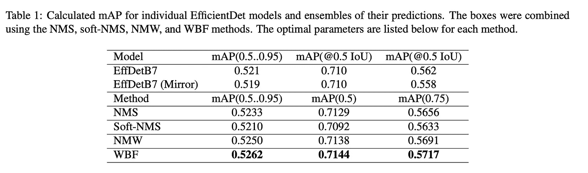

# WBF:优化目标检测——融合和过滤预测框

> 原文：<https://towardsdatascience.com/wbf-optimizing-object-detection-fusing-filtering-predicted-boxes-7dc5c02ca6d3?source=collection_archive---------21----------------------->

## [思想和理论](https://towardsdatascience.com/tagged/thoughts-and-theory)

## 加权盒融合已经成为优化目标检测模型的新 SOTA


由[迪伦·诺尔特](https://unsplash.com/@dylan_nolte?utm_source=medium&utm_medium=referral)在 [Unsplash](https://unsplash.com?utm_source=medium&utm_medium=referral) 上拍摄的照片

目标检测是最常见和最有趣的计算机视觉任务之一。最近的 SOTA 模型，如 YOLOv5 和 EfficientDet，令人印象深刻。这篇文章是关于一种新的 SOTA 新技术，称为加权盒融合，优化了一个巨大的目标检测问题。这是一种先进的对象检测技术，我是在目前正在进行的 VinBigData Kaggle 比赛中遇到它的。

如果你熟悉物体检测的工作原理，你可能知道总有一个中枢 CNN 提取特征。还有另一个阶段，要么生成区域提议(可能的边界框)，要么过滤已经提出的提议。这里的主要问题是，这根本不是一项简单的任务，实际上相当困难。这就是为什么对象检测模型要么最终生成大量的边界框，要么没有足够的边界框，最终导致低平均精度。已经提出了几种算法来处理这个问题，我将首先介绍一下。

如果你对理论上的解释不感兴趣，你可以直接跳到最后的编码教程，在那里我将展示如何将这种技术应用到一个非常具有挑战性的数据集上，这个数据集是我一直在做的( [VinBigData](https://www.kaggle.com/c/vinbigdata-chest-xray-abnormalities-detection) )。

给你一点背景，这个比赛是关于用 x 光检测肺部疾病的。你的模型必须能够区分 14 种不同的疾病，并为每种疾病预测疾病所在的边界框。这变得更加困难，因为每幅图像可能有一种以上的疾病(因此，您必须预测多个不同的边界框)。

第一个问题是疾病由多个不同的放射科医生标记，并且对于相同的异常可能有多个不同的边界框。所以我们必须过滤这些(或者在这种情况下“融合”它们)以避免混淆我们的模型。

第二个问题是，一些密集的疾病区域包含多个标签，这意味着一个小的边界框可以有多个疾病标签。这使得我们的生活有点困难，如果我们使用类似 NMS 的东西，因为我们是基于 IoU 过滤盒子(这在这里经常发生)。所以像 NMS 这样的方法很可能会去掉有用的盒子。

请注意，所有这些技术都可以以两种方式使用。要么预处理您的数据以过滤掉不精确的带标签的边界框(这是我将在这里做的)，要么过滤掉由您训练以提高准确性的模型预测的边界框(或两者都进行)。

我将讨论每一种技术，包括使用该技术前后边界框的可视化。

1.  **非最大抑制(NMS)**

如果你熟悉物体检测，你可能听说过 NMS。给定对象检测模型的每个预测由边界框坐标、类别标签和置信度得分组成，NMS 工作如下:

*   如果这些框在并集 IoU 上的**交集**高于指定的阈值保持超参数，则这些框被过滤成 1 个框。IoU 本质上是两个框之间的重叠量。

这里的主要挑战是，如果对象是并排的，其中一个将被消除(因为 IoU 将相当高)。


来源: [arxiv](https://arxiv.org/abs/1910.13302)


图片由作者转载。我们可以清楚地看到右边的方框变少了。

2.**软 NMS**

第二种方法试图用一种更“软”的方法来解决 NMS 的主要问题。它不是完全移除 IoU 高于阈值的盒子，而是根据 IoU 值降低它们的置信度得分。


图片由作者转载。“软”方法导致过滤掉更少的框(这就是为什么与 NMS 相比，右边有更多的框)

3.**加权盒子融合(WBF)**

WBF 算法的工作方式与 NMS 算法不同。这本书有点长，而且确实涉及到很多数学方程式，但我会尽我所能给你一个简单的概述，不会让你对细节感到厌烦。

首先，它按照置信度得分的降序对所有边界框进行排序。然后，它生成另一个可能的框“融合”(组合)列表，并尝试检查这些融合是否与原始边界框匹配。它通过检查 IoU 是否大于指定阈值(超参数)来实现。

然后，它使用一个公式来调整融合框列表中所有框的坐标和置信度得分。新的置信度得分仅仅是融合它的所有盒子的平均置信度得分。新的坐标以类似的方式融合(平均)，除了坐标被加权(意味着不是每个框在结果融合框中具有相同的贡献)。权重的值由置信度得分确定，这是有意义的，因为低置信度得分可能指示不正确的预测。

就是这样，当然，这是高层次的，如果你想深入研究数学和低层次的细节，我建议在这里查看论文。然而，平心而论，当我在高层次上理解一些东西是如何工作的，实现它，测试它，然后只在需要时回到低层次的细节时，我通常会获得大部分的价值。如果你总是钻研底层的细节，你最终会学到理论是如何工作的，但实际上并没有实现它的大部分。


图片由作者转载。

还值得一提的是，还有第四种方法叫做**非最大加权** **融合**，其工作方式类似，但性能不如 WBF。这是因为它不会改变盒子的置信度得分，而是使用 IoU 值来衡量盒子，而不是使用置信度得分这一更准确的衡量标准。不过他们的表现非常接近:



来源: [arxiv](https://arxiv.org/abs/1910.13302)


图片由作者转载。

**编码部分**

好了，理论部分到此为止，让我们开始编码吧！衡量这篇论文是否真的好的最好方法之一是看他们是否发布了高质量的代码，在这种情况下，他们确实发布了。你可以在 Github 上查看

他们提供了一个易于使用的库。这里有一个例子

```
boxes, scores, labels = weighted_boxes_fusion(boxes_list, scores_list, labels_list, weights=weights, iou_thr=iou_thr, skip_box_thr=skip_box_thr)
```

如果您想尝试其他方法，可以用“nms”或“soft_nms”或“non_maxmimum_weighted”替换“weighted_boxes_fusion ”,这样就可以很好地工作。

我遇到这个库/技术的最初原因是，在 Kaggle 的 VinBigData 竞赛中，数据集有两个主要问题导致对象检测模型表现不佳。

竞赛给出的原始数据帧已经包括了每个图像的边界框、标签。所以这些将是上面 WBF 函数输入的一部分


作者图片

因为我们将在这里使用它进行预处理，所以我们可以将“权重”和“分数”设置为 1，这样每个盒子将被同等对待(因为我们还没有预测)。就是这样！这个库非常简单，只有一行代码，你传入一个边界框和分数的列表，然后你得到一个更整洁的列表。

**最终想法**

我将很快发布几篇关于我从这场比赛中学到的经验的文章，大部分是先进的物体探测技术，所以如果你感兴趣，请跟我来。