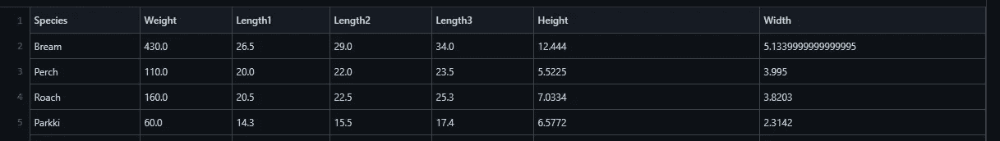
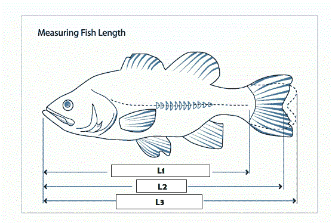
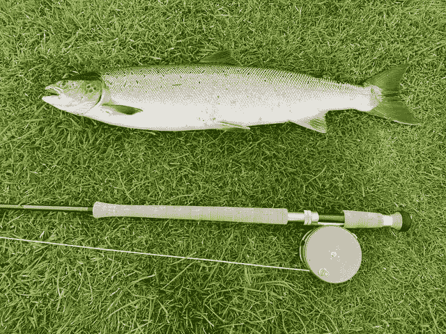

# 我们进行了一轮数据科学竞赛，结果发生了这种情况！

> 原文：<https://towardsdatascience.com/we-did-a-one-round-data-science-competition-and-this-happened-c17ecff16c6d?source=collection_archive---------34----------------------->

## 预测鱼量的简单与复杂模型

作者:[爱德华·克鲁格](https://www.linkedin.com/in/edkrueger/)和[道格拉斯·富兰克林](https://www.linkedin.com/in/dougaf/)。

照片由[迈克·斯威肯斯基](https://unsplash.com/@mike_swigunski?utm_source=unsplash&utm_medium=referral&utm_content=creditCopyText)在 [Unsplash](https://unsplash.com/s/photos/fish-market?utm_source=unsplash&utm_medium=referral&utm_content=creditCopyText) 上拍摄

*本文将讨论我们与一个班级举办的数据科学竞赛。我们将讨论五个得分最高的模型及其复杂性。*

# 介绍

挑战在于创建一个预测鱼体重的机器学习模型。其模型具有最低均方误差(MSE)的学生将被宣布为获胜者！

# 挑战

> 你好！欢迎来到日本东京著名的筑地鱼市场！我们来这里收集他们的鱼的数据，但我们没有在早上 5 点醒来参加金枪鱼拍卖。当我们出现的时候，只剩下一些种类的鱼了。我们收集了剩余鱼的测量值，并希望您使用这些特征训练一个回归模型来预测鱼的重量。
> 
> 我们将拿出 30%的数据，并使用该 csv 进行评分。我们将根据他们的模型在这些原始数据上预测体重的表现对学生进行排名。分数将根据均方差排名决定。

这是一场一次性比赛。不允许调整模型。也就是说，有一次提交模型的机会，我们将使用它尚未看到的维持数据来度量它。

这是我们的鱼类数据。在训练数据集中的 112 行中有 7 个特征。

鱼类数据

下图显示了鱼的长度。这样，我们可以理解长度 1-3。

测量一条鱼

高度是从鱼的腹部到最厚处的脊骨。宽度是周长的度量。重量以克为单位，长度以厘米为单位。如果你感兴趣，这里有一个数据集的链接！

 [## 鱼市

### 鱼市常见鱼种数据库

www.kaggle.com](https://www.kaggle.com/aungpyaeap/fish-market) 

让我们看看前 5 名学生模型(按 MSE 排名)及其方法论。

# 前 5 名模特

即使只上了一周的机器学习课程，我们的学生也想出了一些创造性的解决方案！值得注意的是，排名前五的模型要么都是决策树，要么都是随机森林和线性回归模型。这些模型相对简单，有很强的偏向性。线性回归假设一个线性问题。决策树更加灵活，并假设一个逐步的功能。决策树经常过度拟合它们的训练数据，但是随机森林可以在建立模型时减轻这种风险。

现在让我们看看我们的前五名学生模特！

## 第五名——2659 毫秒

我们的第五名选手使用了一个带有一些附加功能的决策树。这些增加的特征之一是椭球的体积。这个几何特征试图捕捉鱼的形状。

约翰·卡梅隆在 Unsplash 上拍摄的照片

这名学生还选择使用梯度助推器。梯度推进是一种在决策树集合中产生预测模型的技术。这被称为梯度增强树，通常优于随机森林。它像其他 boosting 方法一样以分阶段的方式构建模型，并通过允许优化任意可微分损失函数**来推广它们。**

这位学生的增加了几何特征的梯度提升树获得了 2659 的 MSE，为他们赢得了前 5 名的成绩。

## 第四名——2332 毫秒

我们的第四名学生编写了可能是最优雅的解决方案。这名学生将原始特征输入线性回归模型，得出 MSE 为 2332。这种易于实施且简单明了的模型胜过了 90%的学生模型，获得了第 4 名！

线性回归，通常被认为是一个简单的机器学习模型，永远不应该被低估。

## 第三名——2163 毫秒

排名第三的完成者建立了一个线性回归模型，增加了一些功能，并使用了 LassoCV。额外的特征是长度和长度的二次项之间的差异。

套索回归是一种使用收缩的线性回归。收缩是指数值向一个中心点收缩。套索程序鼓励使用较少参数的模型。

engin akyurt 在 Unsplash 上拍摄的照片

这种特殊类型的回归非常适合显示高度多重共线性的模型(如我们的鱼类数据！).Lasso 回归具有自动内生最佳子集选择的额外好处。当向您的训练数据中添加许多附加功能时，这个自动化功能非常有用！

这个学生用 LassoCV 建立的线性回归模型产生了 2163 的 MSE，获得了第三名。

## 第二名——2034 毫秒

我们的第二名学生也使用了线性回归模型，并添加了几个几何特征来捕捉鱼的形状。三个增加的变量是 h*w 和 l3**2 和(l3**2)*h*w。这些变量代表从头到尾穿过鱼的矩形平面、穿过 l3 的正方形平面和围绕整条鱼的盒子。

这个简单的模型加上一些几何推理产生了 2034 的 MSE 和第二名的成绩！

*戏剧性的鼓声*

## 第一名——802 毫秒

干杯！乔治·特罗瓦托在 [Unsplash](https://unsplash.com/s/photos/first-place?utm_source=unsplash&utm_medium=referral&utm_content=creditCopyText) 上的照片

我们的第一名选手使用了隔离森林。隔离森林是一种异常检测算法，其工作原理是隔离异常值。剔除异常值可能是将该模型提升到首位的关键特性！通过从训练集中分离出异常值，这名学生建立了一个比同龄人更准确的模型。

这个学生还使用了一个额外的树回归变量。该回归器随机生成决策树，然后使用平均来提高预测精度和控制过拟合。

这款车型的 MSE 得分为 802，远低于其他前 5 名选手！

# 结论

注意，这里使用的所有模型都相对简单。所有五个顶级模型都没有很大的灵活性。这对这个问题很好，因为我们可以假设鱼的大小和质量之间的线性关系。超过一定程度的灵活性，您将得到在新数据上表现不佳的模型。

在竞赛环境中，学生通常会过度设计(和过度拟合)模型，特别是当给定 100%的数据来训练模型和多次提交尝试时。通过保留 30%的数据并只允许一次提交，我们试图减少这种行为。

复杂的模型并不是天生更好的模型。当用新数据进行测试时，复杂模型的表现往往不如简单模型。以我们的第四名模型为例。它需要最少的工程。简单的线性回归与原来的功能！没有花费额外的时间来设计额外的功能或使用各种回归优化模型，该模型的表现超过了班上 90%的学生。