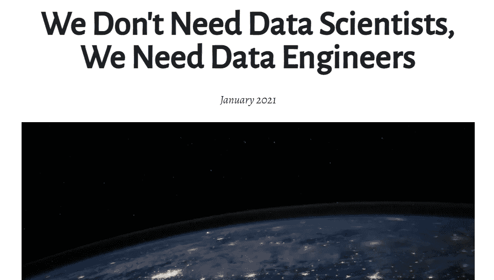
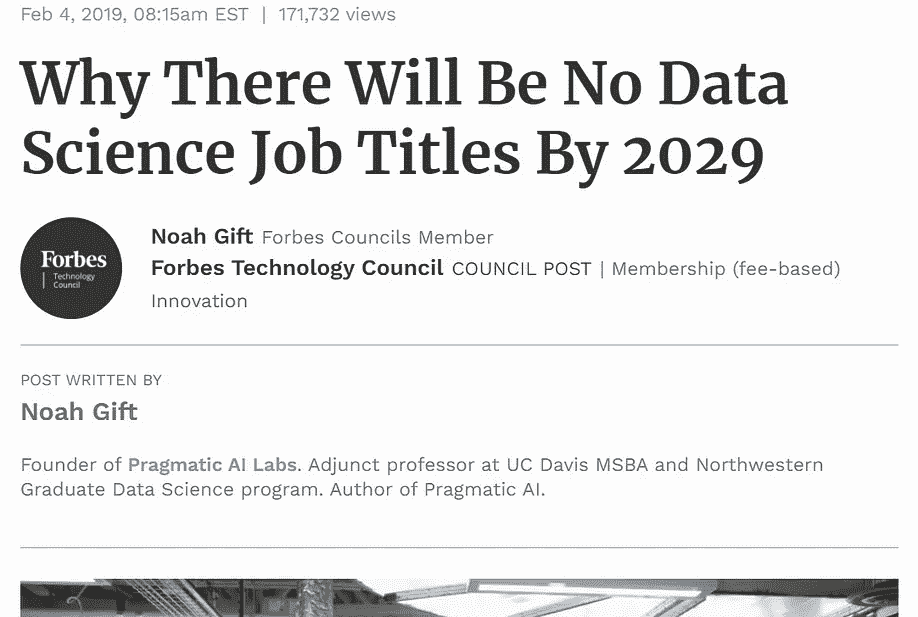
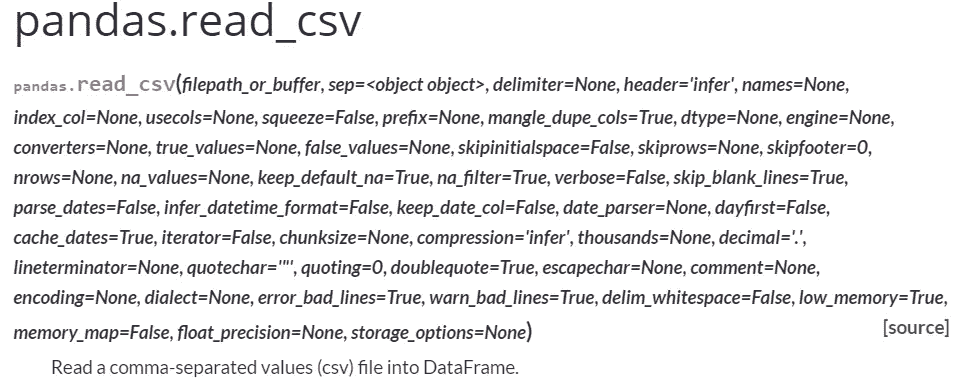
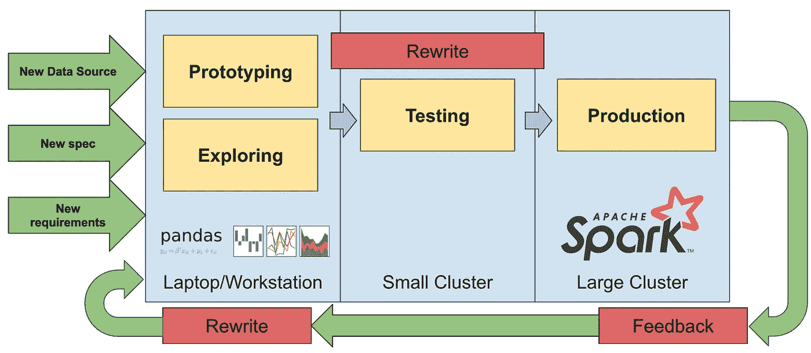

# 我们不需要数据工程师，我们需要为数据科学家提供更好的工具

> 原文：<https://towardsdatascience.com/we-dont-need-data-engineers-we-need-better-tools-for-data-scientists-84a06e6f3f7f?source=collection_archive---------6----------------------->

([来源](https://www.pexels.com/photo/silver-and-blue-metal-tools-4480531/))

## 正如我们所知，数据工程师的角色之所以存在，是因为缺乏足够的工具来支持数据科学家

在大多数公司，数据工程师以各种方式支持数据科学家。这通常意味着翻译或生产数据科学家写的笔记本和脚本。**对于数据科学家来说，数据工程师的大部分角色可以被更好的工具所取代，从而解放数据工程师来做更有影响力(和可伸缩性)的工作。**

# 为什么这很重要？

互联网上流传着一种观点:我们不需要数据科学家，我们需要数据工程师。

([左条](https://www.mihaileric.com/posts/we-need-data-engineers-not-data-scientists/) ) ( [右条](https://www.forbes.com/sites/forbestechcouncil/2019/02/04/why-there-will-be-no-data-science-job-titles-by-2029/?sh=31ad8ac93a8f))

这些文章关注的是“数据工程师”和“数据科学家”的职位空缺数量。我们姑且不论发布这些职位的招聘经理往往不知道这两个职位的区别，而是互换使用(或者使用目前流行的任何东西)。就本文而言，我们可以从表面价值来看待头寸的存在。那么问题就变成了:**数据工程师职位的过剩仅仅是一个人员问题吗？**

# 数据科学是混乱的，因为它反映了现实世界

数据科学家是领域专家(除了了解统计学之外)，他们通常没有很强的编程背景。我已经在多个 Twitter 和论坛帖子中看到了这种专业知识的折扣，软件工程师和其他“技术人员”会问类似“他们为什么不学习 Spark？”。这种心态完全忽略了一个事实，即数据科学家已经可以用他们现有的工具在更小的范围内做他们想做的事情。数据科学家希望获得洞察力，而不是担心构建优雅的管道。公司想要可操作的东西，而不是漂亮的东西。

> 洞察力比优雅的管道更重要。

流行的数据科学工具也受到更多技术人士和学者的批评:“为什么会有人用熊猫？”。**熊猫一定是最受那些对它毫无用处的人憎恨的工具**。然而，它受到每天使用它的数据科学家的喜爱(或者至少是欣赏)。

> 如果熊猫真的如此糟糕，为什么没有什么能让它下台？

熊猫和其他工具一样，是用来处理现实世界的混乱的。看看`read_csv`有多少个参数就知道了:

[https://pandas . pydata . org/docs/reference/API/pandas . read _ CSV . html](https://pandas.pydata.org/docs/reference/api/pandas.read_csv.html)

如果 pandas 如此糟糕，为什么没有任何东西取代它成为 Python 数据科学的标准数据框架？为什么会在领养上连年持续增长？它不是最快的，也不是最健壮的，为什么呢？

# 数据工程师必须处理可扩展工具无法处理的混乱

对于生产使用来说足够健壮的可伸缩系统(例如 Apache Spark)不能处理现实世界的混乱。没有清晰简单的假设，就很难扩展，问题越乱，就越难扩展。数据工程师处理混乱，因为可扩展的工具不能。

> **杂乱无章的缩放极其困难。数据工程师处理混乱，因为工具不能。**

在这种情况下，脏乱意味着:

*   组/连接键倾斜
*   分割
*   调试分布式系统
*   集群配置和资源供应

对于较小规模的系统，这些都不是你需要担心的事情。在湾区之外，大多数数据工程师花时间调试和翻译一个分布式系统，通常是 Spark。

需要多次重写才能将一次性见解转化为生产作业。

在这里，我们真的不能指责任何人，构建今天使用的可伸缩工具的人是在为像他们一样的高技术用户构建。高技术人员不需要他们的工具来为他们处理混乱，通常他们想要调整旋钮。在系统工程中，狗食是一个流行的概念:“建造它的人也使用它”。我认为，对狗食化的担忧在一定程度上导致了我们今天在数据科学中看到的景象:“只有像构建系统**这样的技术人员才能使用它”。**

# 那么，数据工程师应该做什么呢？

数据科学生态系统需要不仅仅关注构建它的人的问题的系统。在过去的 10 多年里，数据科学家大多都在使用相同或相似的工具。对此的解释有两个:(1)数据科学家喜欢使用他们现有的工具，因为他们了解这些工具；(2)那些有能力构建大规模系统的人在很大程度上(无意中)忽略了那些技术不如他们的人的问题。

> 我们需要数据工程师来帮助构建工具，以增强数据科学家的能力，而不是将熊猫转化为火花。

我们需要数据工程师来帮助构建可扩展的工具，为数据科学家提供支持，而不是将熊猫转化为火花。有谁比当今的数据工程师更适合帮助构建下一代数据科学工具呢？