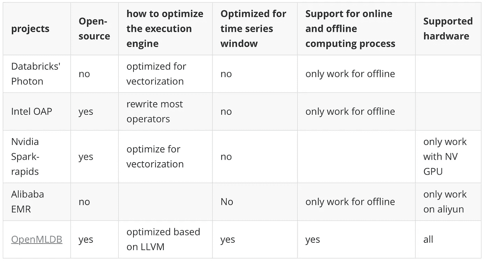
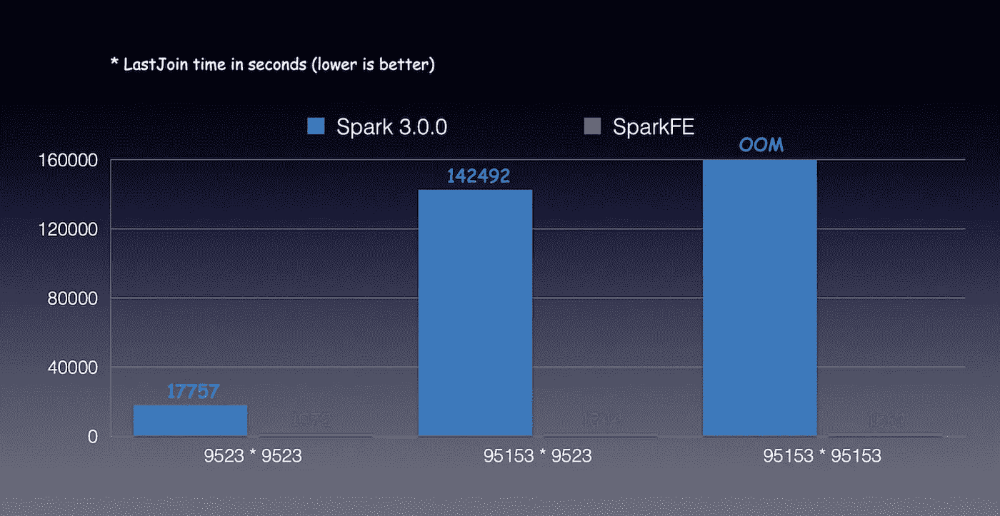
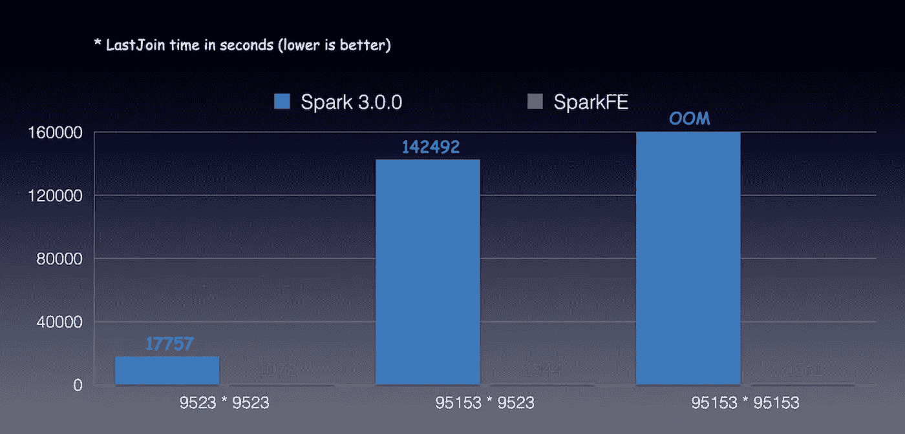
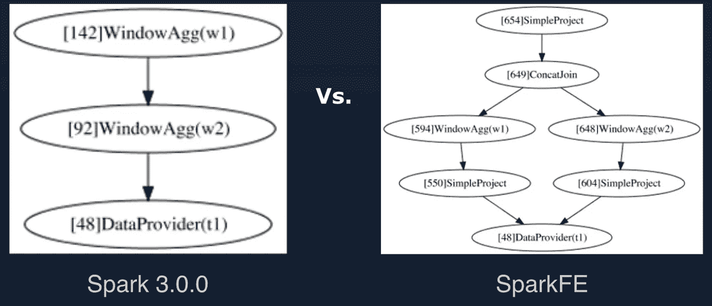
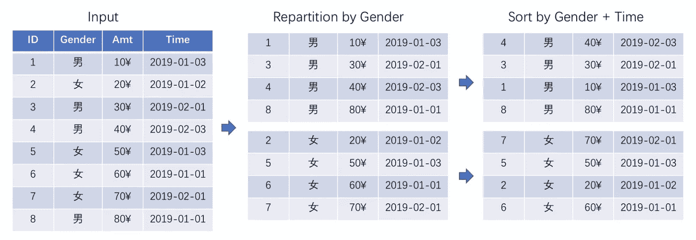
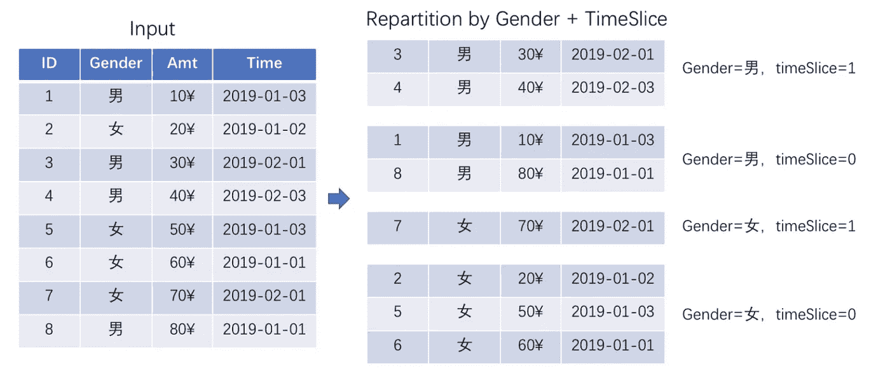
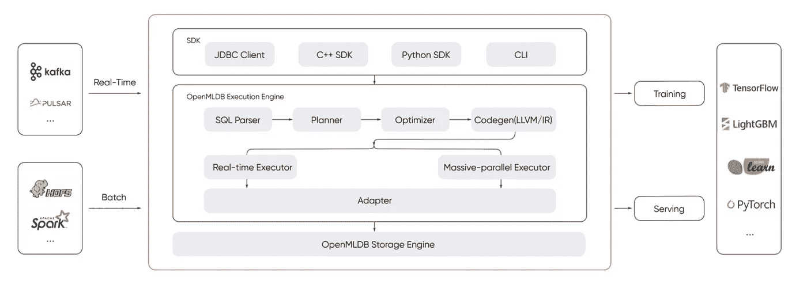

# 相比原生 Spark 3.0，我们在 AI 应用领域取得了显著的优化效果

> 原文：<https://towardsdatascience.com/we-have-achieved-significant-optimization-effects-in-the-ai-application-field-compared-to-native-2a055e47250f?source=collection_archive---------36----------------------->

## 介绍 OpenMLDB 及其相对于原生 Spark 的优势


SpaceX 在 [Unsplash](https://unsplash.com?utm_source=medium&utm_medium=referral) 上拍摄的

# **背景**

Spark 已经迅速成为大数据处理事实上的标准，无需介绍，但 Spark 在 AI 场景下仍有很多不足。

1.  好:原生 Spark 擅长 Hadoop 集群中的大数据处理
2.  不足:SparkSQL 的缺点在特征提取领域逐渐暴露出来
3.  不足:考拉，阿帕奇 Spark 上的熊猫 API

即使 SparkSQL 和 Koalas 项目可以提供一些重要的数据处理功能，但特征提取所需的功能支持仍然非常有限。所支持的时序特征计算的性能不令人满意。只能支持离线分析，但对于 AI 制作，还需要在线计算。而且因为这个过程要反复使用 UDF/UDAF，所以开源的 Spark 和 AI 的融合还有很大的提升空间。

目前，业界已经涌现出越来越多的原生执行引擎解决方案，如 Databricks 的光子模块、Intel 的 OAP 项目、Nvidia 的 Spark-rapids 项目、阿里巴巴的 EMR 服务等。这些项目都有其亮点。它们可以通过底层原生代码生成，充分利用 CPU 矢量化和 GPU 并行计算特性，显著提升 Spark 在特定场景下的性能。但还是有一些不足。首先，它只能支持离线计算和在线特征计算，以及 AI 场景落地所需的在线模型估计服务。其次，对于常用的时间序列计算功能(SQL Over Window)没有进一步优化，最后，对于 AI 场景，特征提取功能也缺乏支持。

## 几种火花发动机的比较



作者图片

所以我们发布了我们的项目 [OpenMLDB](https://github.com/4paradigm/OpenMLDB/) (SparkFE 是 OpenMLDB 的引擎)。它可以弥补上述项目的不足，在人工智能应用中取得更好的性能。基于 LLVM 优化，性能比原来的 Spark 提高了 6 倍以上。

# 优势

*   基于 LLVM 优化，高性能性能比原来的 Spark 提升 6 倍以上。
*   对于 AI，扩展 SQL 语法，支持更多的 FE 函数和时序特征计算。
*   线上线下一致，通过时间序列数据库的窗口特征聚合计算，实现 SQL 一键上线。
*   无迁移成本，兼容 SparkSQL 应用，Scala、Java、Python、R 应用无需修改代码即可享受性能提升。
*   所以，最后，无论是时间序列特征计算场景，还是机器学习的特定表组成场景，最终的性能测试结果都表明 [OpenMLDB](https://github.com/4paradigm/OpenMLDB/) 在不增加硬件成本的情况下，可以实现 6 倍到上百倍的性能提升。


时间序列特征提取。作者图片



用于机器学习的自定义表连接。作者图片

# 与原生 Spark3.0 相比的性能优化

这里我们介绍一下 [OpenMLDB](https://github.com/4paradigm/OpenMLDB/) 的一些应用场景，重点是性能优化的方法。

## 第一个优化是**原生窗口计算**。

底层基于 C++双向队列数据接口，高效实现标准窗口和子窗口功能。扩展 SQL 实现的 ROWS_RANGE 边界也可以更好的解决相同毫秒数据的计算顺序问题。本机窗口计算

*   本机窗口计算
*   ➡Performance 改进
*   ➡行 _ 范围界限
*   带有联合表的➡窗口
*   ➡处理微秒级冲突

```
select trip_duration, passenger_count,
sum(pickup_latitude) over w as vendor_sum_pl,
max(pickup_latitude) over w as vendor_max_pl,
min(pickup_latitude) over w as vendor_min_pl,
avg(pickup_latitude) over w as vendor_avg_pl,
sum(pickup_latitude) over w2 as pc_sum_pl,
max(pickup_latitude) over w2 as pc_max_pl,
min(pickup_latitude) over w2 as pc_min_pl,
avg(pickup_latitude) over w2 as pc_avg_pl ,
count(vendor_id) over w2 as pc_cnt,
count(vendor_id) over w as vendor_cnt
from t1
window w as (partition by vendor_id order by pickup_datetime ROWS_RANGE BETWEEN 1d PRECEDING AND CURRENT ROW),
w2 as (partition by passenger_count order by pickup_datetime ROWS_RANGE BETWEEN 1d PRECEDING AND CURRENT ROW);
```

## 优化的第二点是本机 LastJoin 实现。

这种扩展连接类型可以确保表组装后的结果与拼接前的结果相同。Spark 源代码级别的原生实现比基于 Spark 3.0 的实现快 100 多倍，并且节省更多内存。

```
SELECT t1.name FROM t1 LAST JOIN t2 WHERE t1.id == t1.id
```



LastJoin 性能。作者图片

## 优化的第三点是多窗口并行计算的优化。

Spark 默认的串行执行被优化为并行计算，充分利用了集群计算资源，SparkSQL 整体任务时间也可以大大减少。

```
SELECT
 min(age) OVER w1 as w1-min-age,
 min(age) OVER w2 as w2-min-age
FROM t1
WINDOW
 w1 as (PARTITION BY name ORDER by age ROWS BETWEEN 10 PERCEDING AND CURRENT ROW),
 W2 as (PARTITION BY age ORDER by age ROWS BETWEEN 10 PERCEDING AND CURRENT ROW)
```



作者图片

## 优化的第四点是时间窗口数据偏差计算

与表格不对称优化类似，该窗口对不对称数据进行了两次分区，从而显著提高了任务的计算并行性，并充分利用集群资源来降低总体 TCO(总拥有成本)。



opt 之前，并行度:2。作者图片



opt 之后，并行度:4。作者图片

SparkFE(现在合并到 [OpenMLDB](https://github.com/4paradigm/OpenMLDB/) )有很多不能重复的优化。由于兼容 SparkSQL API，应用场景与 Spark 类似，尤其是在 AI 相关的时序特征计算、数据表拼接方面。

*   时间序列特征提取
*   多窗口并发
*   自定义表连接
*   自定义特征提取功能
*   偏斜优化
*   本机聚合函数

## 这里是 [OpenMLDB](https://github.com/4paradigm/OpenMLDB/) 的架构，欢迎来到社区。



作者图片