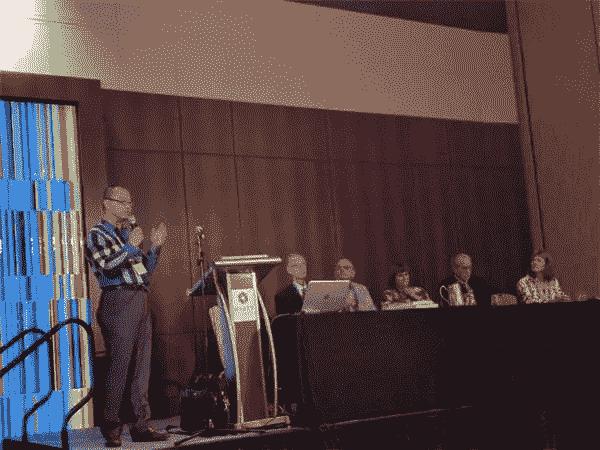
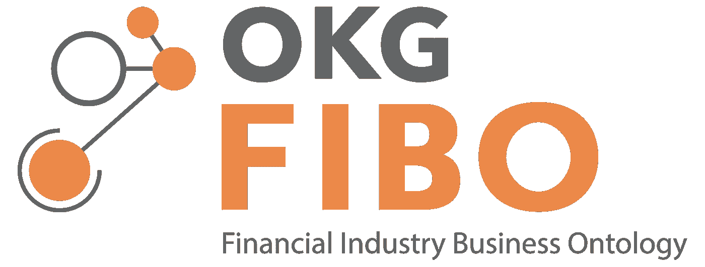
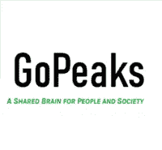
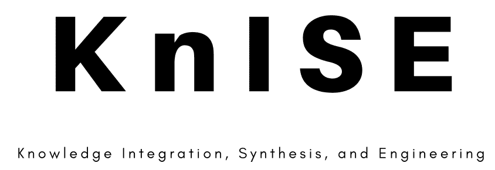

# 大合成

> 原文：<https://towardsdatascience.com/we-need-a-research-practice-knowledge-synthesis-system-for-business-and-management-4314e4322282?source=collection_archive---------21----------------------->

## [思想和理论](https://towardsdatascience.com/tagged/thoughts-and-theory)

## **我们需要一个商业和管理的研究-实践知识综合系统**

# 背景

在我在 *2017 管理学院(AOM)年会*上组织的一次研讨会上，五位前 AOM 大学校长带领观众设想了一个理想的科学实践知识体系。我们共同设想了一个未来，在这个未来，管理研究人员和从业者可以在一个共享的数字平台上直接交流——双方都能及时受益于彼此独特的经验、数据和知识(见[摘要](https://cdn.website-editor.net/284058784ada4beeb9e01f1d94fb70e9/files/uploaded/GoPeaks_Vision.pdf))。这个知识平台将不断积累和整合零散的见解，形成集体智慧。

2017 年 AOM 知识综合研讨会，五位 AOM 总统 Drs. R. Duane Ireland、Jim Walsh、Denise Rousseau、Mike Hitt 和 Susan Jackson(图片来源:作者)。

然而，当前的知识基础设施一直在激励学者们专注于正常的科学和还原论研究。这种研究因学科界限、同行对精细专业化的压力、期刊网点的技术限制(空间、范围和频率)以及学术激励缺乏多样性(出版或消亡)而得以延续。

> **“正常的科学和还原论研究因学科界限、同行对精细专业化的压力、期刊网点的技术限制(空间、范围和频率)以及学术激励缺乏多样性(出版或灭亡)而得以延续。”**

# 现有基础设施的局限性

当涉及到解决复杂的社会问题时，如多重利益相关者的价值、可持续性和社会福利，我们目前的基础设施变得不足([陈& Hitt，2021](https://journals.sagepub.com/doi/abs/10.1177/1056492619862051?journalCode=jmia) )。文献、数据和社区越来越分散。开发连接不同知识片段的完整且可操作的框架变得极其困难，并且对这些片段的影响知之甚少。

> **“文献、数据和社区越来越分散。开发连接不同知识片段的完整且可操作的框架变得极其困难，而且对这些片段的影响知之甚少。”**

经过 60 多年的商业管理科学研究，我们的知识量使得知识合成成为可能，而我们的知识碎片化程度使得知识合成成为必要。发明一种知识综合平台的时机已经成熟，这种平台具有能够促进知识积累的相互支持的组件。该平台应持续整合学术和专业社区中分散的知识资源，并生成及时、可行且易于访问的循证框架，用于管理与各利益相关方相关的组织。

> **“发明一个知识综合平台的时机已经成熟，这个平台由相互支持的组件组成，能够促进知识积累。”**

要做到这一点，我们需要克服当前基础设施(如学术期刊)无法克服的三个持续障碍。

## **第一个障碍是零散的科学**

对于一个组织来说，向各种利益相关者交付价值是一项复杂的任务，涉及跨许多级别、学科和异构效用函数的交互( [Bridoux & Stoelhorst，2014](https://onlinelibrary.wiley.com/doi/abs/10.1002/smj.2089) )。传统的科学方法是使用基于学科的、连贯的理论驱动的和简化的模型，以分段的方式研究这些不同的组成部分。提议的平台应该将来自不同领域的管理概念、模型、理论和发现汇集到一个统一的知识表示中。为了迎合来自不同领域的观众，它还应该阐明通常是特定领域的难以表达的假设和信念。

*潜在的系统解决方案包括:*

*   开发和统一业务和管理概念的本体
*   构建嵌入理论相关属性的机器可读知识图
*   建立多层次、复杂的概念框架，模拟社会生态系统的动态，以创造和分配利益相关者的价值
*   开发一个元框架，该框架可以捕捉处于不同利益相关者身份的个人的共享和异质动机

*我们可以利用的一些现有成果包括:*

*   [关于人类行为结构和模型之间语义匹配的理论](http://www.theoryon.org/)，由 NSF 资助，PI [Kai Larsen](https://www.colorado.edu/business/leeds-directory/faculty/kai-r-larsen) 领导(科罗拉多大学，博尔德)
*   由美国国家科学基金会资助，PI [Jay Pujara](https://www.jaypujara.org/) (南加州大学)领导的创业关系商业开放知识网络(BOKN)项目
*   [商业和管理的因果知识图(CausalKG)](https://www.gopeaks.org/causalkg-for-bam)项目，该项目发展了对组织绩效的因果关系的全面分类，由美国国家科学基金会资助，PI[Victor Chen](https://www.gopeaks.org/nsf-i-corps-team-gopeaks)领导(北卡罗来纳大学夏洛特分校)
*   [商业学术文献的机器阅读](https://arxiv.org/abs/2006.08904)和[非编码知识的视觉表示](https://gopeaks-ai.shinyapps.io/EMIE/)，由 PI[Victor Chen](https://www.gopeaks.org/nsf-i-corps-team-gopeaks)领导(北卡罗来纳大学夏洛特分校)

图片来源:[https://wiki.edmcouncil.org/](https://wiki.edmcouncil.org/)

*   [金融行业业务本体(FIBO)](https://spec.edmcouncil.org/fibo/) ，由[企业数据管理(EDM)委员会](https://edmcouncil.org/page/listofmembersreview)私人资助，由富国银行[戴维·纽曼](https://www.knowledgegraph.tech/speakers/david-newman/)领导

## **第二个障碍是分布式数据**

结构化和非结构化数据(例如，自然语言处理[NLP]数据等)的数量、频率和速度都在不断增长。)关于不同利益相关者的问题。然而，许多数据保存在分散的、不协调的、通常是私人的来源中。因此，我们可以从学术文献中获得的经验证据很可能是基于世界上不完整或有偏见的部分，而不是一个连贯、紧密整合的全球样本。需要新的技术来理解支离破碎的经验证据，并及时将这些碎片合成为一组更完整、更公正的证据。

*潜在的系统解决方案包括:*

*   开发数据共享和查询平台，可以自动比较、合并和重用公开访问的数据，并可以一起索引和打包请求私有访问的数据。
*   重新发明元分析技术的数学，以纳入非线性，缺失的交互项，以及证据合成的隐藏调节因子
*   开发元机器学习(ML)算法来聚集来自不能完美合并的多个数据源的统计和 ML 结果
*   开发 NLP 算法，该算法可以检测和比较基于分类法/本体论的非结构化数据源，以帮助综合管理研究领域的大量文献

*我们可以利用的一些现有成果包括:*

*   [metaBUS 平台](http://metabus.org/)管理超过 14，000 份 OBHR 和管理出版物，由 NSF 资助，PI [Frank Bosco](https://directory.business.vcu.edu/profile.php?urn=fabosco) 领导(弗吉尼亚联邦大学)
*   HubMeta 平台允许研究人员上传正在进行的元分析工作，由 PI 领导(卡尔加里大学)
*   [大机制项目](https://www.darpa.mil/program/big-mechanism)，由 DARPA 资助 4500 万美元，由当时的项目官员[保罗·寇恩](https://www.sci.pitt.edu/people/paul-cohen)(现在的匹兹堡大学)领导
*   [CausalityLink](https://causalitylink.com/solution/) ，专注于将文本文档中的因果关系与财务指标联系起来的人工智能公司，由联合创始人兼首席执行官 [Pierre Haren](https://causalitylink.com/solution/) 领导

## **第三个障碍是证据和实践的脱节**

关于实际问题的知识通过循证实践和实践证据之间的持续交叉验证而进步，然而这两者越来越孤立。对员工、客户、供应商和社区关系等各种利益相关者的直接观察、非结构化数据资源和背景细节通常是研究人员无法获得的( [George，Haas，& Pentland，2014](https://journals.aom.org/doi/10.5465/amj.2014.4002) )。目前还没有一个可扩展的平台，让双方的真相能够以一种及时可信的方式共享。因此，我们对世界的理解可能基于过时、不准确、不完整和间接的证据，而实践可能基于未经充分检验或不可复制的原则。

*潜在的系统解决方案包括:*

*   设计和实现一个图形用户界面，允许工作场所和外部研究团体之间的即时信息交换
*   设计和实施隐私保护协议，允许报告经验发现，同时保护敏感身份和信息
*   设计和实施一个激励系统，工作场所分析办公室可以从使用科学文献开发的模型和框架中受益
*   设计和实施一个平台，利益相关者可以从他们的角度直接评估组织的绩效，而无需代理人，最高领导层可以收到基于证据的干预建议，以回应利益相关者的评估

*我们可以利用的一些现有成果包括:*

图片来源:www。GoPeaks.org

[面向企业绩效管理的可解释人工智能(XAI)](https://www.gopeaks.org/nsf-i-corps-team-gopeaks)项目，该项目采访了 100 家企业分析供应商、顾问和最终用户，由 NSF 资助，PI[Victor Chen](https://www.gopeaks.org/nsf-i-corps-team-gopeaks)(北卡罗来纳大学夏洛特分校)领导

# 规划活动

改变需要时间，即使是在最乐观的时候。我们需要形成一个跨学科的致力于合作的社区(例如 AOM 和 INFORMS ),以支持一系列逐渐产生新的知识合成系统的活动。以下是一些提议的活动和时间表。

> “改变需要时间，即使是在最乐观的时候。我们需要形成一个跨领域的、忠诚的、协作的社区。”

## **2021–2022:组织管理信息系统和管理层之间的联合专题和研讨会**

我和几位顶尖的管理学者一起，正在探索在一个或多个管理精英评论期刊和一个或多个管理信息系统精英期刊之间联合发行特刊的可能性。社会主义国际将呼吁两个轨道的贡献。第一个轨道将呼吁管理信息系统学者审查学术界和实践中知识治理的现有工作实例，并提出商业和管理科学实践知识综合平台的设计原则。第二条路线将要求管理学者回顾组织和管理中的现有理论、模型和经验发现，并提出一个整体框架，在这个框架中，简化论者可以进行比较、综合和不断更新。

然后，编辑团队将把这两种贡献结合成一个科学实践知识综合系统的具体蓝图，首先作为**一篇期刊文章**发表，然后改编为多个主要资助机构(例如，国家科学基金会、国防部、斯隆基金会)的**资助提案**，以将设计付诸实施。

将组织几次研讨会，召集利益攸关方，宣传这项举措。精英评论期刊的编辑和有重要评论贡献的杰出学者将被邀请作为小组成员或演讲者。

## **2022–2023:在领先的学术协会建立新的兴趣小组**

目前，主要学术协会(如 AOM 和 INFORMS)的大多数兴趣小组都是基于专业的。这种划分利益的方式*本身*延续了知识的碎片化。很多学者提出，知识综合本身就是一个兴趣小组。具有综合思维的学者将被邀请在 AOM 和 INFORMS 等主要协会组建新的兴趣小组。

[LinkedIn Group](https://www.linkedin.com/groups/9061066/)和 Connect@AOM 社区 on [知识整合、综合和工程(KnISE)](https://www.gopeaks.org/knise) 是最近创建的，作为商业和管理领域的研究科学家和实践者之间的门户(图片来源:作者)。

> *在我组织的以下活动中已经建立了一些社区:*

*   与《AoM 年鉴》、《AoM 文集》、《年度评论》、JOM、JIBS 和 IJMR 的编辑一起，提议在 2021 年 AOM 会议上召开关于“[管理集体智慧:探索知识综合的新基础设施](https://www.youtube.com/watch?v=tYKs9Trmq4A)”的研讨会
*   在 2015 年 AOM 会议上，与亨利·明茨伯格、彼得·罗兰格、比尔·克里克和 JC·斯潘塞一起参加了“[设计未来商学院](https://cdn.website-editor.net/284058784ada4beeb9e01f1d94fb70e9/files/uploaded/futurebschool_opening_slides.pdf)”的研讨会
*   与 MISQ、AMR、JAP、JIBS 和 ASQ 的 EIC 和 AE 一起，在 2016 年 AOM 会议上举办了一个关于“[创建更可靠和累积的知识生态系统](https://cdn.website-editor.net/284058784ada4beeb9e01f1d94fb70e9/files/uploaded/aom2016_pdw.pdf)的研讨会
*   五位 AOM 总统将在 2017 年 AOM 会议上召开关于“[知识综合的时机已经成熟](https://cdn.website-editor.net/284058784ada4beeb9e01f1d94fb70e9/files/uploaded/aom2017_synthesis_kNLwlK5S2S0HauUSEiYq.pdf)”的研讨会
*   与[商业&管理(RRBM)](https://www.rrbm.network/) 责任研究合作，在 2019 年 AOM 会议上举办关于“[打造管理知识导航者](https://www.gopeaks.org/2019-aom-pdw-on-management-knowledge-navigator)的研讨会

## **2023–2024 年:向多个机构提交大额赠款提案**

如前所述，新知识合成社区的领先研究人员将共同努力，向主要资助机构提交多项资助。主要的资助机构最近提出了知识分散的问题，它们试图鼓励整合目前孤立的知识进步。例如，在其*卓越研究框架*的 2017 年咨询中，高等教育机构最大的资助机构英国研究与创新(UK Research and Innovation)对其倾向于不利于跨学科研究的旧审查政策提出了一系列修订。在美国，美国国家科学基金会(National Science Foundation)将不断增长的融合研究(Growing Convergence Research)定义为其当前 10 大投资优先事项之一，这是一种寻求整合跨学科进展以解决复杂社会需求问题的研究。更具体地说，美国国防高级研究计划局(DARPA)在 2014 年至 2017 年期间实施了一项 4500 万美元的大机制计划，以资助将碎片化的癌症模型整合到整体因果框架中的创新(You，2015)。

*与该科学-实践知识综合系统相关的一些程序包括:*

*   维基媒体基金会[项目和活动资助](https://meta.wikimedia.org/wiki/Grants:Start/Groups%26Organizations)(目标:3 万美元)
*   美国陆军行为和社会科学研究所
*   NSF [组织科学计划](https://www.nsf.gov/funding/pgm_summ.jsp?pims_id=504696)(目标:20 万美元)
*   NSF [科学学计划](https://www.nsf.gov/funding/pgm_summ.jsp?pims_id=505730&org=SBE&sel_org=SBE&from=fund)(目标:20 万美元)
*   创新英国 [STFC 创新伙伴计划](https://www.ukri.org/opportunity/stfc-innovations-partnership-sep-2021/)(目标:36 万)
*   NSF [创新伙伴计划](https://www.nsf.gov/funding/pgm_summ.jsp?pims_id=504790)(目标:50 万美元)
*   NSF [研究协调网络计划](https://www.nsf.gov/funding/pgm_summ.jsp?pims_id=11691)(目标:50 万美元)
*   ESRC [研究资助](https://www.ukri.org/opportunity/esrc-research-grant/)(目标:100 万)
*   斯隆基金会[学术交流和知识普及](https://sloan.org/programs/digital-technology)(目标:200 万美元)
*   创新英国 [Smart 赠款](https://apply-for-innovation-funding.service.gov.uk/competition/810/overview)(目标:200 万英镑)
*   NSF [增长融合研究项目](https://www.nsf.gov/funding/pgm_summ.jsp?pims_id=505637&org=NSF&sel_org=OIA&from=fund)(目标:360 万美元)
*   人类科技前沿项目的工作前景(目标:665 万美元)
*   NSF [融合加速器计划](https://www.nsf.gov/pubs/2020/nsf20565/nsf20565.htm)(目标:800 万美元)

*有些资助正在进行中，但有些可能会在申请时终止或被新项目取代。