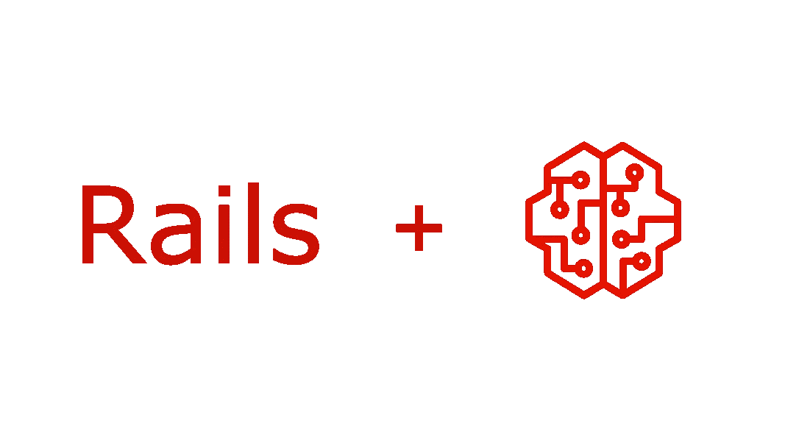
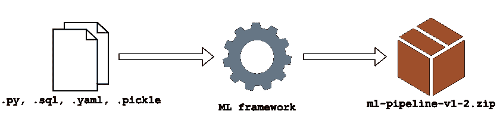
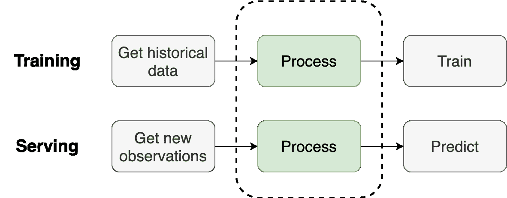
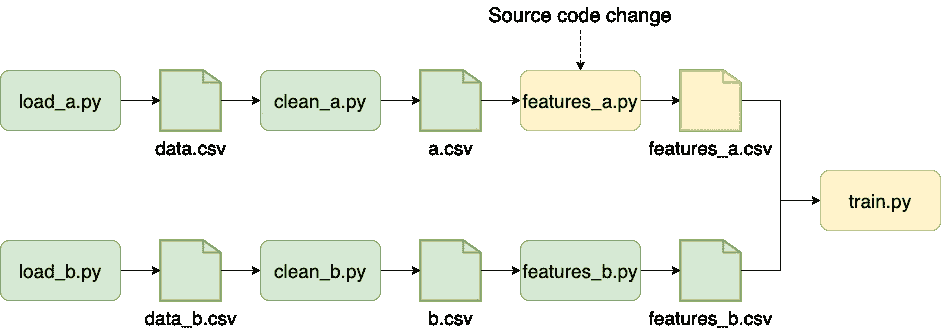
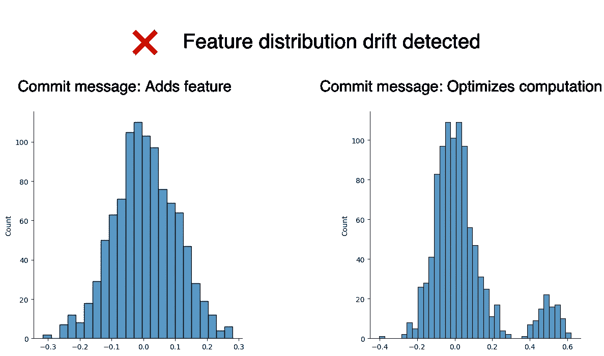

# 我们需要一个 Ruby on Rails 来进行机器学习

> 原文：<https://towardsdatascience.com/we-need-a-ruby-on-rails-for-machine-learning-626373dbd210?source=collection_archive---------29----------------------->

## 一个为用户快乐而优化的 ML 框架应该是什么样的？

图片作者。

> *Rails 允许任何人在 15 分钟内* [*搭建博客引擎*](https://www.youtube.com/watch?v=Gzj723LkRJY)*；这将如何转化为机器学习开发世界？这篇文章代表了我对用于机器学习的 Ruby on Rails 应该是什么样子的看法。*

在过去的几个月里，我和许多数据从业者交谈过，从 Ploomber 用户到其他数据工具的维护者。一个反复出现的话题是机器学习工具的状态；讨论经常围绕机器学习框架的适当 API。

我想知道，当 web 开发框架出现时，在互联网的早期是否也发生过同样类型的讨论。我第一次接触 web 开发是在我了解到 [LAMP stack](https://en.wikipedia.org/wiki/LAMP_(software_bundle)) 的时候。出于好奇，我学习了 PHP、JavaScript、HTML 和 CSS 的基础知识，但我发现将它们缝合在一起构建一个网站太难了。做同一件事有太多的方法，其中大多数似乎都不正确。那时，我想:*即使是建立一个简单的网站，一个人也必须学习很多东西*。然后，我在参加一个关于软件工程的在线课程时学习了 web 框架:这真是一次令人愉快的经历！

该课程展示了如何使用 Ruby on Rails 开发软件应用程序。我对 web 技术了解不多，但是这个框架让我变得更容易:它减少了我必须做出的决定的数量，并提供了一个一致的途径来完成事情。我尝试了一些其他的框架，比如 Django，但是没有一个符合 Rails 的开发经验；毫不奇怪,[Rails 信条](https://rubyonrails.org/doctrine/)的第一个支柱是*为程序员的快乐而优化*。

很快，我开始从事机器学习项目，感觉自己又走上了低效路线。有很多方法可以达到同样的目的，但大多数方法都不正确。

我们将 scikit-learn、PyTorch 或 Tensorflow 等项目称为*机器学习框架*。尽管如此，他们是机器学习**培训**框架，因为做机器学习不仅仅是培训一个模型；这相当于调用 [ORM](https://en.wikipedia.org/wiki/Object%E2%80%93relational_mapping) 框架，web 框架。

Web 框架允许个人快速开发 web 应用程序，但我们目前需要整个团队来构建和部署机器学习模型。我敢肯定，在这一点上，你已经听过 *87%机器学习项目失败*的统计不下十几次了。

简化机器学习模型的开发是新工具的承诺，但许多人正在走向错误的方向。例如，一些工具声称通过版本化数据、缩放实验或自动化模型部署来降低 *87%的统计量*。然而，根据我的经验，大多数项目失败的原因还有其他。我们投入了太多的资源来解决外围问题，而不是解决根本原因。

将业务问题放在一边(这是 ML 项目从未投入生产的首要原因)，确实有一些技术问题，在这些问题上，更好的工具可以产生巨大的差异。根据我的经验，破坏项目的是缺乏开发过程:缺乏代码组织和打包标准，未记录的依赖关系，破碎的计算环境，培训和服务数据预处理之间的不匹配，以及集成较差的管道；这些问题导致项目建立在脆弱的基础上，使得将模型原型(通常在笔记本中开发)转换成生产就绪的工件变得很困难。

下面几节描述了我认为 Ruby on Rails 对于机器学习的体验应该是怎样的。

# 项目脚手架

没有人会从零开始开发 web 应用程序，然而，每当我们开始一个机器学习项目时，我们通常会从几个文件(或笔记本)开始，然后从那里开始构建。此外，从零开始导致每个项目都有一个特定的布局，这很难实现，因为人们必须了解每个项目的结构。相比之下，当使用 web 框架时，如果我们过去使用过该框架，我们会立即知道在哪里可以找到东西。

像[cookiecutter-data-science](https://github.com/drivendata/cookiecutter-data-science)这样的项目是引导项目的好方法。然而，我相信如果项目布局与框架集成，它可以做得更多。例如，Rails 用户可以通过遵循关于项目结构和文件命名的某些[约定](https://en.wikipedia.org/wiki/Convention_over_configuration)来显著减少配置参数。

# 创建软件工件

部署工件由代码、配置和模型文件组成。图片作者。

项目布局的标准化是重要的第一步。自然的第二步是采用标准形式的项目，并轻松地将其转换为部署工件。一旦你用一个特定的框架开发了一个 web 应用程序，你就可以使用一系列的 PaaS 服务来快速部署它。相比之下，数据科学世界充斥着 *Docker for Data Science* 教程，不幸的是，这些教程对于展示如何打包 ML 工作以在生产中运行它是必要的。数据科学家不应该学习 Docker。相反，框架应该创建一个 Docker 映像(或 Python 包)用于部署，而数据科学家不必处理这些细节。

自动化差的另一个例子是当数据科学家为在线服务编写 Flask 应用程序时。一旦定义了服务逻辑，框架就应该生成所有的支持代码，以便将服务管道集成到一个更广泛的系统中；这可以是 REST API，但也可以采用其他形式。

部署自动化是许多新工具的目标。尽管如此，我认为它们提供了一个不完整且容易出错的工作流程。例如， [Mlflow 的](https://www.mlflow.org/docs/latest/models.html#storage-format)文档显示，要部署 scikit-learn 模型；我们必须提供以下文件:

一个模型文件(`model.pkl`)并不是一个完整的推理工件。在大多数情况下，服务管线涉及自定义预处理(即生成特征)。虽然 MLflow 支持任意函数作为模型，但是这种功能隐藏在一个小的[部分](https://www.mlflow.org/docs/latest/models.html#custom-python-models)中。因此，框架不应该将模型文件视为部署工件，而应该将项目视为一个整体:配置、模型文件和依赖项。

为了部署一个模型，我有一个小的 bash 脚本，它用所有必需的文件创建了一个`.zip`工件；第二个脚本使用这样的压缩文件部署模型:

然后，将我的模型导入应用程序:

在这里，我的部署工件包含设置项目所需的一切，公开的 API 抽象了所有细节(加载哪个模型、预处理数据并最终调用模型)。

# 结构管理

配置和代码的严格分离被认为是软件开发的最佳实践。然而，这在许多 ML 项目中不会发生，在这些项目中，云配置设置(例如，连接到 S3 桶)与数据处理代码(例如，NumPy 或 pandas 操作)交织在一起是很常见的。配置和代码分离允许我们在不同的设置下运行代码，简化了测试和执行。

例如，为了实现持续集成，我们可能希望使用原始数据的样本运行管道，并将结果存储在特定的 S3 存储桶中，以便进行测试。然而，我们希望在训练模型时使用整个数据集并将工件存储在不同的存储桶中。 [Rails 默认定义了](https://guides.rubyonrails.org/v5.1/configuring.html)一个开发、测试、生产环境；我们可以将同样的想法应用于 ML 项目，以帮助用户根据他们的目标在不同的配置下运行他们的工作流:测试管道、训练模型或服务模型。

# 在本地和云中运行，无需更改代码

配置和代码之间的严格分离为另一个基本特性打开了大门:从本地环境到云的无缝过渡。虽然并非所有项目都需要，但有时我们可能希望扩大分析规模(例如，在多个进程或集群中运行)以加快计算速度。因此，框架应该允许用户在不修改代码的情况下，通过改变项目的配置，从本地环境转移到分布式环境。

# 状态复制

在云端运行的缺点是我们失去了交互调试错误的能力。例如，在过去调试管道的经验中，日志不能提供足够的信息，所以我必须从远程存储下载工件，在本地复制错误，并使用 [Python 调试器](https://docs.python.org/3/library/pdb.html)。因此，框架必须确保依赖项安装是确定的(即，相同的版本)，提供下载远程工件的方法，并从故障点本地恢复执行。

# 管道组成

[训练-服务偏斜](https://ploomber.io/posts/train-serve-skew/)是部署机器学习模型时最常见的问题之一。当在服务时间和培训时间处理原始数据不同时，问题出现了。防止它的有效方法是在培训和服务期间尽可能多地共享代码。

培训和服务管道之间的唯一区别是前者获取历史数据，对其进行处理，然后培训一个模型。相比之下，后者获得新数据，对其进行处理，并做出预测。

管道必须匹配，以防止培训服务偏差。图片作者。

如您所见，中间发生的所有事情都是(并且必须是)相同的，以防止培训服务偏差。一个用于 ML 的 Rails 应该允许用户将他们的训练管道转化为批处理或在线处理的服务管道。

# 更好的 SQL <> Python 互操作性

表格数据是应用机器学习最常见的用例。但是，在训练模型之前，表格数据通常需要大量的预处理。大量的预处理意味着项目的大部分代码是数据准备，然而，许多框架侧重于模型训练，但是创建训练集是在表格数据上训练模型的最具挑战性和最耗时的部分！

pandas 等库允许用户查询和转储数据仓库中的数据，但不能自动化整个工作流程，导致数据科学家编写自定义 Python 代码来管理下载数据的连接，或参数化 SQL 查询。一个简化 SQL 和 Python 之间集成的框架通过去除大多数项目都有的所有额外的(通常是低效的)代码，有助于产生更干净的管道。

# 依赖性管理

Ruby 有一个奇妙的工具叫做 [Bundler](https://bundler.io/) ，它在设置环境时记录依赖版本。开发人员在一个`Gemfile`(类似于 pip 的`requirements.txt`)中列出他们的依赖项，然后运行`bundle install`。在 Python 中，这需要两步，首先安装依赖项`pip install -r requirements.txt`，然后用`pip freeze > requirements.lock.txt`记录已安装的版本。然而，这不是标准的实践，是一个两步的过程，并且不健壮。Bundler 提供了更强的保证来防止我们破坏我们的依赖安装，因为它存储了一个`requirements.txt`文件不包含的额外信息。Pipfile 项目旨在解决 Python 生态系统中的这些限制，但它还没有准备好；在康达世界，还有另一个[类似的项目](https://github.com/conda-incubator/conda-lock)。依赖管理是一个适用于任何 Python 项目的更广泛的问题，所以我认为一个通用的解决方案(不依赖于任何特定的框架)是前进的最佳方式。

第二个重要的考虑是开发和生产依赖性的管理。例如，我们可以使用在服务预测时不需要的开发库(例如，实验跟踪器)。因此，ML 框架应该确保生产中最小的依赖性，以便更快地构建，并减少不可解决的环境的机会。

# 优化开发速度

大多数工具以可伸缩性而不是用户体验来推销自己。性能和可伸缩性是必不可少的，但是我们在这个过程中过早地抛弃了它们。大多数 ML 项目甚至没有达到可伸缩性成为问题的程度*,因为它们从未投入生产。*

就像[Rails 主义](https://rubyonrails.org/doctrine/#optimize-for-programmer-happiness)一样，我们应该把数据科学家的幸福放在第一位。在数据世界中，这转化为一种工具，允许我们快速运行更多的实验。但是请记住，我所说的实验并不是指*训练更多的模型*，而是一个实验的更广泛的定义:处理更多的训练数据、改进数据清理代码、添加新功能等等。

用户快乐的另一个方面是让他们使用他们觉得最舒服的工具。他们喜欢朱庇特吗？让他们使用它，但是要解决那些阻止在[笔记本上写的代码对生产友好的问题](https://ploomber.io/posts/nbs-production/)。我喜欢笔记本。其他的感觉都像是退步；强迫我在一个类中编写我的数据处理代码让我不高兴，因为我失去了取得增量进步的能力。

# 交互式控制台

Rails 有一个控制台，允许用户*在不接触网站的情况下快速测试想法。*在初始化控制台时，用户可以访问一个`app`对象，他们可以使用这个对象与他们的应用程序进行交互，以进行实验或调试。其他项目也有类似的控制台( [Django](https://docs.djangoproject.com/en/3.2/ref/django-admin/#shell) 、 [Flask](https://flask.palletsprojects.com/en/2.0.x/shell/) )。

控制台是我为 [Ploomber](https://github.com/ploomber/ploomber) 开发的最省时的功能之一。管道可以表示为有向无环图，与它交互以提取信息使得开发更加透明。

几周前，我让一位同事参与我正在做的一个项目。管道有大约 50 个任务，包括数据转储、清理、特征工程和模型训练。我没有给她看源代码文件，而是开始了一个交互式会话，我们浏览了整个管道。几分钟后，她对管道有了一个高层次的想法；但更重要的是，她可以启动一个交互式控制台，探索管道以了解其结构，并在需要时深入研究源代码。

# 增量构建

增量构建加速开发。图片作者。

机器学习管道以微小的步伐前进。因此，对每个微小的变化重复所有的计算是浪费时间。这就是为什么有些人使用像 [Make](https://www.gnu.org/software/make/) 这样的工具来跟踪源代码的变化，并跳过执行源代码没有变化的脚本。削减未变更任务的执行是快速迭代的一个基本特性，然而，大多数管道框架并没有实现它，或者只有一个基本的基于散列的实现。

# 自动化测试

发布突然变化的警报有助于在部署前发现错误。图片作者。

模型会随着时间的推移而退化，经常对它们进行重新训练至关重要。最近，出现了大量的 ML 模型监控工具来解决这个问题，并提醒我们重新训练一个模型。最容易被忽视的是在我们部署一个模型之前持续评估它的质量。传统的单元测试不起作用，因为即使使用相同的输入数据，训练过程也会生成具有不同学习参数的模型，从而导致对相同输入数据的预测略有不同。

另一方面，设置种子是无用的，因为一旦我们在训练过程中改变任何东西(例如，添加更多数据)，参考值就会过时。此外，我们不想测试我们的训练代码每次都生成相同的模型，而是输出高质量的模型。因此，我的方法是使用生产中的当前模型的预测作为参考值，然后测试这些预测与候选模型的不同程度。这种方法让我能够快速丢弃低质量的模型并发现错误，比如对损坏的数据进行训练；然而，这个过程仍然部分是手动的。

ML 框架可以通过与参考模型进行比较来评估模型质量，从而实现模型评估的自动化。然而，自动化测试可以超越模型评估。例如，当代码更改导致模型特征的分布发生重大变化时，向用户发出警告。自动化测试甚至可以检查内存消耗或运行时间的增加，并提醒我们任何降级。

自动化测试有很大的潜力来提高数据管道的质量，而不需要数据科学家编写测试代码。

# 加入运动

我们正在努力使 [Ploomber](https://github.com/ploomber/ploomber) 成为构建机器学习项目的愉快体验，请在 GitHub 上用星星表示您的支持。

如果你想成为旅程的一部分，请加入我们的[社区](http://community.ploomber.io/)或订阅我们的[时事通讯](https://www.getrevue.co/profile/ploomber)。

*最初发布于* [ploomber.io](https://ploomber.io/posts/rails4ml) 。