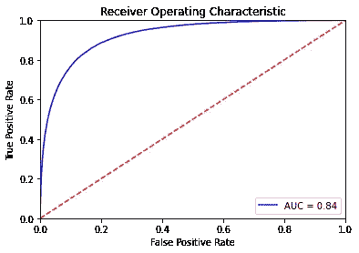
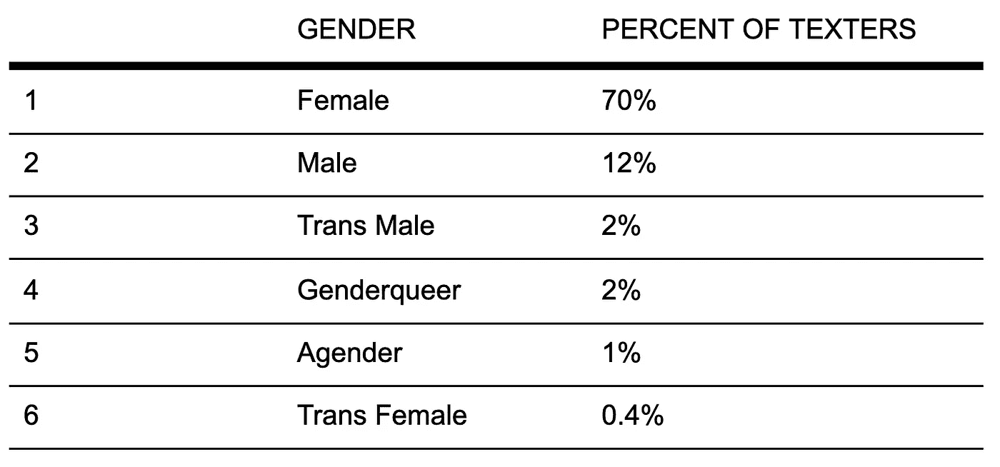
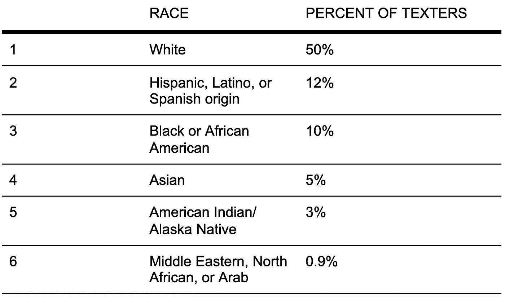

# 我们使用机器学习来研究青少年心理健康的语言

> 原文：<https://towardsdatascience.com/we-used-machine-learning-to-study-the-language-of-teen-mental-health-862993945835?source=collection_archive---------20----------------------->

## [变更数据](https://towardsdatascience.com/tagged/data-for-change)

## 危机短信线路数据科学家使用机器学习模型，根据青少年短信用户使用的独特词汇来预测短信用户的年龄。了解我们如何在 1.18 亿条短信的数据集上使用 NLP 进行数据扩充。

*内容警告//此帖子可能包含令人不安或引发精神健康问题的内容，包括焦虑和压力。*

照片由[普里西拉·杜·普里兹](https://unsplash.com/@priscilladupreez?utm_source=unsplash&utm_medium=referral&utm_content=creditCopyText)在 [Unsplash](https://unsplash.com/?utm_source=unsplash&utm_medium=referral&utm_content=creditCopyText) 拍摄

*本文作者为* [*蒂芙尼·梅什卡特*](https://medium.com/u/50feddc1581b?source=post_page-----862993945835--------------------------------) *，编辑为* [*莉莉·托罗克*](https://medium.com/u/786fbe05cd8e?source=post_page-----862993945835--------------------------------) *，合著者为* [*齐藤圭*](https://medium.com/u/3f51b946338a?source=post_page-----862993945835--------------------------------) *。供稿来自* [*杜瓦·沙姆西*](https://medium.com/u/e4a702ad0c07?source=post_page-----862993945835--------------------------------)*[*香绿*](https://medium.com/u/667a1e73fba0?source=post_page-----862993945835--------------------------------)*[*朱慧珊*](https://medium.com/u/58504c4fd938?source=post_page-----862993945835--------------------------------) *。本研究在* [*危机文本行*](http://crisistextline.org) *与*[*Hopelab*](https://hopelab.org/)*和*[*Well Being Trust*](https://wellbeingtrust.org/)*合作进行。***

# **一眼**

*   **在着手了解新冠肺炎时期青少年面临的独特心理健康挑战时，[危机短信热线](http://crisistextline.org)遇到了一个障碍:在一项谈话后调查中，只有 21%的发短信者直接透露了他们的年龄。为了绕过这个障碍，我们应用机器学习来尝试准确区分青少年短信者和成人短信者，以增加我们可以分析的青少年对话的范围。**
*   **我们使用自然语言处理来预测发短信者的年龄，以便了解我们的年轻短信者在新冠肺炎期间面临的心理健康挑战。**
*   **青少年发短信的声音是独特的，与成年人明显不同。我们的机器学习模型可以根据他们在与我们交谈时使用的词汇识别出他们更年轻，准确率为 85%。**
*   **虽然我们的大多数青少年发短信者是白人和女性(根据调查)，但该模型在非白人、非女性发短信者中表现类似，准确率为 83%**
*   **青少年发短信更有可能使用缩写、表示同意的词语，他们也更有可能提及自己的年龄。**
*   **成年人发短信更有可能讨论经济困难、酗酒、无家可归和精神健康诊断。**

**由于新冠肺炎疫情，2020 年对世界各地的人们来说是极具挑战性的一年。因为填写我们对话后调查的[危机短信热线](http://crisistextline.org)短信人中有 50%是 17 岁或更小的，我们处于一个独特的位置来讨论这个时间对于年轻人的心理健康意味着什么，所以我们在 2020 年启动了一系列关于青少年绝望和韧性的研究。在我们的[第一篇帖子](https://research.crisistextline.org/pandemic-teen-trends-c5198186b453)中，我们发现 2020 年发危机短信的青少年比 2019 年处理了更多的悲伤、饮食失调、焦虑和压力。2020 年，青少年在深夜联系我们的可能性也比以前增加了 45%。(在整篇文章中，我们交替使用年轻人和青少年这两个术语来描述 17 岁或更小的短信者。)**

**到目前为止，我们的分析受到了限制，因为我们不得不依赖于一部分对话，在这些对话中，我们的短信发送者在可选的对话后调查中与我们分享了他们的年龄。**

**然而，我们的危机辅导员向我们解释说，他们通常可以分辨出他们在和青少年发短信，因为青少年发短信的方式和他们使用的语言与年长的短信者不同。**

****例如，下面的消息表明一个年轻人正在发短信:****

**“我真的很紧张，因为我不了解远程学校里发生的任何事情。我不能完成分配给我的所有工作，我的成绩在下降。无处可去，起床穿衣真的很难。我妈妈试图让我起床，但我就是不想。我等不及新冠肺炎的事情结束了”。** 为了保护发件人的身份，我们转述了这句话****

**危机顾问可以立刻分辨出这是一个年轻的短信者——电脑也可以，如果不那么精确的话。这提供了一个使用机器学习和数据增强来估计我们短信者年龄的绝佳机会，以便从更大的数据集——危机短信平台上的几乎所有对话，而不是其中的 21%——中了解青少年心理健康。我们认为这是我们的数据科学家面临的令人兴奋的挑战，也是了解 2020 年年轻人独特的心理健康挑战的机会。**

# **构建模型**

****第一步:**我们从清理和争论我们的数据开始。**

**我们访问了 2018 年至 2020 年危机中发短信者的匿名化和擦洗的短信数据。我们使用[术语频率-逆文档频率](/how-tf-idf-works-3dbf35e568f0) (TF-IDF)将文本消息的内容转换为我们的模型可以处理的数字。我们删除了双倍空格；我们还将数字替换为单词“numeric_value ”,以搜索数字使用的大规模趋势，而不是单个数字。我们选择不删除停用词(几乎没有可解释内容的词，如“the”)，因为删除它们会降低我们模型的预测能力(有关此选择的更多详细信息，请参见最后的方法部分)。然而，我们确实选择包括标点符号，以包括青少年和成人标点符号之间的任何差异。我们预测年轻人会以不同的方式使用标点符号，我们相信这可能是青少年的一个额外的独特标识。**

****第二步:**我们对 2018 年和 2019 年的对话数据进行了训练，然后对 2020 年的对话进行了测试。**

**在 2018 年至 2020 年期间，我们的危机辅导员与 380 万处于危机中的人发短信，但大多数短信者不会分享他们的年龄和其他人口统计信息。为了训练这个模型，我们必须将我们的样本限制在通过我们的自愿谈话后调查确实有年龄可用的谈话中，前面提到的 21%的发短信者在与我们交谈后填写了该调查。这意味着我们的训练和测试数据仅限于这 21%的数据。所以，我们的样本大小看起来像这样:**

*   **训练集样本量:2018 年和 2019 年的 45 万次危机对话，**
*   **测试集样本量:2020 年的 24 万次危机对话。**

**拆分:从 2018 年至 2020 年的数据来看，45%的标记对话是青少年，55%是成年人。这两个阶级几乎是平衡的；有相似数量的年轻人和成年人输入到我们的模型中。**

****步骤 3:** 我们使用了逻辑回归，因为它在具有大量特征集的文本数据上表现良好，并且易于解释。**

**我们使用逻辑回归模型创建了一个二元分类器，根据我们通过人口统计调查分配的标签，识别短信发送者是青少年还是成年人。我们首先用短信作为输入来测试这个模型。**

**然后，我们测试添加了一些其他数据输入，包括主动救援号码(呼叫紧急服务以支持短信发送者的次数)、对话次数(个人联系我们的总次数)、对话开始时间以及与青少年更相关的某些问题标签。最后，使用对话数量和主动救援数量，该模型最具预测性。**

****第四步:**我们评估了几个人口统计数据的表现。**

****我们的模型准确率为 85%，曲线下面积(AUC)为 84%。**AUC 分数是蓝色受试者操作特征(ROC)曲线下的面积，其绘制了真阳性率对假阳性率。简而言之，AUC 分数是一个很好的指标，它可以很好地预测发短信的人是青少年还是成年人。**

****

*****图 1:*** *显示真阳性率对假阳性率的 AUC 曲线。84%的 AUC 分数表明，该模型非常善于预测发短信者是青少年还是成年人。***

**大多数填写了谈话后调查并列出性别的危机短信发送者是女性(约 70%)。列出比赛的短信中有 50%是白人。考虑到这一多数群体，我们还在自我认定的非女性、非白人短信发送者群体上测试了我们的模型。我们在文章底部提供了两张表格，分别列出了发短信者的性别和种族。发短信的人也可以选择写性别回复，也可以选择“不回答”。**

**该模型在非女性、非白人 texter 群体中表现非常好，准确率为 83%，AUC 得分为 83%。该测试表明，我们的模型对这一人群表现相当好，即使他们是我们短信的少数。在学术研究中并不总是这样，你可以在加州大学伯克利分校、T2 大学弗吉尼亚大学和 T4 乔治梅森大学的文章中读到更多关于这个问题的内容。2020 年，非女性、非白人的短信用户数量约为 19，000 人，相比之下，我们 2020 年的完整模型中的短信用户数量约为 237，000 人(包括那些认为自己是女性和白人的短信用户)。**

**我们还测试了我们的模型对青少年对话的预测能力，特别是那些识别为“西班牙裔、拉美裔或西班牙裔”或“黑人或非裔美国人”的短信。我们的模型对西班牙裔短信者的准确率为 84%，AUC 得分为 83%。它在黑人和非洲裔美国人短信人群中的表现也很好，准确率为 83%，AUC 得分为 83%。**

# **根据我们的模型，青少年如何发不同的短信**

**我们的逻辑回归模型通过识别青少年或成人短信者的最强指标来工作。我们可以访问这些属性来深入了解这些群体之间的语言差异。下图列出了青少年和成人之间最明显的特征(1 到 3 个单词)。**

****青少年短信的 50 大特征****

****

*****图 2*** *:逻辑回归模型用来在训练数据中识别青少年发短信者的主要特征。***

****成人短信的 50 大属性****

****

*****图 3*** *:逻辑回归模型用来识别训练数据中的成人短信者的顶级特征。***

**用来确定发短信者是否是青少年的最有区别的词语包括描述与学校相关的话题、他们的年龄或他们的父母。对于成年人来说，这些词主要包括与他们的伴侣和孩子以及工作和大学有关的词。关于青少年和成年人使用的独特语言，有几件事引起了我们的注意。**

**青少年:**

1.  **令人惊讶的是，青少年的一些主要特征包括表示同意的表情，如“你也是”、“好吧”和“mhm”。根据我们的临床团队，青少年比成年人更频繁地向危机辅导员求助，似乎觉得更有义务做出回应。这经常导致给危机顾问的确认信息比成人多，比如“好的”、“mhm”、“哦”等。**
2.  ****青少年最大的特点之一就是“我只有[数值]”。**这包括我们用来替换所有数字的术语“数值”。我们的临床团队把这解释为一个青少年发短信谈论他们的年龄，提到一些困难的事情。这是他们理解自己处境的一种常见方式，他们认为自己的生活不应该如此艰难，因为他们只是一个孩子。**
3.  ****青少年比成年人使用更多的缩写、首字母和缩写词。**图 4 列出了青少年最常用的缩写。**

**成人:**

1.  **在与成年人相关的前 150 个特征中，我们发现与金钱相关的担忧比在青少年对话中更为突出。与金钱相关的主要特征包括“工作”、“保险”、“工作”、“负担得起”、“账单”、“财务”、“金钱”和“事业”。**
2.  **与成年人相关的其他主要特征包括酗酒和无家可归。与酒精相关的单词没有出现在青少年的前 150 个特征中，这很有趣，因为人口水平调查表明，一些青少年确实饮酒，而且当他们饮酒时，往往会酗酒。这一发现可能表明成年人对酒精有更多的挣扎，或者将其视为一种应对机制。**
3.  ****成年人使用较多的心理健康诊断相关词汇，如“残疾”、“疾病”、“抑郁”、“双相”**。此外，成人对话使用更多的专业服务词汇，如“咨询”、“药物”、“医疗”和“心理医生”。**
4.  ****与汽车相关的词语只出现在成人的前 150 个特征中，不在青少年列表中**(即“我的车”、“汽车”、“驾驶”、“驾驶”)。**

**在这前 150 个特征中，我们看到青少年使用了许多成年人通常不使用的首字母缩写词、首字母缩写词和缩写词。我们注意到，使用缩写并没有贬低对话的严肃性，只是表明了青少年在发短信时选择的语言差异。这些包括在下图中:**

****十大** **表示青少年短信的缩写****

****

*****图 4:*** *这是一个年轻人使用的顶级缩写、首字母缩略词或首字母缩写的列表，模型将其用作区分青少年和成年人的特征。***

**表 4 中列出的大多数单词都是常见单词的缩写，如“Instagram”或“really”，但 CPS 是一个明显的例外，它代表儿童保护服务，是青少年短信生活中的一个潜在压力源。我们对这些信息进行了定性分析，发现关于 CPS 的对话从青少年谈论他们的父母，到青少年父母关心他们的孩子。**

# **我们将使用这个扩大的数据集来研究 2020 年年轻短信用户的绝望和恢复能力。**

**这是分析 2020 年青少年心理健康系列的第二篇文章。我们的第三篇也是最后一篇文章将分析是什么让青少年发短信感觉更好。我们将使用本文中描述的机器学习模型来扩大我们可以分析的青少年对话的范围。我们将在这个大型数据集中寻找趋势，以发现青少年使用了哪些应对策略来帮助他们摆脱困境。在接下来的几周里，我们将继续在这个博客上分享我们所学到的东西。**

**关于数据限制的一个注记**

**数据从来都不是完美的；它提供了一个基于不完整信息的故事。危机文本行的数据也不例外。我们认为[危机文本行](http://crisistextline.org)为全国对话增添了一个重要的视角，但重要的是要注意，我们的数据并不代表所有美国人，也不代表所有处于危机中的人正在经历的事情。大约 95%的对话都是由志愿危机顾问根据他们对对话问题的解释来报告问题数据的。在一项网络调查中，人口统计数据是由发短信者在交谈后自我报告的。我们一直使用数据来帮助我们改善对危机中的短信发送者的服务，并定期让第三方建议和验证我们的流程是否参考了最佳实践。我们正在聘请更多的第三方来进一步审查我们的数据做法，以确保它们是适当的、隐私的、安全的和尽可能严格的。**

****危机短信对话中的人口统计分析:****

****发短信者自报性别人口****

****

****表 1:** *在关于性别的谈话后调查中，发短信者最常见的回答。报告的性别比我们在这个表中列出的要多，但是我们已经剔除了至少有 0.4%的人发短信的性别。***

**下表列出了最常见的短信回复。和上表一样，我们只列出了最常见的比赛，其中有超过 0.4%的人发短信。**

****发短信者自报种族人口****

****

****表 2:** *在关于种族的谈话后调查中，发短信者最常见的回答。报道的种族比我们在这个表中列出的要多，但是我们已经在至少有 0.4%的人发短信的种族群体中删除了这个表。***

****这些是我们在模型中使用的参数:****

*   **我们允许模型一次根据 1、2 或 3 个词(1-3 个词)进行分类。**
*   **我们将最大文档频率设置为 0.7，以便忽略出现在 70%以上文本中的单词。我们将这个参数从 0.5 增加到 0.7，因为与青少年的对话占了我们数据的近一半；在大约 50%的对话中出现的一个词，从技术上来说，可能是一个帮助识别青少年声音的词。**
*   **我们将最小文档频率设置为 50，忽略在少于 50 个对话中出现的单词，以便丢弃非常常见或不常见的单词。**
*   **我们将最大迭代次数增加到 2000 次，以便让解算器有更多的时间收敛。**

****为什么我们没有删除停用词:**我们选择在将消息输入模型之前不删除停用词。相反，我们为 min_df(最小文档频率)和 max_df(最大文档频率)选择特定的值，以缩减单词集并删除罕见的单词。这是继开放大学的一项研究[的结果之后，该研究发现，删除预先编译的停用词表会对他们的情感分析分类器在样本 Twitter 数据上的性能产生负面影响。他们发现最好的方法是一种动态的方法来删除语料库中最不常出现的单词。](https://aclanthology.org/L14-1265/)**