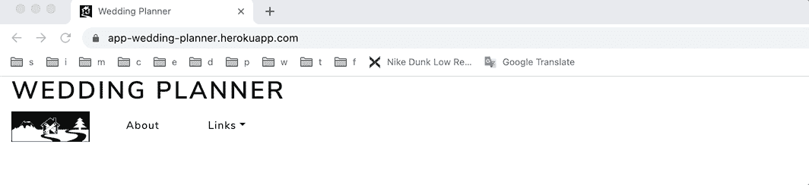

# 用 Python 进行 Web 开发:Dash(完整教程)

> 原文：<https://towardsdatascience.com/web-development-with-python-dash-complete-tutorial-6716186e09b3?source=collection_archive---------3----------------------->


## 用 Plotly 绘图，嵌入引导 CSS，上传和下载文件，选择后改变输入，导航条，微调器，等等…

## 摘要

欢迎来到这个硬核 Dash 教程，通过这篇文章，你将能够为任何类型的 web 应用程序制作和部署一个基本原型(最小可行产品)。


作者图片

在我最好的朋友的婚礼上，我试图用一个仪表板来安排座位，让他的生活更轻松。在编写代码时，我意识到这个简单的项目包含了开发一个基本但良好的原型所需的所有关键特性。所以我觉得值得分享一下。

通过本教程，我将以我的婚礼策划师应用为例(下面的链接)，来解释如何构建一个完整的 Dash web 应用，。

  

我将展示一些有用的 Python 代码，这些代码可以很容易地应用于其他类似的情况(只需复制、粘贴、运行)，并通过注释遍历每一行代码，以便您可以复制这个示例(下面是完整代码的链接)。

<https://github.com/mdipietro09/App_Wedding>  

特别是，我将经历:

*   环境的设置
*   数据和模型
*   准备 [*dash*](https://plotly.com/dash/) 应用程序的基本结构(导航条、正文、布局)
*   输入(表单、滑块、手动、文件上传、事件后更改输入)
*   输出( [*Plotly*](https://plotly.com/python/plotly-fundamentals/) ，文件下载，载入时微调)
*   在 [*Heroku*](https://www.heroku.com/) 部署 app

## 设置

首先，我将通过终端安装以下库:

```
## for application
**dash**==1.20.0 **dash-bootstrap-components**==0.12.2## to produce random data
**names**==0.3.0## for data processing
**numpy**==1.19.5
**pandas**==1.1.5## for plotting
**plotly**==4.14.3## for read and write excel files
**openpyxl**==3.0.7
**xlrd**==1.2.0
```

为了让仪表板看起来漂亮，我们将使用 [*Bootstrap*](https://getbootstrap.com/) ，这是一个 CSS/JS 框架，包含表单、按钮、导航和其他界面组件的设计模板*。*软件包*D*[*ash-Bootstrap-Components*](https://dash-bootstrap-components.opensource.faculty.ai/)可以轻松将 Bootstrap 集成到我们的 dash 应用程序中。

[*names*](https://pypi.org/project/names/)*包生成随机名称，我将使用它来创建随机来宾的数据集。*

*请注意，最新版本的[*xlrd*](https://pypi.org/project/xlrd/)(*2 . 0 . 0*)不接受。xlsx 文件，因此如果您想上传 Excel 文件，请使用 *1.2.0* 。*

## *数据和模型*

*简而言之，这个想法是创建一个随机的客人名单，并运行一个优化算法来安排座位。或者，我们会给用户上传他们的 Excel 文件的可能性，算法将使用该文件而不是随机数据集。*

```
*import **names**
import **pandas** as pd
import **numpy** as np **'''
Generate random guests list
:parameter
    :param n: num - number of guests and length of dtf
    :param lst_categories: list - ["family", "friends", ...]
    :param n_rules: num - number of restrictions to apply (ex. if 1 
                    then 2 guests can't be sit together)
:return
    dtf with guests
'''**
def **random_data**(n=100, lst_categories=["family","friends",
                "work","university","tennis"], n_rules=0):
    **## basic list**
    lst_dics = []
    for i in range(n):
        name = names.get_full_name()
        category = np.random.choice(lst_categories) if 
                   len(lst_categories) > 0 else np.nan
        lst_dics.append({"id":i, "name":name, "category":category, 
                         "avoid":np.nan})
    dtf = pd.DataFrame(lst_dics) **## add rules**
    if n_rules > 0:
        for i in range(n_rules):
            choices = dtf[dtf["avoid"].isna()]["id"]
            ids = np.random.choice(choices, size=2)
            dtf["avoid"].iloc[ids[0]] = int(ids[1]) if 
              int(ids[1]) != ids[0] else int(ids[1])+1 return dtf*
```

*这个函数创建一个包含客人信息的表。*

**

*作者图片*

*我将使用“类别”列用不同的颜色显示客人:*

**

*作者图片*

*“避免”栏将用于确保两个互相讨厌的客人不会被安排在同一张桌子上。*

**

*作者图片*

*该应用程序将根据以下内容安排座位:*

*   *当两个属于同一类别的人坐在一起时，奖励+1*
*   *当两个想避开对方的人被安排在同一张桌子上时，罚分为-1。*

*此函数返回相同的数据帧，并为表分配一个新列:*

**

*作者图片*

## *应用程序结构*

*现在我们可以从最酷的部分开始:构建应用程序。我要把它分成三个部分:导航条，正文，布局。此外，每个部分将包含 3 个部分:*

*   *Input —应用程序的一部分，用户可以在其中插入和选择参数和数据，后端将使用这些参数和数据来返回所需的输出(Navbar 不需要输入)。*
*   *输出-应用程序的一部分，用户可以在其中查看结果。*
*   *[回调](https://dash.plotly.com/basic-callbacks) —包装一个函数的装饰器，其中需要指定输出、输入和状态；后者允许你传递额外的值而不触发回调(回调可能看起来可怕，但实际上它们是你最好的朋友)。*

```
***# setup**
import **dash**
from dash.dependencies import Input, Output, State
import **dash_core_components** as dcc
import **dash_html_components** as html
import **dash_bootstrap_components** as dbc**# App Instance**
app = dash.Dash(name="name")
app.title = "name"**########################## Navbar ##########################**
**# Input****# Output**
navbar = dbc.Nav()**# Callbacks**
**@app.callback()**
def function():
    return 0**########################## Body ##########################
# Input**
inputs = dbc.FormGroup()**# Output** body = dbc.Row([
        **## input**
        dbc.Col(md=3),
        **## output**
        dbc.Col(md=9)
])**# Callbacks**
**@app.callback**()
def function():
    return 0**########################## App Layout ##########################** app.layout = dbc.Container(fluid=True, children=[
    html.H1("name", id="nav-pills"),
    navbar,
    html.Br(),html.Br(),html.Br(),
    body
])**########################## Run ##########################**
if __name__ == "__main__":
    app.run_server(debug=True)*
```

*先说**风格。**奇妙的*Dash-Bootstrap-Components*提供了大量不同的预定义样式。你可以在这里查看它们。一旦选择了一个样式表，就可以将其作为外部样式表插入到应用程序实例中。您甚至可以使用多个:*

```
*theme = dbc.themes.LUXcss = 'https://cdnjs.cloudflare.com/ajax/libs/font-awesome/4.7.0/css/font-awesome.min.css'**# App Instance**
app = dash.Dash(name="name",
                external_stylesheets=[theme, css])*
```

*让我们继续到顶部的 [**导航栏**](https://dash-bootstrap-components.opensource.faculty.ai/docs/components/nav/) **，**我将包括一个链接、一个弹出窗口和一个下拉菜单。*

**

*作者图片*

*正如你所看到的，导航条很酷，点击后会有弹出菜单和下拉菜单。“链接”下拉菜单很简单，因为你不需要回调来使它工作，而“关于”弹出菜单有点棘手。*

**

*导航栏包含 3 个导航项目:徽标,“关于”按钮，下拉菜单。“About”按钮包含两个元素:一个导航链接(通常用于导航一个多页应用程序，但在这里是 *href="/"* )和一个弹出窗口(绿色和红色标记)。这两个元素在回调中作为输出、输入和状态被调用，就像这样，如果“About”导航链接被单击，那么 popover 就变成活动的并显示出来。python 函数 *about_popover()* 期望 3 个参数，因为回调有一个输入和两个状态，返回 2 个变量，因为回调有两个输出。当应用程序启动，按钮没有被点击 *n=0。**

*请注意，下拉菜单(蓝色部分)包括使用外部样式表导入的字体(即*class name = " fa fa-LinkedIn "*)。*

*我们刚刚看到的导航栏是最终**布局的元素之一，**连同标题和主体:*

****

*作者图片*

*现在，我们来谈谈房间里的大象…主体**。它由输入(左侧)和输出(右侧)组成，它们通过回调相互作用。***

**

*作者图片*

## *输入*

*正常情况下，输入被包装在一个[表单组](https://dash-bootstrap-components.opensource.faculty.ai/docs/components/form/)中，并在点击表单按钮时发送。**滑块和手动输入**是最常见的表单元素。*

**

*作者图片*

*这是创建普通滑块的方法:*

```
*dcc.Slider(id="n-guests", min=10, max=100, step=1, value=50, 
           tooltip={'always_visible':False})*
```

*下面是如何在滑块中只强制特定的值:*

```
*dcc.Slider(id="n-iter", min=10, max=1000, step=None, 
           marks={10:"10", 100:"100", 500:"500", 1000:"1000"}, 
           value=0),*
```

*这是一个简单的手动输入:*

```
*dbc.Input(id="max-capacity", placeholder="table capacity", 
          type="number", value="10"),*
```

*让我们增加难度，解决“**文件上传**的情况。我将为用户提供上传 Excel 文件的可能性，该文件包含我们随机生成的类似数据集:*

**

*作者图片*

*上传文件时，我希望发生两件事:*

*   *显示文件名只是为了确保选择了正确的文件名并正确加载*
*   *隐藏前两个滑块，因为它们是用于随机模拟的，并且在上传自定义文件时变得无用*

**

*作者图片*

*我们如何实现这一目标？简单，用一个神奇的回调函数改变 HTML 组件的 CSS 样式:*

**

*为了使用上传的文件，我们需要解析它并将其转换为 pandas 数据帧，我们将使用以下函数:*

```
*import pandas as pd
import base64
import io**'''
When a file is uploaded it contains "contents", "filename", "date"
:parameter
    :param contents: file
    :param filename: str
:return
    pandas table
'''**
def **upload_file**(contents, filename):
    content_type, content_string = contents.split(',')
    decoded = base64.b64decode(content_string)
    try:
        if 'csv' in filename:
            return pd.read_csv(io.StringIO(decoded.decode('utf-8')))
        elif 'xls' in filename:
            return pd.read_excel(io.BytesIO(decoded))
    except Exception as e:
        print("ERROR:", e)
        return 'There was an error processing this file.'*
```

*在继续讨论输出之前，让我们回顾一下到目前为止我们所看到的内容。下面是主体中输入的完整代码:*

```
***########################## Body ##########################
# Input**
inputs = dbc.FormGroup([
    **## hide these 2 inputs if file is uploaded**
    html.Div(id='hide-seek', children=[ dbc.Label("Number of Guests", html_for="n-guests"), 
        dcc.Slider(id="n-guests", min=10, max=100, step=1, value=50, 
                   tooltip={'always_visible':False}), dbc.Label("Number of Rules", html_for="n-rules"), 
        dcc.Slider(id="n-rules", min=0, max=10, step=1, value=3, 
                   tooltip={'always_visible':False}) ], style={'display':'block'}), **## always visible**
    dbc.Label("Number of Trials", html_for="n-iter"), 
    dcc.Slider(id="n-iter", min=10, max=1000, step=None, 
               marks={10:"10", 100:"100", 500:"500", 1000:"1000"}, 
               value=0), html.Br(),
    dbc.Label("Max Guests per Table", html_for="max-capacity"), 
    dbc.Input(id="max-capacity", placeholder="table capacity", 
              type="number", value="10"), **## upload a file**
    html.Br(),
    dbc.Label("Or Upload your Excel", html_for="upload-excel"), 
    dcc.Upload(id='upload-excel', children=html.Div([
               'Drag and Drop or ', html.A('Select Files')]),
               style={'width':'100%', 'height':'60px', 
                      'lineHeight':'60px', 'borderWidth':'1px',  
                      'borderStyle':'dashed',
                      'borderRadius':'5px', 'textAlign':'center', 
                      'margin':'10px'} ),
    html.Div(id='excel-name', style={"marginLeft":"20px"}), **## run button**
    html.Br(),html.Br(),
    dbc.Col(dbc.Button("run", id="run", color="primary"))
]) **# Callbacks**
**@app.callback(**
 output=[
  Output(component_id="hide-seek", component_property="style"),
  Output(component_id="excel-name", component_property="children")], 
 inputs=[
  Input(component_id="upload-excel",component_property="filename")])
def **upload_event**(filename):
    div = "" if filename is None else "Use file "+filename
    return {'display':'block'} if filename is None else 
           {'display':'none'}, div*
```

## *输出*

*后端将产生 3 个输出:标题，一个链接，以下载 Excel 文件的结果，显然是情节。*

**

*作者图片*

*先从 [**Plotly**](https://plotly.com/python/plotly-fundamentals/) **制作的剧情开始吧。**本质上，这个令人惊叹的图形库有两大模块: [*plotly express*](https://plotly.com/python/plotly-express/) 和[*graph _ objects*](https://plotly.com/python/graph-objects/)*。*前者是一个高级图形工具，包含可以一次创建整个图形的功能(我发现它类似于 [*seaborn*](https://seaborn.pydata.org/) )，而后者允许你一砖一瓦地构建一个图形(这实际上是 *plotly express* 在引擎盖下运行的)。*

**Plotly express* 在您想要根据特定列的值来设计数据样式时是完美的，所以在这里我将使用它，但是如果您想要查看用 graph_objects 制作的绘图示例，请查看[这篇文章](/how-to-embed-bootstrap-css-js-in-your-python-dash-app-8d95fc9e599e)。*

*那么…这是什么？*

**

*作者图片*

*它可能看起来像一幅画，但它是一个恰当的几何图形:这是一个散点图，其中的颜色基于客人所属的类别(家人、朋友……)，大小取决于客人是否想避开某人(基本上我会突出显示有问题的人)，而面组件与分配给每个客人的桌子相关联。分面图是由多个具有相同坐标轴组的子图组成的图形，其中每个子图显示数据的一个子集。*

*首先，我需要使用圆方程为地块添加 x 和 y 坐标: *(x，y) = (r*cosθ，r*sinθ)* 。然后，我在“避免”列的基础上添加了“大小”列:*

```
*def **prepare_data**(dtf):
    **## mark the rules**
    dtf["avoid"] = dtf["avoid"].apply(lambda x: 
                     dtf[dtf["id"]==x]["name"].iloc[0] if 
                     pd.notnull(x) else "none")
    dtf["size"] = dtf["avoid"].apply(lambda x: 1 if x == "none" 
                     else 3) **## create axis**
    dtf_out = pd.DataFrame()
    lst_tables = []
    for t in dtf["table"].unique():
        dtf_t = dtf[dtf["table"]==t]
        n = len(dtf_t)
        theta = np.linspace(0, 2*np.pi, n)
        dtf_t["x"] = 1*np.cos(theta)
        dtf_t["y"] = 1*np.sin(theta)
        dtf_out = dtf_out.append(dtf_t) return dtf_out.reset_index(drop=True).sort_values("table")*
```

**

*作者图片*

*然后，我可以简单地使用 plotly 命令来生成图形，并指定当鼠标悬停在这些点上时会显示哪些信息:*

```
*import plotly.express as pxfig = px.scatter(dtf, x=**"x"**, y=**"y"**, color=**"category"**, 
                 hover_name=**"name"**, facet_col=**"table"**, 
                 facet_col_wrap=3, size=**"size"**,                         
                 hover_data={"x":False, "y":False, "category":True, 
                             "avoid":True, "size":False,  
                             "table":False}
              ) fig.add_shape(type="circle", opacity=0.1, fillcolor="black", 
              col="all", row="all", exclude_empty_subplots=True,                       
              x0=dtf["x"].min(), y0=dtf["y"].min(), 
              x1=dtf["x"].max(), y1=dtf["y"].max()
              ) fig.update_layout(plot_bgcolor='white', 
                  legend={"bordercolor":"black", 
                          "borderwidth":1, 
                          "orientation":"h"}
              )*
```

**

*作者图片*

*plotly 的完整代码(以及标题):*

*现在出图了，如何**把结果下载成 Excel 文件**？我们只需要一个函数，将熊猫数据帧转换成一个文件，并通过链接将其下载到用户界面:*

```
*import pandas as pd
import io
import base64**'''
Write excel
:parameter
    :param dtf: pandas table
:return
    link
'''**
def **download_file**(dtf):
    xlsx_io = io.BytesIO()
    writer = pd.ExcelWriter(xlsx_io)
    dtf.to_excel(writer, index=False)
    writer.save()
    xlsx_io.seek(0)
    media_type = 'application/vnd.openxmlformats-officedocument.spreadsheetml.sheet'
    data = base64.b64encode(xlsx_io.read()).decode("utf-8")
    link = f'data:{media_type};base64,{data}'
    return link*
```

*在前端，我们必须添加用于下载的 HTML 链接，并使用回调来完成通常的操作:*

**

*正如您可能已经注意到的，输出(标题、下载、绘图)被包装在一个 [**微调器**](https://dash-bootstrap-components.opensource.faculty.ai/docs/components/spinner/) 中，它呈现了加载状态的良好效果，同时详细说明了输入:*

**

*作者图片*

## *部署*

*最后，我们准备部署这个应用程序。以下是 dash 应用程序的完整代码(你可以在 [GitHub](https://github.com/mdipietro09/App_Wedding) 上查看其余部分):*

*个人喜欢 [**Heroku**](https://www.heroku.com/) 用于部署原型**。**你需要添加一个 *requirements.txt* 和一个 *Procfile* 。如果你需要帮助，你可以在这里找到详细的教程和[这里](https://pub.towardsai.net/build-deploy-a-python-bot-with-short-term-and-long-term-memory-a3f1cd6254b8)。*

## *结论*

*这篇文章是一个关于如何用 Python Dash 构建一个好的 web 应用程序的(几乎)完整的教程。这个应用非常简单，因为它没有任何数据库和用户登录功能(也许是下一个教程的素材？).在这里，我只是想展示你如何轻松地将你的想法转化为原型向世界展示。现在你知道它是如何工作的，你可以开发你自己的应用程序。*

*我希望你喜欢它！如有问题和反馈，或者只是分享您感兴趣的项目，请随时联系我。*

> *👉[我们来连线](https://linktr.ee/maurodp)👈*

> *本文是用 Python 开发**应用程序系列的一部分，参见:***

*</how-to-embed-bootstrap-css-js-in-your-python-dash-app-8d95fc9e599e>  <https://pub.towardsai.net/build-deploy-a-python-bot-with-short-term-and-long-term-memory-a3f1cd6254b8>  </surpass-excel-vlookup-with-python-and-nlp-ab20d56c4a1a> *