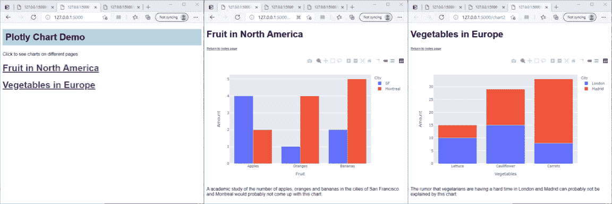
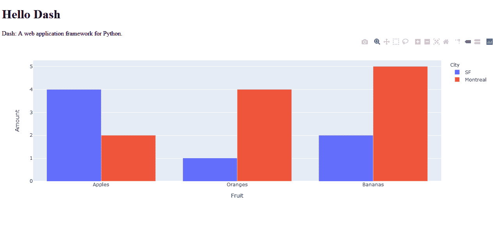
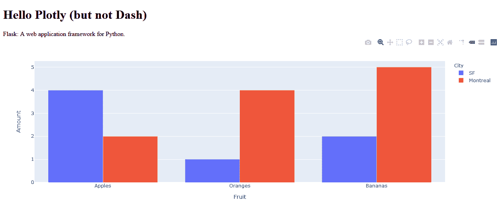

# 用 Plotly 和 Flask 实现 Web 可视化。

> 原文：<https://towardsdatascience.com/web-visualization-with-plotly-and-flask-3660abf9c946?source=collection_archive---------0----------------------->

## 数据可视化

## 当 Plotly plus Flask 更容易和更灵活时，为什么要使用 Dash



使用 Plotly 和 Flask 的多页 web 应用程序—图片由作者提供

你为什么想用 Python 写 HTML？这让我困惑。但如果你想写一个 Dash 应用程序，这就是你需要做的。

虽然我知道将所有代码放在一个文件中有一定的满足感，但在我看来，如果你对 HTML 有足够的了解，可以用另一种语言编写代码，那么你肯定也有足够的知识用 HTML 编写代码！

我很想让 Dash 成为编写 web 可视化应用程序的解决方案，但我不相信。

请考虑以下情况:

1.  Dash 应用程序基本上是一个 Flask 应用程序，它整合了 Plotly。
2.  编写一个使用 Ploty 的实际 Flask 应用程序并不困难。
3.  编写 Flask 应用程序可以让您更好地控制您所编写的内容，并且更加灵活。

因此，虽然我承认 Dash 是一个构造良好、用心良苦的工具，可以用来创建复杂而令人印象深刻的 web 应用程序，但我想提出一个我认为更简单的解决方案——至少对于简单的 web 应用程序来说是这样。

我们将看到使用 Flask 构建包含 Plotly 图表的多页面 web 应用程序是多么简单(对于 Dash 的开源版本来说，这不是一项简单的任务)。

但是首先让我们快速比较一下一个简单的 Dash 应用程序和它的 Flask 等价物。

# 简单的 Dash 应用程序

下面列出了 Dash 教程的一个稍微修改的版本——原来的教程是[这里是](https://dash.plotly.com/layout)，你可以从 [github](https://github.com/plotly/dash-docs/blob/master/dash_docs/chapters/getting_started/examples/getting_started_layout_1.py) 下载源代码。

它有几个部分。首先，我们导入适当的库，然后在下一行，我们启动一个 Dash 应用程序。接下来，我们定义一个熊猫数据帧，然后画一个条形图，把它放入变量*图*。

最后一部分为应用程序创建布局。创建布局基本上就是在 Python 中将网页定义为文档对象模型。定义的页面由一个标题“Hello Dash”和一些文本“Dash:Python 的 web 应用程序框架”组成。最后是图表。

```
import dash
import dash_core_components as dcc
import dash_html_components as html
import plotly.express as px
import pandas as pdapp = dash.Dash(__name__)df = pd.DataFrame({
   'Fruit': ['Apples', 'Oranges', 'Bananas', 'Apples', 'Oranges', 'Bananas'],
   'Amount': [4, 1, 2, 2, 4, 5],
   'City': ['SF', 'SF', 'SF', 'Montreal', 'Montreal', 'Montreal']
})fig = px.bar(df, x='Fruit', y='Amount', color='City',  
   barmode='group')app.layout = html.Div(children=[
   html.H1(children='Hello Dash'),
   html.Div(children='''
   Dash: A web application framework for Python.
   '''),
   dcc.Graph(
      id='example-graph',
      figure=fig
   )
]) if __name__ == '__main__':
   app.run_server(debug=True)
```

*代码转载由 Plotly 提供—版权所有 2019 Plotly，* [*麻省理工学院许可*](https://github.com/plotly/dash-docs/blob/master/LICENSE)

这并不难理解，它会生成一个如下所示的网页:



使用 Dash 的单页 web 应用程序—图片由作者提供

现在让我们看看烧瓶当量。

# 一个简单的烧瓶+ Plotly 应用程序

一个使用 Plotly 的 Flask app 就有点不一样了。首先，有两个部分:Flask 应用程序本身和一个或多个 HTML 模板。Flask 应用程序的工作类似于 Dash 应用程序，但不构建实际的网页。网页是一个 HTML 模板，我们将 Plotly 数据从 Flask 应用程序传递给它，这样它就可以显示图表。

Flask 部分的结构与 Dash 类似:首先是(略有不同的)imports，然后是 Flask app，但现在有所不同。代码的下一部分在一个名为 *notdash()* 的函数定义中，它有一个 *app.route* 装饰器。

```
from flask import Flask, render_template
import pandas as pd
import json
import plotly
import plotly.express as pxapp = Flask(__name__)**@**app.route('/')
def notdash():
   df = pd.DataFrame({
      'Fruit': ['Apples', 'Oranges', 'Bananas', 'Apples', 'Oranges', 
      'Bananas'],
      'Amount': [4, 1, 2, 2, 4, 5],
      'City': ['SF', 'SF', 'SF', 'Montreal', 'Montreal', 'Montreal']
   }) fig = px.bar(df, x='Fruit', y='Amount', color='City', 
      barmode='group') graphJSON = json.dumps(fig, cls=plotly.utils.PlotlyJSONEncoder) return render_template('notdash.html', graphJSON=graphJSON)
```

在 Flask 中，url 被映射到函数上，装饰器告诉我们哪个函数对应于一个特定的 URL，或者路由。在我们的例子中，我们有一个名为 *notdash()* 的函数，这个函数用于 url“/”(即网站的根 URL)。我们很快就会看到，使用 Flask，我们可以用不同的 URL 指定其他页面。

(如果您需要快速建立和运行 Flask 应用程序，请参见[如何创建和运行 Flask 应用程序](https://jones-alan.medium.com/how-to-create-and-run-a-flask-app-533b7b101c86)5 分钟简介)

在 *notdash()* 中，我们创建了 dataframe，并且像在以前的版本中一样，在变量 *fig* 中创建了一个绘图。现在我们稍微改变一下。我们的下一步是使用 *json.dumps()* 和 Plotly 附带的 json 编码器将 plot 转换成 JSON。这样做的原因是，网页将使用 Plotly Javascript 库来呈现绘图，这需要将 Plotly 图表编码为 JSON。

下一行代码告诉 Flask 使用一个名为*notdash.html*的 HTML 模板，并将 JSON 代码传递给它。

模板是将要显示的网页。它相当于 Dash 应用程序的布局，但我们在 HTML 文件中编写实际的 HTML:HTML 的主体包含一个标题(显示一条消息)和一个 *< div >* 元素，该元素将包含 Plotly 图表(为了让 Plotly 工作，我们需要给这个 *< div >* 一个 id，并将其 class 属性设置为 *chart* )。

文件的其余部分是几行 Javascript 样板代码，这些代码在任何 Flask/Plotly 应用程序中都很常见。首先，我们导入 Plotly Javascript 库。然后我们创建自己的脚本，为导入的 JSON 代码设置一个变量，然后从 Plotly 库中调用 *plot* 方法来显示图表。

注意，我们告诉 Python 将 JSON 数据放入 HTML 的方式是使用符号 *{{name}}* ，其中 *name* 是从 Python 传递给模板的参数，花括号表示它是参数的占位符。

```
<!doctype *html*>
<html>
 <body>
  <h1>Hello Plotly (but not Dash)</h1>
  <div *id*='chart' *class*='chart'”></div>
</body><script *src*='https://cdn.plot.ly/plotly-latest.min.js'></script>
<script *type*='text/javascript'>
  var graphs = {{graphJSON | safe}};
  Plotly.plot('chart',graphs,{});
</script></html>
```

它看起来是这样的:



使用 Plotly 和 Flask 的单页 web 应用程序—图片由作者提供

非常类似于 Dash 版本，对吗？。

我不得不承认，我的非破折号版本稍微长一些，但从我的角度来看，将你的网页写成 HTML 文件并用 Python 编写你的 web 应用程序更符合逻辑。

更重要的是，它允许你灵活地编写多页应用程序。

# 多页应用程序

在本节中，我们将制作一个由三个页面组成的应用程序:两个包含不同图表的页面和一个包含其他两个页面链接的索引页面。当您有许多不同的图表或仪表板要包含在一个网站上时，这可能是您经常想要做的事情，但是当使用 Dash 时，这并不简单。

下图显示了该应用程序的三个页面。


使用 Plotly 和 Flask 的多页 web 应用程序—图片由作者提供

它比前一个稍微复杂一些，因为图表页面(*notdash2.html*)现在有三个参数，图表(和以前一样)加上一个标题和一个描述 HTML 代码中的占位符是 *{{graphJSON}}* 、 *{{header}}* 和 *{{description}}。*

Flask 代码现在有三个路径用于三个页面。第一个是 web 应用程序的根，另外两个是两个图表页面。请注意，这些图表具有相同的模板，因为它们使用相同的布局，但是不同的标题、描述和图表被传递给这些模板。

所以我认为，这并不太难，一个多页面的 web 应用程序使用 Plotly 来显示 Flask 应用程序中熊猫数据帧的图表。

## 复试

但是，我听说你死于羊毛短跑爱好者说，什么样的回调？回调是一种破折号机制，它允许网页更新以响应输入的变化。嗯，我们也可以用 HTML 和 Flask 来做。但不是在这里。如果有足够的兴趣，我将在这篇文章之后再写一篇关于这方面的文章。如果你想在这篇文章和其他文章发表时得到通知，请考虑订阅我的免费、不定期的时事通讯。

*更新:后续文章在此:* [*一个带 Plotly 和 Flask 的交互式 Web 仪表盘*](/an-interactive-web-dashboard-with-plotly-and-flask-c365cdec5e3f)

## 密码

如果您从上面的要点中复制代码，不要忘记 HTML 模板需要放在一个文件夹中， *templates，*或者，您可以在我的 Github 存储库中找到所有的源代码— [参见 Github 页面。](https://alanjones2.github.io/Flask-Plotly/)

## 那么，Dash 还是 Flask？

我确信使用 Dash 进行 web 可视化可能有很好的理由，我并不完全反对。我在这里的目的是展示，在我看来，至少对于简单的应用程序来说，有一种替代方案至少和 Dash 一样好。希望一直有用。

一如既往，感谢阅读。如果你想知道我什么时候发表新文章，请考虑注册下面的电子邮件提醒，或者订阅我偶尔发布的简讯 [Technofile](https://technofile.substack.com/) 。

如果你不是一个媒体订阅者，那就注册吧，这样你就可以每月花 5 美元阅读尽可能多的文章。在这里注册，我将赚取一小笔佣金。