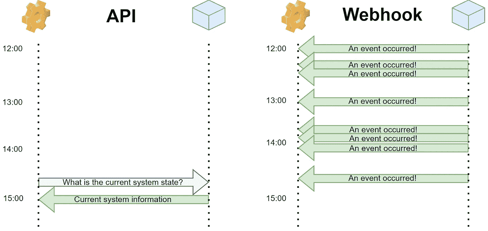
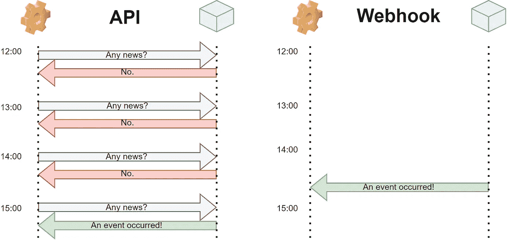

# Webhook 和 API——你需要哪一个？

> 原文：<https://towardsdatascience.com/webhook-vs-api-which-one-do-you-need-8c430f8ea71b?source=collection_archive---------3----------------------->

## 基于事件和基于请求的数据传输的快速非技术性介绍

一个钩子。照片由[格兰特·杜尔](https://unsplash.com/@grant_durr?utm_source=medium&utm_medium=referral)在 [Unsplash](https://unsplash.com?utm_source=medium&utm_medium=referral) 拍摄

即使你对技术完全不熟悉，你也可能每天都在使用 API。无论是从网上商店订购，确定您的火车时刻表，还是查看天气应用程序，我们都会不断地请求信息，这些信息是从我们不一定了解的系统或数据库中检索出来的。我们的信息请求和底层系统之间的层是*应用编程接口*或 **API** 。Webhooks 也许不太为人所知，但却越来越受欢迎。本文将对这两者进行简短的非技术性介绍。

# 什么是 API？

一个 **API** 是一个软件连接其他软件的接口。它以预先指定的格式接收请求，在内部处理它们，并返回所请求的信息(例如，以 JSON 或 XML 格式)。处理步骤可能是简单的数据检索，但也可能涉及更复杂的子程序。API 是**请求驱动的**，当进行调用时被触发。

利用 API 可以隐藏软件的内部机制，只输出相关的结果。此外，它允许不同的应用程序用一种通用语言进行通信。API 通常相当稳定；即使底层系统频繁改变，依赖软件也可能继续使用相同的 API。

最后，API 是双向的。本质上，你必须发送一个请求来接收某样东西。你也可以*给系统添加*一些东西。例如，如果你在社交媒体上发布了一些东西，你的帖子会通过一个 API 被路由到底层数据库。简而言之:API 可以用于发送数据和请求数据。

日常生活中使用的 API 的一些常见示例:

*   **在线支付:**有没有想过如何让 PayPal 的支付近乎即时？零售商的网站连接到 PayPal API。这是一个明显的例子，你不想分享完整的源代码；由于通过 API 进行通信，最终用户只有有限的权限。
*   旅游预订:每当查询*booking.com*或*skyscanner.com*时，这些平台都会向许多酒店和航空公司的 API 提出请求，以便为你找到最优惠的价格。
*   社交媒体登录:许多网站提供通过*、 *LinkedIn* 等的登录，而不是为你访问的每个网站创建唯一的用户账户。它是如何工作的？你猜对了，登录 API。*
*   *天气预报:谷歌天气预报中灰色的雨云和寒冷的气温？它从*weather.com*API 提取数据。*

# *什么是 webhook？*

*与 API 相反，web hook 是**事件驱动的**。每当系统发生变化时，webhook 就会广播新的信息。因此，它也被称为**反向 API** 。另一种看待它的方式是，将 API 视为**拉系统**，将 webhook 视为**推系统**。*

*自然地，你可能会订阅你想要得到通知的特定事件。您不必经常检查数据是否已经更新或事件是否已经发生，而只需在事件发生时得到通知。因此，webhook 比 API 更加轻量级和资源高效。但是它们的设计有点困难，因为它们必须被定制来推动特定的事件。*

*webhooks 的几个例子:*

*   ***交易系统:**这是一个作家都会熟悉的媒介。支付通知是网络陷阱的一个简单例子。*
*   *Twitter 机器人: *Twitter 机器人*通知你，例如，被喜欢的推文或新的关注者。*
*   *电子邮件服务:像 MailChimp 这样的服务提供了许多网页挂钩。例如，当有人订阅你的时事通讯时，一个 webhook 可能会自动转发这个事件来更新你的 CRM 系统。*
*   ***购物平台**:类似 *Shopify* 的平台利用 webhooks，例如，发送订单或通知会计系统收到付款。推送的事件会自动触发动作。*

# *哪个更好？*

*正如你可能猜到的，两者之间没有“更好”的。是使用 webhook 还是 API 确实取决于问题的背景。请考虑以下注意事项:*

## *答:鞋店*

**

*照片由[内森·沃克](https://unsplash.com/@nwphoto?utm_source=medium&utm_medium=referral)在 [Unsplash](https://unsplash.com?utm_source=medium&utm_medium=referral) 上拍摄*

*假设你订购了一双鞋，急切地等待着从商店里拿起它的那一刻。你不耐烦地给商店打电话。销售人员尽职尽责地走进杂志查看——还没有。五分钟后，你再次打电话——还是没有。又过了五分钟——什么也没有。这将是一个非常无效的 API:员工总是忙于处理你烦人的请求，而你实际上只对*事件*感兴趣:你想知道你的鞋子什么时候在那里。在 webhook 实现中，员工只需在鞋子到达时给你打电话。*

*这可能意味着 webhook 比 API 更有效，这也是可能的。然而，现在考虑你每年买两双鞋；您还没有决定选择哪一对，将根据可用的选择来决定。所以，每次鞋店接到新订单或者卖出一双鞋，销售员工都会热情地给你打电话，沟通目前的库存。由于每年只有两个决策时刻，webhook 方法现在提供了过载的数据；API 在这里会更合适。*

## *什么时候用哪个？*

*好吧，也许没有一个天生比另一个更好，但是对于特定的用例来说，它们肯定更好。以下指南可能有用:*

***API***

**想用 API 就用吧……**

*   *…与底层应用程序的双向通信，例如向 API 背后的数据库发送更新。*
*   *…只是为了了解当前或请求时的系统状态，而不是每个中间数据突变。*
*   *…比事件提供的信息更多，无法在自定义 webhook 中捕获所有信息。*

**

*API 和 Webhook 的比较。如果您只需要调用时的系统状态(例如，做决定时)，API 通常更有用。[图片由作者提供]*

***Webhook***

**如果你愿意，可以使用 web hooks……**

*   *…在(特定)事件发生时获得通知。*
*   *…自定义缓存中最新的数据*就绪*。*
*   *…构建自定义内容工作流。*
*   *…与第三方系统同步数据。*

**

*API 和 Webhook 的比较。如果你想在事件发生的那一刻得到通知，Webhook 通常更合适。[图片由作者提供]*

*当然，单个应用程序通常同时支持 webhooks 和 API。如果两者都有有效的用例，就没有理由局限于一个。*

# *最后的话*

*本文关注的是对最终用户来说相当明显的 API 和 webhooks，但这只是冰山一角。还有更多这两种情况的例子，大多数都涉及到表面下的信息交换。提醒他们促进*个软件*之间的联系，而不是*个人*之间的联系；除非你是程序员，否则你可能永远不会直接观察 API 或 webhook。*

*本文的底线是:批判性地评估你的用例是基于请求的还是基于事件的，并基于此使用 API 或 webhook。API 可能更广为人知，但是 webhooks 通常提供了一种轻量级的高效替代方案。*

# *参考*

*<https://agilitycms.com/resources/posts/-api-vs-webhooks-what-s-the-difference>  <https://www.mparticle.com/blog/apis-vs-webhooks>  <https://sendgrid.com/blog/webhook-vs-api-whats-difference/>  <https://nordicapis.com/5-examples-of-apis-we-use-in-our-everyday-lives/>  <https://sendgrid.com/blog/whats-webhook/>   *