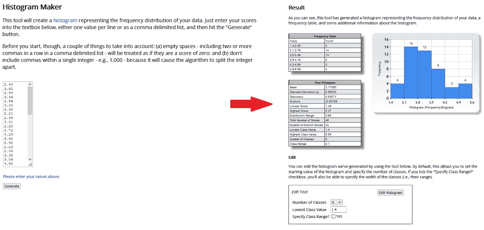

# 在每台设备上进行统计和数据分析的网站

> 原文：<https://towardsdatascience.com/websites-for-statistics-and-data-analysis-on-every-device-ebf92bec3e53?source=collection_archive---------25----------------------->

## 统计、回归、神经网络、PCA、绘图等等

## 我对网络浏览器中数据分析在线工具的选择。

**快速链接:** [**在线统计**](#8417) **|** [**在线回归&拟合**](#037e) **|** [**在线 PCA**](#f4e8)**|**[**在线数学环境**](#0cc3) **|** [**关于客户端 web 编程**](#1efe)

曾经想要做一个快速的统计测试，回归，主成分分析，或者一些简单的描述性统计，但是你手边只有你的智能手机？这里有一些基于网络的工具，可以在任何浏览器上运行这些分析。其中一些工具运行在客户端，这让我有机会关注客户端 web 编程的强大功能。

# 一个伟大的资源，免费的在线统计工具:[SocialScienceStatistics.com](https://www.socscistatistics.com/)

我不得不推荐这个网站，它提供在线工具来计算描述性统计数据，进行假设检验，计算 p 值，甚至绘制一些简单的图，包括直方图:

[**https://www.socscistatistics.com/**](https://www.socscistatistics.com/)

这不是我的，我没有因为推广它而获得任何收益！我只是展示它，因为它超级有用和方便。

虽然该网站宣传自己是为社会科学中从事统计工作的学生和研究人员量身定制的，但这些工具实际上足够广泛，可以应用于处理数据分析的所有学科。我的意思是，该网站没有使用任何专门针对社会科学的行话。

本网站中的所有工具都是按照易用性和清晰表达的原则设计的。在我看来，这一点很好地实现了。当然，你会发现它比任何特别的统计或数学程序更容易使用——当然是以一些限制为代价的。重要的是，本网站中工具的输出已经过审核，其准确性与常规“已建立”程序的输出一致。

## SocialScienceStatistics.com 提供的工具

该网站有三个主要部分:[统计计算器](https://www.socscistatistics.com/tests/)，主要处理[假设检验](https://www.socscistatistics.com/tests/studentttest/default.aspx)； [p 值计算器](https://www.socscistatistics.com/pvalues/)，允许你从 *Z* 、 *t* 、卡方和皮尔逊( *r* )中导出 p 值；以及[描述性统计](https://www.socscistatistics.com/descriptive/) —平均值、方差、[标准差计算器](https://www.socscistatistics.com/descriptive/variance/default.aspx)，以及简易直方图和条形图制作工具。下面让我给你一些细节，并展示一些例子:

[**描述性统计**](https://www.socscistatistics.com/descriptive/) **:** 给定一个输入数据集，该模块中的工具返回简单的平均值、中位数、众数、标准差等。到四分位数范围、偏斜度和峰度计算器，以及一些快速数据绘图仪:一个快速直方图生成器，您只需输入一系列值，然后单击一下就可以获得直方图；一个快速条形图生成器，您可以输入带有相关计数的标签，甚至可以输入应用程序将自动计算频率并显示图表的源数据。

**看这些例子:**

为了说明一个不是简单计算平均值、中位数或众数的例子，许多描述性统计工具中的一个从一系列数字中计算变异系数。列出这个网站中的所有其他工具，你在文本框中输入数据(你可以从任何常规的电子表格程序中复制粘贴)，然后进行一些选择并点击*计算*。


计算动作变异系数的工具。作者 Luciano Abriata 图。

另一个可以在本网站上进行的典型分析示例是计算峰度和偏斜度的简单工具:


根据一组输入数字计算偏度和峰度的工具。作者 Luciano Abriata 图。

如果你更喜欢检查你的数据是如何分布的，最好画一个直方图。网站上的这个伟大的工具使直方图对你来说非常容易；只需输入观察值并点击*生成*。



SocialScienceStatistics.com 的简单直方图生成器。作者 Luciano Abriata 图。

使用另一个工具，您可以轻松制作和比较三组独立数据的直方图:


用于计算和比较最多三个数据集中的分布的工具。作者 Luciano Abriata 图。

这两个直方图工具不仅提供了图，还提供了计算的仓和频率，您可以将其复制到一个单独的程序中，根据您的喜好重新绘制图。此外，web 工具允许您微调 x 轴的范围，向数据添加标签，并在那里重新绘制图表。

[**统计检验**](https://www.socscistatistics.com/tests/) :从两个或两个以上的数据集，使用网站的各种工具，您可以计算独立或重复测量的方差分析，最多 5 个处理；还有 Fisher 检验、Mann-Whitney 检验、Wilcoxon 检验、各种 t 检验和卡方检验；线性回归和 2 输入多元线性回归；相关性检验，包括常规皮尔逊相关性和 Spearman 相关性；p 值和置信区间的计算，以及用于数据转换和变换的各种实用程序。

作为一个例子，我向你展示了一个我经常使用的工具，用来[用 t 检验](https://www.socscistatistics.com/tests/studentttest/default2.aspx)比较观察结果。与网站的所有其他工具一样，您输入数据(这里是两组数字)，进行一些选择(这里是截止 p 值和问题是否暗示单尾或双尾假设)，然后单击*计算*。你会立即得到所有中间计算的结果，以及在所选 p 下你是接受还是拒绝假设的结论。


t 检验计算器。作者 Luciano Abriata 图。

[**帮助您决定给定问题需要哪些统计数据的向导:**](https://www.socscistatistics.com/tests/what_stats_test_wizard.aspx) 该向导指导您逐步完成问题，并根据您的答案推荐最适合您想要解决的问题的统计测试。

事实上，整个网站上的大多数工具都非常关注你输入的数据类型以及你脑子里想的问题。因此，当您正在运行的计算可能不合适时，它会在旅途中向您发出警告。

此外，该网站还包括[**关于统计的教程**](https://www.socscistatistics.com/tutorials/) 关于通过 [SPSS 软件](https://ezspss.com/)进行统计的各种主题，包括如何报告结果。

# 回归和数据拟合

上述网站的不足之处在于回归。然而，有一些其他的在线工具涵盖了这一点。

第一个计算线性回归、15 阶多项式回归，以及指数、对数和幂回归。使用非常简单，它接受从常规电子表格程序复制粘贴的 x，y 表格:

  

第二种方法仅限于多项式回归，但我喜欢它，因为它更具交互性；特别是，您可以上下改变多项式的阶数并实时获得结果(包括图形)，因此进行探索性拟合更有用:

  

为了更普遍地适应，同时保持简单，我知道的最好的在线工具是这样的:

<https://mycurvefit.com/>  

该网站提供了几个内置函数来将(x，y)数据(可以手动输入，也可以按照说明复制粘贴)拟合到常规函数中，包括线性函数、5 阶多项式以及各种 sigmoidal、指数、幂、双曲线和高斯形状。x 和 y 值可以在拟合之前进行变换，这扩展了可用的快速拟合集。但最重要的是，用户可以编辑自己的功能，这在我做的测试中似乎效果不错。此外，这个拟合网站允许根据不同的方案对 x 和 y 值进行加权。

需要 2 分钟来适应 GUI。但是它非常完整，使所有功能都可用，并显示拟合结果的实时更新(回归系数、皮尔逊相关、p 值、误差平方和等)。)以及显示输入数据(红点)和基于拟合的输入域模拟(黑线)的清晰图。例如，请参见我如何将一些(x，y)数据拟合到方程 y = a*cos(b*x-1)+3:


mycurvefit.com 的例子。作者 Luciano Abriata 图。

# 主成分分析

上面的网站没有包括的，我在网上也没找到多少，是轻松探索多维数据的工具。可能经常会发生这样的情况，你手头有多维数据，光看数字很难分组，也很难在网上绘图。

我制作了这个在线工具，用户可以在他们的网络浏览器上运行主成分分析:

<http://lucianoabriata.altervista.org/jsinscience/pca/pca3.html>  

有了它，人们可以轻松地加载一个由多个变量描述的带标签的对象表，然后点击几下就可以获得通过 PC1 和 PC2 上的投影分布对象的图，以及解释观察到的投影的负载图和特征值图。此外，该工具返回由奇异值分解过程产生的矩阵，以便用户可以重新制作他们自己的图。

这是内置的例子，你可以在[http://lucianabriata . alter vista . org/jsin science/PCA/PC a3 . html](http://lucianoabriata.altervista.org/jsinscience/pca/pca3.html)试试


本文作者开发的在线 PCA web 应用程序。作者 Luciano Abriata 图。

# LALOLab，网络浏览器的数学环境

您可能已经注意到，我上面的 PCA web 应用程序使用了一个名为 LALOLib 的库中的奇异值分解。这是 LALOLab 的 JavaScript 库对应物，lalo lab 是一个用于 web 浏览器中数值计算的包。LALOLab 就像一种在线 MatLab(或 Octave，或 Mathcad，或任何你喜欢的数学编程工具)，而 LALOLib 是一个库，你可以插入到你的 web 应用程序中运行复杂的计算。

LALOLab 和 LALOLib 是 MLWeb(【https://mlWeb.loria.fr/lalolab/】)的一部分，ml web 是一系列用于 web 中的数值过程和机器学习的工具，其中也包括 ML.js，这是一个专用于 web 浏览器中的机器学习的库。接下来，我简要概述了 LALOLab maths 接口和 LALOLib + ML.js 库。

## 数学在线界面

LALOLab 感觉完全像一个数字计算和编程环境，非常像 MatLab 和其他软件，不同之处在于它只在你的 web 浏览器中运行，甚至不将数据发送到服务器，因为它完全基于客户端 web 编程。事实上，它使用 LALOLib JavaScript 库进行数值计算——您也可以将它集成到您的 web 应用程序中，见下一节。

LALOLab 包括用于线性代数、统计、编程中的流程控制、基本图、统计、优化的函数，以及用于回归、神经网络等的各种机器学习工具。当然，它不如独立程序强大，但它确实提供了广泛的计算和数字编程环境，您可以在任何地方使用，无需安装任何软件。无论你在哪里有浏览器，无论是你的手机、平板电脑、linux 桌面还是 windows 笔记本电脑，你都会有这个工具(就像这个故事中的所有其他工具一样——网络之美！).

下面是我用 LALOLab 的截图。您可以在左下方逐个输入命令，或者在右下方编写脚本。浅蓝色的大框将处理命令并显示输出。您可以看到语法和格式与 MatLab 非常相似(但不完全相同)。


您可以在此访问 LALOLab:

  

## 在 web 应用程序中运行计算的 JavaScript 库

如果您对客户端 web 编程感兴趣，您可以在 web 应用程序的 JavaScript 代码中使用 LALOLab 的函数。您只需要用 HTML 中的这行代码加载 LALOLib 库:

`<script src="http://mlweb.loria.fr/lalolib.js"></script>`

LALOLib 库提供了与 LALOLab 相同的功能，但是是在 web 页面中常规 JavaScript 的上下文中。它有一个特殊的函数，可以将 JavaScript 数组转换成自己的矩阵表示。用该函数创建的矩阵继承了可以应用于矩阵的所有函数和运算。

例如，从 JavaScript 数组 P 中创建一个 LALOLib 矩阵对象，如下所示:

```
var pMatrix = array2mat(P);
```

然后，您可以对矩阵保持对象进行操作，使用如下所示的函数进行转置:

```
var pMatrixT = transposeMatrix(pMatrix);
```

…或者这个将两个矩阵相乘的例子:

```
var H = mul(pMatrixT, qMatrix);
```

…或者说运行奇异值分解:

```
var svdH = svd(H, “full”);
```

在这种情况下，svdH 包含三个矩阵。v，svdH。s 和 svdH。U

你也可以嵌套操作，比如说得到一个矩阵的乘积的行列式和另一个矩阵的转置:

```
var d = det(mul(pMatrix, transposeMatrix(qMatrix)));
```

…等等。

# 对客户端 web 编程的进一步评论

我不想让这篇文章过多地讨论编程，我将在一篇专门的文章中讨论编程，但是我确实想强调我写的关于客户端编程对科学的力量的两篇同行评议文章:

第一篇文章回顾了浏览器内编程的最佳工具，包括 HTML5 中使用的 JavaScript 以及相关的 web 技术。通过脚本、库、web 应用程序甚至完整 web 应用程序的具体示例，强调了这些技术在执行数值计算、文本处理和挖掘、通过查询在线数据库和 web 服务检索和分析数据、有效的数据可视化(包括 3D 可视化，甚至虚拟和增强现实)方面的潜力；所有这些都在浏览器中以相对较低的编程工作量完成，应用于化学信息学、结构生物学、生物物理学和基因组学以及其他分子科学。

<https://www.mdpi.com/2227-9709/4/3/28>  

这篇文章讨论了客户端 web 编程在科学教育和推广中的应用:

<https://pubmed.ncbi.nlm.nih.gov/29254737/>  

我最后评论一下这些作品的一些副产品。第一个是完全为在网络浏览器中运行而构建的生物信息学工具，很像上面介绍的 LALOLab 环境，但这里致力于探索蛋白质中氨基酸变异背后的物理化学原因:

<https://pubmed.ncbi.nlm.nih.gov/27315797/>  

这另一个副产品是关于使用 web 编程为分子可视化和建模产生增强和虚拟现实体验:

<https://peerj.com/articles/cs-260/>  

这项工作进一步发展成为一个完整的化学教育网站，moleculARweb:

<https://pubs.acs.org/doi/10.1021/acs.jchemed.1c00179>  

在本文中，我将在这个平台上与其他技术一起讨论:

<https://pub.towardsai.net/interactive-augmented-reality-web-apps-to-enable-immersive-experiences-for-science-education-dce51889473f>  

在这份同行评审意见中:

  

我是一个自然、科学、技术、编程和 DIY 爱好者。生物技术专家和化学家，在潮湿的实验室和计算机里。我写我广泛兴趣范围内的一切。查看我的 [*列表*](https://lucianosphere.medium.com/lists) *了解更多故事。* [*成为媒介会员*](https://lucianosphere.medium.com/membership) *访问我和其他作家的所有故事，* [*订阅通过邮件获取我的新故事*](https://lucianosphere.medium.com/subscribe) *(平台原创附属链接)。*