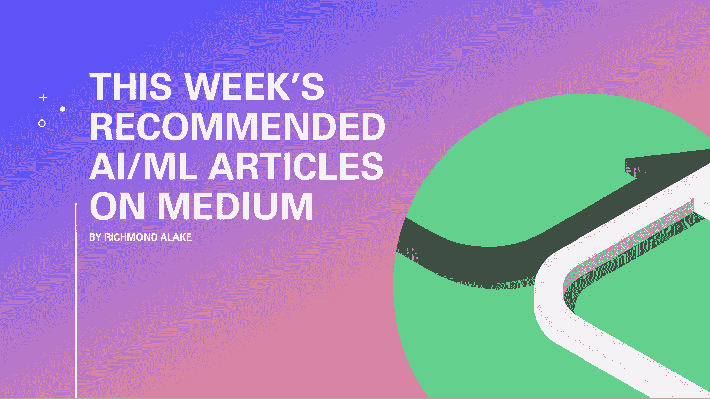

# 数据科学家和机器学习从业者每周推荐文章(1 月 11 日)

> 原文：<https://towardsdatascience.com/weekly-recommended-articles-for-data-scientists-and-machine-learning-practitioners-59853fb844d3?source=collection_archive---------43----------------------->

## 人工智能和数据科学

## 每周数据科学、机器学习和 AI 推荐文章

作者图片

2021 年似乎将会走上一条与备受厌恶的 2020 年相同的道路。

一些技术媒体作者已经开始从 ML 从业者的角度捕捉全球正在发生的事件。

这篇文章介绍了六篇写得很好的与时间相关的文章，不同水平的 ML 从业者都会喜欢。

**以下是本周推荐文章的内容:**

*   一篇涵盖人工智能方法的文章将继续支持疫情后的医疗保健行业。
*   两篇文章侧重于面部识别，一篇传达面部识别对少数群体的灌输，另一篇提出面部识别可以支持司法工作的方法。
*   一篇解释 OpenAI 最新项目 DALL-E 的短文和一篇关于过渡到机器学习相关角色的旅程的详细文章。
*   一篇介绍销售预测数据合成的文章。

*快乐阅读*

# 1.新冠肺炎之后的医疗保健中的人工智能

Raj 的文章提供了关于制药公司、政府和医疗保健机构在新冠肺炎疫情期间利用人工智能的各种方式的深刻信息。

但更重要的是，在本文的后半部分，Raj 提供了一系列方法，在新冠肺炎疫情之后，人工智能仍然在提供价值。

关键的一点是，人工智能应用作为医疗保健中的支持工具将继续存在。

 [## 新冠肺炎之后的医疗保健中的人工智能

### 艾在新冠肺炎战斗的第一线。之后，它可以在医疗保健中发挥更大的作用。

medium.com](https://medium.com/towards-artificial-intelligence/artificial-intelligence-in-healthcare-after-covid-19-dbbdaffb48d7) 

# 2.艾被娜塔莎·玛塔用来监视和压迫中国的维吾尔穆斯林

Natasha Matta 的文章包含了利用面部识别和监控系统来压迫和歧视中国维吾尔穆斯林的信息。

这篇文章聚焦于大型科技公司参与向中国当局提供硬件、软件和工具，从而对少数民族进行不间断的监控和监视，主要是为了灌输思想。

这篇文章展示了一个人工智能被用作剥夺个人隐私和基本人权的工具的例子。

虽然我们可能没有直接参与到这个特定的场景中，但是作为 ML 从业者，我们需要考虑更大的图景，思考我们开发的工具如何被用于伤害。

 [## 利用人工智能监视和压迫中国的维吾尔穆斯林

### 在中国的维吾尔族穆斯林“再教育营”里有大规模的种族灭绝和监禁，中国领先的技术…

natashamatta.medium.com](https://natashamatta.medium.com/use-of-ai-to-surveil-oppress-uyghur-muslims-in-china-18fd5773972b) 

# 3.对国会大厦的袭击应该会引发一场关于面部识别的新辩论

面部识别软件的使用一直是一个有争议的话题，并引起了社会的高度关注。

但在这篇文章中，托马斯·史密斯探索了面部识别软件的应用场景，更具体地说，ClearviewAI 提供的软件可以用来追踪袭击美国国会大厦的暴徒。

 [## 对国会大厦的袭击应该会引发一场关于面部识别的新辩论

### 使用面部识别有一个合适的时机。那就是现在。

tomsmith585.medium.com](https://tomsmith585.medium.com/this-is-a-rare-moment-when-we-actually-need-clearview-ai-a8e036a33442) 

# 4.基于深度学习的数据合成方法及其在金融交易中的应用[张睿](https://medium.com/u/e7734dafe2fb?source=post_page-----59853fb844d3--------------------------------)

在这篇文章中，张睿详细介绍了基于从历史销售数据中获得的信息创建销售预测工具的技术工作。Rui 的文章涵盖了典型数据科学项目中涉及的主要过程，如数据收集、清理、增强模型开发等。

本文的主要内容集中在通过表格变分自动编码器(TVAE)支持的数据合成来扩充最初有限的数据集的过程。

 [## 基于深度学习的数据合成方法及其在金融交易中的应用

### 如何使用变分自动编码器和一般线性回归预测表格交易数据

towardsdatascience.com](/a-deep-learning-based-method-for-synthesizing-data-with-an-application-in-financial-transactions-9c3936423d9a) 

# 5.戴尔·E 由[戴尔·马科维茨](https://medium.com/u/1b81dbdfe1ea?source=post_page-----59853fb844d3--------------------------------)在不到 5 分钟的时间里解释

Dale 的文章对 OpenAI 的最新公开项目 DALL-E 进行了高水平的技术介绍。

Dale 提供 DALL-E 的功能，尽管图像是通过人工输入的文本提示生成的。避免过多的技术术语，Dale 友好地解释了 DALL-E 的功能、技术细节、应用和性能。

 [## DALL E 在 5 分钟内解释了

### OpenAI 的新图像和文本模型是如何工作的

towardsdatascience.com](/dall-e-explained-in-under-5-minutes-327aea4813dd) 

# **6。我是如何从一名销售工程师变成深度学习/计算机视觉研究工程师** [**曼普里特·辛格·米哈斯**](https://medium.com/u/35b4b2dadc4?source=post_page-----59853fb844d3--------------------------------)

Manpreet 与 Medium 读者分享了他从客户经理到计算机视觉工程师的详细经历。

Manpreet 的文章包含学习、求职、技能提升等外部资源的链接。除了提供的资源之外，这篇文章还有一个额外的好处，那就是提供第一人称的叙述和关于导航机器学习研究、求职和获得经验的建议。

 [## 我是如何从一名销售工程师成为深度学习/计算机视觉研究工程师的

### 在我的职业转变过程中，我希望得到的指导、提示和建议…

towardsdatascience.com](/how-i-went-from-being-a-sales-engineer-to-deep-learning-computer-vision-research-engineer-8882272a1a6) 

# 结论

我很想知道媒体作家在接下来的几周里会报道些什么。看到 2020 年即将到来的快速发展和进步，我更加兴奋。

## **要联系我或找到更多类似本文的内容，请执行以下操作:**

1.  订阅我的 [**邮件列表**](https://richmond-alake.ck.page/c8e63294ee) 获取每周简讯
2.  跟着我上 [**中**](https://medium.com/@richmond.alake)
3.  通过 [**LinkedIn**](https://www.linkedin.com/in/richmondalake/) 联系我

 [## 作为机器学习工程师，如何在 2021 年保持相关性

### 我的计划和策略

towardsdatascience.com](/how-to-stay-relevant-as-a-machine-learning-engineer-in-2021-41b5feaa4771)  [## 2021 年如何成为计算机视觉工程师

### 排名第一的大规模开放式在线课程(MOOCs)

towardsdatascience.com](/how-to-become-a-computer-vision-engineer-in-2021-c563545d4c9a)