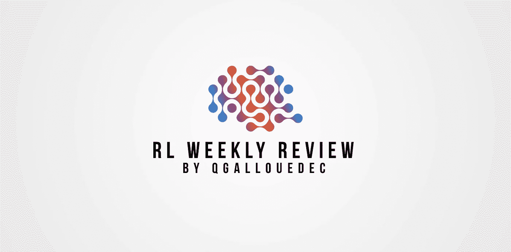
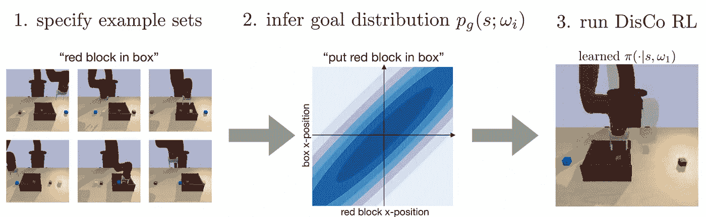
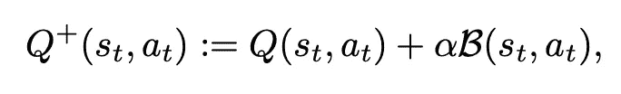

# 强化学习试卷#10 的每周回顾

> 原文：<https://towardsdatascience.com/weekly-review-of-reinforcement-learning-papers-10-be5947715b26?source=collection_archive---------48----------------------->

## 每周一，我都会发表我研究领域的 4 篇论文。大家来讨论一下吧！

作者图片

[ [←上一次回顾](/weekly-review-of-reinforcement-learning-papers-9-d0f7eff9eae2?sk=cdaaf56e9d7bf2a52f9fdc8e6af0dc30) ][ [下一次回顾→](https://qgallouedec.medium.com/weekly-review-of-reinforcement-learning-papers-11-7e1780ddf176?sk=18185b32a63640b45cc486270c267584)

# 论文 1:通用策略的分布条件强化学习

Nasiriany，s .，Pong，V. H .，Nair，a .，Khazatsky，a .，Berseth，g .，和 Levine，S. (2021 年)。 [Disco rl:通用政策的分布条件强化学习](https://arxiv.org/abs/2104.11707)。 *arXiv 预印本 arXiv:2104.11707* 。

以目标为条件的强化学习包括将一个目标整合到政策论证中。例如，考虑一个机器人手臂和一个放在桌子上的立方体；任务是控制机械臂将立方体移动到期望的位置。如果目标位置不变，你知道的 RL 方法可以解决这个问题。但是如果我现在想把立方体移动到一个新的位置呢？我是否必须为多维数据集的每个目标位置学习一个策略？通过使用以目标为条件的策略，可以学习任何目标位置的移动任务。该策略将州和目标州作为参数。

以目标为条件的策略可以允许一些一般化，但是不能捕获所有可能需要的任务。举个例子，同样的例子，如果你在桌子上加了一个盒子，你想让手臂把立方体移动到盒子里，完成这个任务有很多状态:立方体可以在盒子的中心，在盒子的边缘，或者其他任何地方，只要它在盒子里，任务就完成了。

在本文中，作者建议用状态分布来代替目标。首先，模型必须使用对应于成功任务的状态的例子来学习奖励分配。一旦模型能够识别对应于任务成功的状态，就可以学习策略。他们在这篇论文中提出了他们的算法，适用于对奖励分布的学习，他们称之为分布条件强化学习(DisCoRL)。

首先，一个模型被训练来推断一个目标分布，一个策略被训练来完成期望的任务。

这种方法的巨大优势在于，它将以目标为条件的 RL 方法扩展到了以前被忽略的各种各样的任务。

# 论文 2:拼车强化学习:综述

秦，朱海红，叶，等(2021)。[拼车强化学习:综述](https://arxiv.org/abs/2105.01099)。 *arXiv 预印本 arXiv:2105.01099* 。

本文是一篇关于拼车强化学习方法的文献综述。我们这里处理的是专业拼车，比如优步提供的服务。从某种意义上来说，司机提供了一次他本应该去的旅行(去度假或去工作场所)，这不是拼车。

拼车其实集合了几个话题。(1)匹配，包括根据顾客的要求和驾驶员的位置将顾客和驾驶员联系起来；(2)重新定位，包括将空闲的驾驶员(不在驾驶中)移向一个位置，使其与未来顾客的距离最大化，或使顾客的平均等待时间最小化；(3)驱动器的动态定价。

对于这些主题中的每一个，作者探索了几个作品，讨论了每个获得的假设和结果。有趣的是，所有的工作都是首先(如果不是唯一)在模拟中完成的。因此，有必要解决所使用的模拟工具的真实性问题，以及允许从模拟到真实世界的方法。

另一方面，这是他们的结论性评论，大多数作品都是最近写的。这是一个非常新的领域，还有许多方向有待探索。

# 论文 3:通过乐观自举和逆向归纳进行原则性探索

(2021)白超群，王，李，王，郑，韩，郝建杰，刘。[乐观自举和逆向归纳的原则性探索](https://arxiv.org/abs/2105.06022)。 *arXiv 预印本 arXiv:2105.06022* 。

U pper 置信界限( [UCB](/the-upper-confidence-bound-ucb-bandit-algorithm-c05c2bf4c13f) )是一种强化学习方法，其特殊性在于为很少访问的州提供探索奖励。从另一个角度来看:一个代理人对一个它从未尝试过的行动的结果持乐观态度。

这种算法在表格情况下非常容易实现(每个状态-动作对都与一个值相关联，该值可以存储为一个表)。然而，当我们想要使用神经网络来估计该值时，该算法很难实现:不可能单独选择与状态-动作对相关联的输出。网络的输出值取决于网络的权重集，因此权重的每次更新都会对输出集产生影响。

乐观值函数是通过对估计的 Q 函数和奖金 B 求和而获得的

在本文中，作者提出了乐观自举和逆向归纳(OB2I)，一种适应 UCB 探索奖金思想的深度 RL 算法。以前的工作允许 UCB 的这种适应，但仅限于线性情况。在这个版本的算法中，状态-动作对的不确定性被估计。如果这种不确定性高，奖金就高，如果不确定性低，奖金就低。然后，这个额外奖励被添加到状态-动作的值中。因此，可以将这种方法与所有基于值的算法相结合。他们通过超越其他最先进的勘探策略来验证其方法的效率。

# 论文 4:具有通用策略更新的快速强化学习

Barreto，a .，Hou，s .，Borsa，d .，Silver，d .，& pre COPD，D. (2020 年)。[具有通用策略更新的快速强化学习](https://www.pnas.org/content/117/48/30079)。*美国国家科学院院刊*， *117* (48)，30079–30087。

了解一个令人满意的政策所需的交互次数通常非常多。这是强化学习与深度学习共有的限制。本文作者采用了分而治之的方法。这到底是什么意思？

一个复杂的任务通常由几个任务的连续或并行实现组成。通过将一项任务分成更简单的子任务，可以更有效地学习。但这就引出了一个问题:如何评价一个政策必须在几个子任务上表现良好？为了理解这一点，让我们再次从策略迭代算法开始。我们从任何政策开始，然后我们评估这个政策以获得它的状态-动作值函数(政策评估)。一旦我们有了这个价值函数，我们就创建了一个新的政策，为每个州选择产生最大回报的行动(政策改进)。然后我们重新开始。

政策迭代的保证之一是，在每一步，政策必然会变得更好。在本文中，作者将策略迭代扩展到几个奖励信号必须最大化的情况。它们引入了一般政策评估(GPE)和一般政策改进(GPI)。

让我们用几句话来解释 GPI，即如何从它的价值函数出发，建立一个新的政策，比以前的政策更好。这个想法是评估几个政策。一旦我们有了每个政策的价值函数，我们就可以检查各个状态:对于每个状态，我们选择在所有政策中给出最高回报的行动。

结果是好的，从某种意义上说，该算法收敛非常快，比 Q 学习快几个数量级。当然我简化了很多。我邀请你阅读这篇文章来理解这种概括的所有微妙之处，以及结果是如何得到的。

我很高兴向你们展示我本周的阅读材料。请随时向我发送您的反馈。