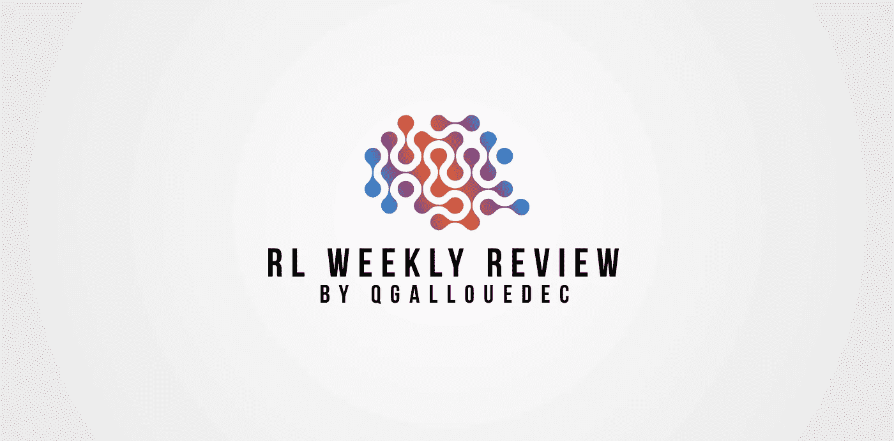
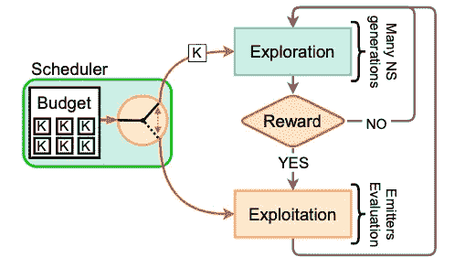
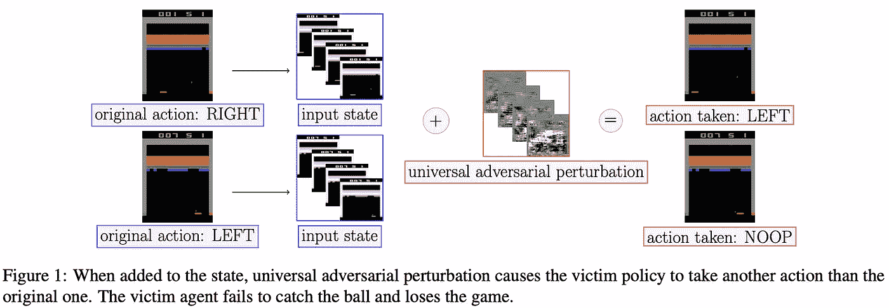
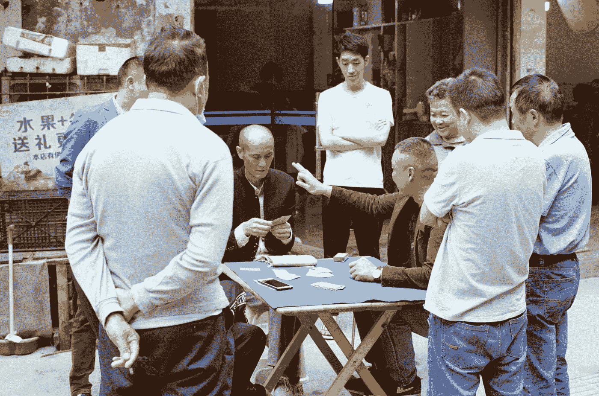
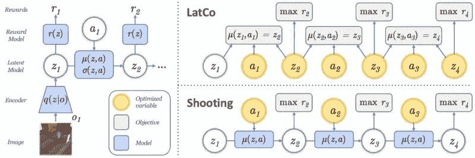

# 强化学习试卷#12 的每周回顾

> 原文：<https://towardsdatascience.com/weekly-review-of-reinforcement-learning-papers-12-9ec3a81720?source=collection_archive---------41----------------------->

## 我在我的研究领域发表了 4 篇论文。大家来讨论一下吧！

作者图片

[ [←上一次回顾](/weekly-review-of-reinforcement-learning-papers-11-7e1780ddf176?sk=18185b32a63640b45cc486270c267584) ][ [下一次回顾→](/review-of-reinforcement-learning-papers-13-24ed69a8fdc2?sk=7b943268ec3a5256ff4cc0f7b48aa81f)

# 论文 1:通过新颖性搜索和发射体的稀疏回报探索

Paolo，g .，Coninx，a .，Doncieux，s .，和 Laflaquière，A. (2021 年)。[通过查新和发射体进行稀疏回报探索](https://arxiv.org/abs/2102.03140)。arXiv 预印本 arXiv:2102.03140 。

强化学习的主要权衡是探索与利用的权衡。探索对于发现新的回报是必要的，开发对于利用已经吸收的知识也是必要的。有些环境，比如机器人环境，有非常稀有的奖励的特殊性(称为稀疏)。这项工作的目的是提出一种算法，允许在稀疏奖励的框架内进行有效的探索。他们称他们的方法为 SERENE(通过新奇事物和发射器进行稀疏回报探索)。这是什么？

图来自[文章](https://arxiv.org/abs/2102.03140):宁静的建筑

这种算法的主要区别在于，它将清楚地区分探索过程和开发过程。换句话说，代理从探索过程开始，然后切换到利用过程，依此类推。代理如何决定是探索还是剥削？这是元调度器的角色，它必须为每个模式分配正确的时间。

探索阶段实际上是奖励不可知论者，并且只寻求最大化所遇到的状态的新颖性。这允许有效地发现新的领域，而仅仅通过寻找奖励是永远不会被发现的。然后在开发过程中，代理将创建算法的本地实例，他们称之为发射器。这些发射器是基于奖励的进化算法的实例。它们适合于在空间的小区域上优化奖励。

所获得的结果并不具有启发性，但是在我看来，区分探索阶段和开发阶段的想法使得算法具有更好的可读性，从而允许以更好的方式管理折衷。

# 论文 2:针对深度强化学习策略的实时攻击

泰克古尔，B. G .，王，s .，&阿索坎，N. (2021)。[针对深度强化学习策略的实时攻击](https://arxiv.org/abs/2106.08746)。 *arXiv 预印本 arXiv:2106.08746* 。

D eep 强化学习代理和我们一样，容易受到攻击。什么是攻击？想象一个交易代理，被训练买卖股票。通过训练一个*攻击*智能体，可以愚弄第一个智能体，并通过仔细扰乱观察使他做出错误的决定。因此，代理人可能买入大量下跌的股票，或者相反，在错误的时机卖出非常有利可图的股票。

图来自[篇](https://arxiv.org/abs/2106.08746)。

到目前为止，主要的限制是这些策略速度缓慢，无法实时部署。在这篇论文中，作者提出了一种方法，他们称之为普遍对抗性扰动(UAP)。他们在 ATARI2600 游戏中表明，通过正确训练扰动者，通过应用低振幅(0.5%)的扰动，有可能使主代理的性能灾难性地下降。此外，他们表明，与以前的方法不同，他们的算法的轻便性允许其实时使用。

这是好消息吗？不确定。

# 论文 3: DouZero:通过自我游戏深度强化学习掌握斗地主

查大丁，谢军，马，张，连，胡，刘军(2021)。 [DouZero:用自玩深度强化学习掌握斗地主](https://arxiv.org/abs/2106.06135)。 *arXiv 预印本 arXiv:2106.06135* 。

斗朱迪在中国是一种非常受欢迎的纸牌游戏。它是由三个玩家玩的。每个玩家从一手牌开始，目标是在其他玩家之前除掉他们。规则很简单，这使得它非常容易学习。然而，它有着极难掌握的特殊性。为了正确地玩游戏，你需要从数学、概率和战略的角度去思考。

照片由[Ulrich&Mareli Aspeling](https://unsplash.com/@marlulla?utm_source=medium&utm_medium=referral)在 [Unsplash](https://unsplash.com?utm_source=medium&utm_medium=referral) 上拍摄

你可以想象一些人想知道这个游戏是否能抵抗强化学习。这篇文章的作者介绍了 DouZero，一个通过掌握这种游戏来训练自我游戏的 DRL 特工。有趣的是实现。在这种游戏中，每一轮都可以放一张或多张牌。但是要小心，不是随便什么卡。合法的诉讼数量有限。这使得实现有点复杂。在这项工作中，作者提出了两个主要成分:**动作编码**和**并行演员**。训练有素的代理实现的性能超过了任何现有的机器人。似乎没有一款游戏能抵抗这种诱惑

# 论文 4:通过潜在空间配置的基于模型的强化学习

朱，c .，纳加班迪，a .，达尼利迪斯，k .，莫尔达奇，I .，，莱文，S. (2020)。[基于模型的潜在空间配置强化学习](https://arxiv.org/abs/2106.13229)。

基于视觉感知的强化学习的问题在于观察空间非常大(每个像素的所有可能值的乘积)。当然，空间中的大部分观察点是不可到达的，对于所考虑的环境，只有少数会被访问。然而，这足以使强化学习算法，尤其是那些基于规划的算法变得困难。一个非常有效的解决方案是创建一个空间的潜在表示，一个更精简的观察版本，但它在理论上包含了输入中存在的所有数据。但让我们面对现实吧，长期规划仍远未明朗。事实上，使用潜在观察空间的算法通常可以预测一些未来的观察，但仍然无法进行长期规划。

图来自[论文](https://arxiv.org/abs/2106.13229) : LatCo 架构

他们的假设如下:与其计划一系列的行动(通常在文献中是这样做的)，不如通过计划一系列的状态来更容易地解决一个任务。这背后的直觉是，每个动作对轨迹的其余部分都有重要的影响。因此，最小的误差很快就会产生相当大的预测误差。
相反，作者使用了配置法，这种方法优化了一个状态序列，使报酬最大化。这种方法还保证了轨迹的可行性。

有趣的是，他们称之为 LatCo(潜在搭配)的这种方法，在某些环境中可以极大地改善结果，但在其他环境中却不行。这将是有趣的调查，以了解这种结果差异的原因。

谢谢你把我的文章看完。我很乐意阅读你的评论。