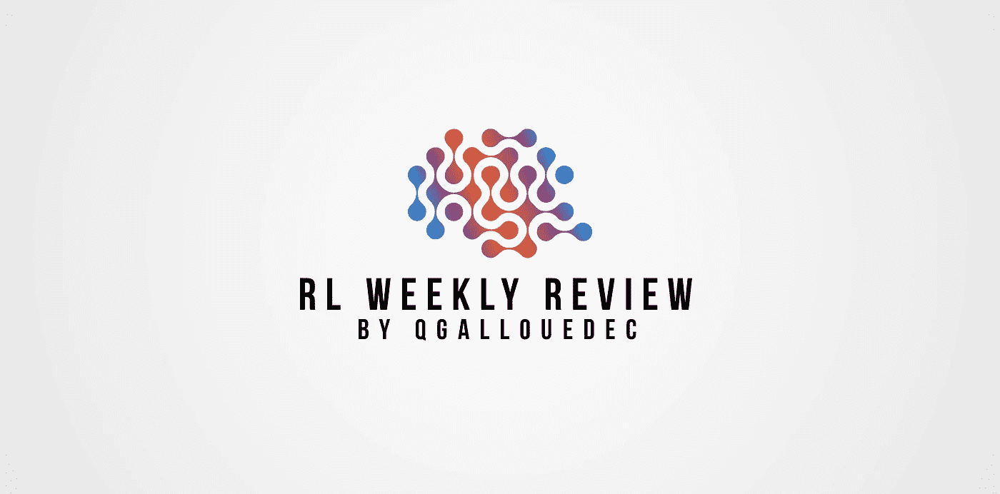
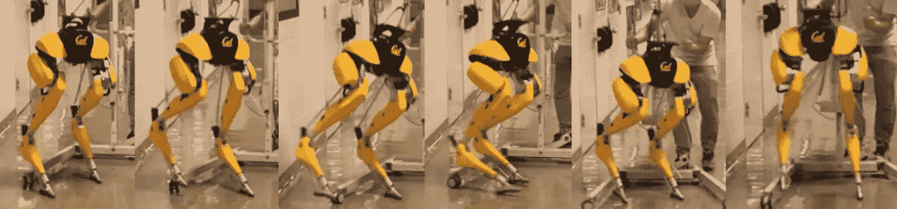
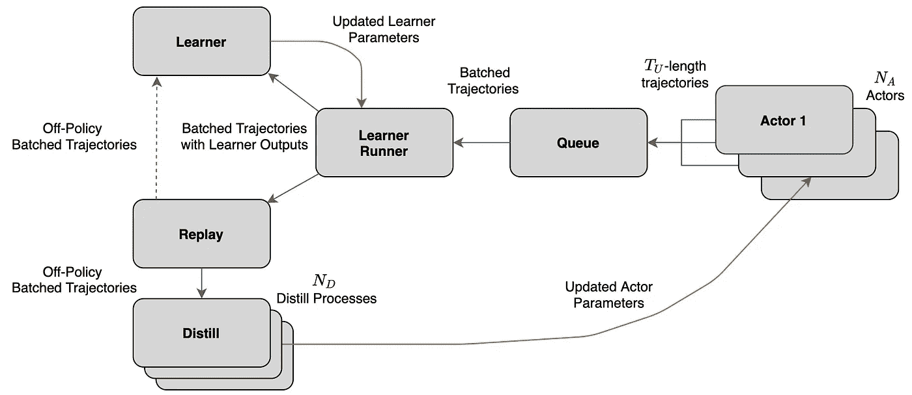
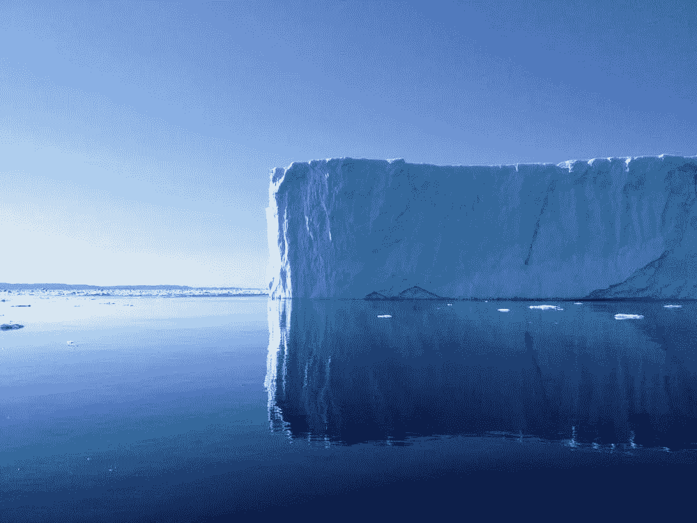

# 强化学习论文#4 的每周回顾

> 原文：<https://towardsdatascience.com/weekly-review-of-reinforcement-learning-papers-4-d735531f629c?source=collection_archive---------47----------------------->

## 每周一，我都会发表我研究领域的 4 篇论文。大家来讨论一下吧！

作者图片

[ [←上一次回顾](https://medium.com/mlearning-ai/weekly-review-of-reinforcement-learning-papers-3-32f03633066e?source=friends_link&sk=c53ec970bac2d20ac7c0853391b83e12) ][ [下一次回顾→](https://qgallouedec.medium.com/weekly-review-of-reinforcement-learning-papers-5-adb88dc9dff?source=friends_link&sk=c992da2710ad5e171e41c214b6de4798)

纪念安德烈亚斯。

# 论文 1:规划在基于模型的深度强化学习中的作用

汉姆里克、J. B .、弗里森、A. L .、贝巴哈尼、f .、格斯、a .、维奥拉、f .、威瑟斯彭、s .…&韦伯、T. (2020)。[论规划在基于模型的深度强化学习中的作用](https://arxiv.org/abs/2011.04021)。 *arXiv 预印本 arXiv:2011.04021* 。

W 规划在强化学习中的贡献是什么？这很难知道:它是许多非常强大的算法(如 MuZero)的一部分。但是这个计划阶段对好的学习结果有多大的必要呢？这是本出版物的作者试图回答的问题。为了做到这一点，他们修改了 MuZero，用不同的环境，不同的消融来面对它。

以下是他们回应的摘要。计划是有用的，但是**并不总是非常有效**。在某些情况下，人们会直观地定义为需要大量的推理，如推箱子，没有必要做大量的规划。在像 9x9 Go 这样的其他游戏中，学习表现受到计划深度的强烈影响。另一方面，规划对于良好的概括是不够的。这表明，识别良好的政策偏差可能比学习更好的模型来推动泛化更重要。

直觉上，预测未来的能力对于学习好的政策很重要。我发现通过测试基于基准模型的学习算法来质疑这种直觉是很有趣的。

# 论文 2:双足机器人鲁棒参数化运动控制的强化学习

(2021 年)李，郑，陈，彭，张宝兵，李宝兵，李宝兵，李宝兵。[双足机器人鲁棒参数化运动控制的强化学习](https://arxiv.org/abs/2103.14295)。 *arXiv 预印本 arXiv:2103.14295* 。

ipedal 移动是机器学习力量的一个很好的展示。大多数机器人的控制不是基于学习。我们使用几十年前就知道的线性自动方法，结果非常令人满意。但是这些方法从来没有强大到足以让双足机器人行走。正是在这个前沿领域，机器学习引起了人们极大的兴趣。

在本文中，作者提出了一个适用于双足机器人控制的强化学习框架。在这个框架中，第一个学习阶段是在模拟中完成的。然而，模拟系统地不同于真实世界。这被称为*模拟真实*差距。这就是他们使用域随机化的原因:模拟常数不再是常数:它们从一个模拟时期变化到下一个。这使得该策略在部署到真实机器人上时，对于它将经历的域改变更加健壮。

图来自[文章](https://arxiv.org/abs/2103.14295):从脚滑中恢复

学习到的策略允许双足机器人执行一系列有趣的行为:例如，在图形上，它们通过使机器人滑动来破坏其稳定性。我们看到它是如何对这种扰动做出正确反应的！它还执行其他任务:快速行走，转弯，支撑额外的重量…

deep-RL 应用于机器人控制的另一个很好的演示。去看他们的[视频](https://www.youtube.com/watch?v=goxCjGPQH7U)。我发现这种认识很能说明问题，因为我们每个人都是在最初几个月学会走路的。

# 论文 3:使用行动者-学习者提炼的强化学习中的有效转换器

Parisotto，e .，& Salakhutdinov，R. (2021)。[使用行动者-学习者提取的强化学习中的高效转换器](https://arxiv.org/abs/2104.01655)。 *arXiv 预印本 arXiv:2104.01655* 。

F 或者某些应用，特别是对机器人的实时控制，需要学习的模型响应时间低。机器人必须对环境的变化做出快速反应。因此，学习模型必须足够简单，以允许推理与实时控制的约束兼容。很多时候，学习到的强化学习模型很简单。正如安德烈·卡帕西所说

> “我所知道的关于 ConvNets 设计的一切(resnets，bigger=better batchnorms 等。)在 RL 是没用的。Superbasic 4 层 ConvNets 效果最佳。”[ [来源](https://twitter.com/karpathy/status/822563606344695810)

但是，如何利用那些让监督学习如此成功的复杂模型呢？为了回答这个问题，这篇文章的作者提出了一个“行动者-学习者升华”(ALD)的过程。它允许将学习进度从在大型网络上学习的模型转移到较小的网络。这使得他们可以在非马尔可夫环境(即部分可观测环境)中使用非常高效但非常笨重的变压器架构。这个超级模型然后被提炼为一个更轻的 LSTM 模型。

图来自[篇](https://arxiv.org/abs/2103.14295):ALD 概况。

他们在相当简单的环境(I-Maze 9x9 和 Meta-Fetch)中对其进行了测试，学习到的模型成功地将 LSTM 的轻便性和变压器的效率结合起来。它可以很好地帮助协调强化学习和监督学习，有利于强化学习！

# 论文 4: pH-RL:将强化学习引入健康实践的个性化架构

Hassouni，A. E .、Hoogendoorn，m .、Ciharova，m .、Kleiboer，a .、Amarti，k .、Muhonen，v .、… & Eiben，A. E. (2021)。 [pH-RL:将强化学习引入健康实践的个性化架构](https://arxiv.org/abs/2103.15908)。 *arXiv 预印本 arXiv:2103.15908* 。

总是同一个问题:在模拟或游戏中，强化学习已经证明了自己。但是现实世界呢？在这篇论文中，作者提出了一个健康问题的通用强化学习架构:个性化，更具体地说是移动应用的个性化。他们称之为 pH-RL(带 RL 的电子健康个性化)。这种架构允许通过学习来个性化健康应用，并且个性化的级别是可调的。

事实上，他们提出了在移动医疗应用程序中引入强化学习模型的指南。他们用 MoodBuster 应用程序(一个在线治疗心理疾病的平台)证明了他们方法的有效性。从经验上来说，他们表明，学习模型正确地选择了最大限度地每日坚持治疗模块所需的行动和信息。

我喜欢这种将医疗保健联系起来的文章。结果很有趣，但我忍不住评论道:当心技术解决主义，尤其是在医疗保健领域。

# 奖励论文:在世纪营 1.4 千米冰层下的沉积物中保存了数百万年的格陵兰植被和冰川历史记录

Christ，A. J .，Bierman，P. R .，Schaefer，J. M .，Dahl-Jensen，d .，Steffensen，J. P .，Corbett，L. B .，… & Southon，J. (2021)。世纪营地 1.4 千米冰层下的沉积物中保存了数百万年前的格陵兰植被和冰川历史记录。*美国国家科学院院刊*，*第 118 期* (13)。

来自 [Pexels](https://www.pexels.com/fr-fr/photo/rhume-glacier-iceberg-fondre-5317263/?utm_content=attributionCopyText&utm_medium=referral&utm_source=pexels) 的 [CHRISTIAN PFEIFER](https://www.pexels.com/fr-fr/@christian-pfeifer-3550788?utm_content=attributionCopyText&utm_medium=referral&utm_source=pexels) 的图片

多年后，一个被遗忘的样本揭示了格陵兰岛令人震惊的历史。由于冷战期间意外收集的岩石和土壤碎片，几十年来没有人注意到这些碎片，研究人员已经证明格陵兰冰盖在大约一百万年前已经完全融化。

1966 年，美国研究人员被派往格陵兰的世纪营，进行 1400 米深的钻探。客观？官方说法:这是为了刺破北极生存的秘密。非正式地说:是为了**藏在冰层下苏联俄罗斯**能触及的 600 核导弹。在切斯特·朗威的指导下，1.4 千米厚的冰芯和 3 米厚的冰下沉积物被提取、冷冻并转移到布法罗大学的一个仓库里。一份独一无二的档案，最终会被遗忘几十年。切斯特·朗威在 20 世纪 90 年代犹豫要不要销毁这些样本，以便在大学的冰柜里腾出空间。但是最终接受他们的是考纳格大学。

2017 年，在一次大清理期间，这些著名的样本将被分发给世界各地的几个团队，包括佛蒙特大学的一个团队。2021 年，这些来自佛蒙特大学的研究人员研究了这些样本，并发现了可追溯到一百万年前的植物化石。这意味着一百万年前，在世纪营地，可能有北方森林，而不是冰川。

然而，这个惊人的发现相当令人恐惧:一百万年前，平均气温只比今天高 2 到 3 度。具有讽刺意味的是，这正是对未来 50 年的预测。格陵兰岛的融化将导致海平面上升 6 到 7 米。那么我们还在等什么呢？我们是继续做出调整，还是真的全力以赴来防止这种情况发生？

我很高兴向你们展示我本周的阅读材料。请随时向我发送您的反馈。