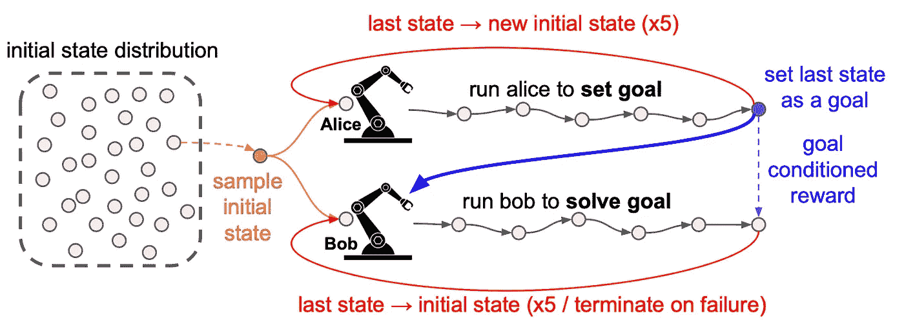

# 强化学习论文#5 的每周回顾

> 原文：<https://towardsdatascience.com/weekly-review-of-reinforcement-learning-papers-5-adb88dc9dff?source=collection_archive---------40----------------------->

## 每周一，我都会发表我研究领域的 4 篇论文。大家来讨论一下吧！

作者图片

[ [←上一次回顾](/weekly-review-of-reinforcement-learning-papers-4-d735531f629c?source=friends_link&sk=53ee1d401bfcb4fe3d7ee642bd1decc9) ][ [下一次回顾→](/weekly-review-of-reinforcement-learning-papers-6-2f919fe2a479?source=friends_link&sk=da5442ea1ab2dcccd2e6223d4f2d7f9a)

# 论文 1:超越波束搜索的机器翻译解码

r .勒布隆，Alayrac，j .，Sifre，l .，Pislar，m .，Lespiau，j .，Antonoglou，I .，Simonyan，k .，& Vinyals，O. (2021)。[机器翻译解码超越光束搜索](https://arxiv.org/abs/2104.05336)。arXiv 预印本 arXiv:2104.05336。

L et 来说说机器翻译。BLEU(双语评估替读)是一种算法，用于评估由机器从一种语言翻译成另一种语言的文本的质量。机器翻译越接近专业的人工翻译，评价越好。使用波束搜索可以获得最佳结果。这是一种启发式搜索算法，通过只考虑每个节点的有限的子节点集来探索图形，从而减少运行图形所需的内存。但是作者对这种波束搜索并不满意，因为它没有考虑从业者感兴趣的度量。这些指标是什么？这篇文章的简短使我无法解释，所以我建议您参考这篇文章。为了取代波束搜索，他们提出使用 RL，更具体地说是基于 MCTS 的算法。

他们展示了一个令人惊讶的结果:没有最好的算法，所有的指标都考虑在内。所考虑的度量极大地决定了要使用的最佳算法。但是在某些情况下，基于 MCTS 的算法比波束搜索算法获得更好的结果。在 23 页中，作者探讨了这种新的翻译方法的优缺点。他们还提出了几个附录，可以很容易地重现他们的结果。这为机器翻译的新方法奠定了基础。

# 论文 2:和朋友一起学习:敌对动机的内在目标

Campero，a .，Raileanu，r .，Küttler，h .，Tenenbaum，J. B .，rocktschel，t .，& Grefenstette，E. (2020)。[和朋友一起学习:敌对动机的内在目标](https://arxiv.org/abs/2006.12122)。arXiv 预印本 arXiv:2006.12122 。

在一个回报很少的环境中学习是很复杂的。没有什么能引导代理人去高回报的领域。一个解决办法是引入所谓的内在奖励。具体来说，它是一种奖励，这种奖励不是来自环境，而是来自行为者本身。但是这个奖励的目的是什么呢？以及如何决定何时给予这种奖励？这里有一个简单的例子:当代理访问一个新的状态时，它可以给自己一个奖励。这鼓励它去好奇，去发现新的状态。但这不是这里使用的奖励类型。我简单解释一下。

作者提出了一个框架，其中代理生成一个“教师”和一个“学生”。老师学会提出越来越高的目标，学生学会实现这些目标。代理人因此可以改进、获得一般技能，甚至不需要从环境中获得奖励。事实上，就好像代理人在一个不使用奖励的世界里学习进化。

来自[论文](https://arxiv.org/abs/2006.12122)的图:AMIGO 的两个模块:产生目标的教师和以目标为条件的学生政策

退一步说，我觉得这个想法从哲学的角度来看非常有趣。我们每天都在学习新的东西，但我们生活的世界却没有目的(或者说隐藏得很好)。我们创造自己的进步目标。

获得的结果看起来非常好。训练是在一个更难的 gridworld 上进行的，在一些配置中，代理人能够获得任何最先进的算法都无法获得的奖励。太棒了。

# 论文 3: AMP:程式化的基于物理的角色控制的对抗性运动先验

彭新波，马，郑，阿比尔，p，莱文，s，金泽，a(2021)。 [AMP:基于物理的风格化角色控制的对抗性动作优先](https://arxiv.org/abs/2104.02180)。arXiv 预印本 arXiv:2104.02180 。

如果动画角色的动作看起来如此逼真，这主要归功于动作捕捉。你知道，那些演员穿着朴素的衣服，所有关节上都有小跟踪球。效果真的很好。但如果结果这么好，那是因为活动范围有限。对于更复杂的运动，需要复杂的机械来获得满意的结果。

你可能会说，与 Deep-RL 有什么联系。在这项工作中，作者提出了一种基于对抗性学习的方法，以免除模仿目标的设计。

对于代理来说，目标是双重的:完成一个高级任务，并采用角色的风格。对于高层次的任务，通常很容易定义一个相关的奖励函数:例如，对于一个向前的进程，奖励将值得所走的距离。关于风格的模仿，代理必须尽可能接近包含角色自然动作的数据集来呈现动作。优点是该数据集的运动序列非常相似，并且不一定对应于所讨论的任务。

得到的结果是非常现实的:字符做侧手翻，翻筋斗，踢足球，你应该检查出来！

# 论文 4:机器人操作中自动目标发现的不对称自我游戏

OpenAI，o .、Plappert，m .、Sampedro，r .、Xu，t .、Akkaya，I .、Kosaraju，v .…& za remba，W. (2021)。[机器人操作中自动发现目标的不对称自我游戏](https://arxiv.org/abs/2101.04882)。 *arXiv 预印本 arXiv:2101.04882* 。

一只虱子和鲍勃。这是竞争中的两个机器人代理的名字。爱丽丝的目标？去做鲍勃做不到的事情。鲍勃的目标？去实现爱丽丝的成就。学习过程是这样的:
(1)爱丽丝开始与环境互动。她可以移动物体，推动它们…几步之后，我们将场景定格。这是“目标”状态
(2) Bob 开始于和 Alice 相同的初始状态。通过与环境的互动，Bob 必须找到一种方法来重现目标状态。

来自[文章](https://arxiv.org/pdf/2101.04882.pdf)的图:初始状态从预定义的分布中取样，Alice 生成目标状态，Bob 试图达到目标状态

一旦鲍勃成功再现了爱丽丝提出的场景，爱丽丝就会提出更复杂的状态来再现。我们将简单地让爱丽丝与环境互动更长的时间。她互动的时间越长，就越会修改场景，Bob 就越难重现。

这个想法非常聪明，因为我们确保每次都有可能达到目标状态(Alice 已经达到了，所以我们至少有一个解决方案)。另一方面，Bob 被训练来再现目标状态。如果学习成功， **Bob 不是被训练去做单一任务**(就像我们在机器人学里经常看到的那样)**，而是可以做任何任务**。我邀请您参加[查看](https://robotics-self-play.github.io)受过培训的代理能够执行的任务的复杂性和多样性，这里有一个小的概述。

来自[文章](https://arxiv.org/abs/2101.04882)的图:Bob 成功到达的最终状态。

我和你打赌，这篇论文将成为机器人学习的里程碑。

# 奖励论文:利用深度学习的潜力改进蛋白质结构预测

Senior，A. W .、Evans，r .、Jumper，j .、Kirkpatrick，j .、Sifre，l .、Green，t .、……和 Hassabis，D. (2020)。[利用深度学习的潜力改进蛋白质结构预测](https://www.nature.com/articles/s41586-019-1923-7?BZB_TOKEN=11cf2d2ae5b81f5f4ccd09a5cd23fc4c)。*性质*， *577* (7792)，706–710。

本周的一个收获，与这篇奖金文章的强化学习无关。我们会谈到 AlphaFold。这是你去年肯定看过的一条新闻:DeepMind 科学家解决了蛋白质折叠问题。但是它到底是什么意思呢？

蛋白质是生命中生物化学的基础。理解它们是如何工作的将会使对生命机制的理解有巨大的进步。这个想法很简单:蛋白质是由一系列氨基酸组成的。氨基酸在某种程度上是蛋白质的组成部分。大约有 20 个这样的基本构件。通过以特定的顺序组装这些氨基酸，我们得到了一种蛋白质。但是蛋白质并不是无定形的链。它会折叠并形成最终形状。正是这种形式是其化学性质的来源。因此问题来了:蛋白质是如何折叠的？

我们知道对于一个氨基酸序列，有一种独特的折叠方式。因此，我们面临的挑战是根据氨基酸序列预测蛋白质的形状。这个问题研究了 50 年，每年都会组织一次比赛，确定最佳折叠预测算法。以下是上一期的结果:

*casp 14 中参与者的排名，根据他们预测的 Z 分数总和。图来自官方* [*CASP14 网页*](https://predictioncenter.org/casp14/zscores_final.cgi) *。*

最左边的条形比第二个大得多，是 AlphaFold，DeepMind 提出的模型。(纵坐标，简称 z 分数:其值越高，预测越好。)他们是怎么取得这么好的成绩的？简单来说，他们用的是深度学习。训练网络来预测残基对之间的距离。从这些数据中，他们可以准确地预测蛋白质的形状。

这份出版物很好地展示了人工智能对人类的积极应用。恭喜你。

我很高兴向你们展示我本周的阅读材料。请随时向我发送您的反馈。