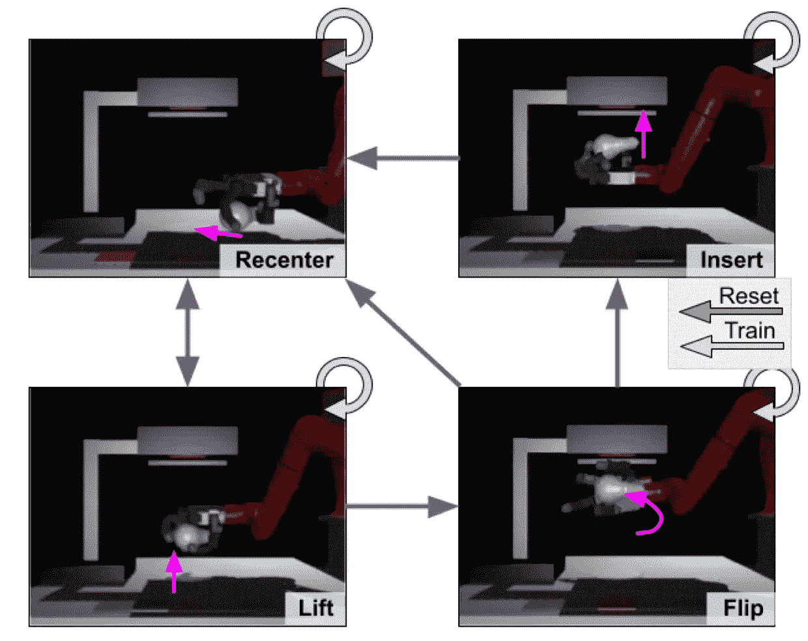
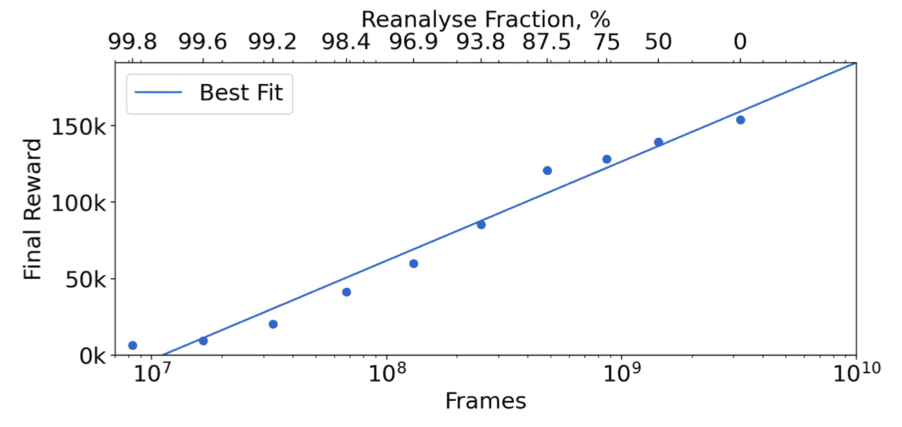
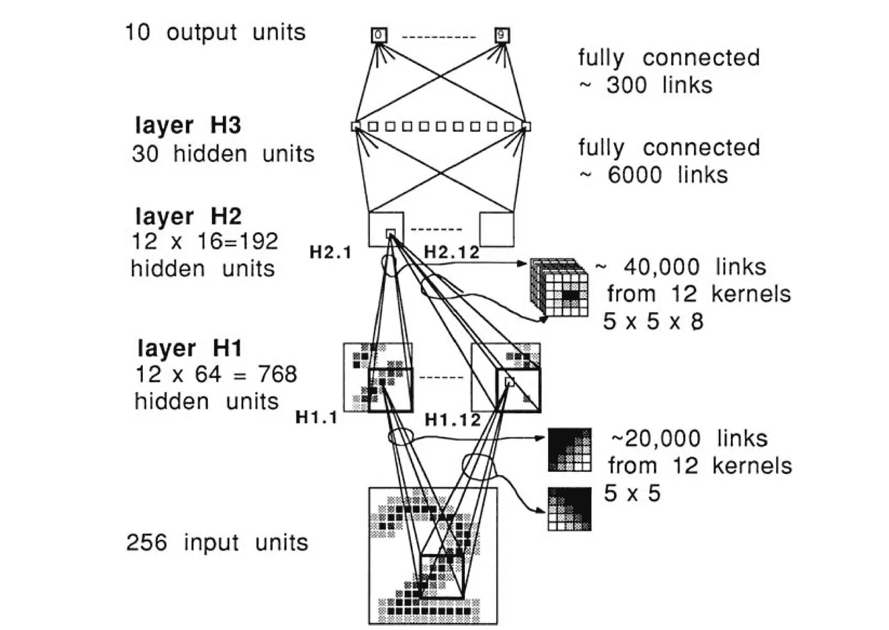

# 强化学习论文#6 的每周回顾

> 原文：<https://towardsdatascience.com/weekly-review-of-reinforcement-learning-papers-6-2f919fe2a479?source=collection_archive---------50----------------------->

## 每周一，我都会发表我研究领域的 4 篇论文。大家来讨论一下吧！

作者图片

[ [←上一次回顾](/weekly-review-of-reinforcement-learning-papers-5-adb88dc9dff?source=friends_link&sk=c992da2710ad5e171e41c214b6de4798) ][ [下一次回顾→](https://qgallouedec.medium.com/weekly-review-of-reinforcement-learning-papers-7-e5c726c2fafd?sk=ab04089a8009d0b9c098a80b6dde42d2)

# 论文 1: MT-Opt:大规模连续多任务机器人强化学习

卡拉什尼科夫，d .、瓦利，j .、切博塔尔，y .、斯旺森，b .、琼施科夫斯基，r .、芬恩，c .、… &豪斯曼，K. (2021)。 [MT-Opt:大规模连续多任务机器人强化学习](https://arxiv.org/abs/2104.08212)。 *arXiv 预印本 arXiv:2104.08212* 。

智能机器人:科幻小说取之不尽的灵感源泉，强化学习的丰富研究领域。要真正“智能”，机器人必须掌握大量技能(我们称之为多面手机器人)。有许多机器人使用强化学习成功地学习了一项任务。然而，这些机器人有一个共同的问题:学习需要大量的训练。因此，通用机器人仍然是科幻小说。

在这篇文章中，作者提出了一些接近这种多面手机器人的基础。例如，他们认为学习的某些方面是可以共享的:探索、经验和任务间的表现。在这个框架中，学习是连续的，新的任务可以在飞行中学习，通过重用过去的经验，收集用于学习其他任务。这种方法称为 MT-Opt。作者展示了一些用这种方法学习的任务的例子，(排列，重排，…)。

哦对了，还有一点:学习也可以分布在几个代理(这里是几个机器人)之间。由于这种学习合作，MT-Opt 通过在 7 个机器人上的分布式学习，在现实生活中学习了 12 项任务。

# 论文 2:发现不同的运动跳跃策略

图片比文字更有说服力:

杨，杨，范德平，尹，。(2021).[发现多样的竞技跳跃策略](https://arpspoof.github.io/project/jump/jump.html)。美国计算机学会信号图 2021。

本文的作者提出了一个运动技能的学习框架，特别是跳高。

> 一点历史题外话:今天所有运动员使用的跳跃被称为背越式跳高(背对障碍物)。它在 1968 年奥运会的决赛中首次被执行。之前，运动员面对障碍物跳跃，效率低很多。在迪克·福斯贝里之前，没有人想到这种跳跃。他将加冕奥运冠军，但不会提高世界纪录。

基于一个模拟的角色模型，他们应用强化学习来学习跳高。(注意跳跃前的跑步阶段不一定要学)。没有使用演示，代理必须发现跳过栏的最佳策略。为了让代理学习人类可行的策略，动作被限制在自然姿态。通过鼓励新政策，可以出现各种重要的战略。其中:背越式跳高在模拟中达到 2.00 米仍是最佳策略。我觉得这个主意非常有趣。

# 论文 3:通过多任务学习的免重置强化学习:在没有人工干预的情况下学习灵巧的操作行为

Gupta A .、Yu J. Zhao T.Z .、Kumar V .、Rovinsky A .、Xu K .、Devlin T .和 Levine S. (2021)。[通过多任务学习的免重置强化学习:在没有人工干预的情况下学习灵巧的操作行为](https://arxiv.org/abs/2104.11203)。 *arXiv 预印本 arXiv:2104.11203。*

R 应用于机器人的强化学习有一个特点。它将被部署在一个真实的机器人上。有两种方法。要么(1)在模拟机器人上进行学习，并将学习到的策略部署在真实机器人上，要么(2)直接在真实生活中进行学习。每种方法都有其优点和缺陷。如果在模拟中学习，一个人可以自由地同时模拟数百个机器人，这可以比在现实生活中模拟得更快。然而，由于模拟被系统地非常简化，所以在模拟中学习的策略很难部署在真实的机器人上。第二种选择是直接在真实的机器人上学习。模拟和现实差距的问题已经不存在了。但与环境互动的成本要高得多:时间无法加速，可用的机器人往往只有一个。现实世界的学习还有最后一个限制，这也是本文的主题。环境需要人工干预或复杂的工程来重置(例如，如果任务是打开抽屉，则关闭抽屉)。

在本文中，作者通过提出一种方法来解决这种限制，该方法利用了这样一个事实，即一些任务本质上是另一个任务的重置。例如(这不是在论文中所做的，但是这个例子很好地说明了原理)，*打开抽屉*是在于*关闭抽屉*的任务的复位。相反地，*关闭抽屉*是在于*打开抽屉*的任务的复位。这个想法是同时学习这些任务。机器人将首先学习关闭抽屉的模式，并且一旦抽屉被关闭，新的学习情节开始学习如何打开抽屉，等等。

来自[文章](https://arxiv.org/abs/2104.11203)的图:模拟中灯泡插入的任务和转换。目标是将灯泡重新放在中心，提起它，翻转它，然后将其插入灯中

这种方法在一个真实的机器人上进行了测试，机器人能够在短短 2 天多的时间内学习几项任务，无需任何人工干预。也不需要任何复杂的修补来重置环境。这种学习技巧将可能成为在真实机器人上学习复杂行为的标准。

# 论文 4:通过学习模型进行规划的在线和离线强化学习

Schrittwieser，j .，Hubert，t .，Mandhane，a .，Barekatain，m .，Antonoglou，I .，和 Silver，D. (2021)。[利用学习模型进行规划的在线和离线强化学习](https://arxiv.org/abs/2104.06294)。 *arXiv 预印本 arXiv:2104.06294* 。

基于模型的强化学习是最广泛使用的数据高效学习解决方案。它通常离线(从固定数据)或在线(通过与环境交互)执行。当前的方法首先学习环境的模型，然后在该模型上训练策略。他们不直接使用学习到的模型来计划动作序列。这正是作者称之为 Reanalise 的方法所提出的。这种方法侧重于直接使用学习到的模型来改进策略和价值。这种改进可以离线(从数据)和在线(通过与环境交互)完成。Reanalize 最终成为半在线半离线学习的解决方案。他们的方法与基于模型的算法兼容，特别是与 MuZero 兼容。结合这两者，我们得到了作者所说的 *MuZero 不插电*。

图来自[文章](https://arxiv.org/abs/2104.06294):不同*再分析*分数在《吃豆人》中的最终得分。MuZero 不插电可以学习任何数据预算。

MuZero 不插电在线和离线强化学习达到了一个新的艺术境界。对于所有数量级的数据预算，它都优于 Atari 学习环境中以前的基线。我喜欢这个统一算法的自然想法，它可以学习所有数量级的数据预算，并处理离线和在线数据，而无需特殊适应。

# 奖励论文:应用于手写邮政编码识别的反向传播

LeCun，y .，Boser，b .，Denker，J. S .，Henderson，d .，Howard，R. E .，Hubbard，w .，& Jackel，L. D. (1989)。[应用于手写邮政编码识别的反向传播](https://www.mitpressjournals.org/doi/abs/10.1162/neco.1989.1.4.541)。*神经计算*， *1* (4)，541–551。

本周再次出现了一篇应该知道的文章。这篇发表于 1989 年的论文首次提出了利用反向传播直接从图像中学习卷积核系数的方法。在这个出版物中，目标是识别手写的邮政编码。(这些相同的代码稍后将产生 MNIST 数据集)。这种方法用于所有计算机视觉算法，包括当观察空间是图像时的强化学习。

图来自[文章](https://direct.mit.edu/neco/article/1/4/541/5515/Backpropagation-Applied-to-Handwritten-Zip-Code):卷积神经网络架构

值得注意的是，这种方法并没有立即引起人们的兴趣。这些算法是计算密集型的，并且在实践中学习过程非常长。直到 2000 年，GPU 带来的计算并行化才允许通过并行化矩阵计算来显著提高这种方法的效率。

我很高兴向你们展示我本周的阅读材料。请随时向我发送您的反馈。