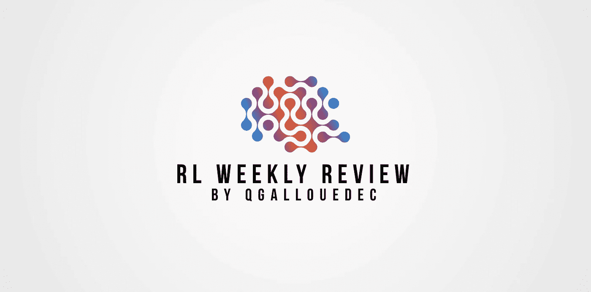
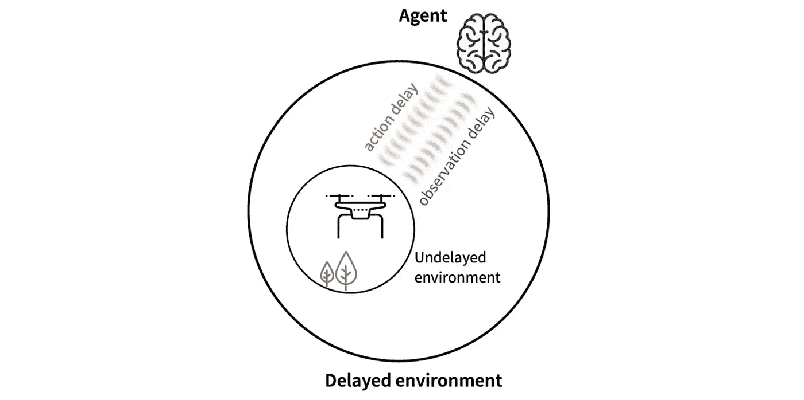
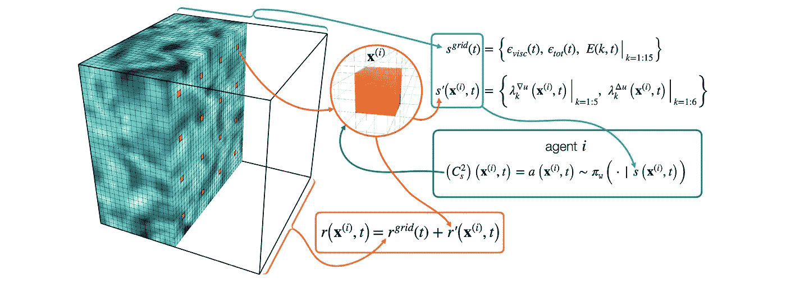
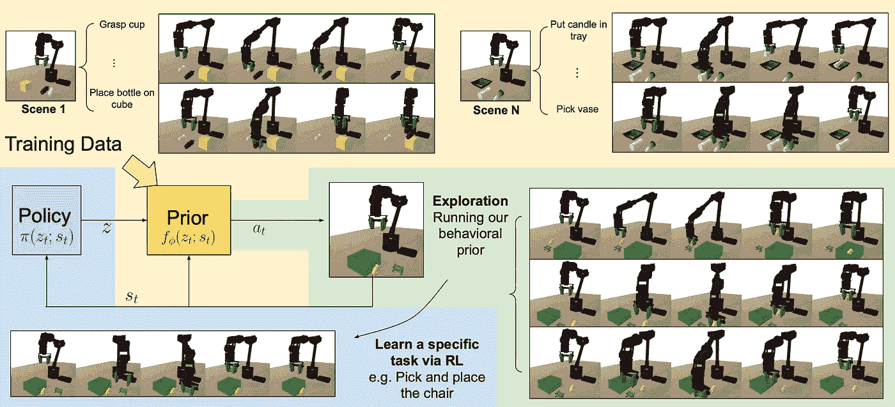

# 强化学习论文#8 的每周回顾

> 原文：<https://towardsdatascience.com/weekly-review-of-reinforcement-learning-papers-8-9d02a67b2e8a?source=collection_archive---------39----------------------->

## 每周一，我都会发表我研究领域的 4 篇论文。大家来讨论一下吧！

作者图片

[ [←上一次回顾](/weekly-review-of-reinforcement-learning-papers-7-e5c726c2fafd?sk=ab04089a8009d0b9c098a80b6dde42d2) ][ [下一次回顾→](https://qgallouedec.medium.com/weekly-review-of-reinforcement-learning-papers-9-d0f7eff9eae2?sk=cdaaf56e9d7bf2a52f9fdc8e6af0dc30)

# 论文 1:随机延迟的强化学习

拉姆斯泰特、布泰勒、贝尔特拉姆、帕尔和比纳斯(2020)。[具有随机延迟的强化学习](https://arxiv.org/abs/2010.02966)。 *arXiv 预印本 arXiv:2010.02966* 。

行动和回报之间的延迟是常见的，也是 RL 中的一个核心问题。即使在现实世界中:一个行为可以立即产生回报(例如，跌倒后立即出现的疼痛的负面回报)，也可以有很长的延迟(在学校表现良好可以让你获得一份远离财务问题的工作)。显然，整个中间范围都包括在内:一个动作可以产生任意远的时间上的回报)。相反，某一时刻的奖励不能系统地归因于单一的过去行为。事实上，这可能是所有先前行为的回报，每个行为都有或多或少的重要贡献。

在本文中，作者介绍了以下范式:延迟环境是在延迟通信动态中封装未延迟环境(一个动作立即产生相关的回报)的结果。

文章图:延迟环境是延迟通信动态中未延迟环境封装的结果。

动作延迟到达这个无延迟环境，而观察延迟到达代理。他们称之为随机延迟马尔可夫决策过程(RDMDP)。

接下来，作者介绍了一种来自软演员评论家(SAC)的算法，他们称之为延迟校正演员评论家(DCAC)，其中他们添加了来自重放缓冲区的轨迹的部分重采样。这允许他们估计多步偏离策略状态值。获得的结果似乎比用 SAC 获得的结果更好。优点主要是对延迟的鲁棒性，延迟可以同样大或为零。

# 论文 2:加强对少量学习的关注

洪军，方，李，张，陈，陈，李，李(2021)。[强化对少量学习及以后的注意](https://arxiv.org/abs/2104.04192)。 *arXiv 预印本 arXiv:2104.04192* 。

机器学习的主要限制之一是它是{一切}-密集型的:它是数据密集型、计算密集型、时间密集型和能量密集型的。因此，一个主要的挑战是改进学习算法，使它们不那么贪婪。这是少投学习的目标。它包括从非常少量的支持物中正确地识别未知类别的样本。

在这篇文章中，作者通过用强化学习算法训练注意机制，将 RL 和少数镜头学习联系起来。因此，代理被训练来适应性地定位特征空间中感兴趣的区域。奖励函数被构造成使得如果代理对所选数据有良好的预测，则代理被奖励。

结果表明，保留的表征越来越歧视少数镜头的学习场景。同样，分类似乎给出了令人满意的结果。因此，强化学习在这个领域很有帮助。

# 论文 3:通过多智能体强化学习自动化湍流模拟

Novati，g .，de Laroussilhe，H. L .，& Koumoutsakos，P. (2021 年)。[通过多智能体强化学习实现湍流建模自动化](https://www.nature.com/articles/s42256-020-00272-0)。*自然机器智能*， *3* (1)，87–96。

所有学过流体力学的人都知道，描述流体流动的唯一方法是模拟。随后的方程只能找到非常特殊情况下的解，对于航空或气象应用来说太简单了。最近，机器学习使得大大增加模拟的真实性成为可能。作者在这里提出了多智能体强化学习作为自动湍流模型发现的工具。进入更多的技术细节:作者使用大电流各向同性湍流模拟，并从直接数值模拟中以统计特性恢复的措施奖励代理。代理必须识别流程中的关键时空模式。目标是在亚网格尺度上估计未解决的物理问题。

来自[文章](https://www.nature.com/articles/s42256-020-00272-0)的图:代理(红色块)执行本地化操作。观测值包括由一小组局部和全局变量编码的流场状态

结果表明，这种方法是真正令人感兴趣的，并且似乎可以很好地推广到学习过程中从未遇到过的流动。学习模型给出了良好的结果，但是避免了对复杂的流体动力学方程进行积分。

# 论文 4: Parrot:强化学习的数据驱动行为先验

辛格，刘，周，于，莱茵哈特，n .，，莱文，S. (2020)。 [Parrot:用于强化学习的数据驱动行为先验](https://arxiv.org/abs/2011.10024)。 *arXiv 预印本 arXiv:2011.10024* 。

考虑一个机器人必须学会抓住物体的环境。它将首先探索环境，大部分时间甚至无法触及物体。这可能是学习的一个相当大的障碍，尤其是在回报很少的情况下。另外，这不是我们人类学习的方式。我们重复使用我们在其他领域学到的技能，并试图将它们用于新的任务:学习打网球可能很难，但我们可以重复使用我们已经学到的技能，如跑步，或握球拍；我们从来没有真正从零开始。

本文提出的问题是:我们如何为 RL 代理人提供这种有用的预培训？作者提出了所谓的行为先验，即从其他任务的先前学习中学习到的。这些先验可以被重用来快速学习新任务，同时保留代理尝试新行为的能力。

来自[文章](https://arxiv.org/abs/2011.10024)的图:训练数据集由来自广泛任务的接近最优的状态-动作轨迹组成。每项任务都可能涉及到与一组不同的对象进行交互。

结果令人信服。学习成绩比基线好得多。我不认为这是一个很大的惊喜，也相当令人放心。重用经验应该增加学习能力。本文的真正成果是找到了一种机制，允许在重用已学技能和探索新行为之间进行灵活的折衷。

我很高兴向你们展示我本周的阅读材料。请随时向我发送您的反馈。