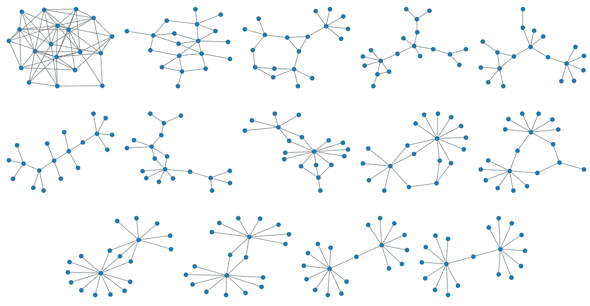

# 强化学习论文#9 的每周回顾

> 原文：<https://towardsdatascience.com/weekly-review-of-reinforcement-learning-papers-9-d0f7eff9eae2?source=collection_archive---------45----------------------->

## 每周一，我都会发表我研究领域的 4 篇论文。大家来讨论一下吧！

作者图片

[ [←上一次回顾](/weekly-review-of-reinforcement-learning-papers-8-9d02a67b2e8a?sk=a9f56ffd7721f0956f8319456eec4d5f) ][ [下一次回顾→](https://qgallouedec.medium.com/weekly-review-of-reinforcement-learning-papers-10-be5947715b26?sk=3d43102b9d5c0f070360473c478ce87e)

# 论文 1:连续动作、状态和时间中的价值迭代

Lutter M .，Mannor S .，Peters J .，Fox D .，Garg A. (2021)。[连续动作、状态和时间的价值迭代](https://arxiv.org/abs/2105.04682)。 *arXiv 预印本 arXiv:2105.04682* 。

强化学习方法首先是表格化的:人们必须从有限数量的动作中选择一个动作，这是从有限数量的可能观察值中得出的观察值。这些学习方法被连续扩展到连续观察空间，然后扩展到连续动作空间。**这里作者感兴趣的是连续时间**。这不是每 *t* 秒采取一次行动的问题，而是在连续的时间内进行一次真正的控制。

最明显的框架是机器人技术，这是他们选择的。他们提出了连续拟合值迭代(cFVI)，这是一种基于已知动态模型的允许连续控制的算法。

作者在仿真和真实世界中展示了该方法在几种控制环境中的有效性。一个经典的问题在于学习一个策略，并使用转移方法(例如，领域随机化)将其部署到现实世界中。非常有趣的是，尽管没有使用模拟真实迁移学习方法，但是用 cFVI 学习的策略在真实世界中比用离散时间控制学习的策略更健壮。看一看:

# 论文 2:人工智能经济学家:用人工智能驱动的税收政策改善平等和生产率

郑，s .，Trott，a .，斯里尼瓦萨，s .，n .，Gruesbeck，m .，，D. C .，& Socher，R. (2020)。[人工智能经济学家:用人工智能驱动的税收政策改善平等和生产率](https://arxiv.org/abs/2004.13332)。arXiv 预印本 arXiv:2004.13332 。

人工智能经济学家 T21 是一个强化学习框架，旨在模拟一个简化的世界，由几个经济主体组成。在这种环境下，每个代理人都可以与其他代理人互动，交换商品，聚集资源，建设以获得收入…他们也被征税，税收的钱被用于建设道路，学校…

目标是最大限度地提高生产率和代理之间的平等。选择税收政策是为了最大限度地实现这一双重目标。要在高收入和低收入的税收水平之间找到恰当的平衡，选择如何重新分配税收，将税收投资到哪里，等等，都需要谨慎的政策。

就目前而言，环境过于简单，无法得出政策建议。然而，人们可以想象一个更完整的模拟，其中代理人的个人行为，以及公司和社区的行为，更忠实于现实。还有必要引入一个与经济完全相关的不可或缺的目标:生态。

# 论文 3:强化学习中信心偏差的计算来源

勒布雷顿，m .，帕尔明特里，s .，加西亚，N. A. S. (2021 年 5 月 5 日)。[强化学习中置信度偏差的计算来源](https://osf.io/cy9e6/)。从 osf.io/cy9e6 取回

> 无知比知识更容易带来自信

牛顿说。他描述了一种后来被称为[邓宁-克鲁格效应](https://en.wikipedia.org/wiki/Dunning–Kruger_effect)的偏见。简单地解释一下:当一个不称职的人倾向于高估他或她的能力水平。在这一点上你认为这是典型的人类偏见。然而，这种偏见也存在于强化学习中。很少有文章试图解释这些偏见是如何以及为什么在强化学习环境中出现并持续存在的。作者将这种行为描述为反直觉的，我同意他们的观点。

那么，我们该如何解释呢？作者认为，这些信心偏差出现并保持在学习偏差的强化学习环境中。因此，他们在学习阶段和迁移阶段检查了不同的工具和信心判断。研究结果表明，强化学习包括依赖于上下文的学习和确认更新，是解释参与者对论文中使用的任务的选择的一个非常好的候选。第二，他们表明模型的过度自信偏差可以通过学习的信心值的过度加权来解释。因此，他们得出结论，基于所提出的强化学习模型，可以预测个体的认知偏差。

# 论文 4:通过神经网络构建组合学

瓦格纳(2021)。[通过神经网络构建组合学](https://arxiv.org/abs/2104.14516)。 *arXiv 预印本 arXiv:2104.14516* 。

对数学家来说，伟大的新工具是计算机。不仅进行大型计算，而且从几十年前开始，帮助他们进行论证。这叫计算机辅助校样。这些计算机辅助校样开始有了良好的记录。除了其他方面，它们让我们获得了一些革命性的结果，如四色定理的证明或开普勒猜想的证明。毫无疑问:机器学习算法是最强大的工具之一，不仅对数据科学家，对所有科学家，包括数学家都是如此。这里有一个证明。

在这篇文章中，作者再次展示了强化学习应用于计算机辅助证明的兴趣。他们的主题是图表。图形是一个活跃的研究课题，数学家们经常提出问题或猜想。一个猜想只有被证明才能成为定理。事实证明，有些猜想是错误的。要说明一个猜想是假的，需要提供一个反例。因此，作者有了使用强化学习来寻找使一些猜想无效的图的反例的想法。被驳倒的猜想有:奥奇切-汉森猜想、柯林斯猜想和阿伦森-格罗兰-格泽西克-基拉克-约翰斯顿猜想。我不会解释这些猜想，因为它们往往是非常数学化的，并没有带来太多的意义。重要的是要记住，这些反例是通过一种强化学习算法获得的:深度交叉熵方法。

对于每一个猜想，都会生成一个图，然后提交给环境。环境，根据猜想，会有回报。然后，代理将最大化这个奖励，并在某些情况下，找到一个图的反例来使猜想无效。

图自文章:关于图的邻近和距离特征值猜想的最佳构建图的演化。看来网络很快意识到稀疏图是最好的，最终出现了“平衡双星”结构。最后，给出了一个反例。

这篇文章不仅反驳了猜想，它还解决了关于图的其他问题，要了解更多，去探索这篇非常有趣的文章。

我很高兴向你们展示我本周的阅读材料。请随时向我发送您的反馈。