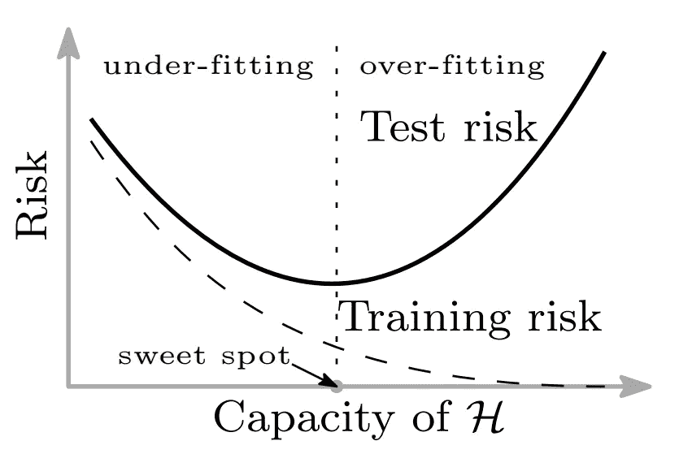
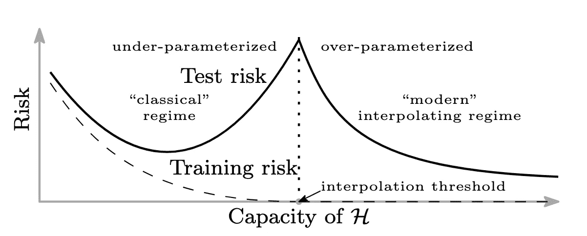
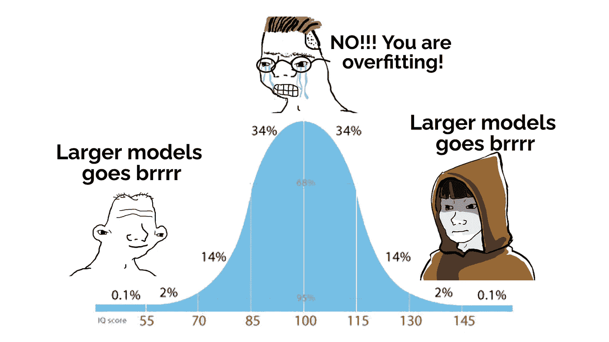
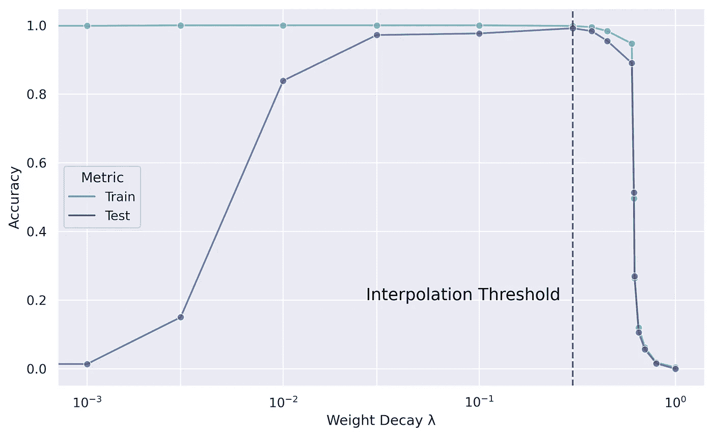
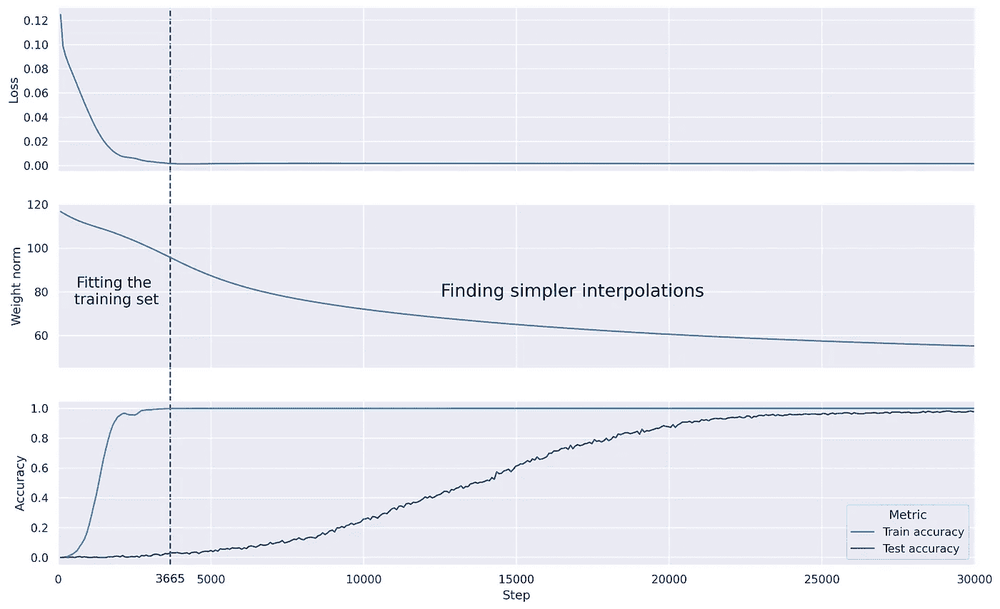
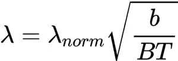
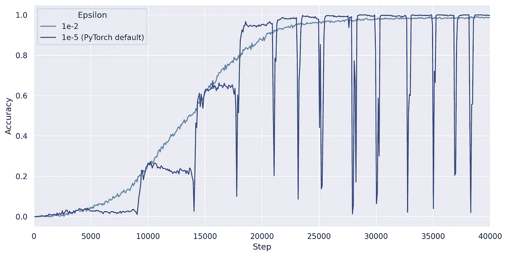
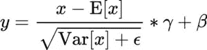

# 重量衰减及其特殊效应

> 原文：<https://towardsdatascience.com/weight-decay-and-its-peculiar-effects-66e0aee3e7b8?source=collection_archive---------3----------------------->

## 它是如何工作的，为什么工作，以及一些实用的技巧。

由[在](https://unsplash.com/@goodfreephoto_com?utm_source=medium&utm_medium=referral) [Unsplash](https://unsplash.com?utm_source=medium&utm_medium=referral) 上拍摄的好的免费照片。我们都喜欢光滑的东西，不是吗？

# 什么是体重衰减？

权重衰减，有时被称为 L2 归一化(尽管它们并不完全相同，[这里是解释差异的好博客文章](/weight-decay-l2-regularization-90a9e17713cd))，是正则化神经网络的一种常见方法。它有助于神经网络学习更平滑/更简单的函数，与尖锐、嘈杂的函数相比，这些函数在大多数情况下更容易概括。

有许多正则化，权重衰减是其中之一，它通过在每一步用一些小因子将权重推向零来完成工作。

在代码中，这实现为

重量衰减的基本实现

其中`weight_decay`是一个超参数，典型值范围从 1e-5 到 1。

实际上，您不必亲自执行此更新。例如，PyTorch 中的优化器有一个为您处理所有更新的`weight_decay`参数。

在 PyTorch 中使用权重衰减

# 体重衰减的直觉

但是体重衰减实际上对模型有什么帮助呢？什么情况下应该用？

首先，我们必须理解为什么有时模型不能一般化。

## 古典政体

在经典的机器学习理论中，我们认为存在“欠拟合”和“过拟合”区域。

传统体制中模型容量的训练和测试损失摘自[“协调现代机器学习实践和偏差-方差权衡”](https://arxiv.org/abs/1812.11118)

在欠拟合区域，模型“太简单”而不能捕捉数据的结构，因此既有**高训练误差**又有**高测试误差**。

在过拟合区域，模型具有足够的容量，它可以仅记忆训练数据集而不学习数据的底层结构，导致**低训练误差**但**高测试误差**。

无论是哪种情况，这个模型都不能一概而论。传统观点认为，最好的模型位于这两个区域之间。

权重衰减在这里作为一种方法**降低模型的容量**，使得过度拟合的模型不会过度拟合，并被推向最佳点。这也表明，如果模型最初在欠拟合区域中运行，重量衰减将具有负面影响。

## 现代政体

然而，最近的研究揭示了一种称为“深度双重下降”的现象，表明实际上存在第三个区域。虽然经典理论认为进一步增加模型复杂性会导致更高的测试误差，但经验证据表明，随着我们从“过拟合”区域进入“过参数化”区域，测试误差将会下降。

从[“现代机器学习实践与偏差-方差权衡的调和”](https://arxiv.org/abs/1812.11118)中截取的训练和测试损失与模型能力的全貌

经验证据表明，过拟合和过参数化区域之间的这种边界(称为“插值阈值”)发生在模型刚好具有足够的能力来实现**(接近)零训练损失**的时候。

在插值阈值处，只有一组参数可以对整个训练集进行插值。最有可能出现的情况是，这种特定的插值将会非常颠簸和尖锐，因为大多数数据集都包含一定程度的噪声。当模型被迫以勉强足够的能力适应所有噪声时，它没有额外的空间来使噪声训练点之外的函数平滑，因此泛化能力很差。

随着我们进一步增加模型容量，它不仅可以完美地命中训练数据点，还可以获得额外的容量来选择在空间之间平滑插值的函数，从而更好地进行概括。

*这就是体重下降的原因。*

在模型可以学习的所有可能的插值中，**我们希望使我们的模型偏向更平滑、更简单的插值**，这样它就能够进行推广。重量衰减正是这样做的。这就是体重下降如此强大的原因。

虽然不完全准确，但我认为下面的迷因很好地总结了我们目前的理解。

完全由我原创的迷因

# 玩具实验

为了测试上述特性，我训练了一个带有跳跃连接的简单前馈网络，以学习对二进制编码的数字执行加法。您可以在这里找到完整的源代码:

<https://github.com/andylolu2/ml-weight-decay>  

它在 2 位和 4 位加法上被训练，并且在 3 位加法上被测试以测量它的概括能力。以下是一个示例培训点:

示例培训输入和标签

我的模型由两个剩余块组成，每个块的宽度为 256，总共有 300K 个参数，这些参数几乎肯定会在“过参数化”区域内运行。我针对重量衰减因子的不同值对其进行了训练，下面是它与训练和测试精度的关系图:

在我的玩具实验中，精确度与重量衰减系数λ的关系图

我们可以看到，对于这个模型，λ的合适值是 0.1 左右。

在左手侧，当λ太低时，模型完全具有足够的能力来拟合训练数据集，但是不偏向于寻找更简单的插值，因此测试精度非常低。

在右侧，当λ太高时，该模型由于被迫使用非常小的权重而受到太多限制，以至于它的表达能力不足以适应训练数据。因此，训练和测试精度都很低。

根据我们上面的直觉，我们期望在插值阈值处看到测试精度的下降——但是我们没有。为什么？

我的最佳猜测是因为我们的数据集是完全无噪声的，所以插值阈值处的特定权重集不会出错，最终会很好地进行概化。

为了进一步说明权重衰减在帮助模型概化方面的重要性，下面是λ = 0.1 的模型的训练曲线:

在我的玩具实验中，λ = 0.1 的训练曲线

在前 3665 个步骤中，该模型能够达到 100%的准确率，并且几乎没有训练损失。但是测试精度还是很低。

在接下来的 25K 步中，它继续最小化权重范数(模型权重的平方和),同时保持完美的训练精度。这对应于为训练数据找到更简单的插值，并且我们可以清楚地看到这与测试准确度的增加之间的相关性。

更简单的插值=利润！

# 选择正确的价值

好的，所以体重下降是非常有用的。现在，我如何选择正确的λ值呢？

一般来说，挑选体重衰减值没有金科玉律。一些尝试和错误是不可避免的。然而，有一些规则你可以遵循。提出 AdamW 优化器的研究人员提出了以下规则:

[“解耦权重衰减正则化”](https://arxiv.org/abs/1711.05101)中提出的归一化权重衰减因子公式

其中 *b* 批量， *B* 为训练点总数， *T* 为总历元数。现在要调整的新超参数是 *λ_norm* 。

所以他们只是把一个超参数换成了另一个超参数…嗯…这个怎么有用？？

这很有帮助，因为将 *b* 、 *B* 和 *T* 的选择从合适的权重衰减值中分离出来，因此更容易调整超参数。

但是，您仍然需要搜索 *λ_norm* 的好值。作者发现 0.025 到 0.05 范围内的 *λ_norm* 对于他们训练的图像分类网络来说是最佳的。也许这可以作为一个有用的起点。

# 批处理规范化的问题

如今，我们几乎总是将批量范数层放入我们的神经网络，因为它大大加快了训练速度。然而，当我运行我的实验时，当我使用具有权重衰减的批范数层时，我经常看到这种周期性波动的奇怪行为。

在我的玩具实验中，使用批量标准训练时出现了奇怪的周期波动，重量随默认值衰减

这肯定不是我第一次看到这种行为。似乎当模型即将收敛时，这些波动就开始出现了。那么是什么造成的呢？

我在谷歌上寻找答案，看到了这篇文章:

<https://arxiv.org/abs/2106.15739>  

总之，这与批处理规范层的工作方式有关。

受 [PyTorch Doc](https://pytorch.org/docs/stable/generated/torch.nn.BatchNorm1d.html?highlight=batch%20norm#torch.nn.BatchNorm1d) 启发的批量定额层方程

上面显示了 batch norm 如何计算其输出的公式。这里， *x* 是一个尺寸为 *(batch_size，1)* 的特征。重要的是，它将这些值除以 *x* 的方差与某个小值εϵ.之和的平方根

当我们使用权重衰减时，一些权重逐渐变为零。随着权重趋近于零，无论从上一层得到什么输入， *x* 的值也将趋近于零(或恒定值)。

结果，批中的 Var[ *x* ]变得很小，以至于当我们将它传递给批范数层时，它将其除以一个接近于零的值，导致最终输出放大。这导致了巨大的波动，如下图所示。

爆炸后，由于该步骤的巨大梯度，权重更新为某个大值，因此方差再次变高。重量会再次开始衰减，这个过程会不断重复，形成周期性的模式。

从实用的角度来看，为了避免这种不稳定性，我发现简单地将 epsilon 的值增加到更大的值(比如`1e-2`而不是 PyTorch 默认的`1e-5`)效果惊人地好。

又一个有用的东西放在你的脑后。

# 摘要

权重衰减是一种正则化方法，通过学习更平滑的函数使模型更好地泛化。在经典(欠参数化)状态下，它有助于限制模型过拟合，而在过参数化状态下，它有助于引导模型朝向更简单的插值。实际上，有一个最佳的重量衰减值范围。

希望你觉得这个博客有用！

# 密码

<https://github.com/andylolu2/ml-weight-decay>  

# 参考

1.  普里图姆·纳基兰、加尔·卡普伦、亚米尼·班萨尔、特里斯坦·杨、波阿斯·巴拉克、伊利亚·苏茨基弗。 [*深度双下降:更大的模型和更多的数据伤害*](https://arxiv.org/abs/1912.02292) 。2019.arXiv:1912.02292
2.  米哈伊尔·贝尔金，丹尼尔·许，，苏米克·曼达尔。 [*调和现代机器学习实践和偏差-方差权衡*](https://arxiv.org/abs/1812.11118) 。2019.arVix:1812.11118
3.  叶卡捷琳娜·洛巴切娃、马克西姆·科德良、娜杰日达·奇尔科娃、安德烈·马林宁、德米特里·维特罗夫。 [*对神经网络的周期性行为进行批量归一化和权值衰减训练*](https://arxiv.org/abs/2106.15739) 。2021.arVix:2106.15739
4.  伊利亚·洛希洛夫，弗兰克·哈特。 [*解耦权重衰减正则化*](https://arxiv.org/abs/1711.05101) 。2019.arVix:1711.05101