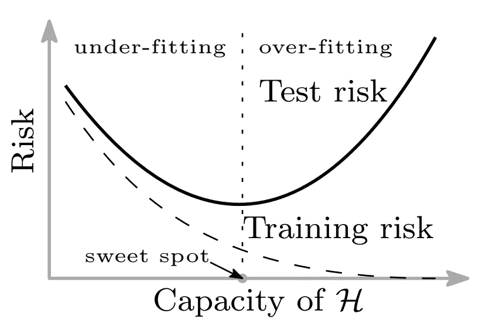
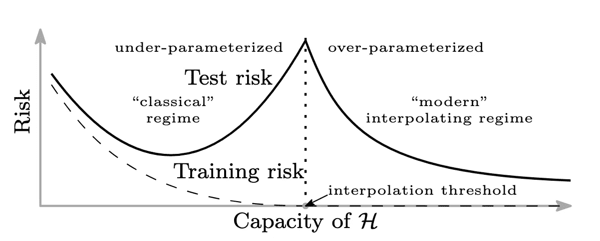
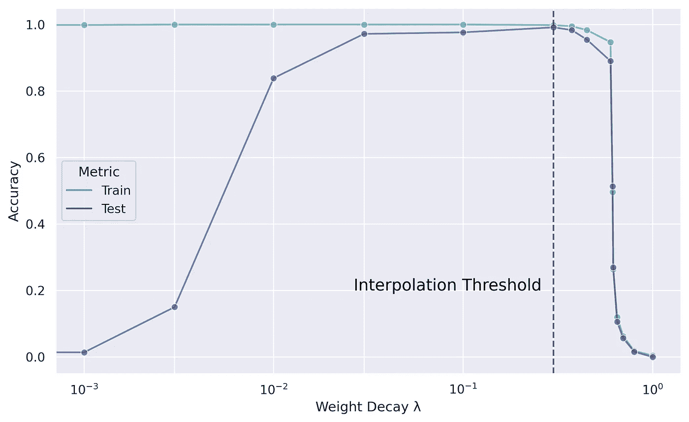
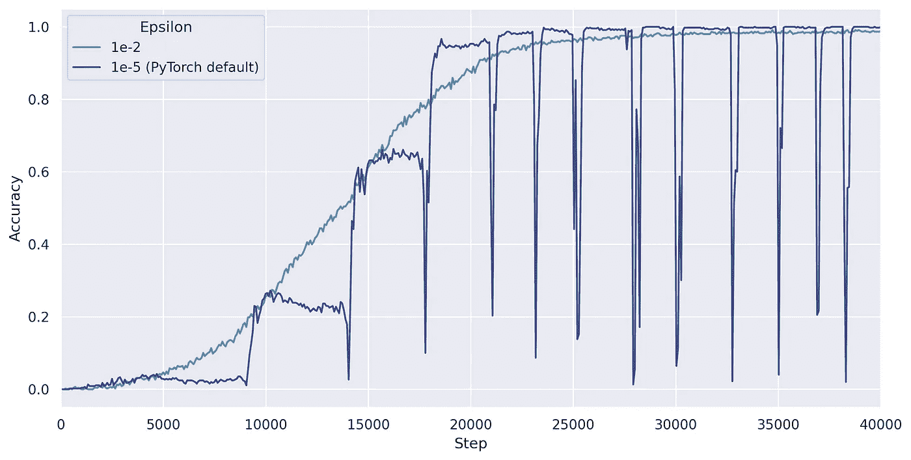

# 重量衰减及其特殊效应

> 原文：<https://towardsdatascience.com/weight-decay-and-its-peculiar-effects-66e0aee3e7b8?source=collection_archive---------3----------------------->

## 它是如何工作的，为什么工作，以及一些实用的技巧。

由[在](https://unsplash.com/@goodfreephoto_com?utm_source=medium&utm_medium=referral) [Unsplash](https://unsplash.com?utm_source=medium&utm_medium=referral) 上拍摄的好的免费照片。我们都喜欢光滑的东西，不是吗？

# 什么是体重衰减？

权重衰减，有时被称为 L2 归一化(尽管它们并不完全相同，[这里是解释差异的好博客文章](/weight-decay-l2-regularization-90a9e17713cd))，是正则化神经网络的一种常见方法。它有助于神经网络学习更平滑/更简单的函数，与尖锐、嘈杂的函数相比，这些函数在大多数情况下更容易概括。

有许多正则化，权重衰减是其中之一，它通过在每一步用一些小因子将权重推向零来完成工作。

在代码中，这实现为

重量衰减的基本实现

其中`weight_decay`是一个超参数，典型值范围从 1e-5 到 1。

实际上，您不必亲自执行此更新。例如，PyTorch 中的优化器有一个为您处理所有更新的`weight_decay`参数。

在 PyTorch 中使用权重衰减

# 体重衰减的直觉

但是体重衰减实际上对模型有什么帮助呢？什么情况下应该用？

首先，我们必须理解为什么有时模型不能一般化。

## 古典政体

在经典的机器学习理论中，我们认为存在“欠拟合”和“过拟合”区域。

传统体制中模型容量的训练和测试损失摘自[“协调现代机器学习实践和偏差-方差权衡”](https://arxiv.org/abs/1812.11118)

在欠拟合区域，模型“太简单”而不能捕捉数据的结构，因此既有**高训练误差**又有**高测试误差**。

在过拟合区域，模型具有足够的容量，它可以仅记忆训练数据集而不学习数据的底层结构，导致**低训练误差**但**高测试误差**。

无论是哪种情况，这个模型都不能一概而论。传统观点认为，最好的模型位于这两个区域之间。

权重衰减在这里作为一种方法**降低模型的容量**，使得过度拟合的模型不会过度拟合，并被推向最佳点。这也表明，如果模型最初在欠拟合区域中运行，重量衰减将具有负面影响。

## 现代政体

然而，最近的研究揭示了一种称为“深度双重下降”的现象，表明实际上存在第三个区域。虽然经典理论认为进一步增加模型复杂性会导致更高的测试误差，但经验证据表明，随着我们从“过拟合”区域进入“过参数化”区域，测试误差将会下降。

从[“现代机器学习实践与偏差-方差权衡的调和”](https://arxiv.org/abs/1812.11118)中截取的训练和测试损失与模型能力的全貌

经验证据表明，过拟合和过参数化区域之间的这种边界(称为“插值阈值”)发生在模型刚好具有足够的能力来实现**(接近)零训练损失**的时候。

在插值阈值处，只有一组参数可以对整个训练集进行插值。最有可能出现的情况是，这种特定的插值将会非常颠簸和尖锐，因为大多数数据集都包含一定程度的噪声。当模型被迫以勉强足够的能力适应所有噪声时，它没有额外的空间来使噪声训练点之外的函数平滑，因此泛化能力很差。

随着我们进一步增加模型容量，它不仅可以完美地命中训练数据点，还可以获得额外的容量来选择在空间之间平滑插值的函数，从而更好地进行概括。

*这就是体重下降的原因。*

在模型可以学习的所有可能的插值中，**我们希望使我们的模型偏向更平滑、更简单的插值**，这样它就能够进行推广。重量衰减正是这样做的。这就是体重下降如此强大的原因。

虽然不完全准确，但我认为下面的迷因很好地总结了我们目前的理解。

完全由我原创的迷因

# 玩具实验

为了测试上述特性，我训练了一个带有跳跃连接的简单前馈网络，以学习对二进制编码的数字执行加法。您可以在这里找到完整的源代码:

 [## GitHub-andylolo 2/ml-重量衰减

### 了解体重衰减如何帮助模型进行归纳的知识库。你可以在 Medium 上阅读相关博客…

github.com](https://github.com/andylolu2/ml-weight-decay) 

它在 2 位和 4 位加法上被训练，并且在 3 位加法上被测试以测量它的概括能力。以下是一个示例培训点:

示例培训输入和标签

我的模型由两个剩余块组成，每个块的宽度为 256，总共有 300K 个参数，这些参数几乎肯定会在“过参数化”区域内运行。我针对重量衰减因子的不同值对其进行了训练，下面是它与训练和测试精度的关系图:

在我的玩具实验中，精确度与重量衰减系数λ的关系图

我们可以看到，对于这个模型，λ的合适值是 0.1 左右。

在左手侧，当λ太低时，模型完全具有足够的能力来拟合训练数据集，但是不偏向于寻找更简单的插值，因此测试精度非常低。

在右侧，当λ太高时，该模型由于被迫使用非常小的权重而受到太多限制，以至于它的表达能力不足以适应训练数据。因此，训练和测试精度都很低。

根据我们上面的直觉，我们期望在插值阈值处看到测试精度的下降——但是我们没有。为什么？

我的最佳猜测是因为我们的数据集是完全无噪声的，所以插值阈值处的特定权重集不会出错，最终会很好地进行概化。

为了进一步说明权重衰减在帮助模型概化方面的重要性，下面是λ = 0.1 的模型的训练曲线:

在我的玩具实验中，λ = 0.1 的训练曲线

在前 3665 个步骤中，该模型能够达到 100%的准确率，并且几乎没有训练损失。但是测试精度还是很低。

在接下来的 25K 步中，它继续最小化权重范数(模型权重的平方和),同时保持完美的训练精度。这对应于为训练数据找到更简单的插值，并且我们可以清楚地看到这与测试准确度的增加之间的相关性。

更简单的插值=利润！

# 选择正确的价值

好的，所以体重下降是非常有用的。现在，我如何选择正确的λ值呢？

一般来说，挑选体重衰减值没有金科玉律。一些尝试和错误是不可避免的。然而，有一些规则你可以遵循。提出 AdamW 优化器的研究人员提出了以下规则:

[“解耦权重衰减正则化”](https://arxiv.org/abs/1711.05101)中提出的归一化权重衰减因子公式

其中 *b* 批量， *B* 为训练点总数， *T* 为总历元数。现在要调整的新超参数是 *λ_norm* 。

所以他们只是把一个超参数换成了另一个超参数…嗯…这个怎么有用？？

这很有帮助，因为将 *b* 、 *B* 和 *T* 的选择从合适的权重衰减值中分离出来，因此更容易调整超参数。

但是，您仍然需要搜索 *λ_norm* 的好值。作者发现 0.025 到 0.05 范围内的 *λ_norm* 对于他们训练的图像分类网络来说是最佳的。也许这可以作为一个有用的起点。

# 批处理规范化的问题

如今，我们几乎总是将批量范数层放入我们的神经网络，因为它大大加快了训练速度。然而，当我运行我的实验时，当我使用具有权重衰减的批范数层时，我经常看到这种周期性波动的奇怪行为。

在我的玩具实验中，使用批量标准训练时出现了奇怪的周期波动，重量随默认值衰减

这肯定不是我第一次看到这种行为。似乎当模型即将收敛时，这些波动就开始出现了。那么是什么造成的呢？

我在谷歌上寻找答案，看到了这篇文章:

 [## 具有批量归一化和权重衰减的神经网络训练的周期行为

### 近年来，使用批量归一化和权重衰减来训练神经网络已经成为一种常见的做法。在…

arxiv.org](https://arxiv.org/abs/2106.15739) 

总之，这与批处理规范层的工作方式有关。

受 [PyTorch Doc](https://pytorch.org/docs/stable/generated/torch.nn.BatchNorm1d.html?highlight=batch%20norm#torch.nn.BatchNorm1d) 启发的批量定额层方程

上面显示了 batch norm 如何计算其输出的公式。这里， *x* 是一个尺寸为 *(batch_size，1)* 的特征。重要的是，它将这些值除以 *x* 的方差与某个小值εϵ.之和的平方根

当我们使用权重衰减时，一些权重逐渐变为零。随着权重趋近于零，无论从上一层得到什么输入， *x* 的值也将趋近于零(或恒定值)。

结果，批中的 Var[ *x* ]变得很小，以至于当我们将它传递给批范数层时，它将其除以一个接近于零的值，导致最终输出放大。这导致了巨大的波动，如下图所示。

爆炸后，由于该步骤的巨大梯度，权重更新为某个大值，因此方差再次变高。重量会再次开始衰减，这个过程会不断重复，形成周期性的模式。

从实用的角度来看，为了避免这种不稳定性，我发现简单地将 epsilon 的值增加到更大的值(比如`1e-2`而不是 PyTorch 默认的`1e-5`)效果惊人地好。

又一个有用的东西放在你的脑后。

# 摘要

权重衰减是一种正则化方法，通过学习更平滑的函数使模型更好地泛化。在经典(欠参数化)状态下，它有助于限制模型过拟合，而在过参数化状态下，它有助于引导模型朝向更简单的插值。实际上，有一个最佳的重量衰减值范围。

希望你觉得这个博客有用！

# 密码

 [## GitHub-andylolo 2/ml-重量衰减

### 了解体重衰减如何帮助模型进行归纳的知识库。你可以在 Medium 上阅读相关博客…

github.com](https://github.com/andylolu2/ml-weight-decay) 

# 参考

1.  普里图姆·纳基兰、加尔·卡普伦、亚米尼·班萨尔、特里斯坦·杨、波阿斯·巴拉克、伊利亚·苏茨基弗。 [*深度双下降:更大的模型和更多的数据伤害*](https://arxiv.org/abs/1912.02292) 。2019.arXiv:1912.02292
2.  米哈伊尔·贝尔金，丹尼尔·许，，苏米克·曼达尔。 [*调和现代机器学习实践和偏差-方差权衡*](https://arxiv.org/abs/1812.11118) 。2019.arVix:1812.11118
3.  叶卡捷琳娜·洛巴切娃、马克西姆·科德良、娜杰日达·奇尔科娃、安德烈·马林宁、德米特里·维特罗夫。 [*对神经网络的周期性行为进行批量归一化和权值衰减训练*](https://arxiv.org/abs/2106.15739) 。2021.arVix:2106.15739
4.  伊利亚·洛希洛夫，弗兰克·哈特。 [*解耦权重衰减正则化*](https://arxiv.org/abs/1711.05101) 。2019.arVix:1711.05101