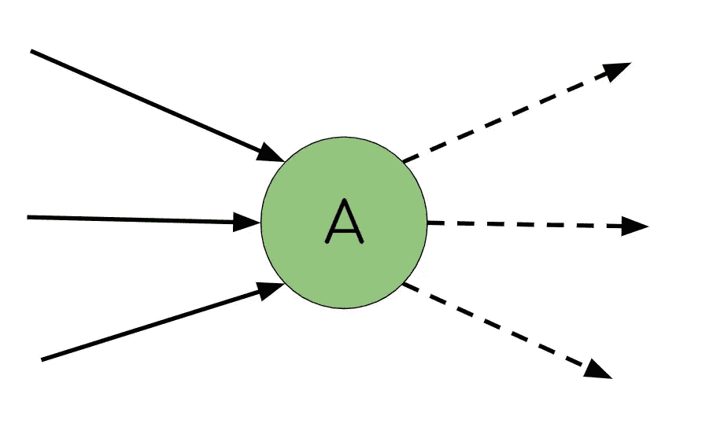
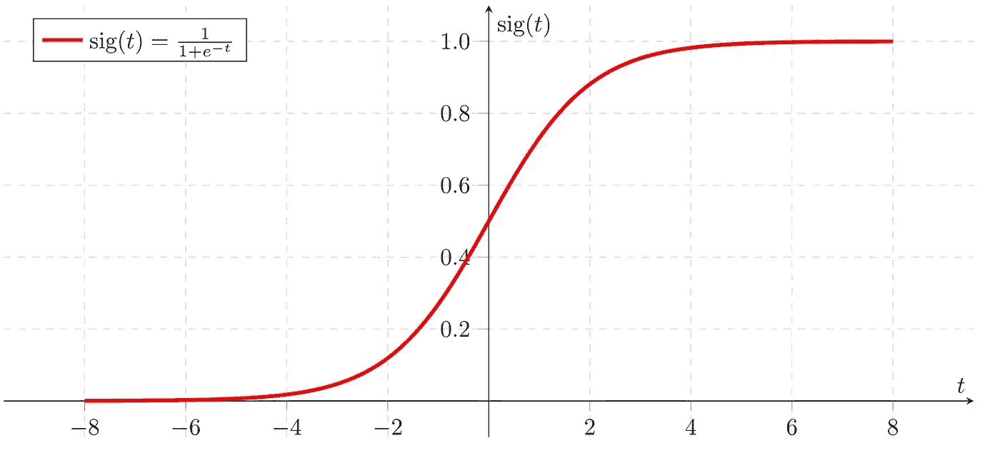
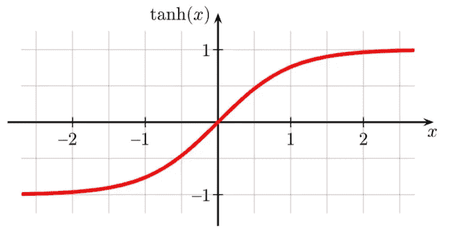
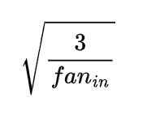

# 深度学习中的权重初始化和激活函数

> 原文：<https://towardsdatascience.com/weight-initialization-and-activation-functions-in-deep-learning-50aac05c3533?source=collection_archive---------16----------------------->

## 显著影响模型性能的微小变化

莱纳斯·尼隆德在 [Unsplash](https://unsplash.com?utm_source=medium&utm_medium=referral) 上拍摄的照片

D 开发深度学习模型需要大量的微调。本文讨论并比较了不同的激活函数和权重初始化器对模型性能的影响。

本文将涵盖三个激活函数: **sigmoid** ，双曲线正切( **tanh** ，整流线性单元( **ReLU** )。

然后用三个初始化器测试这些激活函数:**Glorot**(Xavier)**He**， **LeCun** 。

## 这篇文章分成几个部分:

1.  激活功能和重量初始化
2.  激活功能
3.  重量初始化功能
4.  砝码初始化和激活实验

这是关于调整深度学习模型系列的第二篇文章。随着新文章的产生，我会添加下面的链接。

 [## 深度学习模型的学习率

### 如何通过优化让好的模型变得伟大

towardsdatascience.com](/learning-rates-for-deep-learning-models-e500efe09f2e) 

# 激活功能和初始化

有效的深度学习模型需要大量微妙的调整。然而，小的变化可能会波及到您的模型，并显著改变性能，因为它们是健壮和灵活的。

激活功能是深度学习课程介绍中介绍的那些方面之一。有许多选择，但是没有给出每种方法的太多细节。

尽管提供的细节有限，但它们似乎比本文的另一个主题初始化更容易理解。

你可能会想，“我将随机初始化我的权重，使之变小”，这样你就能产生好的模型。但是这篇文章和围绕它的一系列文章都不是关于好的。我们想要优秀的模特。

相反，我们可以通过仔细选择激活函数和初始化器来为我们的模型挤出更多的性能。

# 激活功能

激活函数在深度学习模型中起着重要的作用。但很多人可能体会不到其中的微妙。

激活功能(作者图片)

在核心处，激活函数允许非线性关系的建模。

很简单，但极其重要。没有这些激活函数在本质上更复杂的线性回归中将每一层的输出传递给下一层。停下来想一想这一点。

如果你以前使用过逻辑回归模型，你可能已经知道这种情况。逻辑函数或 sigmoid 函数将线性回归模型的线性输出转换为分类所需的非线性输出。

没有 sigmoid 函数，逻辑回归只是线性回归。

因此，虽然激活函数可以将非线性关系引入到模型中，但是应该使用什么函数呢？在谷歌上快速搜索可用的功能，会给你提供一长串的功能。例如，swish 或指数线性单位函数对许多人来说没有多大意义。但是这些功能中的每一个在深度学习中都有它的位置。

尽管可用的功能多种多样，但它们有一些共同点。也就是说，它们根据基于导数的优化方法更新模型权重。

> **注意:**不是所有的优化方法都需要梯度，但这是另一篇文章的主题。

在这篇文章中，我将介绍三个更常见的激活函数。

1.  **乙状结肠**
2.  双曲正切 **(Tanh)**
3.  整流线性单元 **(ReLU)**

## 乙状结肠的

对许多人来说，sigmoid 函数是他们遇到的第一个激活函数。此函数将连续输出转换为 0 到 1 范围内的输出，用于逻辑回归。

sigmoid 还具有简单易用的梯度，非常适合梯度下降优化。

Sigmoid 函数

## 双曲正切值

类似于 sigmoid 函数，但有明显的区别。输出的范围是-1 到 1。这种看似很小的差异允许深度学习模型的有趣的新架构。

长期短记忆(LSTM)模型在每个单元中大量使用双曲正切函数。这些 LSTM 单元是理解不同输出如何开发鲁棒架构的绝佳方式。

关于这些激活函数的输出范围如何影响的更多细节可以在我下面的文章中找到。

 [## 如何对时间序列数据使用深度学习

### 了解时间序列深度学习的可用选项

towardsdatascience.com](/how-to-use-deep-learning-for-time-series-data-f641b1b41a96) 

Tanh 函数

## 整流线性单元

构建越来越大的模型时出现的一个问题是渐变消失的问题。误差必须传播通过的层越多，来自反向传播的更新就受到抑制。

这种行为的结果是，在每次训练迭代期间，许多权重仅少量更新。ReLu 激活用于缓解这个问题。

与之前的激活功能相比，ReLu 激活的输出范围为[0，inf。从受限范围的输出到不受限制的正输出的这种变化允许误差更有效地通过模型传播回来，从而改进了更新权重的过程。

ReLU 函数

# 重量初始化功能

权重初始化是深度学习中经常被忽视的一个方面。一般来说，你可以摆脱随机初始化。或者，您的 TensorFlow 模型的默认初始化方法工作正常(不是说您知道默认值是什么)。

然而，正如您将在实验中看到的，权重初始化的选择可以与激活函数配对，以产生显著的性能增益。

下面是本文中涉及的三种初始化方法(不包括随机方法)。

1.  格洛特(泽维尔)
2.  **何**
3.  **乐村**

虽然还有很多初始化器，但这三个是很好的起点，尤其是如果您以前从未尝试过初始化的话。

这些方法应该补充激活功能以观察最大益处。

## 均匀分布与正态分布

对于那些使用 TensorFlow(本文中的深度学习包)的人，您会注意到初始化器有两个选项，uniform 和 normal。

这些分布之间的差异通常很小。不幸的是，对于哪种发行版表现最好，还没有达成共识。

这些差异也可能是由于您使用的数据造成的。
无论如何，对于本文中的实验，使用了均匀分布。

## 初始化方法

这些初始化方法试图将深度学习模型的初始条件置于用于训练的理想状态。

显示了以下方法的分布函数。但是，请记住，正态分布有一个稍微不同的公式。

## 格洛罗特

Glorot(或 Xavier)初始化试图缓解渐变消失的问题。这个解决方案是通过将初始权重设置为一个分布来产生的，其中该分布的方差取决于输入和输出层的数量。

Glorot 函数是为 sigmoid 函数设计的。输入单元的数量被定义为“扇入”，而输出单元的数量被定义为“扇出”下面的完整公式代表了均匀分布的极限，其中值是从范围 **[-limit，limit]** 中均匀提取的

格洛特均匀分布的极限公式(图片由作者提供)

## 男性

Glorot 对于 ReLu 来说不是最佳的。因此引入了 he 初始化。

这种方法只考虑输入层的变化。其中下面的公式也是均匀分布的极限。从范围**[-极限，极限】**中选择重量

均匀分布的极限公式(图片由作者提供)

## 乐村

类似于 he 初始化，但是该方法的规模减小了。

虽然此函数与其他权重初始化方法非常相似，但细微的变化会在模型的完整训练中产生不同的结果。下面再次给出均匀分布极限的公式，以形成范围 **[-limit，limit]**

勒村均匀分布的极限公式(图片由作者提供)

请注意，这些方法彼此非常相似。因此，即使是对深度学习模型的微小改变，如随机种子，也可能改变每个初始化器的性能。

这些权重初始化方法旨在根据它们各自的输入和输出来表示权重的方差。

# 砝码初始化和激活实验

本文的剩余部分给出了一个简单的实验，您可以从提供的代码中重新创建这个实验。目的是比较具有不同激活函数的不同权重初始化方法。

这些实验决不是结论性的。相反，它们说明了不同权重初始值设定项之间的显著差异。

观察这些结果时，请关注模型的中间性能。虽然最好的结果需要更多的训练，但是如果您有计算限制，那么继续训练您的模型可能是不可行的。

## 实验设置

对于这个例子，我在公共领域许可下使用 diamonds 数据集。这个数据集由分类变量和数字变量的组合组成。对于本文，我已经删除了分类特性。

 [## 钻石

### 通过切割、颜色、净度、价格和其他属性来分析钻石

www.kaggle.com](https://www.kaggle.com/shivam2503/diamonds) 

该数据集提供了许多要素的大量数据。因此，展示不同的激活功能和不同的初始化功能应该足够复杂。

数据加载和缩放(由作者编写代码)

## 生成模型

使用的模型是在 TensorFlow 中设计的简单多层神经网络。请注意，这种结构非常适合初始化器，因为输入和输出层的大小相同——尤其是 Glorot，它是围绕相等的输入和输出大小设计的。

目标输出是连续的，损失设置为平均绝对误差。对于每个实验，激活被修改。最终模型有两个完全连接的层，每层有 50 个节点。

创建模型和参数初始化(由作者编写代码)

## 可视化结果

为了可视化实验的结果，我使用了库 Plotly。我过去广泛使用过这个包。复制文章中的情节的代码来自下面的代码。关于 Plotly 的细节可以在链接文章中找到。

 [## 使用 Plotly 和 Python 自动生成交互式报告

### 使用 Python 中的 Plotly 轻松生成交互式报告

towardsdatascience.com](/automated-interactive-reports-with-plotly-and-python-88dbe3aae5) 

只有验证损失显示在图中。这种选择纯粹是为了减少结果中的混乱。更有效的结果分析将包括训练和验证损失曲线，产生模型优化的完整可视化。

多个模型的图验证损失(作者代码)

## 激活和初始化方法的比较

为实验的每个激活函数和权重初始化方法生成新的模型。此外，还会跟踪培训历史，并显示培训中的验证损失。

学习率被设置得相对较低，以便揭示每个初始化器之间的细微差别。

完整的实验可以从下面的代码段运行。

激活函数和初始化实验(作者代码)

## 乙状结肠激活

使用 sigmoid 激活的权重初始化方法的比较(图片由作者提供)

## 双曲正切激活

权重初始化方法与 Tanh 激活方法的比较(作者提供图片)

## 整流线性单元激活

权重初始化方法与 ReLU 激活的比较(图由作者提供)

在这些实验中，学习率被故意设置得很低。基本原理是延长学习所需的时期数。然而，这突出了一些令人兴奋的结果。

首先是 sigmoid 函数的奇怪行为。没有额外的训练时期，这个实验的中间结果是最差的。最好的结果来自 tanh 实验，它似乎与实现的权重初始化器无关。

还提出了随机均匀分布。有趣的是，随机分布在 ReLU 激活中比其他初始化器表现得更好。虽然这个结果是惊人的，但最好的表现仍然比其他实验差。

停下来考虑结果与每个初始化器的预期用例的不一致。为每个激活函数设计的初始化器通常不是性能最好的。由此，我们可以得出两点。

*   模型的性能取决于权重初始化、使用的激活函数和训练持续时间。
*   性能之间的差异可能更多地取决于底层数据，而不是所实现的特定组合。

这些实验应该被认为是对激活函数和权重初始化器的各种组合的性能差异的介绍。关于更严格的细节，请参考下面的参考资料。

# 结论

在深度学习模型中选择激活函数和权重初始化方法是一项重要的任务。这些相同的变化通过模型波及到整体性能的惊人变化。

当选择一个激活函数时，停下来考虑这个选择如何与你正在使用的初始化方法配对。

这些小的设计决策加起来可以创建更强大、更健壮、更有效的深度学习模型。

如果你有兴趣阅读关于新颖的数据科学工具和理解机器学习算法的文章，可以考虑在 Medium 上关注我。我总是在我的文章中包含代码，您可以将其应用到您的工作中！

*如果你对我的写作感兴趣，想直接支持我，请通过以下链接订阅。这个链接确保我会收到你的会员费的一部分。*

 [## 通过我的推荐链接加入 Medium-Zachary Warnes

### 阅读扎卡里·沃恩斯(以及媒体上成千上万的其他作家)的每一个故事。您的会员费直接支持…

zjwarnes.medium.com](https://zjwarnes.medium.com/membership) 

# 参考

*   【https://arxiv.org/ftp/arxiv/papers/2102/2102.07004.pdf 
*   [https://eprint.iacr.org/2020/904.pdf](https://eprint.iacr.org/2020/904.pdf)