# 加权线性回归

> 原文：<https://towardsdatascience.com/weighted-linear-regression-2ef23b12a6d7?source=collection_archive---------1----------------------->

[杰森](https://unsplash.com/@jdent)在 [Unsplash](https://unsplash.com/photos/XytkIYWKmEo) 上的照片

线性回归是最简单和最著名的监督机器学习模型之一。在线性回归中，响应变量(因变量)被建模为特征(自变量)的线性函数。线性回归依赖于几个重要的假设，而这些假设在某些应用中是不能满足的。在本文中，我们研究线性回归的一个主要陷阱:异方差。

# 线性回归模型

我们从线性回归数学模型开始。假设有 *m* 个观测值和 *n* 个特征。线性回归模型表示为

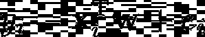

其中 *y* 为响应变量， **x** 为( *n* +1) × 1 特征向量， **w** 为( *n* +1) × 1 包含回归系数的向量， *e* 表示观测误差。注意，向量 **x** 的第一个元素是 1，表示拦截(或偏差):

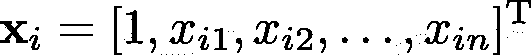

线性回归模型也可以矩阵形式写成

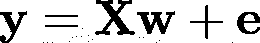

其中 **X** 为尺寸为 *m* × ( *n* +1)的特征矩阵， **y** 为 *m* × 1 的响应向量， **e** 为代表观测误差的 *m* × 1 向量。可以看出，线性回归的系数估计为

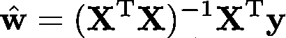

注意 **w** 的第一个元素代表拦截的估计值。

# 假设

线性回归基于几个重要的假设:

1.  **线性**:指因变量与自变量呈线性关系。
2.  **正态**:表示观测误差正态分布。
3.  **独立性**:指观测误差相互独立。
4.  **同方差**:表示观察误差不是响应变量的函数，并且其方差对于所有观察都是恒定的。
5.  **多重共线性低**:表示自变量之间相关性不高。

在许多有真实数据的情况下，很难满足所有这些假设。这并不一定意味着你不能使用线性回归。然而，如果这些假设中的任何一个不满足，则不能期望最佳性能，并且模型系数的推断可能不准确。在本文中，我们的重点是假设 4。

# **同方差**

线性回归假设 **e** 内的观测误差是独立同分布(即同分布)正态随机变量(假设 2、3、4)。这种情况在数学上可以表示为

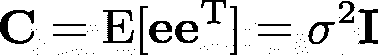

其中 **C** 为观测误差的协方差矩阵， **I** 为[单位矩阵](https://en.wikipedia.org/wiki/Identity_matrix)，E 代表[期望值](https://en.wikipedia.org/wiki/Expected_value)。换句话说， **e** 的协方差矩阵为

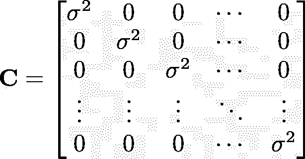

协方差矩阵的对角元素表示每个观测误差的方差，并且它们都是相同的，因为误差是同分布的。非对角元素表示两个观测误差之间的协方差，并且它们都为零，因为误差在统计上是独立的。这种情况称为同质性。

# 异方差

在某些应用中，不能保证同方差，而且观测误差实际上不是同分布的(尽管我们仍然假设它们是独立的)。在这种情况下，观测误差的协方差矩阵表示为

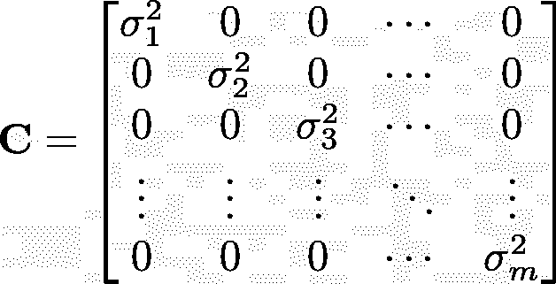

其中对角元素是不相同的，并且每个观察值都有其自己的方差。缺乏同方差对线性回归结果有几个影响。首先，模型的性能不再是最佳的。换句话说，该模型不会具有最低的均方误差(MSE)。第二，模型系数和标准误差将是不准确的，因此它们的推论和任何基于它们的假设检验将是无效的。

# 侦查

有许多方法可以检测出你正在处理的是异方差数据还是同方差数据。最简单的方法是绘制线性模型的残差与预测值(拟合值)的关系图，并寻找残差中的任何特定模式。

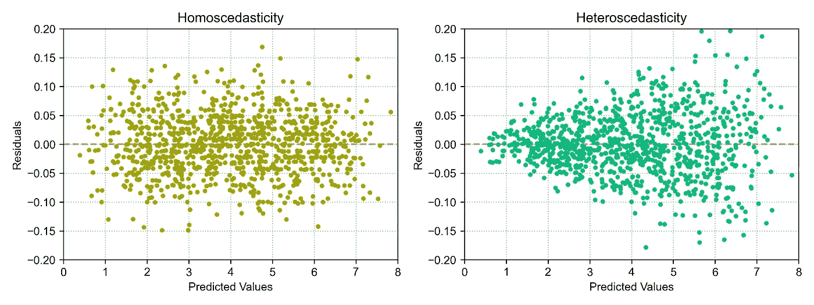

残差与预测值，左:同方差，右:异方差数据(图片由作者提供— [来源](https://gist.github.com/rvaghefi/b0ba172a93b253f40ab583133d976b60)

同方差数据的残差图没有显示特定的模式，值均匀地分布在水平轴周围。另一方面，异方差数据的残差图显示了不同预测值的残差变化的方差(沿水平轴的垂直分布)。

# 加权线性回归

加权线性回归是线性回归的推广，其中误差的协方差矩阵包含在模型中。因此，当我们处理异方差数据时，这可能是有益的。这里，我们使用最大似然估计(MLE)方法来导出加权线性回归解。MLE 是一种通过最大化模型的似然函数来估计未知参数的方法。线性回归模型中的响应变量 **y** 为多元正态随机变量。因此，MLE 可以推导为

由于对数函数是非递减的，我们可以取似然函数的对数。我们也去掉任何不依赖于 T2 w T3 的项

这相当于

通过扩展括号内的项并删除常数项

我们通过对上述项相对于 **w** 求导来估计 **w** ，并将其设置为零

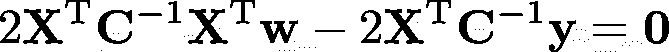

相对于 **w** 求解，我们得到加权线性回归的解

可以看到，加权线性回归的解与线性回归的解非常相似。唯一的区别是加权线性回归使用误差的协方差 **C** 来寻找回归系数。因为 **C** 是一个对角矩阵，它的逆矩阵简单地通过用它们的倒数替换对角元素来获得

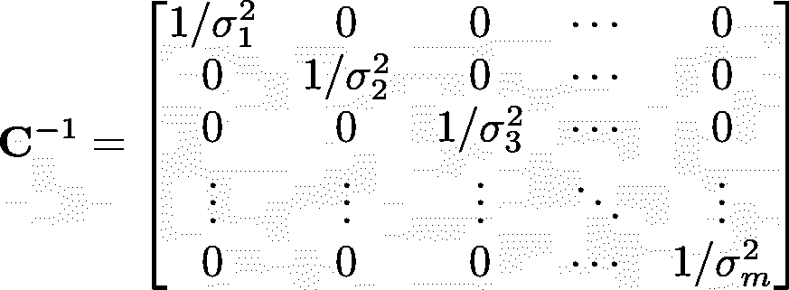

该表达式表明，加权线性回归根据方差对每个观测值使用不同的权重。如果观测值具有较大的误差方差，它对最终解的影响将较小(由于权重较低),反之亦然。注意，如果所有的观测值都具有相同的方差，则上述表达式将与线性回归的解相同。

# 异常稳健性

加权线性回归的另一个优点是它对异常值的鲁棒性。加权线性回归可以给异常值分配较小的权重，从而减少它们对系数估计的影响。异常值可以通过绘制[标准化残差](https://en.wikipedia.org/wiki/Studentized_residual)(也称为学生化残差)与预测值的关系图来检测:

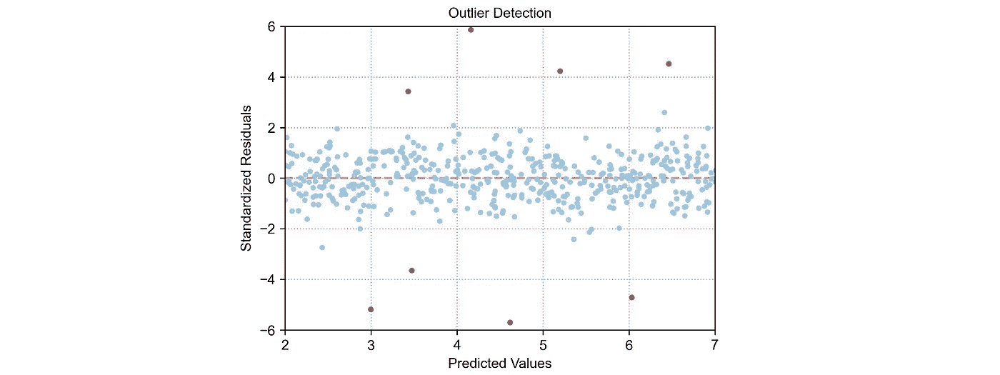

标准化残差与预测值对比以检测异常值(图片由作者提供— [来源](https://gist.github.com/rvaghefi/a19a564631d603dfc8cac65f4b881b3c)

任何绝对标准化残差大于 3 的观察值都被认为是异常值。

# 未知协方差

加权线性回归的主要缺点是需要观测误差的协方差矩阵来求解。在许多应用中，这样的信息在之前是不可用的。在这种情况下，可以估计协方差矩阵。有几种方法可以估计协方差矩阵。这里提供了一种方法:

*   不用协方差矩阵求解线性回归(或通过设置 **C** = **I** 求解加权线性回归，与线性回归相同)
*   计算残差
*   从残差中估计协方差
*   使用估计的协方差求解加权线性回归

# Python 示例

在本节中，我们提供了一个 Python 代码片段来运行异方差数据的加权线性回归，并将其与线性回归进行比较:

在这段代码中，我们生成了一组合成数据，其中观察误差的方差是特征的函数。线性回归模型的实际斜率和截距分别为 5 和 2。我们首先使用线性回归来寻找残差并估计协方差矩阵。然后，我们运行加权线性回归，找到系数

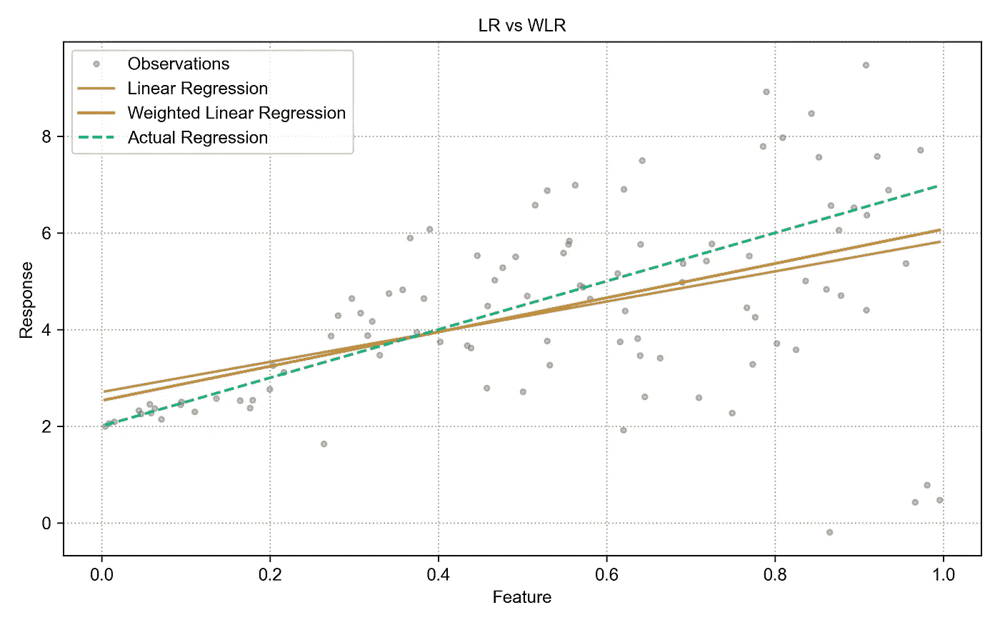

响应变量与特征变量(图片由作者提供)

上图显示，在存在异方差的情况下，加权线性回归为回归系数提供了更准确的估计。

# 结论

在本文中，我们提供了加权线性回归的简要概述。当观测误差不具有恒定方差且违反线性回归的同方差要求时，应使用加权线性回归。加权线性回归的主要缺点是它依赖于观测误差的协方差矩阵。

# 参考

[加权最小二乘&稳健回归](https://online.stat.psu.edu/stat501/lesson/13) (2021)，宾夕法尼亚州立大学统计系。

南 Chatterjee，A. S. Hadi，[示例回归分析，第 5 版](https://www.wiley.com/en-us/Regression+Analysis+by+Example%2C+5th+Edition-p-9781118456248) (2013)，John Wiley & Sons。

南统计处理基础，第一卷:估计理论(1993)。