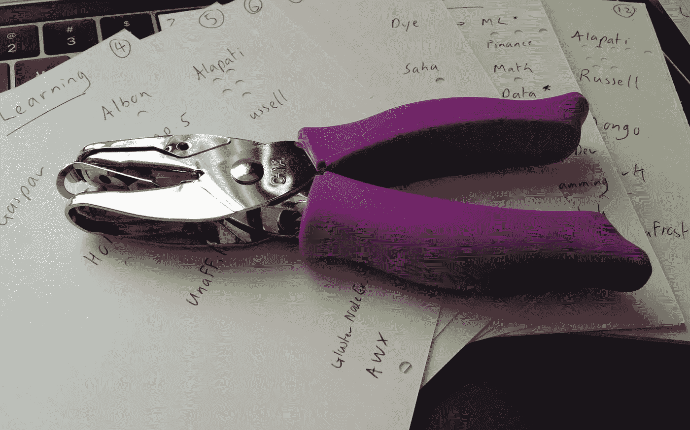

# 学习数据科学的怪异技巧

> 原文：<https://towardsdatascience.com/weird-trick-for-learning-data-science-9b14ce832bd0?source=collection_archive---------42----------------------->

## 卡片和打孔机是必不可少的，但你还需要一样东西

人造霜供图

数据科学和数据工程是怎么学的？

24 小时自学数据科学？

但是如果我在接下来的 24 小时内忘记了呢？

假人的数据科学？

嗯，我不是傻瓜，我不认为拼写正确。

数据科学食谱？

我不确定数据科学是否和制作威灵顿牛肉一模一样，但我不知道如何制作威灵顿牛肉，所以也许是这样的。

我可以看到这些简化的吸引力，但它们从来没有为我工作过，所以让我提供一个替代的简化，加上这个奇怪的技巧。

我的解决方案的第一部分需要大约一个小时。第二部分，这个奇怪的小把戏，花了 4 年时间，但是相信我，时间过得太快了，你会发誓只有 3 年半。

**第一部分——卡片**

首先，选择一组与你希望应用的数据科学和数据工程相关的相互关联的主题。这里有一组样本:

-线性代数

-统计

-机器学习

-数据(多种数据库类型)

-编程(Python 数据科学堆栈)

- DevOps (Kubernetes 等。)

在每个科目中，寻找一套书籍和课程——找到 10 个候选人，筛选出 4-6 个。

通过查看作者/讲师在 GitHub 上提供的任何配套资源，以及阅读评论，您通常应该能够形成对潜在学习资源的看法。

手里有一套学习资源(比方说六个科目的 40 种资源)，准备一叠 15 张空白卡片。在每张卡片上写下一个主题，以及你将用于该主题的 4 到 6 个资源，间隔开，以便在每个资源下有打孔的空间。

在一两张卡片上，写下“动态分配”——当这些卡片出现时，你可以做任何主题/资源。

接下来，考虑到你有足够的时间来完成这项工作，选择一个卡块时间——当它出现时你可以花在任何卡上的时间。我认为一小时是最少的，四小时是最多的。这不是关于完成一项任务需要多少时间，而是关于你有多少时间可以专注于一项工作。

对于每种资源，拿一张 5 x 6 的卡(这越来越贵了！)并写出章节号和标题。在每个你认为大致相当于你的卡块时间大小的地方画圈。因此，如果你认为你能在每个卡块时间内覆盖 10 页，那么一个 30 页的章节旁边会有三个圆圈。

现在让我们第一次浏览这叠 3x5 的卡片:

每当你坐下来“学习数据科学”时，你就会抓起那叠卡片，看看上面的内容。你从卡片上列出的四到六种资源中选择一种，并把自己投入到那种资源中去。您可以在整个卡阻塞时间使用相同的资源，或者中途切换到同一张卡上的另一个资源。

当卡块时间结束时，你拿起打孔机，在你自己使用的资源下打一个洞——每半个卡块时间打一个洞。

把卡片放在叠的底部。下次你坐下来“学习数据科学”时，你可以用叠上的任何一张卡片重复这个过程。

随着您在资源方面取得进展(例如，完成一章)，您可以拿起一叠 5x6 的资源卡，在您完成的章节/部分标题旁边的圆圈中打勾。进步！

**第二部分——一个奇怪的把戏**

在接下来的四年里，无论哪一个周期适合你的生活方式，无论你有多少时间，都要坚持完成这一堆卡片。可能有些时候你有或多或少的可用时间——没问题，你可以减少卡块时间的大小，或者调整你自己对每一轮需要多少日历时间的预期。

在这个系统中，你不能真的“落后”——如果你休息一段时间，在你的下一个机会，你拿起牌叠，把牌放在最上面。堆栈不在乎你错过几天或几周。

这样做，每四张一组，所以一旦你把全套卡片做了四次，就把它们钉在一起，放在一边。写下你的下一组卡片，根据前一组卡片的调整。添加额外的资源，删除那些你已经用尽或没有用的资源，调整顺序。

每几轮过后，自我测试一下，看看你是否有所进步。为此，我有两种首选方法。一个是在 StackExchange 这样的网站上回答问题。你可以用找到一个你能实际回答的重要问题所花的时间，以及写出你的答案(用代码)所花的时间来量化这一点。

第二种方法是从零开始创建一些小问题的解决方案。从零开始，你可以更容易地跟踪你的方法的复杂性，以及你的执行速度。

就是这样！

嗯，可能会有更多，但一旦你有了这个卡系统运行，它很容易补充，只要你不用完 3x5 的卡。