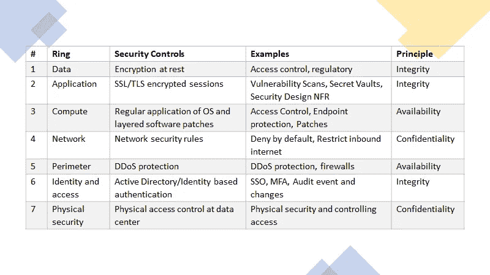

# 架构完善的框架—云的安全方面

> 原文：<https://towardsdatascience.com/well-architected-framework-security-aspects-of-the-cloud-1119417f7cb8?source=collection_archive---------80----------------------->

## 假设违规是显而易见的，并使用*零信任模型*克服安全挑战

# 介绍

在这个*关于云良好架构框架的第二个*帖子中，我将详细讨论云良好架构框架的 ***安全支柱*** 。我将详细阐述安全架构的*纵深防御*概念，以及公共提供商提供的工具和流程示例，以保护基础设施、应用程序和数据。我还将简要介绍安全的身份管理、网络安全和基础设施安全。

> 这一系列的帖子将涵盖云架构良好的框架，其他帖子的参考 URL 是:
> 【1】[架构良好的框架—云上的性能效率](/well-architect-framework-performance-efficiency-on-the-cloud-15cf87c10297)

照片由 [Henry Be](https://unsplash.com/@henry_be?utm_source=medium&utm_medium=referral) 在 [Unsplash](https://unsplash.com?utm_source=medium&utm_medium=referral) 上拍摄

# 纵深防御

它包括确定安全组件、技术和方法的关键概念的整体方法，以支持每一层的深度防御策略。这种策略使组织能够采用一系列流程和治理机制来减缓旨在获取对信息的未授权访问的攻击。如果攻击者破坏了一层保护，那么就有后续层来防止进一步暴露。因此，深度防御的目标是保护数据，防止未经授权的访问。

## 中央情报局原则

安全政策的底线是确保—

*   *保密性* —处理最低特权原则，将信息访问权限限制在明确授权的个人。
*   *完整性* —防止对信息进行未经授权的更改。
*   *可用性* —确保信息对授权用户可用。

## 安全层

让我们帮助您通过安全实施层来保护数据信息，从而实现纵深防御。这种方法消除了对任何单一保护层的依赖，充当了减缓攻击的屏障，并提供了可以自动或手动操作的警报遥测

信息安全的纵深防御层(src:自定义映像)

下面是分层安全实施的总结:

表—映射分层安全控制(src:自定义映像)

# 身份管理

无论是内部交易还是在线交易，身份都是当今商业和社交交易不可或缺的一部分。云为应用程序提供了各种强大的功能:为应用程序用户提供单点登录，为公司网络外的所有登录强制执行 MFA(多因素身份验证)。

## 单点登录（single sign-on 的缩写）

使用 SSO，用户只需要记住一个 ID 和密码。对于用户来说，跨应用程序的访问被绑定到单个身份，因此，管理访问修改很简单；例如，如果用户离开组织；禁用其帐户。实施基于*活动目录(AD)* 的单点登录允许组织使用集中式身份提供商，实现身份基础设施的集中安全控制、报告、警报和管理。

## 多因素认证

多因素身份验证通过要求两个或更多元素进行完全身份验证，为您的身份提供了额外的安全性。这些元素分为三类:

*   *你知道的事情*:密码或安全问题的答案。
*   *你有的东西*:接收通知的手机应用。
*   某种生物特征，比如指纹。

即使攻击者拥有单个因素的身份验证信息，也可能不足以进行身份验证，因此，攻击者将能够使用这些凭证进行身份验证。

# 加密

加密是保护数据安全的最重要的武器，它是使数据不可读和不可用的过程。使用或读取数据需要使用密钥。您应该通过静态加密和传输加密来保护数据。

## 静态加密

数据存储在物理介质上，可以是磁盘、数据库或磁带，因此，无论采用何种存储机制，静态加密都可以确保数据对于任何没有密钥的未经身份验证的用户都是不可读的。

## 传输中的加密

通过互联网或任何其他不受信任的硬件从一个位置移动到另一个位置(例如，从客户端到服务器，反之亦然)的数据需要在传输过程中进行加密。组织可以通过在通过网络发送数据之前对数据进行加密，或者设置安全通道在两个系统之间传输未加密的数据，来处理安全传输。

## 数据分类

数据分类解决了组织识别*关键 v/s 非关键*数据的关键目的。它能够为关键、敏感、非关键和不敏感的数据对象建立数据治理的流程和策略。相应地，数据可以分为:受限、私有或公开。

各种因素会影响治理的数据分类，例如业务需求和法律遵从性(PCI、HIPAA、GDPR 等)。组织必须遵守的法规要求通常推动了大部分数据加密要求。

## 公共云支持加密

所有主要的公共云提供商，Azure、GCP 或 AWS，都支持不同级别的数据加密。它们都提供工具和机制来:

*   加密静态数据，即磁盘、blob 存储、文件共享
*   加密虚拟机，即虚拟硬盘
*   加密数据库，即透明数据加密(TDE)
*   使用 HSM(硬件安全模块)加密保险库机密
*   备份加密

# 网络安全性

网络是进入组织数据城堡的大门。因此，保护组织的网络免受攻击和未经授权的访问对于任何体系结构设计都非常重要。

网络安全可以从多个方面来看，例如:

*   *保护应用和互联网之间的网络流量—*

限制和消除来自互联网的攻击，有助于实现这一目标的方法很少—评估和通过安全防火墙的入站和出站通信，或者使用第 7 层 WAF 来保护边界以防止 XSS 或 SQL 注入，或者防止其他 OWASP 3.0 漏洞。

*   *保护应用程序之间的网络流量:——*

通过在虚拟网络中实现安全性和保护，将资源之间的通信限制在所需的范围内。通过启用允许和限制虚拟机或 PaaS 服务上运行的应用程序之间的通信的策略，可以使用网络安全组在通信的虚拟机之间实施第 3 层保护。

*   *保护应用程序和用户之间的网络流量:——*

内部部署和云虚拟网络之间的安全网络集成。虚拟专用网络(VPN)连接是在网络之间建立安全通信通道的常用方式。在您的内部网络和公共云之间建立专用的私有连接，可以通过连接提供商提供的私有连接将您的内部网络扩展到云中。

# 基础设施安全

云上的整体基础架构安全性对于组织的安全状况至关重要。所有公共云提供商都启用了防止对云资源进行未经授权的特权访问的机制，例如使用 IAM(身份和访问管理)服务限制对虚拟机和数据库的访问。

基于角色的访问控制(RBAC)机制有助于将*角色*定义为访问权限的集合，此后这些角色被分配给*安全主体*并随后映射到*用户* & *组。*用户和组是在*和*(活动目录)中定义的实体。

## 服务原则

这是为服务和云资源提供身份的一种方式。*服务主体*是服务或应用程序使用的身份，与任何其他身份一样，它可以被分配角色。

# 结论

在这篇文章中，我们讨论了云架构良好的框架的*安全性*支柱的一些关键原则。我试图通过实施分层方法和在每一层解决安全性问题来强调安全性在您的体系结构中的重要性。我还提到了身份管理和通过使用 SSO & MFA 实现安全应用程序的重要性。此外，我试图解释为什么加密通常是防止访问您的数据的最后一道防线。最后，我们研究了保护应用程序和互联网之间流量的方法。

在本系列的后续文章中，我将重点介绍云架构良好的框架的其他支柱。

> *接我上*[***LinkedIn***](https://www.linkedin.com/in/p-jainani/)*进一步讨论*

# 参考

[1] [微软 Azure 架构良好的框架—安全性](https://docs.microsoft.com/en-us/azure/architecture/framework/security/overview)
【2】[AWS 架构良好—安全性](https://docs.aws.amazon.com/wellarchitected/latest/security-pillar/welcome.html)
【3】[Google Cloud 的架构框架—安全性](https://cloud.google.com/architecture/framework/security-privacy-compliance)