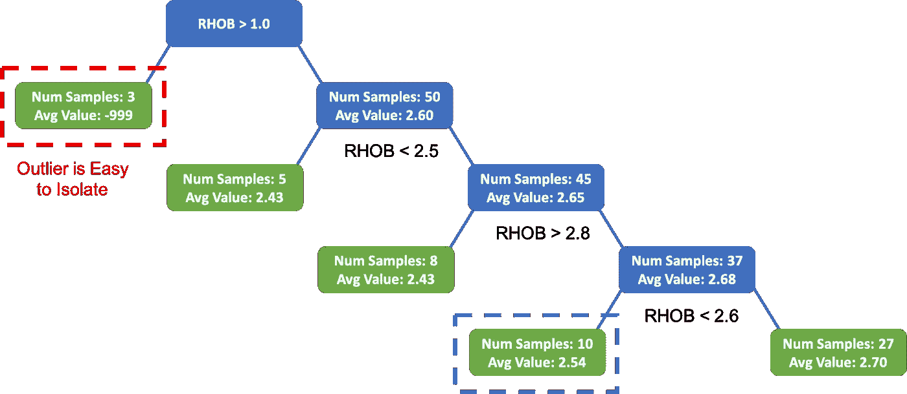

# 基于机器学习和 Python 的测井数据异常检测

> 原文：<https://towardsdatascience.com/well-log-data-outlier-detection-with-machine-learning-a19cafc5ea37?source=collection_archive---------9----------------------->

## 异常值的识别是机器学习工作流程中的一个重要步骤


威尔·梅尔斯在 [Unsplash](https://unsplash.com?utm_source=medium&utm_medium=referral) 上拍照

离群值是数据集中的异常点。它们是不符合数据集的正态或预期统计分布的点，可能由于多种原因而出现，例如传感器和测量误差、较差的数据采样技术以及意外事件。

在测井测量和岩石物理数据中，异常值可能由于被冲刷的钻孔、工具和传感器问题、罕见的地质特征以及数据采集过程中的问题而出现。必须在工作流程的早期识别和调查这些异常值，因为它们会导致机器学习模型的预测不准确。

下图中的例子(来自 McDonald，2021)说明了岩心孔隙度与岩心渗透率的关系。大多数数据点形成一个连贯的聚类，但是，由红色正方形标记的点位于该主要点组之外，因此可以被视为异常值。为了确认它是否确实是一个异常值，需要对报告和原始数据进行进一步的调查。


岩心孔隙度和渗透率数据中的异常值示例。图片来自麦当劳(2021)

# 识别异常值

有多种方法可以识别数据集中的异常值，其中一些方法涉及可视化技术，如散点图(如交会图)和箱线图，而其他方法则依赖于单变量统计方法(如 Z 分数)或甚至无监督的机器学习算法(如 K 近邻)。

本文将介绍以下异常值检测方法:

*   基于领域知识的手动删除
*   箱线图和 IQR
*   使用卡尺曲线
*   自动异常检测

# 岩石物理机器学习系列

本文是正在进行的系列文章的第三部分，该系列文章着眼于从基本测井记录测量到使用机器学习进行岩石物理性质预测的数据集。

这些文章最初是在 SPWLA 2021 大会的一个机器学习和人工智能研讨会上作为交互式笔记本展示的。它们后来被扩展和更新以形成这些文章。该系列包括:

1.  [探索性数据分析:使用 Pandas、Matplotlib 和 Seaborn](/exploring-well-log-data-using-pandas-matplotlib-and-seaborn-712779a39ac2) 探索测井数据
2.  [在岩石物理机器学习之前识别和处理缺失的测井数据](/identifying-and-handling-missing-well-log-data-prior-to-machine-learning-5fa1a3d0eb73)
3.  测井数据异常值检测— *本文*
4.  使用机器学习预测关键储层属性
    ** *尚未完成***

# 数据

2018 年，Equinor 向公共领域发布了 Volve 领域的全部内容，以促进研究和学习。发布的数据包括:

*   测井记录
*   岩石物理解释
*   报告(地质、完井、岩石物理、岩心等)
*   核心测量
*   地震数据
*   地质模型
*   还有更多…

Volve 油田位于北海挪威部分斯塔万格以西约 200 公里处。1993 年在侏罗纪时代的胡金地层中发现了碳氢化合物。石油生产始于 2008 年，持续了 8 年(是计划时间的两倍)，直到 2016 年停止生产。在油田寿命期内，总共生产了 63 个 MMBO，达到了 56000 桶/天的稳定产量

有关 Volve 字段和整个数据集的更多详细信息，请访问:[https://www . equinor . com/en/what-we-do/Norwegian-continental-shelf-platforms/Volve . html](https://www.equinor.com/en/what-we-do/norwegian-continental-shelf-platforms/volve.html)

这些数据在 Equinor 开放数据许可证下获得许可。

# 用于分析的选定数据

Volve 数据集由 24 口井组成，包含各种测井数据和其他相关测量数据。对于这个小教程系列，我们将选择五口井。这些是:

*   9 月 15 日-F-1 A
*   9 月 15 日-F-1 B
*   9 月 15 日-F-1 C
*   2011 年 9 月 15 日至 11 日
*   15/9-F-11 B

从这些井中，选择了一套标准的测井测量(特征)。它们的名称、单位和描述详见下表。


Volve 油田选定井的标准测井测量和岩石物理推导曲线。

该系列笔记本的目标是预测三种常见的岩石物理测量值:孔隙度(PHIF)、含水饱和度(西南)和页岩体积(VSH)。传统上，这些是通过一些经验公式计算出来的。

# 导入库和数据

项目这一部分的第一步是导入我们正在使用的库和数据。

```
import pandas as pd
import matplotlib.pyplot as plt
import numpy as np
import seaborn as sns
import scipydf = pd.read_csv('data/spwla_volve_data.csv')
```

最初看一下 pandas 的`describe()`功能，我们可以看到输出的数据范围(最小和最大)。

```
df.describe()
```


从 pandas 返回使用 df.describe()方法的测井测量数据帧。

# 使用手动方法处理异常值

## 去除极端电阻率

电阻率测量提供了电流通过地层的难易程度的指示。简而言之，如果地层含有盐水，那么电阻率将会很低，而如果存在石油或孔隙空间很小，电阻率将会很高。

电阻率测量可能受到多种方式的影响，例如附近的套管、工具/传感器问题，甚至是非常高电阻的地层。此外，根据进行测量的工具类型(感应、电磁传播、侧向测井),在高电阻率值时，读数的准确度可能会受到限制。

我们正在处理的数据集包含电磁传播电阻率测量值，我们将应用以下截止值。这些限制并不特定于任何工具，并且会根据所使用的数据和技术而变化。

*   瑞秋> 60 岁
*   狐狸精> 100
*   RPCHEM > 100
*   RPCLEM > 200

包含高于这些值的电阻率测量值的任何行都将被删除。如果我们只删除数据值，我们以后会有丢失数据的问题。

我们可以通过以下方式做到这一点:

```
df = df.loc[~((df.RACEHM > 60) | (df.RACELM > 100) | (df.RPCEHM > 100) | (df.RPCELM > 200)),:]df.describe()
```

当我们返回数据帧摘要时，我们可以看到这些电阻率曲线的测量次数从 27，845 次减少到 23，371 次


去除高电阻率值后，使用熊猫公司的 df.describe()方法返回的测井测量数据帧。

## 将电阻率对数曲线转换为正常值

由于电阻率曲线的数值范围很大，从几十欧姆·毫米到几千欧姆·毫米，并且通常呈现偏斜分布，因此最好通过取数值的对数底 10 (log10)将测量值转换为更正态的分布。

```
# Select all resistivity curves
res_curves = ['RACEHM', 'RACELM', 'RPCEHM', 'RPCELM']

# Loop through each curve and transform it
for res in res_curves:
    df[f'{res}_l10'] = np.log10(df[res])

    # Drop out the original columns
    df.drop(columns=[res],inplace=True)

df.head()
```


获取电阻率测量值的 LOG10 后的数据帧。

从上表中，我们可以看到新列已经添加到数据帧中，旧列已经删除。

## 用箱线图识别异常值

箱线图是一种基于五个关键数字显示数据分布的图形和标准化方法:最小值、第一个四分位数(第 25 个百分位数)、中值(第二个四分位数)。/第 50 个百分位数)、第 3 个四分位数(第 75 个百分位数)和“最大值”。最小值和最大值分别定义为 Q1-1.5 * IQR 和 Q3 + 1.5 * IQR。任何超出这些限制的点都被称为异常值。


箱线图的图形描述，突出显示关键组成部分，包括中位数、四分位数、异常值和四分位数间距。作者创造的形象。

我的 YouTube 频道上的以下视频介绍了 boxplots 的背景以及如何用 python 生成它们。

调用箱线图最简单的方法是在数据帧上使用`.plot(kind='box)`。但是，正如您将看到的，这将在一个刻度上绘制所有的列，如果曲线之间有不同的值范围，例如从 0 到 1，以及 3000 到 5000，那么较小的测量值将更难区分。

```
df.plot(kind='box')
plt.show()
```


使用 pandas 生成的测井数据的简单箱线图。图片由作者提供。

为了使这些图更容易查看和理解，我们可以从 seaborn 库调用 boxplot，并遍历 dataframe 中的每一列。

一旦我们创建了函数，我们就可以创建一个列的列表，并“弹出”或删除包含字符串数据的井名列。然后，我们可以对数据帧中的每条测井曲线运行该函数。


突出异常值的测井数据箱线图，每个都有自己的数据范围。作者图片

从生成的图中，我们可以看到一些测量值可能包含异常值，这些异常值以绿色突出显示。仅基于箱线图，不容易判断这些点是否是真正的异常值。这就是我们需要依靠领域知识和其他方法的地方。

## 用交会图识别异常值

当处理多个变量时，我们可以使用交会图来识别潜在的异常值。这些包括绘制一个测井测量值与另一个测井测量值的对比图。第三次测井测量可用于为绘图添加颜色，以增强异常值的识别。

在本例中，我们将使用一个函数来绘制密度与中子孔隙度数据的散点图(交会图)，该散点图将由卡尺着色。


所有井的中子孔隙度(NPHI)与体积密度(RHOB)的交会图。颜色表示由卡尺(CALI)测量的钻孔尺寸。作者图片

我们可以在返回的图上看到，有几个点以橙色/红色突出显示，这表明如果我们假设位大小为 8.5 英寸，可能会发生冲刷。

这表明一些测量可能会受到井筒条件的影响。许多测井工具能够补偿一定程度的冲蚀和粗糙。

在本例中，为了说明处理受冲刷影响的坏数据点的过程，我们将删除任何超过 9 英寸的点。超出标准 0.5 英寸。任何小于 8.5 英寸的点也将被删除。

我们可以通过以下方式做到这一点:

```
df = df[(df['CALI'] >= 8.5) & (df['CALI'] <= 9)]
df.describe()
```


删除受冲刷影响的坏数据点后的数据帧摘要。图片由作者提供。

我们现在可以看到，我们已经将数据集进一步减少到 22，402 个深度样本，低于初始数据集中的 27，845 个。

# 使用无监督机器学习方法识别异常值

监督和非监督机器学习方法都可以用于识别测井数据和岩石物理数据中的异常值。出于本教程的目的，我们将关注一些无监督学习技术。

无监督的机器学习模型试图在不需要标记类别的情况下识别数据中的潜在关系。有许多无监督的机器学习方法可用于识别数据集中的异常/异常值。

在本文中，我们将了解三种常见的方法:

*   隔离林(IF)
*   一级 SVM (SVM)
*   本地异常因素(LOF)

## **隔离林**

隔离林方法基于决策树。该方法选择一个特征/测量值，并在最小值和最大值之间随机分割数据。然后，这个过程沿着决策树继续下去，直到数据中所有可能的分裂都已完成。任何异常/异常值都将在流程的早期被分离出来，使其易于识别并与其余数据隔离。

下图展示了一个非常简单的例子，它使用了一个变量——体积密度(RHOB)。



测井数据隔离林示例。图片由作者提供。

## 一等 SVM

支持向量机是一种常见的分类机器学习工具，这意味着它们适合根据数据特征将数据分成不同的组。这是通过识别数据组之间的最大边际超平面来实现的，如下面简单的多类示例所示。


SVM 划分两类数据的示例。作者图片

在传统的 SVM 分类中，我们有不止一个类或相。然而，当我们只有一类数据时，我们可以使用所谓的一类 SVM。

在异常值检测的情况下，我们要做的是找到将数据点与原点分开的边界(见下图中的左图)。在这种情况下，我们将原点视为第二类。边界线外的任何点都被视为异常值。我们可以通过提供想要在数据集中检测的异常值的数量来控制线的位置。这个参数被称为污染水平。

但实际上，离群值可能存在于与主数据云相关的任何一侧。在这种情况下，我们希望找到一个非线性超平面，将异常值从主数据点中分离出来(参见下图中的右图)。我们可以使用 RBF 核(径向基函数核)来寻找点之间的非线性边界。

我们可以通过指定污染水平来控制允许识别多少异常值。如果我们只需要少量的异常值，我们可以将其设置为一个较小的数字。类似地，如果我们想要检测更多的异常值，我们可以为算法提供更多的污染值。


使用一次 SVM 识别测井数据中异常值的示例。图片作者。

## **局部异常因素**

该方法评估给定点周围数据点的密度。与其他点相比密度较低的点将被视为异常值。有关此方法的更多信息，请查看此链接:

[https://medium . com/ml point/local-outlier-factor-a-way-to-detect-outliers-DDE 335d 77 E1 a](https://medium.com/mlpoint/local-outlier-factor-a-way-to-detect-outliers-dde335d77e1a)


异常值检测的局部异常值因子示例。图片来自[https://sci kit-learn . org/stable/auto _ examples/neighbors/plot _ lof _ outlier _ detection . html](https://scikit-learn.org/stable/auto_examples/neighbors/plot_lof_outlier_detection.html)

## 创建模型

我们可以使用下面的代码非常简单地创建模型，这是使用 [scikit 学习库完成的。](https://scikit-learn.org/stable/)


返回每个所选模型的异常分数的数据框架，以及数据点是异常值(-1)还是异常值(1)。图片由作者提供。

我们现在可以使用密度-中子交会图来检查每个模型的性能。这是通过使用 Seaborn 的 FacetGrid 并将散点图映射到它来实现的，如下所示。

这将为每种方法和已识别的异常数据点的数量返回以下图。


看来综合框架方法提供了更好的结果，其次是 LOF，然后是 SVM。在前两种方法中，图右侧的大部分异常值都被移除。

对于每种方法，我们可以更详细地查看每口井的数据。

它返回下面的图。


测井数据异常值检测中不同异常值识别方法的比较。异常值以橙色突出显示，内标/优点以蓝色突出显示。图片由作者提供。

这让我们更好地了解如何使用所选方法在每口井中识别异常。我们可以看到，LOF 方法突出显示了数据点中心的许多点，这些点可能不是真正的异常值。这就是领域专家知识在确认这些点是否确实是异常值时发挥作用的地方。

## 在测井图上显示异常点

为了确定在哪里检测到异常值，我们可以使用下面的代码为每种方法和每口井生成简单的测井曲线。

在绘制数据之前，我们可以根据井名将数据帧分成多个数据帧，这样会更简单

一旦数据帧被井分割，我们就可以使用列表的索引号来访问所需的数据。

如果我们循环通过井名列表，我们可以得到索引号和相关的井名。

它返回:

```
Wellname 	 Index
15/9-F-1 A 	0
15/9-F-1 B 	1
15/9-F-1 C 	2
15/9-F-11 A 	3
15/9-F-11 B 	4
```

然后，我们可以用它来选择所需的井


用红色显示已识别异常的测井曲线。图片由作者提供。

上面的图向我们展示了常规测井图上存在异常/潜在异常值的地方。从 3700 到 3875 的区间是包含缺失值的区间。因为我们使用的是线图，所以对该间隙两侧的点进行插值以创建一条线。

突出显示的间隔需要用领域知识进行更详细的评估，但是出于本教程的目的，我们将使用隔离森林方法的结果。

# 导出结果

现在我们有了一个干净的数据集，我们可以将其导出到机器学习阶段所需的文件中。

为此，我们首先需要创建我们的临时数据帧，其中我们只使用被隔离林算法识别为内联者的数据。一旦这些点被删除，我们就可以创建我们的输出数据框架。

## 创建监督学习文件

为了准备监督学习文件，我们需要执行几个步骤。

## 训练、验证和测试分割

在导出数据之前，我们首先需要将数据分成训练、验证和测试数据集。

训练数据集用于训练模型，验证数据集用于调整模型参数，而测试数据集用于在看不见的数据上验证模型。应该注意的是，这些术语可以互换使用，可能会引起混淆。

## 测试数据分离

首先，我们将分离一口井(15/9-F11 B)用于我们的测试数据集，其余的井和数据将被分配给`training_val_wells`

## 训练和验证数据集

接下来，我们将我们的`training_val_wells`数据分成训练特征和目标特征(软件，PHIF & VSH)。在我们使用 Sklearn 进行预测的情况下，我们通常只指定一个特征进行预测。但是，对于这个示例，我们将设置三个目标特性。

当我们检查培训功能(X)时，我们可以看到我们拥有所有必需的列。

```
X.head()
```


剔除异常值后的选定训练特征。图片作者。

我们还可以检查目标的头部特征(y):

```
y.head()
```


剔除异常值后选择的目标特征。

## 列车测试分离

Sklearn 的 train_test_split 模块。对于本例，我们将使用 70%的训练规模，剩下 30%用于验证和调整模型。`random_state`已被设置为固定值，以允许本次研讨会产生可重复的结果。如果你想每次都随机化这些值，你可以删除这个方法输入。

***需要注意的是，这里使用的方法叫做 train_test_split。但我们实际上正在做的是分离训练和验证数据集。***

# 摘要

在本文中，我们介绍了什么是异常值，以及使用图和无监督学习算法识别异常值的方法。一旦识别出异常值，就可以将其移除。这是通过结合使用方法和领域专业知识来完成的。如果盲目地丢弃分数，你可能会丢弃有价值的数据。所以要经常检查你识别的异常值是不是真的异常值。

这本笔记本最初是为 2021 年 SPWLA 大会上的 SPWLA 机器学习研讨会发布的，后来进行了修改。

*感谢阅读！*

如果您觉得这篇文章很有用，请随时查看我的其他文章，这些文章从不同方面介绍了 Python 和测井数据。你也可以在 [*GitHub*](https://github.com/andymcdgeo) *找到我在这篇文章和其他文章中使用的代码。*

*如果你想联系我，你可以在*[*LinkedIn*](https://www.linkedin.com/in/andymcdonaldgeo/)*或者我的* [*网站*](http://andymcdonald.scot/) *找到我。*

*有兴趣了解更多关于 python 和测井数据或岩石物理学的知识吗？跟我上* [*中*](https://andymcdonaldgeo.medium.com/subscribe) *。*

如果你喜欢阅读这些教程，并想支持我作为一名作家和创作者，那么请考虑报名成为一名媒体成员。一个月 5 美元，你就可以无限制地阅读数千篇各种主题的文章。如果您使用 [**我的链接**](https://andymcdonaldgeo.medium.com/membership) **，**注册，我将为您赚取一小笔佣金，无需额外费用！

[](https://andymcdonaldgeo.medium.com/membership) [## 通过我的推荐链接加入 Medium 安迪·麦克唐纳

### 作为一个媒体会员，你的会员费的一部分会给你阅读的作家，你可以完全接触到每一个故事…

andymcdonaldgeo.medium.com](https://andymcdonaldgeo.medium.com/membership)