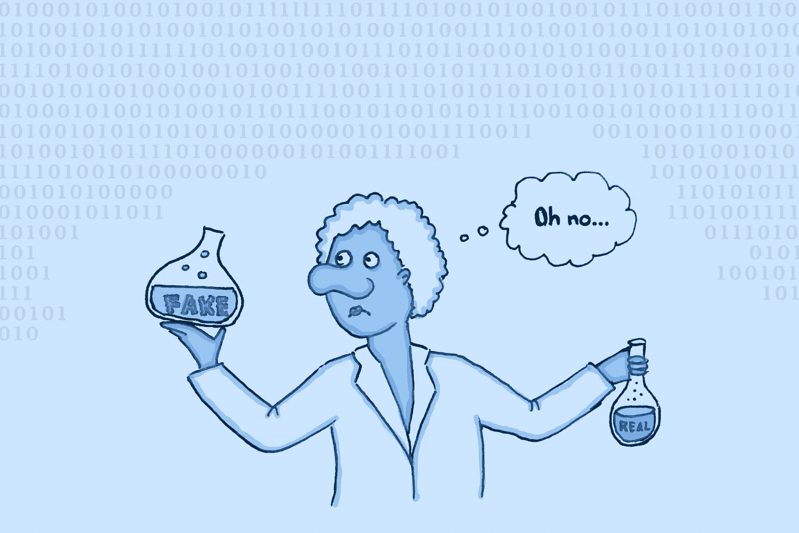

# 我们正面临一场虚假的科学危机，而人工智能让它变得更糟

> 原文：<https://towardsdatascience.com/were-facing-a-fake-science-crisis-and-ai-is-making-it-worse-2169a6449c94?source=collection_archive---------17----------------------->

## 期刊撤回了越来越多的论文，因为这些论文并非出自他们声称的作者之手

《科学》杂志上低质量(和无质量)的论文数量正在增加。作者图片

 然后，研究人员将任何重要的发现写在论文中，并提交给可能的出版物。在同行评审过程中，其他科学家检查研究是否合理，然后期刊发表论文供公众阅读。

因此，你可能有理由相信发表的论文相当可靠，符合高质量标准。你可能会想到在同行评审中被忽略的小错误，但不会有大的失误。毕竟是科学啊！

不过，你对这个的期望是错误的。真正的好科学确实存在，但也有令人担忧的大量虚假研究。在过去的几年里，它的数量以闪电般的速度增长，正如论文撤回数量的暴涨所证明的。

> **伪科学**
> 
> 目前的一些做法有可能破坏科学研究的合法性。它们包括虚构的作者，增加与论文无关的科学家作为合著者，甚至更邪恶的做法，如用低质量的人工智能写作垃圾来淹没期刊。

这个过程类似于杂货店的召回。如果以前销售的产品由于某种原因是坏的或危险的，商店可能会决定召回它，并要求所有顾客不要使用它。类似地，一份杂志可以回忆起一篇发表的论文，事后证明是伪造的。

当然，有时论文被收回是因为作者在他们的研究中犯了一个诚实的错误。然而，在超过一半的情况下，这是因为学术不端或欺诈。直到十年前，这种行为或多或少局限于研究人员伪造实验数据或歪曲结果以支持他们的理论。然而，技术变得越复杂，事情就变得越复杂。

一个简单的解决办法是忽略伪造的文件。然而，问题是它们通常很难识别。此外，一旦一篇论文从出版物中被撤下，整个期刊都会有点失色。如果这种情况经常发生，公众对科学的整体信心就会下降。因此，科学界作为一个整体需要认真对待这个问题。

 [## 为什么 Python 中的装饰者是纯粹的天才

### 用一个@符号来分析、测试和重用你的代码

towardsdatascience.com](/why-decorators-in-python-are-pure-genius-1e812949a81e) 

# 卡米尔·诺斯

这个问题有些是模拟的。Camille Noû与人工智能没有太多关系，但它仍然值得一提。诺思出生于 2020 年 3 月，已经在天体物理学、计算机科学和生物学等不同领域合作撰写了 180 多篇论文

我说“它”是因为诺斯不是一个真实的人；更确切地说，它是由法国研究倡导组织 [RogueESR](https://rogueesr.fr/) 发明的人工制品。它带有中性的法语名字 Camille，并融合了古希腊词“νοῦς”，意思是理性或认知，以及法语词“nous”，意思是“我们”

nos 是为了回应一项备受批评的[新法](https://www.enseignementsup-recherche.gouv.fr/pid39124/loi-de-programmation-de-la-recherche-2021-2030.html)(来源于法语)而创建的，旨在重组法国的学术研究。尽管该法律的目的是让研究更好，但它的批评者[认为](https://www.lemonde.fr/sciences/article/2020/11/20/le-controverse-projet-de-loi-de-programmation-pour-la-recherche-definitivement-adopte-par-le-parlement_6060513_1650684.html)科学家的工作将会不公平地不稳定，并根据其要求依赖外部资金。特别是，科学家获得的资助必须依赖于他们自己以前的成就，尽管研究通常是社区的努力。

为了让这种担忧可见，许多研究人员选择将诺思作为合著者。然而，负责检查这些论文的期刊和同行评审员并不总是被告知，诺斯并不是一个真实的人。

尽管到目前为止，所有这些论文的研究部分似乎都是合法的，但人们可以如此容易地添加一位甚至没有身份证的合著者，这令人担忧。尽管强调诺思等作家的共同努力是一个光荣的目标，但在当今时代凭空创造科学家的想法非常令人担忧。

社区的努力需要得到认可，但目前我们没有这样做的制度。作者图片

# 在不属于作者的地方添加作者

然而，突出同行评议系统和学术界的缺陷并不是这个问题表现的唯一地方。尤其是在关于 AI 的[篇论文中，假冒合著的案例越来越多。这种欺骗包括在他们不知情或未同意的情况下，将一位知名科学家添加为合著者的做法。另一种方法是添加一个虚构的合著者，有点像 Camille Noû，但目的是假装国际合作或更广泛的科学讨论。](https://www.wired.com/story/ai-research-paper-real-coauthor-not/)

除了给人一种国际合作的错觉之外，添加具有良好资质的假作者可能有助于提高论文的可信度。许多科学家在阅读论文或在工作中引用论文之前，会在谷歌上搜索所有作者的名字。但是，看到一位来自知名机构的合著者可能会让他们更仔细地审视一篇论文，特别是如果它还没有经过同行评议的话。然后，一个机构的声望就可以像可信度的代理一样发挥作用，直到耗时数月的同行评审完成。

目前还不清楚有多少假作者被添加进来。首先，一些科学家可能会选择忽略他们的名字出现在他们没有写的论文上的事实，特别是当有问题的论文的内容通常并不可怕(尽管并不伟大)并且法律行动可能会过于昂贵和耗时。此外，在发表论文之前，目前还没有标准的方法来验证科学家的身份。这就给了假作者一张免费通行证。

所有这些问题表明某种类型的身份验证过程的必要性。目前还没有正式的协议，这很遗憾。在这个时代，每家银行都可以在线验证你的身份，并将其与你网络摄像头上的人脸进行匹配，科学甚至无法保护其最有价值的贡献者免受骗子的侵害。

当它是关于写科学论文的时候，一个好的古老的人类头脑的道路今天仍然比最好的人工智能更好。作者图片

# 算法正在产生糟糕的文章

1994 年，物理学家艾伦·索卡尔(Alan Sokal)想写一篇关于人文学科相关主题的论文，并将其提交给一家期刊。它[被接受了](https://physics.nyu.edu/sokal/weinberg.html)，尽管没有人，包括作者本人，明白他在说什么。这不仅是荒谬的，而且也显示了同行评审者有多懒。在这种情况下，他们实际上接受了本质上是一篇胡言乱语的文章。

同样，在 2005 年，三个计算机科学专业的学生决定开发 SCIgen，作为对研究界的一个恶作剧。这个程序炮制出完全无意义的论文，里面有图表、数字和引文，夹杂着大量计算机科学的术语。他们的一篇胡言乱语的论文被当时的一个会议接受了。更有甚者，2013 年，120 篇论文[在发现是 SCIgen 写的后，被各个出版社撤回](https://www.nature.com/news/publishers-withdraw-more-than-120-gibberish-papers-1.14763)。2015 年，该网站每年仍有 60 万的页面访问量。

然而不幸的是，伪造文件不仅仅是恶作剧。整个公司通过撰写胡言乱语的论文并将其提交给掠夺性期刊来赚钱，这些期刊几乎不拒绝任何东西，因为它们收取出版费。这些公司也被称为[造纸厂](https://www.nature.com/articles/d41586-021-00733-5)，他们的方法越来越复杂。尽管欺诈检测也越来越好，但专家们有理由担心，这些肆无忌惮的行为者已经磨练了针对低质量期刊的技能，接下来可能会试图淹没真正的期刊。这可能导致造纸厂和不想发表伪作的期刊之间的军备竞赛。

当然，另一个问题即将出现:人类还会是唯一一个写研究论文的人吗？在 10 年或 20 年内，人工智能驱动的算法是否能够自动筛选大量文献，并将它们的结论放在一篇达到最高研究标准的新论文中？我们如何去信任这些算法或它们的创造者？

然而，今天，我们正在处理一个更愚蠢的问题:我们如何识别由相对不复杂的算法撰写的、没有产生任何合理内容的论文？我们如何应对它们？除了志愿者的努力和迫使欺诈作者撤回论文，科学界对这个问题的答案少得惊人。

大多数期刊迫切需要更新我们的安全系统来追踪假论文。作者图片

# 反对伪科学

大多数声誉不佳的期刊至少有一个基本的电子邮件验证程序，供希望提交论文的研究人员使用。[这里的](https://www.google.com/url?q=https://www.sciencemag.org/authors/science-information-authors&sa=D&source=editors&ust=1622068710398000&usg=AOvVaw3FVMMp0PqnIatoO9MalHlk)比如说，就是《T2》科学的验证系统。尽管如此，建立一个假的电子邮件地址，并通过它的过程是相当容易的。这种类型的欺诈仍然经常发生，正如每年从权威期刊撤回的[论文数量](https://retractionwatch.com/)所示。所以，我们需要更强大的系统。

验证科学家身份的一个好方法是[或](https://info.orcid.org/what-is-orcid/)。基本上，通过这个系统，每个研究人员都可以获得一个唯一的标识符，然后自动链接到他们的跟踪记录。在期刊的同行评审和出版过程中使用 ORCID 将使伪造身份或在未经其他研究人员知情或同意的情况下使用他们的证书变得更加困难。虽然这是一个很好的倡议，但还没有主要期刊强制所有作者使用 ORCID 或其他地方的标识符。在我看来，这是一种耻辱，而这是很容易解决的。

最后，人工智能本身可能在这场斗争中有用。一些期刊正在[部署](https://medium.com/@aaronedell/stopping-fake-research-papers-from-getting-published-using-machine-learning-c5805f79af2a) [AI 模型](https://analyticsindiamag.com/how-ai-is-tackling-fake-academic-research-that-is-plaguing-scientific-community/)检测虚假投稿。然而，到目前为止，各种期刊还不能就一个共同的标准达成一致。因此，缺乏资源或专业知识的期刊无法像排名较高的出版物那样应用相同的质量标准。

这扩大了高层次和低层次期刊之间的差距，对我来说，这清楚地证明了所有期刊应该团结起来，找到一种方法来共享欺诈检测的资源。当然，高水平的期刊可能会在短期内从缺乏竞争中获利。然而，从长远来看，拥有更多低标准的期刊可能会降低人们对科学出版的整体信心。

然而，这并不是说研究人员和科学期刊坐以待毙，而不是去追踪造假的作者。事实上，个体出版物正在做大量的工作来追查假论文。但是，如果一些期刊有办法，而另一些没有，那么出版物就不是在一个公平的竞技场上运作。此外，骗子总是能够用他们的假论文瞄准一些资金不足的期刊。期刊需要集体行动，找到追踪造纸厂的方法，并核实所有作者的身份。

 [## 为什么开发人员会爱上函数式编程

### 从 Python 到 Haskell，这种趋势不会很快消失

towardsdatascience.com](/why-developers-are-falling-in-love-with-functional-programming-13514df4048e) 

# 超越科学:假新闻越来越造假

如果你认为虚假内容是仅限于科学的问题，那你就错了。仅仅几年前，在特朗普时代的鼎盛时期，“假新闻”是当时的流行语。自那以后，产生内容来影响公众舆论的方法变得更加复杂，它们与那些伪造的科学论文非常相似。

例如，[假记者](https://www.theverge.com/2020/7/7/21315861/ai-generated-headshots-profile-pictures-fake-journalists-daily-beast-investigation)显然是各种保守媒体专栏的作者。他们的头像是用人工智能算法生成的。他们的 LinkedIn 和 Twitter 账户完全是假的，目前还不清楚谁是这些文章的真正幕后黑手。

还有几个[假新闻](https://www.worldgreynews.com/add-news) [文章](https://breakyourownnews.com/) [生成器](https://www.fodey.com/generators/newspaper/snippet.asp)让制造假新闻头条变得轻而易举。虽然你可能无法用这样的内容说服一个有经验的事实审查员，但是你可能能够用它给普通的脸书用户留下深刻的印象，足以说服他们分享这篇文章。

这就是为什么我自己倾向于只相信来自已有来源的新闻和科学，或者我可以反复检查以确定其真实性的内容。我完全不考虑其他来源，因为我知道大部分来源从“一点点错误”到“完全捏造”

几年前我没有这种态度。我周围的人也没有。对新闻的信任已经急剧下降，我不知道我们如何才能恢复它。现在，已经发生在新闻上的事情正在发生在科学上。很难发现世界上正在发生的事情的真相，这已经够糟糕了。但是，如果人类知识的基础遭到侵蚀，那将是一场更大的灾难。

虽然围绕假新闻的争论自 2020 年大选以来已经平息，但远未结束。由于伪造内容的工具仍在变得越来越复杂，我相信在未来的几年里，这种对话将变得更加活跃。希望到那时，我们能就如何打击虚假内容和虚假研究达成共识。

*本文原载于* [*建于*](https://builtin.com/artificial-intelligence/ai-fake-science) *。*