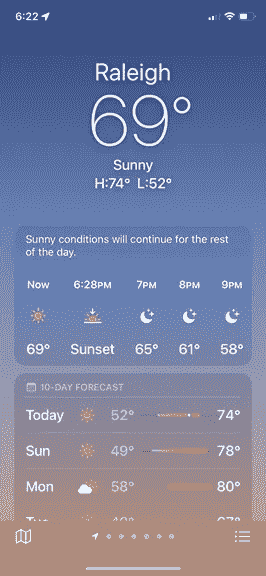
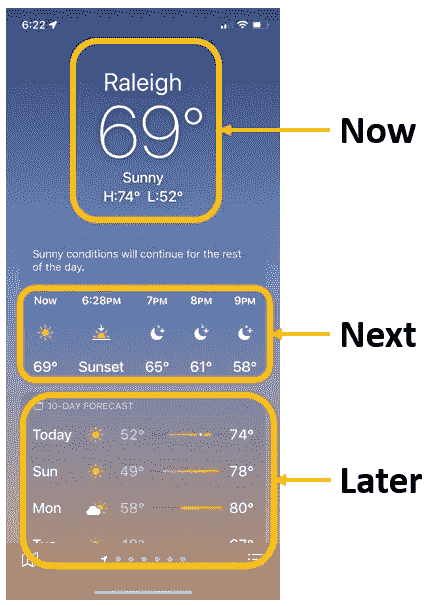
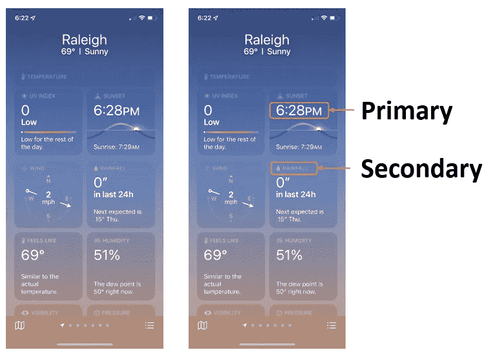
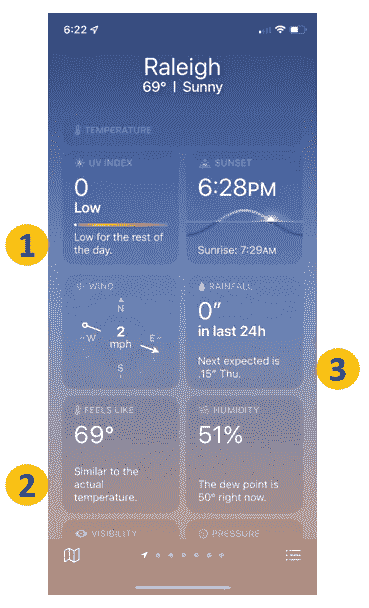
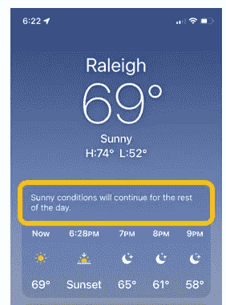

# 关于数据可视化，苹果的天气应用能教会我们什么

> 原文：<https://towardsdatascience.com/what-apples-weather-app-can-teach-us-about-data-visualization-d17af605aaec?source=collection_archive---------36----------------------->

## 你可以在下一次可视化、仪表板或演示中应用的三个经验

作者图片

我的工作是思考我们如何交流数据和分析，所以我不时会发现自己很羡慕别人是如何构建他们的产品和可视化的。

我最近用最新的 iOS 更新了我的手机，其中一个更新特别吸引我的是新的天气应用程序。我注意到苹果引入了新的可视化和提示来帮助人们理解屏幕上的内容，并且有一些有用的提示我们可以应用到我们自己的交流和可视化中。

下面是我们如何在数据产品中使用他们的设计的三个建议。

# 1.找到你的数据流

请考虑一下您与天气应用程序最频繁的交互。平均来说，我猜你现在最常去查看温度。下一个最常见的是看天气预报——今天会下雨吗？今晚我户外活动的温度是多少？你的第三大频率可能是查看即将到来的一天或本周晚些时候的天气。

现在，看看与上述内容相关的应用程序流程。从上到下，信息流从现在的**(当前天气)到接下来的(接下来几个小时)的**再到之后的**(10 天天气预报)。该应用程序旨在让人们最便捷地获取他们最需要的信息。它还跟踪时间的逻辑顺序——现在、下一个、以后。**

****

**作者图片**

**将这个例子扩展到您的数据可视化世界，这个流的概念在构建仪表板和为演示创建叙述时尤其相关。**

> **你的设计是为了让人们以他们思考的方式快速看到他们需要的信息吗？**

**在构建仪表板时，考虑人们首先、其次和第三寻找什么信息，并从上到下或从左到右组织内容，以反映人们将如何与您的产品交互。也许您有创建层次结构的产品类别，所以您可能想考虑从最高级别到最细粒度。或者，您有一个显示五年趋势、一年趋势和最近一个月的时间序列。找到正确流程的最简单的方法是与你最频繁的用户交谈，听听他们是如何谈论这个话题的，然后将它构建到项目中。**

**在创建演示文稿时，或者我们现在雄辩地称之为数据讲故事，我最有效的技巧之一是设身处地为观众着想，问自己幻灯片上的信息会引发什么最符合逻辑的问题，然后在下一张幻灯片中回答它。**创造并遵循你的听众将拥有的**(或你希望他们拥有的)思路。如果你显示一个时间序列有一个不寻常的峰值或谷值，接着解释为什么你会看到谷值——这是大多数人想要的最合理的下一条信息。**

# **2.使用颜色来引起对重要区域的注意**

**我们中的许多人认为使用大小(即更大的文本)、粗体和颜色的变化是改变所呈现信息的有效方式。一个很少使用但非常有效的颜色技巧是使用灰色阴影来传达次要信息。看下面左边的图像，你首先看到的是什么？我的注意力很快被白色的文字吸引住了。快速浏览一下，您可能甚至不会注意到灰色的文本。然而，当你需要它的时候，你可以瞥一眼上面的白色来查看信息。**

****

**作者图片**

**明亮、大胆的颜色通常被认为是吸引信息注意力的方式，但也要记住，颜色的***缺失*也同样有效**。这在交流某人已经熟悉并经常看到的信息时特别有用。**

**例如，您可能会将一些重要 KPI 的每周快照发送给您的经理或领导团队，或者您将这些信息作为仪表板的标题—用户已经知道这些 KPI，他们只想看到标题数字。通过为指标名称找到正确的灰度颜色，减少您所展示信息的认知负荷，然后使用大字体的强烈偏移色(如白色背景上的黑色)使您的标题数字突出。**

# **3.提供人类可读的数字解释**

**如果你正在阅读这篇文章，很可能你是数据专家，并且对数字有天赋。考虑到这一点，你可能会忘记，你的听众往往对数据和数字没有同样的兴趣。他们可能是强大的产品创新者或项目经理。**

> **对你来说，从数据中明显提取出来的东西对他们来说可能是一个等待解开的谜。**

**作为数据从业者，当我们看到数字时，我们会含蓄地或明确地“将点连接起来”，但为了确保每个人都在同一页上，我们应该尽一切努力阐明*数字的含义*和/或*帮助人们将数字放入上下文*。**

**我们再来重温一下天气 app 的最后一张截图。请注意在底部的方块中，围绕数据的有用的上下文和/或人类可读的解释。**

****

**作者图片**

**第一，苹果不仅让我们知道紫外线指数现在是多少，还让我们知道接下来一天会发生什么。对于第二点——尤其是我在北卡罗来纳州罗利的地方——感觉上的*温度远远超过实际温度是很常见的，所以有一些有用的文字可以给你一个心理基准，告诉你现在的温度是多少。在第三个问题上，这篇文章给我们提供了下一个指标何时出现的信息。***

**回到应用程序的顶部，我们可以看到另一个可读文本的实例，它显示了今天剩余时间的内容。**

****

**作者图片**

**这里的技巧是使信息(1) **对读者来说是附加的**——不仅仅是重复他们在屏幕上看到的数据点；(2) **篇幅简短**——一般不超过一个简短的句子；(3) **使用简单明了的英语**——避免行话和技术术语，用任何用户都能理解的语言表达。**

**我在 Tableau 中实现这一点的一种方法是使用创建的字段，这些字段提供了与基准的简单比较。例如，对于州级数据，我将使用一个简单的 if-else 语句在地图的工具提示中添加州是高于、等于还是低于某个指标的全国平均值。这个简单的基准可以帮助查看者将一个看似随机的数字放到有意义的上下文中。**

**如果您正在创建可视化、演示或数据产品，请不时看看您领域之外的信息呈现方式。这可以像高速公路上的标志一样简单——注意绿色背景上的白色大文本偏移，以便于阅读——也可以像苹果公司开发的应用程序一样复杂。**

**请记住，像苹果这样的公司拥有一些世界上最聪明和最好的设计师，像天气应用程序这样的东西，其核心是一种数据可视化产品，用于交流与温度、雨水和其他相关主题相关的信息。只要关注我们如何体验我们日常接触的产品，我们就能学到很多东西。**

***你也对这些话题感兴趣或有疑问吗？* [*在 LinkedIn 上跟我联系*](https://www.linkedin.com/in/jordanbean/) *！***