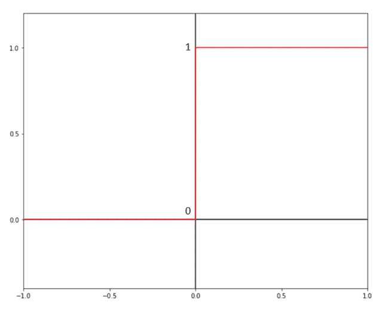
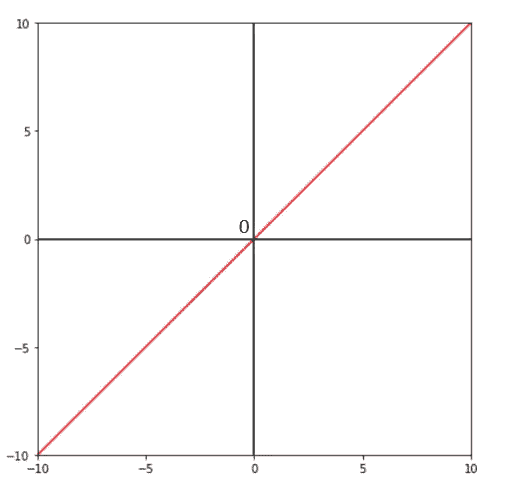
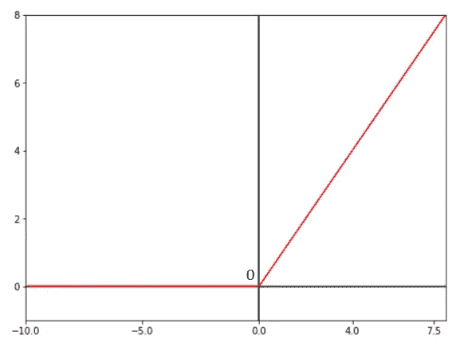
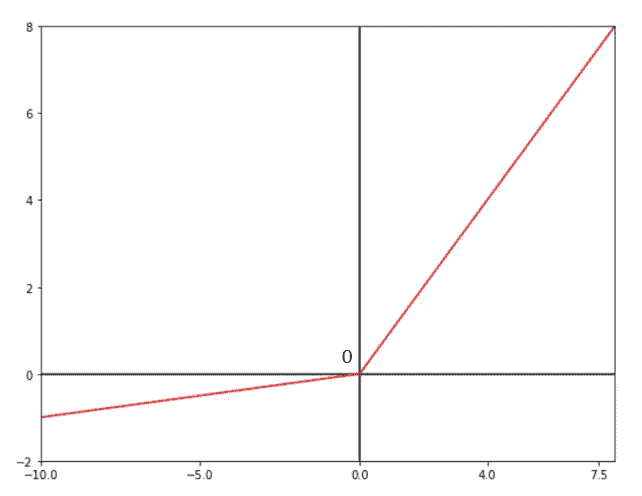
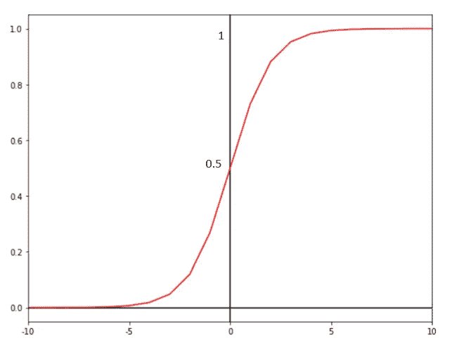
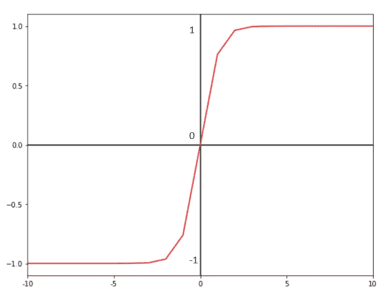

# 深度学习中的激活函数有哪些？

> 原文：<https://towardsdatascience.com/what-are-activation-functions-in-deep-learning-cc4f01e1cf5c?source=collection_archive---------10----------------------->

## 深度学习/统计/张量流

## 像我五岁一样解释

乔希·里默尔在 [Unsplash](https://unsplash.com?utm_source=medium&utm_medium=referral) 上的照片

所有关于激活功能的问题都集中在这里。我会尽量长话短说。

**什么是激活功能？**

**为什么神经网络需要激活函数？**

**激活功能有哪些类型？**

**如何在 TensorFlow / Keras 中实现它们？**

**如何为你的神经网络选择合适的激活函数？**

先说最明显的问题:'*什么是激活函数？* ' 假设你们所有的深度学习爱好者都知道人工神经网络(ANN)的基本结构，以及它的构建模块神经元在网络内部的实际功能，那么**每个神经元**肯定都很清楚:

1.  从网络的输入层或前几层的神经元接收输入
2.  对收到的信息进行某种处理或计算
3.  向网络下一层的神经元发送输出信号

由于神经元执行所有这些功能，它们的输出各不相同，有时对网络并不重要。来自某些神经元的这种信息在被抑制时，会导致更高得分的网络。这就是激活功能发挥作用的地方。

一个**激活函数**是一个看似很小的数学表达式，它决定一个神经元 ***是否激活*** 。这意味着激活函数抑制了其输入对神经网络的整体应用没有意义的神经元。这就是为什么神经网络需要这样的函数来显著提高性能。

在大多数情况下，需要激活函数来向网络提供某种非线性。如果没有这些功能，神经网络基本上就变成了一个简单的线性回归模型。然而，线性激活函数也存在，我们将在下面看到:

## 激活功能的类型:

*   二元阶跃函数
*   线性激活函数
*   非线性激活功能 **s** (相当多)

## 1.二元阶跃函数

二元阶跃函数(图片由作者提供)

**数学方程式:**

> 当 x < 0 时，x = 0；当 x ≥ 0 时，x = 1

这是最不常用的激活函数，你可能甚至没有听说过它。二元步进激活函数是一个简单的阈值分类器。如果二进制阶跃函数的输入大于阈值条件，则神经元将被激活，这意味着神经元的输出将被成功传递到下一层。如果不是这样，神经元就不会被激活，对整个神经网络来说基本上是无用的。

## 2.线性激活函数

线性激活函数(图片作者提供)

**数学方程式:**

> (x) = x

从等式中可以明显看出，激活与函数接收到的输入成正比。这里的梯度对于通过网络的每一步计算都保持不变。因此，lienar 激活函数应该用于不需要非线性的简单回归应用。

## 3.非线性激活函数

有许多有用的非线性激活函数可用于不同的应用:

## **ReLU(整流线性单元)激活功能:**

ReLU 激活功能(图片由作者提供)

**数学方程式:**

> (x) =最大值(0，x)

这是一个分段线性函数，如果输入为正，它将直接输出输入，否则，它将输出零。因此，它被称为“整流”线性单位。这是用于网络的输入和输出层之间的隐藏层的最常见的激活函数，因为它易于实现并且通常导致更好的性能。

然而，由于所有的负输入都被映射为 0，该激活中的梯度也变为零。因此，在反向传播过程中，一些神经元的权重可能不会更新，从而使它们变得无用。这就是所谓的**‘垂死的 ReLU 问题’**。

## 泄漏 ReLU 激活功能:

泄漏的 ReLU 激活功能(图片由作者提供)

**数学方程式:**

> ф(x)= 1(x<0)(αx)+1(x>= 0)(x)；α是一个小常数

泄漏 ReLU 激活功能试图缓解*垂死 ReLU* *问题*，该问题发生在具有小正斜率的 ReLU 中，不会导致零梯度问题。因此，在反向传播期间，负区域中的神经元也被考虑在内。

基于 ReLU 的其他很少使用的激活函数有:1)参数指数线性单元 (PELU)。2)[**指数线性单元**](https://sefiks.com/2018/01/02/elu-as-a-neural-networks-activation-function/) (ELU)。3)[**高斯误差线性单元**](https://paperswithcode.com/method/gelu) (GELU)。4)[**比例指数线性单元**](https://paperswithcode.com/method/selu) (SELU)。这里不探讨它们，因为它们在最常见的神经网络模型中几乎从未使用过，本文旨在尽可能简短。

## 乙状结肠激活功能:

乙状结肠激活功能(图片由作者提供)

**数学方程式:**

> (x) = 1/(1 + e^-x)

该函数接受负输入或正输入，并始终返回范围 **(0，1)** 内的输出。最大的输入非常接近 1，而最小的输入非常接近 0。这通常用于需要输出类别概率的应用。这是广泛用于二进制分类神经网络的输出层的激活函数。

## Tanh 激活功能:

Tanh 激活功能(图片由作者提供)

**数学方程式:**

> (x) = (e^x — e^-x) / (e^x + e^-x)

双曲正切激活函数遵循与 sigmoid 函数相同的梯度曲线，但是在这里，该函数输出的结果在范围 **(-1，1)** 内。由于该范围，由于该函数以零为中心，因此它主要用于神经网络的隐藏层。这个函数的输出也可以是负的。因此，结果可以强烈地映射到下一个输入神经元。

## Softmax 激活功能:

softmax 激活函数基于 sigmoid 函数，该函数以范围(0，1)内的**概率**产生输出。softmax 函数可以定义为多个 sigmoid 函数的简单组合。

**数学方程式:**

> \(x)= exp(x)/(σk exp(y))；k 是类的数量，y 是输出向量

sigmoid 函数用于二进制分类并产生一个输出概率，而 softmax 函数总是用于**多类分类**应用，因为它产生应用中“k”个类中每个类的输出概率，其总和为 1。

## Swish 激活功能:

Swish 激活功能(图片由作者提供)

**数学方程式:**

> ф(x)= x sigmoid(βx)；β是一个可学习的参数

Swish 是谷歌最近才提出的一个自门控激活功能。“嗖嗖”是平滑的，不会像 ReLU 激活功能那样突然改变方向。它可以被认为是一个修改的漏重激活函数。小的负值没有被完全抑制，因此来自相关神经元的小的潜在模式也可以被网络捕获，同时还将较大的负值平坦化为零，这有利于保持稀疏的特征向量。出于这个原因，据报道，在许多不同的应用程序中，swish 激活功能的性能远远超过了传统的 ReLU 功能。

## 为您的模型选择正确的激活功能:

由[格伦·卡斯滕斯-彼得斯](https://unsplash.com/@glenncarstenspeters?utm_source=medium&utm_medium=referral)在 [Unsplash](https://unsplash.com?utm_source=medium&utm_medium=referral) 上拍摄的照片

这里有一些方便的通用规则和惯例，您在为不同的应用程序构建神经网络时应该遵循。

*   **ReLU** 激活函数是目前任何类型神经网络的**隐藏**层(而不是输出层)最常用的函数。
*   尽管 **swish** 激活函数在复杂的应用程序中似乎确实优于 ReLU 函数，但它应该主要用于深度超过 50 层的大型神经网络。
*   对于**二进制分类**应用，输出(最顶层)层应由 **sigmoid** 函数激活——对于**多标签分类也是如此。**
*   对于**多类**应用，输出层必须由 **softmax** 激活功能激活。
*   **线性**激活函数应仅用于简单回归神经网络的输出层。
*   对于**递归神经网络**(RNNs)**tanh**激活函数优先用于**隐藏层** (s)。在 **TensorFlow 中默认设置。**
*   如果 **ReLU** 功能似乎不能提供最佳结果，将激活更改为**泄漏 ReLU** 在某些情况下可能会产生更好的结果和整体性能。

对于 Tensorflow 激活功能的实现，请从 [Tensorflow 的官网](https://www.tensorflow.org/api_docs/python/tf/keras/activations)查看这个方便的模块。

感谢您的阅读。如果你喜欢这篇文章，考虑关注并鼓掌。

你也可以在 [LinkedIn](https://www.linkedin.com/in/davidbengurion/) 上和我联系。☺