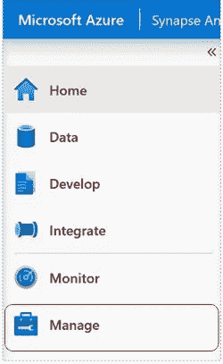
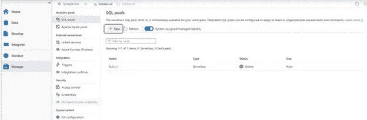
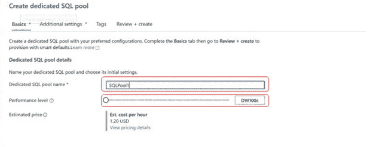
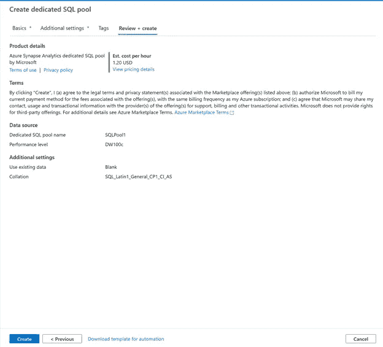
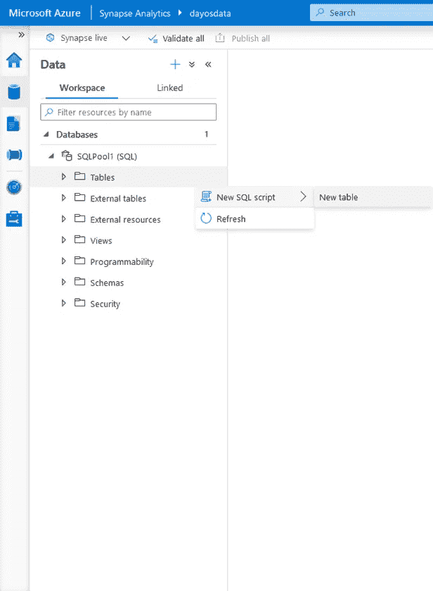
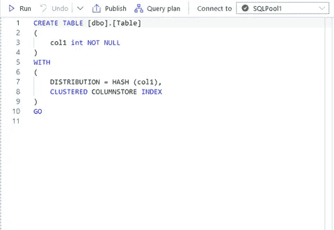

# Azure Synapse Analytics 中的专用 SQL 池是什么？

> 原文：<https://towardsdatascience.com/what-are-dedicated-sql-pools-in-azure-synapse-analytics-67ff2548966c?source=collection_archive---------7----------------------->

## Azure Synapse Analytics 中的大数据解决方案

弗兰基·查马基在 [Unsplash](https://unsplash.com?utm_source=medium&utm_medium=referral) 上拍摄的照片

TLDR

*   Synapse SQL 池的背景
*   什么是专用 SQL 池？
*   怎么用？
*   创建您第一个专用 SQL 池
*   YouTube 视频对以下步骤进行了直观描述

# **Synapse SQL 池的背景**

自从我的上一篇帖子( [SQL On-Demand:一种更简单的数据查询方式|作者 Dayo bami kole | toward Data Science)](/sql-on-demand-an-easier-way-to-query-data-a9aa6e593f18)以来，Azure Synapse Analytics 已经向公众公开(正式发布)，我在帖子中提到了 Synapse 的一些顶级功能，其中之一就是 SQL Pool。有几种方法可以在 Azure Synapse 中查询数据，有 SQL 池和 Apache Spark 池。有两种类型的 SQL 池:专用的和无服务器的。在随后的一篇文章中，我重点介绍了以前称为 SQL On-Demand 的无服务器 SQL 池。在这篇文章中，我将重点关注专用的 SQL 池。

# **什么事**

SQL 池是传统的数据仓库。在加入 Synapse 家族之前，它的前身是 Azure SQL 数据仓库。它是一个大数据解决方案，以列存储的关系表格式存储数据。它还使用大规模并行处理(MPP)架构来利用多达 60 个节点来运行查询。一旦您将数据存储在专用的 SQL 池中，您就可以利用它从仪表板进行历史分析，将其用作机器学习的数据集，以及您可能用于大规模数据集的任何其他数据目标。

有关 Synapse SQL 架构的更多信息，请查看微软文档

[https://docs . Microsoft . com/en-us/azure/synapse-analytics/SQL/overview-architecture](https://docs.microsoft.com/en-us/azure/synapse-analytics/sql/overview-architecture)

# **目标**

使用专用 SQL 池的目标是存储大规模数据，并能够高效地进行查询。这更容易，因为它是以列格式存储的，并且您可以利用聚集列存储索引进行快速检索。

# **如何使用**

你可能想知道如何将数据输入这个平台，对吗？

围绕专用 SQL 池，您会经常听到一个术语，即 Polybase。什么是 Polybase，它是一个允许你从外部资源查询数据的工具，例如 SQL Server，Oracle，Teradata，MongoDB 等。您可以看到使用专用 SQL 池的好处。一旦数据被摄取，Polybase 还提供了查询大数据的能力。

# **创建您的第一个专用 SQL 池**

如果你已经有了 Synapse 环境，那就非常简单了。如果你需要一些帮助，看看我的介绍视频[这里](https://www.youtube.com/watch?v=xYfK4-FAWec)

在您的 Azure Synapse 环境中，单击管理

作者图片

在 SQL 池下，单击新建

作者图片

为专用 SQL 池命名

将性能级别扩展到您选择的级别。

作者图片

点击查看+创建

点击底部的创建

作者图片

**创建您的第一个 SQL 池表**

进入数据库部分。您可能需要刷新数据库部分。您应该会看到新创建的 SQLPool。展开它，您会看到 SQL Server 等数据库的相似之处。

要创建您的第一个表，您将右键单击“表”部分并选择“新 SQL 脚本”，然后选择“新表”

作者图片

这将创建一个默认的表脚本。您所要做的就是单击 Run 来创建您的第一个表

作者图片

显然，这只是一个示例脚本，您可以在这里编写各种类型的查询以用于大数据目的

# **结论**

既然您已经创建了第一个专用的 SQL 池，那么您现在已经对 Azure Synapse 中有助于构建端到端数据解决方案的众多功能之一有了一些体验。请继续关注 Azure Synapse Analytics 的其他组件以及它们之间的联系。