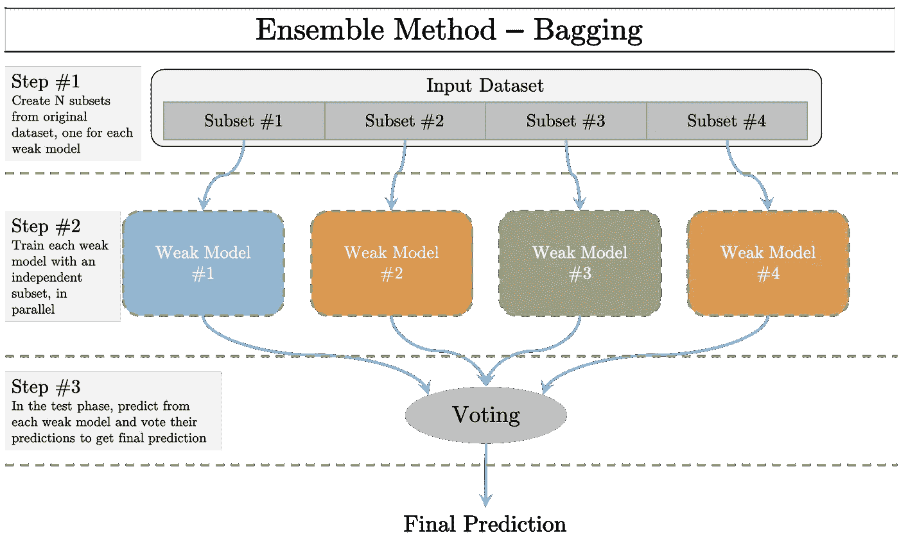
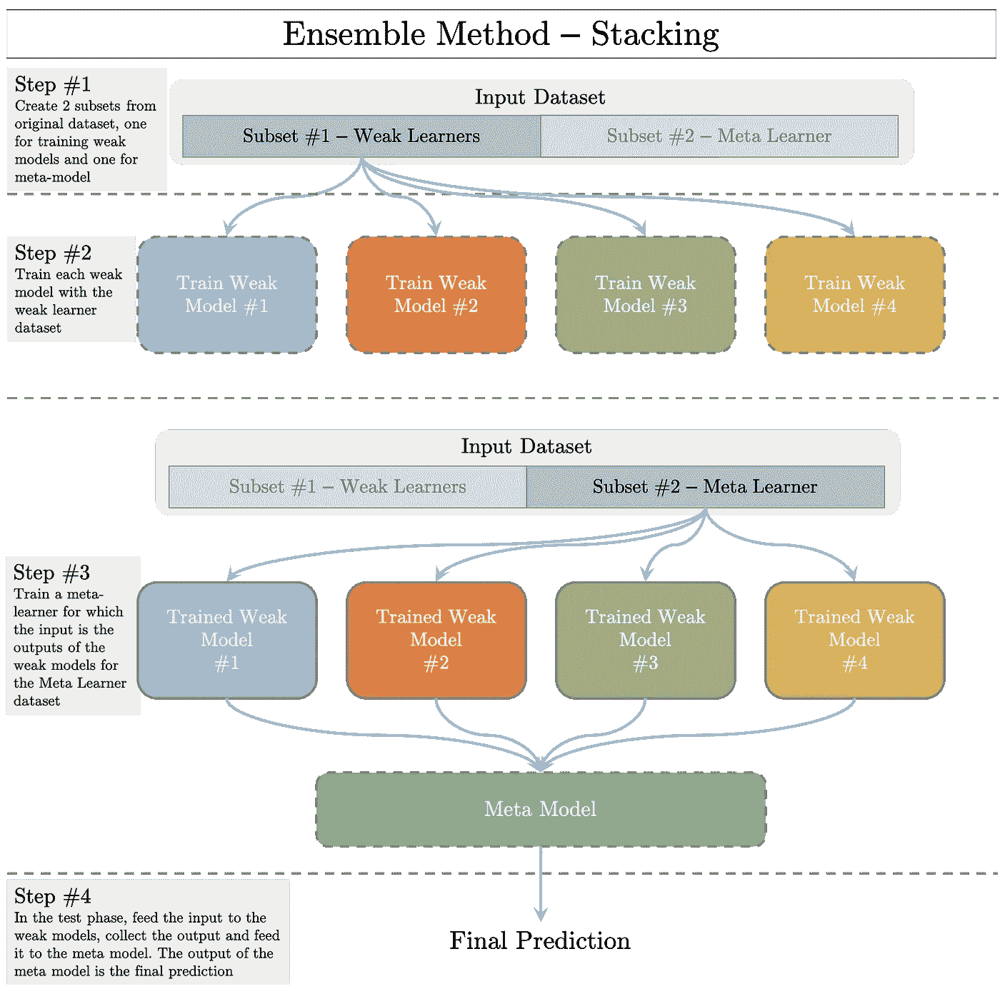
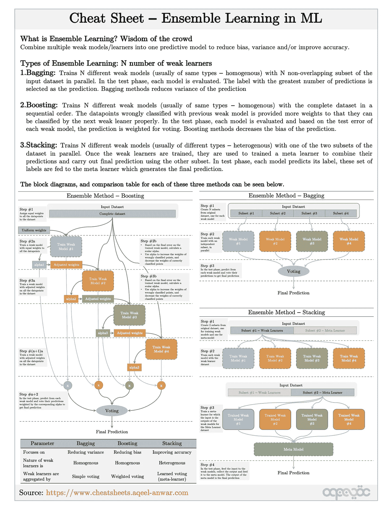

# 机器学习中的集成方法有哪些？

> 原文：<https://towardsdatascience.com/what-are-ensemble-methods-in-machine-learning-cac1d17ed349?source=collection_archive---------18----------------------->

作者图片

带有备忘单的机器学习集成方法的可视化漫游

# 背景

假设你搬到了一个新地方，想出去吃饭。你如何找到一个好地方？

解决方案 1: 找一位真正擅长自己工作的美食评论家，看看他/她对你所在地区的餐馆有什么推荐

**解决方案 2:** 使用谷歌，随机查看**一个用户对几家餐馆的评论**。

**解决方案 3:** 使用谷歌，查看**多个用户对几家餐馆的评论**，然后**平均他们的评分**。

让我们分析上述每一种解决方案。

## 解决方案 1:

1.  食物评论家通常是非常准确的。
2.  很难找到一个美食评论家
3.  也许你找到的美食评论家是个严格的素食主义者，而你不是。在那种情况下，美食评论家的推荐将会有偏见。

## 解决方案 2:

另一方面，在网上随便拿起一个人对一家餐馆的星级评定就是

1.  远不如**准确**
2.  **更容易找到**

## 解决方案 3:

1.  总的来说，它可以是你需要的正确的精确度
2.  更容易在网上找到
3.  因为给餐馆评分的用户来自不同的背景，所以不存在偏见。

因此，不需要问美食评论家，你只需看看一群随机的(但人数众多的)人的集体意见，就能得到相当不错的餐馆推荐。这就是所谓的 ***群体智慧*** ，是各种信息网站的支柱，如 *Quora、Stack-exchange 和 Wikipedia* 等。

# 什么是系综方法？

机器学习中的集成方法集体使用多个弱学习器来预测输出。您不是为数据集训练一个大型/复杂的模型，而是训练多个小型/简单的模型(弱学习者)并聚合它们的输出(以各种方式)来形成您的预测，如下图所示

推论:系综法(图片由作者提供)

# 集合方法的类型

一般来说，有三种不同类型的集成方法目前常用于 ML

1.  制袋材料
2.  助推
3.  堆垛

这些方法具有相同的 ***群体智慧*** 概念，但在细节上有所不同**关注**什么，使用 t **类型的弱学习者**和用于形成最终输出的**类型的聚集**。

## 1.制袋材料

在 Bagging(**B**oot strap**Agg**erat**ing**中，多个学困生被并行训练**。对于每一个弱学习者，输入数据是从原始数据集中随机抽样替换并训练的。具有替换的子集的随机采样创建了接近 iid 的样本。在推理过程中，测试输入被提供给所有弱学习者，输出被收集。通过对每个弱学习者的输出进行投票来进行最终预测。**

**完整的步骤如下面的框图所示。**

****

**集合方法— Bagging(图片由作者提供)**

**在 bagging 方法中，弱学习者通常属于同一类型。由于替换随机抽样产生 iid 样本，集合 iid 变量不会改变偏差，但会减少方差，因此 bagging 方法不会改变预测中的偏差，但**会减少其方差**。**

## **2.助推**

**在 boosting 中，多个弱学习者被顺序学习**。每个随后的模型通过给予被先前的弱学习者错误分类的数据点更多的重要性来训练。以这种方式，弱学习者可以关注特定的数据点，并且可以共同地**减少预测的偏差**。完整的步骤如下面的框图所示。****

********

****集成方法—增强(图片由作者提供)****

****通过对数据集中的所有数据点赋予相等的权重来训练第一个弱学习者。一旦训练了第一个弱学习者，评估每个点的**预测误差。基于每个数据点的误差，更新下一个学习者的数据点的相应权重。如果数据点被经过训练的弱学习者正确分类，则减少其权重，否则增加其权重。除了更新权重之外，每个弱学习者还维护一个标量 alpha，该 alpha 量化弱学习者在分类整个训练数据集方面有多好。******

****随后的模型在这些加权的点集上被训练。对一组加权点进行训练的一种方式是表示误差中的权重项。不使用均方误差，而是使用加权均方误差，以确保具有较高分配权重的数据点在被正确分类时被赋予更大的重要性。另一种方式可以是加权采样，即在训练时基于它们的权重来采样点。****

****在推理阶段，测试输入被提供给所有的弱学习者，他们的输出被记录下来。如上图所示，在使用弱学习者的输出进行投票之前，通过用相应的弱学习者的权重α缩放每个弱学习者的输出来实现最终预测。****

## ****3.堆垛****

****在堆叠中，多个弱学习者被并行训练，这类似于装袋中发生的情况。但与 bagging 不同，stacking 不执行简单的投票来聚合每个弱学习者的输出，以计算最终的预测。相反，另一个元学习者在弱学习者的输出上被训练，以学习从弱学习者输出到最终预测的映射。完整的框图如下所示。****

********

****集合方法—叠加(图片由作者提供)****

****堆叠通常有不同类型的弱学习者。因此，对所有弱学习者的预测给予同等权重的简单投票方法看起来并不是一个好主意(如果弱学习者在结构上是相同的，它本来会是一个好主意)。这就是元学习者出现的地方。它试图了解哪个弱学习者更重要。****

****弱学习者是并行训练的，而元学习者是顺序训练的。一旦弱学习者被训练，他们的权重保持不变来训练元学习者。通常，元学习者是在不同于弱学习者的子集上被训练的。****

# ****小抄****

****下面的备忘单涵盖了可能会派上用场的集合方法的主题。****

********

****小抄综合方法(来源:[http://cheatsheets.aqeel-anwar.com/](http://cheatsheets.aqeel-anwar.com/)****

# ****摘要****

****集成方法不是训练一个网络，而是使用多个弱学习者，并聚集他们各自的输出来创建最终的预测。不同集合方法的比较可以在下表中看到。****

********

****集成方法的比较(图片由作者提供)****

# ****奖金:****

****可以在下面的链接中找到这个主题和机器学习中许多其他重要主题的紧凑备忘单****

****<https://medium.com/swlh/cheat-sheets-for-machine-learning-interview-topics-51c2bc2bab4f> **** 

******如果这篇文章对你有帮助，欢迎鼓掌、分享和回复。如果你想了解更多关于机器学习和数据科学的知识，请关注我@**[**Aqeel an war**](https://medium.com/u/a7cc4f201fb5?source=post_page-----cac1d17ed349--------------------------------)**或者在**[***LinkedIn***](https://www.linkedin.com/in/aqeelanwarmalik/)***上与我联系。*******