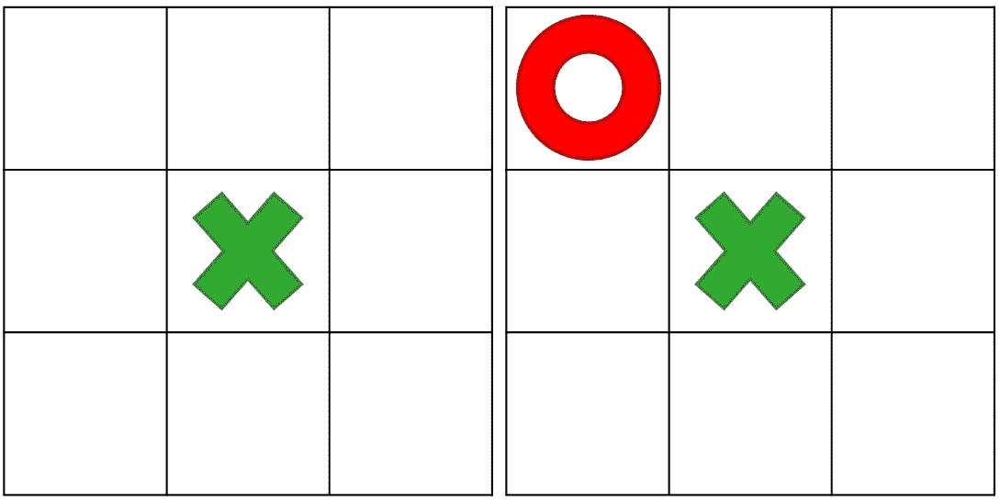
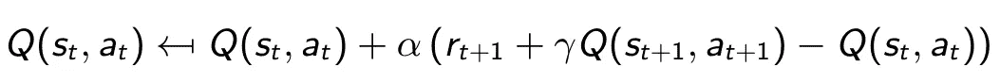
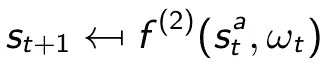
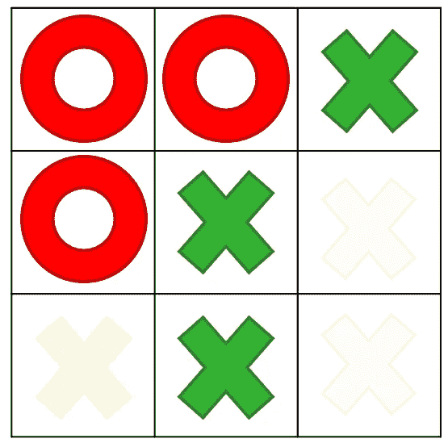
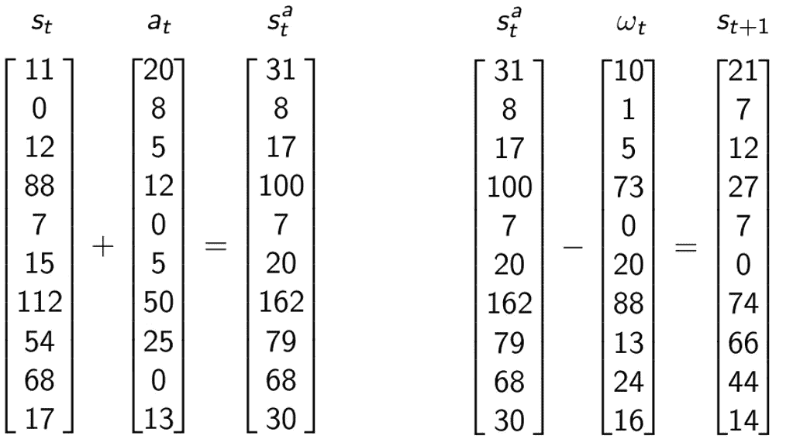

# 什么是后决策状态？他们想从我们这里得到什么？

> 原文：<https://towardsdatascience.com/what-are-post-decision-states-and-what-do-they-want-from-us-9e02105b7f40?source=collection_archive---------44----------------------->

## 阐明强化学习中的转移函数和状态-动作对

一个井字游戏完美地展示了后决策状态的概念[作者自己的作品]

以一个经验丰富的强化学习老手的反高潮开始；后决策状态并不新奇或惊天动地。还没点开？很好，因为实际上有一些内容出现了。在本文中，我们将更深入地研究状态-动作对和转移函数的概念，提供从一个问题状态转移到另一个问题状态的过程的洞察力。

# 转换函数

在强化学习(RL)的最简单表示中，我们有一些**概率函数** `p(s_t+1|s_t,a_t)`引导我们到新的状态。我们处于状态`s_t`，采取行动`a_t`，并神奇地以某种概率`p`转移到状态`s_t+1`。此外，我们可以定义一个集合`S’`,它包含所有的结果状态`s_t+1`,在给定我们的动作的情况下，这些结果状态可以从我们的当前状态到达。自然地，该集合中所有状态的概率总和应该是 1。

听起来很简单，但是许多有趣的信息隐含在这个看似简单的概率函数中。如果我们的目标是更明确地试图描述从状态`s_t`移动到`s_t+1`的过程，我们可以称之为**转移函数**；一些明确的功能`f()`引导我们从一种状态到另一种状态。拥有“一些”结果状态`S’`并不是非常有用，因此在这一点上引入外部信息变量`*ω_t*` *是很好的。*这个变量可以封装任何不在我们控制范围内的信息:骰子上的眼睛数量、明天的降雨量、比特币价格、未来的石油需求……简而言之，`*ω_t*` 捕捉到了我们转变的不确定性，并可能被视为区间`(t,t+1]`中透露的信息。这就是强化学习的内容；我们部分地通过自己的行为来影响回报，部分地预测世界会给我们带来什么。目的是仔细选择我们的行动，这样我们就能在有利的位置上面对未来。

有了我们的外生信息变量`ω_t`，我们现在可以尝试定义一个显式的转移函数。设`Ω_t`是所有可能变量`ω_t`的集合；将这些变量视为场景可能更方便。综上所述:我们从`s_t`到`s_t+1`的转变取决于当前(预决策)状态`s_t`，被选择的动作`a_t`和外生信息`ω_t`的实现:

转换函数(从一个预决策状态到下一个状态)

# 决策后状态

到目前为止，一切顺利。现在让我们来讨论一下 Q 值。正如你可能知道的，基于值的 RL 算法学习对应于状态-动作对的值。这些 Q 值——用`Q(s_t,a_t)`表示——捕获了我们当前行动的*预期*下游值。作为复习，看看 SARSA 算法的规范更新公式[2]:

用 SARSA 更新状态-动作对的 Q 值的函数

学习与状态-动作对相关的预期下游值听起来有点抽象，这就是**后决策状态** — 在【2】中详细解释的地方——可能会有所启发。我们已经确定我们的转变是部分确定的(由于我们的行动`a_t`)和部分随机的(由于`ω_t`的随机表现)。为什么不把这两个元素分开，看看会发生什么？

首先，我们引入一个转移函数`f^(1)`来从我们当前的预决策状态`s_t`转移到后决策状态`s_t^a`。请注意，这种转变是完全确定的，并且不需要时间来向前移动，我们可以在选择一个操作的瞬间计算它:

从预决策状态到后决策状态的转换函数

第二，我们有一个转换函数`f^(2)`从决策后状态`s_t^a`移动到下一个决策前状态`s_t+1`。这个函数是完全随机的；完全取决于`ω_t`的实现。根据定义，我们的动作是基于状态`s_t`中嵌入的信息，因此，新信息`ω_t`必须在采取动作后到达*。因此，第二个转换函数意味着时间的流逝，在此期间新的信息被揭示:*

从决策后状态到下一个决策前状态的转换函数

所以现在我们有两个转移函数，而不是一个。这看起来没什么进步，但是请耐心听我说。

# 井字游戏

有什么比用一个老式的井字游戏更好的方式来说明一个概念呢？让我们考虑一下游戏开始时的状态。决策前状态`s_0`显然是一个空棋盘，而我们有九个可行的动作`a_0(s_0)`，因此可能达到九个决策后状态`s_0^a`(注意这相当于评估九个状态-动作对)。

决策前状态(左窗格)，九个可达到的决策后状态(右窗格)[作者自己的作品]

为了真正达到决策后状态，我们必须选择一个动作并填写`f^(1)(s_t,a_t)`。为了达到随后的预决策状态，我们必须等待——从我们的角度来看是外生的——对手的移动并填入`f^(2)(s_t^a,ω_t)`

第一个动作后的决策后状态(左窗格)和对手动作后的下一个决策前状态(右窗格)[作者自己的作品]

再举个例子？我们已经接近比赛的尾声了。我们有三个要考虑的行动，或者说，在上下文中，有三个可达到的决策后状态要评估。假设我们已经有了一些观察结果，我们可以知道两个后决策状态可能会产生很差的结果。

游戏接近尾声时可达到的决策后状态的可视化[作者自己的作品]

现在很容易看出价值函数`Q(s,a)`和`Q(s^a)`非常相似。后决策状态的关键是关于未来的确定性和随机性知识的综合分离。决策后状态提供了比决策前状态更多的最新信息，明确地捕获了最新的系统状态，而没有实际地及时向前移动。

# 特征设计

对于井字游戏来说，所有这些可能看起来有点做作，但是当我们为更现实的 RL 问题设计功能时，根据决策后状态进行思考的好处变得更加明显。通常，将这些特征建立在我们拥有的最新信息的基础上是有意义的。

假设我们有一个仓库，里面有一千种不同的商品，每种商品的数量反映在一个大的向量中(即状态)。根据预期的当前库存水平，我们决定(即行动)订购一定数量的每种商品。我们的决策后状态将是当前库存水平加上订单水平。这个*更新的*水平预测了，例如，预期的存储成本、过期库存和满足未来需求的能力——简而言之，预期的下游价值。因此，如果我们计算任何特征(例如所有项目的总体积、快速移动项目的数量)，我们是基于决策后向量来这样做的。实际上，这里的后决策向量是状态向量和动作向量的简单相加。从后决策到下一状态的转换减去`ω_t`的随机实现:

有 10 种产品类型的库存的转移函数示例。在左边的 f^(1)，通过向现有库存添加新订单，从 s_t 过渡到 `s_t^a`。右边的 f^(2)，从`s_t^a to s_t+1 by subtracting stochastic demand.`过渡

观察`s_t^a`是我们确定满足未来需求能力的最佳预测器。因此，当基于状态计算特性时，我们可能会利用某个函数`ϕ_f:s_t^a↦θ_f`(其中函数可以是神经网络，而`s_t^a`是输入向量)。当然，`ϕ_f:(s_t,a_t)↦θ_f`可能有完全相同的意思，但前者肯定更明确。正如 Python 的禅宗所说:

> “显性比隐性好”

# 外卖食品

*   决策后状态与状态-动作对密切相关，但是提供了关于信息可用性的更明确的观点。具体地说，它们体现了将状态-动作对转换成单个信息变量。
*   我们将传统的转移函数分成两个部分，清晰地区分在单个时间点的*确定性*转移(基于选定的动作)和随着时间推移的*随机*转移(基于环境)。
*   从决策后状态的角度思考通常有利于特征设计，因为我们希望特征基于我们最近的信息。

*本文关注状态-动作对和决策后状态之间的相似性。对差异感兴趣吗？请查看:*

 [## 关于后决策状态

### 论强化学习中状态-动作对和决策后状态的(不那么)细微差别。

towardsdatascience.com](/about-post-decision-states-again-5725e5c15d90) 

# 参考

[1]萨顿和巴尔托(2018 年)。*强化学习:简介*。麻省理工出版社。

[2]鲍威尔(2007 年)。*近似动态规划:解决维数灾难*。约翰·威利&的儿子们。