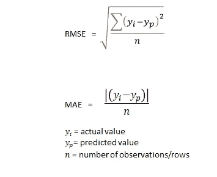
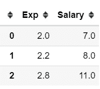
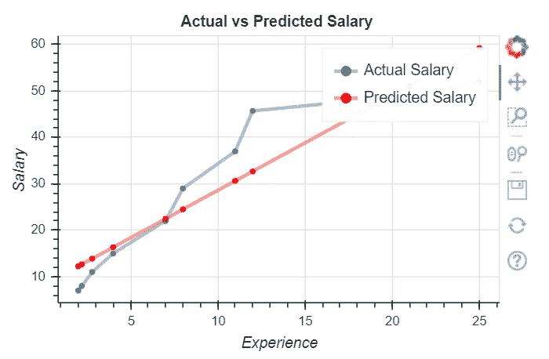
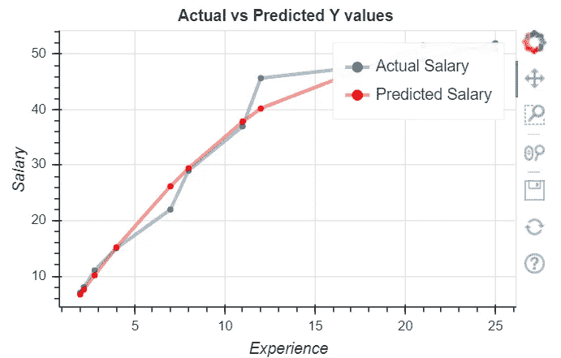
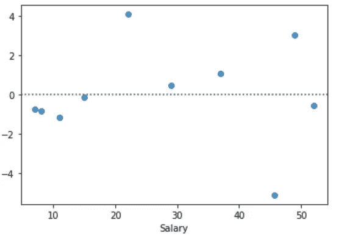
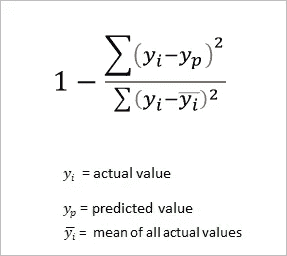

# RMSE 和梅是什么？

> 原文：<https://towardsdatascience.com/what-are-rmse-and-mae-e405ce230383?source=collection_archive---------3----------------------->

## 评估指标的简单指南

均方根误差(RMSE)和平均绝对误差(MAE)是用于评估回归模型的指标。这些指标告诉我们我们的预测有多准确，以及与实际值的偏差有多大。


帕特丽夏·塞尔纳在 [Unsplash](https://unsplash.com/s/photos/inch?utm_source=unsplash&utm_medium=referral&utm_content=creditCopyText) 上的照片

从技术上来说，RMSE 是 **E** 错误的 **S** 方的 **R** oot，而 MAE 是**A**b 错误的 **M** ean。在这里，误差是一个变量的预测值(由我们的回归模型预测的值)和实际值之间的差异。它们的计算方法如下:



仔细观察，你会发现两者都是误差的平均值。

我们用一个例子来理解这个。比如说，我想根据经验的年数来预测一个数据科学家的工资。所以，工资是我的目标变量(Y)，经验是自变量(X)。我有一些关于 X 和 Y 的随机数据，我们将使用[线性回归](https://en.wikipedia.org/wiki/Linear_regression)来预测工资。让我们使用[熊猫](https://pandas.pydata.org/)和 [scikit-lear](https://scikit-learn.org/stable/getting_started.html) n 进行数据加载和创建线性模型。

```
import pandas as pd
from sklearn.linear_model import LinearRegressionsal_data={"Exp":[2,2.2, 2.8, 4, 7, 8, 11, 12, 21, 25], 
          "Salary": [7, 8, 11, 15, 22, 29, 37 ,45.7, 49, 52]}#Load data into a pandas Dataframe
df=pd.DataFrame(sal_data)
df.head(3)
```



```
#Selecting X and y variablesX=df[['Experience']]
y=df.Salary#Creating a Simple Linear Regression Model to predict salarieslm=LinearRegression()
lm.fit(X,y)#Prediction of salaries by the model
yp=lm.predict(X)
print(yp)[12.23965934 12.64846842 13.87489568 16.32775018 22.45988645 24.50393187 30.63606813 32.68011355 51.07652234 59.25270403]
```

现在，我们有了“yp”——我们的工资预测数组，我们将通过绘制预测工资(yp)和实际工资(y)来评估我们的模型。我正在用 [bohek](https://docs.bokeh.org/en/latest/index.html) 进行我的可视化。

```
from bokeh.plotting import figure, show, output_filep=figure(title="Actual vs Predicted Salary", width=450, height=300)
p.title.align = 'center'
p.circle(df.Exp, df.Salary)
p.line(df.Exp, df.Salary, legend_label='Actual Salary', line_width=3, line_alpha=0.4)
p.circle(df.Exp, yp, color="red")
p.line(df.Exp,yp, color="red",legend_label='Predicted Salary', line_width=3, line_alpha=0.4)p.xaxis.axis_label = 'Experience'
p.yaxis.axis_label = 'Salary'show(p)
```



从上图中，我们看到预测数据点和实际数据点之间存在差距。在统计学上，这种差距/差异被称为残差，通常被称为误差，用于 RMSE 和 MAE。Scikit-learn 提供了[度量](https://scikit-learn.org/stable/modules/classes.html#module-sklearn.metrics)库来计算这些值。然而，我们将通过使用上面的数学表达式来计算 RMSE 和 MAE。这两种方法会给你同样的结果。

```
import numpy as np
print(f'Residuals: {y-yp}')
np.sqrt(np.mean(np.square(y-yp)))  #RMSEnp.mean(abs(y-yp))                 #MAE#RMSE/MAE computation using sklearn library
from sklearn.metrics import mean_squared_error, mean_absolute_errornp.sqrt(mean_squared_error(y, yp))
mean_absolute_error(y, yp)**6.48
5.68**
```

这是我们的基线模型。MAE 约为 5.7——似乎更高。现在我们的目标是通过减少这个误差来改进这个模型。

让我们用同样的模型对“experience”(X)进行多项式变换，看看我们的误差是否减少了。

```
from sklearn.preprocessing import PolynomialFeatures
pf=PolynomialFeatures()     #Linear Equation of degree 2
X_poly=pf.fit_transform(X) lm.fit(X_poly, y)
yp=lm.predict(X_poly)
```

我已经使用 Scikit-learn [多项式特性](https://scikit-learn.org/stable/modules/generated/sklearn.preprocessing.PolynomialFeatures.html)创建了一个 1、X 和 X2 的矩阵，并将其作为输入传递给我的模型。

计算我们的误差指标和…

```
#RMSE and MAE
np.sqrt(np.mean(np.square(y-yp)))
np.mean(abs(y-yp))**2.3974
1.6386**
```

瞧……他们这次低多了。它比我们的基线模型更适合！让我们画出 y 和 yp(就像我们之前做的那样)来检查重叠部分。



两条线之间的间隙已经减小。让我们使用 seaborn 的[残差](https://seaborn.pydata.org/generated/seaborn.residplot.html)绘图函数来观察残差或误差(y-yp)的分布

```
print(y-yp)   #residuals
[ 0.333921 0.447306  0.84028668 -0.136044 -4.190238 -0.434767
 -0.847751  5.488121 -2.584481  1.083648]import seaborn as sns
sns.residplot(y, yp)  
plt.show()
```



我们看到残差往往集中在 x 轴周围，这是有意义的，因为它们可以忽略不计。

还有第三个指标——R 平方得分，通常用于回归模型。这衡量了我们的模型可以解释的变化量，即我们的模型返回的正确预测的百分比。它也被称为决定系数，通过以下公式计算:



让我们使用公式和 sklearn 库来计算 R2，并比较这些值。这两种方法应该给你相同的结果。

```
#Calculating R-Squared manually
a=sum(np.square(y-yp))           # a -> sum of square of residuals
b=sum(np.square(y-np.mean(y)))   # b -> total sum of sqauresr2_value = 1-(a/b)
**0.979**#calculating r2 using sklearn
from sklearn.metrics import r2_score
print(r2_score(y, yp))
**0.979**
```

因此，总的来说，我们可以认为 98%的模型预测是正确的，误差的变化在 2 个单位左右。对于一个理想的模型，RMSE/梅=0，R2 分数= 1，所有的剩余点都在 X 轴上。对于任何业务解决方案来说，实现这样的价值几乎是不可能的！

我们可以用来提高模型准确性的一些技术包括:

*   变换/缩放功能
*   处理异常值(如果有)
*   添加新功能/功能工程
*   使用不同的算法
*   模型超参数调谐

在我的下一篇文章中，我将详细解释上面的一些概念。以上代码可以参考我的笔记本[这里](https://github.com/sacharya225/data-expts/blob/master/SalaryPrediction_Regression.ipynb)。