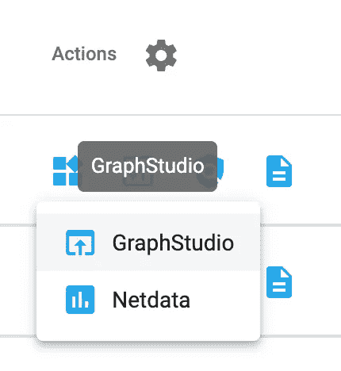
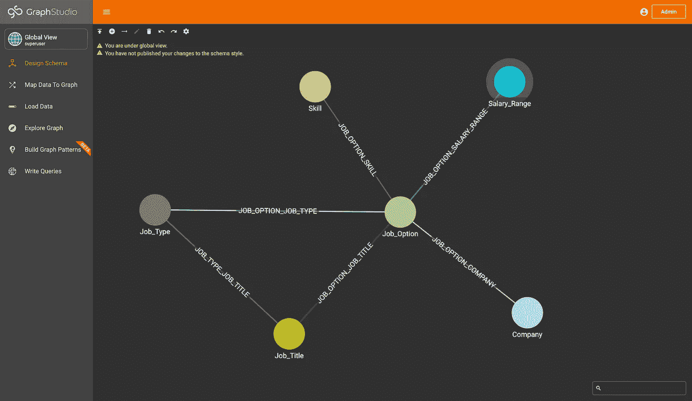
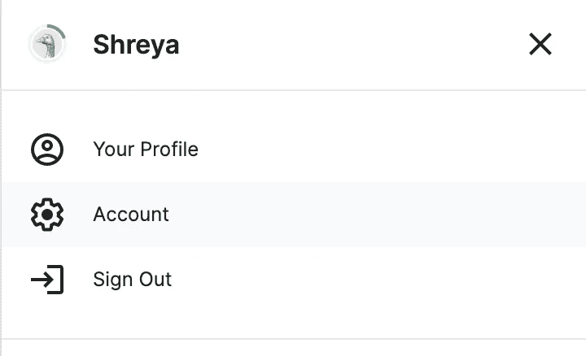
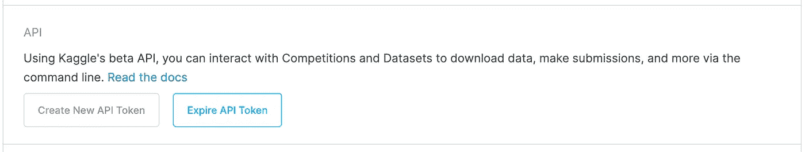
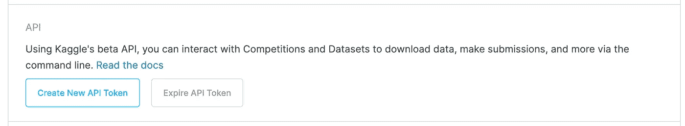

# 数据科学工作最受欢迎的技能是什么？求一个图形数据库！

> 原文：<https://towardsdatascience.com/what-are-the-most-popular-skills-for-data-science-jobs-ead45f56841?source=collection_archive---------32----------------------->

## 通过用 TigerGraph、实际工作数据和 Kaggle API 构建 Indeed.com 工作图来寻找下一份工作

# 概观

图表无处不在，可以帮很多忙，包括找工作。像 LinkedIn 这样的平台由图表数据库驱动，帮助向你推荐工作。在这篇博客中，我们将创建一个可以帮助你回答一些问题的图表，比如什么技能最适合我想要的工作和工资范围。让我们构建图表，然后回答图表上的一些问题。

# 第一部分:在 TigerGraph 云上创建解决方案

首先，您需要在 TigerGraph Cloud 上创建一个解决方案。关注本博客了解更多详情:

<https://www.tigergraph.com/blog/getting-started-with-tigergraph-3-0/>  

简而言之，您需要:

1.  导航到[https://tgcloud.io/.](https://tgcloud.io/.)
2.  单击“我的解决方案”选项卡。
3.  点击右上角的蓝色“创建解决方案”按钮。
4.  在第一页按“空白”。
5.  不要更改第二页中的任何内容，然后按下一步。
6.  根据您的详细信息定制第三页。
7.  提交您的解决方案，等待它被创建。

# 第二部分:创建图表模式

现在让我们去 https://colab.research.google.com/的[创建一个新的 Colab 笔记本。创建之后，让我们连接到图表，然后创建图表模式，这有点像我们将如何加载数据的地图。](https://colab.research.google.com/)

## 步骤 1:连接到您的解决方案

首先，让我们安装并导入 pyTigerGraph。

```
!pip install pyTigerGraphimport pyTigerGraph as tg
```

接下来，让我们创建一个 TigerGraphConnection，将我们连接到我们刚刚创建的 TG 云解决方案。

> 注意:用您在第一部分中分配的子域和密码替换子域和密码。

```
conn = tg.TigerGraphConnection(host="https://SUBDOMAIN.i.tgcloud.io/", password="PASSWORD")
```

一旦运行，您就可以开始了！

## 第二步:创建您的模式和图表

现在我们已经连接到我们的解决方案，让我们创建一个新的图表，我们的 JobGraph。为此，我们将有六个顶点(工作、工作类型、职称、工资范围、公司和技能)和六条边。

```
print(conn.gsql('''CREATE VERTEX Job_Option(PRIMARY_ID job_id INT, job_link STRING, num_skills INT, num_reviews DOUBLE, num_stars DOUBLE)
CREATE VERTEX Job_Type(PRIMARY_ID job_type_id STRING) WITH PRIMARY_ID_AS_ATTRIBUTE="true"
CREATE VERTEX Job_Title(PRIMARY_ID job_title_id STRING) WITH PRIMARY_ID_AS_ATTRIBUTE="true"
CREATE VERTEX Salary_Range(PRIMARY_ID salary_range STRING) WITH PRIMARY_ID_AS_ATTRIBUTE="true"
CREATE VERTEX Company(PRIMARY_ID company_name STRING) WITH PRIMARY_ID_AS_ATTRIBUTE="true"
CREATE VERTEX Skill(PRIMARY_ID skill STRING) WITH PRIMARY_ID_AS_ATTRIBUTE="true"CREATE UNDIRECTED EDGE JOB_OPTION_JOB_TYPE(FROM Job_Option, TO Job_Type)
CREATE UNDIRECTED EDGE JOB_OPTION_JOB_TITLE(FROM Job_Option, TO Job_Title)
CREATE UNDIRECTED EDGE JOB_TYPE_JOB_TITLE(FROM Job_Type, TO Job_Title)
CREATE UNDIRECTED EDGE JOB_OPTION_SALARY_RANGE(FROM Job_Option, To Salary_Range)
CREATE UNDIRECTED EDGE JOB_OPTION_COMPANY(FROM Job_Option, To Company)
CREATE UNDIRECTED EDGE JOB_OPTION_SKILL(FROM Job_Option, To Skill)'''))
```

一旦你创建了顶点和边，把它们放在一起形成一个图，我们称之为 JobGraph。

```
print(conn.gsql('''CREATE GRAPH JobGraph(Job_Option, Job_Type, Job_Title, Salary_Range, Company, Skill,JOB_OPTION_JOB_TYPE, JOB_OPTION_JOB_TITLE, JOB_TYPE_JOB_TITLE, JOB_OPTION_SALARY_RANGE, JOB_OPTION_COMPANY, JOB_OPTION_SKILL)'''))
```

完美！通过按 Actions 和 GraphStudio 下的四个方块导航到 GraphStudio。



转到动作下的四个框，然后按“GraphStudio”(作者图片)

点击侧边栏中的“设计模式”。在那里，您将看到刚刚创建的模式！



查看 GraphStudio 中的模式(图片由作者提供)

## 第三步:更新你的图名和令牌

太棒了，我们快完成了！在加载数据和运行查询之前，让我们更新连接凭证。

```
conn.graphname = "JobGraph"conn.apiToken = conn.getToken(conn.createSecret())
```

完美！现在让我们输入数据。

# 第三部分:加载您的数据

## 第一步:创建一个 Kaggle 令牌

我们将从位于[这里](https://www.kaggle.com/elroyggj/indeed-dataset-data-scientistanalystengineer)的 Kaggle 的 Indeed dataset 中获取数据。该数据包含数据科学家、数据分析师和数据工程师的工作信息。

<https://www.kaggle.com/elroyggj/indeed-dataset-data-scientistanalystengineer>  

首先，在 kaggle.com 上创建一个帐户。

  

接下来，在主页中单击您的个人资料图片。在打开的边栏中，按下“帐户”



按下你的个人资料表，然后选择“帐户”(作者图片)

向下滚动页面，然后在 API 下，按“API 令牌过期”这将使任何现有的 API 过期。



按“过期 API 令牌”

接下来，按“创建新的 API 令牌”,它将自动下载您的令牌作为 kaggle.json。



按“创建新的 API 令牌”将下载“kaggle.json”(图片由作者提供)

完美！现在您已经有了 API 令牌，让我们在笔记本中加载数据。

## 第二步:从 Kaggle 加载数据

首先，您需要安装 Kaggle 库。

```
!pip install -q kaggle
```

接下来，让 Colab 提示您上传一个文件。上传刚刚下载的 kaggle.json 文件。

```
from google.colab import filesfiles.upload()
```

太棒了。现在让我们创建 Kaggle 文件夹并使其可访问，然后下载数据。我们将它存储在一个名为 data 的文件夹中。

```
! mkdir ~/.kaggle
! cp kaggle.json ~/.kaggle/
! chmod 600 ~/.kaggle/kaggle.json
! kaggle datasets list! kaggle datasets download -d elroyggj/indeed-dataset-data-scientistanalystengineer
! unzip indeed-dataset-data-scientistanalystengineer.zip -d data
! ls data
```

从结果来看！ls 数据，你会发现两个文件。有我们数据的文件是 indeed_job_dataset.csv(在 data 的目录下，所以 data/indeed_job_dataset.csv)。


ls 的结果(图片由作者提供)

太好了！现在让我们将数据加载到图表中。

## 第二步:将数据插入图表

让我们使用 pandas 创建一个 indeed_job_dataset.csv 的数据框架。

```
import pandas as pddata = pd.read_csv("data/indeed_job_dataset.csv")
```

接下来，让我们编辑一些列值和名称，以确保一切都可以向上插入。

```
data["id_val"] = [val for val in data["Unnamed: 0"]]
data = data.drop("Unnamed: 0", 1)data["Company"] = ["No Company Found" if type(i) != str else i for i in data["Company"]]
```

完美！现在我们的数据已经准备好了，让我们向上插入所有的顶点和边。

```
conn.upsertVertexDataFrame(data, "Job_Type", "Job_Type", attributes={"job_type_id": "Job_Type"})
conn.upsertVertexDataFrame(data, "Job_Title", "Job_Title", attributes={"job_title_id": "Job_Title"})
conn.upsertVertexDataFrame(data, "Salary_Range", "Queried_Salary", attributes={"salary_range": "Queried_Salary"})
conn.upsertVertexDataFrame(data, "Company", "Company", attributes={"company_name": "Company"})conn.upsertEdgeDataFrame(data, "Job_Option", "JOB_OPTION_SALARY_RANGE", "Salary_Range", "Job_Type", "Queried_Salary", attributes={})
conn.upsertEdgeDataFrame(data, "Job_Option", "JOB_OPTION_COMPANY", "Company", "Job_Type", "Job_Title", attributes={})
conn.upsertEdgeDataFrame(data, "Job_Type", "JOB_TYPE_JOB_TITLE", "Job_Title", "Job_Type", "Job_Title", attributes={})
conn.upsertEdgeDataFrame(data, "Job_Option", "JOB_OPTION_JOB_TITLE", "Job_Title", "id", "Job_Title", attributes={})
conn.upsertEdgeDataFrame(data, "Job_Option", "JOB_OPTION_JOB_TYPE", "Job_Type", "id", "Job_Type", attributes={})
```

由于“Skills”是数据帧中的一个列表，我们将分别向上插入每个顶点和边，而不是通过数据帧。运行此代码块以加载技能:

```
for job in range(len(data["Skill"])):
   if type(data["Skill"][job]) == str:
      for skill in eval(data["Skill"][job]):
         conn.upsertVertex("Skill", skill, attributes={"skill": skill})
         conn.upsertEdge("Job_Option", job, "JOB_OPTION_SKILL", "Skill", skill)
```

之后，我们将所有数据加载到我们的图表中！现在我们的图表已经准备好了，让我们开始查询我们的数据，从标题中提出问题。

# 第四部分:编写查询

## 问题 1:总体而言，什么是最受欢迎的技能(对于数据科学家、数据分析师和数据工程师而言)？

首先，我们来找最热门的整体技能。

```
conn.gsql('''USE GRAPH JobGraphDROP QUERY topSkillsCREATE QUERY topSkills () FOR GRAPH JobGraph {SumAccum<INT> @connectedJobs;Seed = {Job_Option.*};Res = SELECT tgt FROM Seed:s - (JOB_OPTION_SKILL:e) - Skill:tgt
      ACCUM tgt.@connectedJobs+=1
      ORDER BY tgt.@connectedJobs DESC
      LIMIT 5;PRINT Res;}INSTALL QUERY topSkills''')
```

结果如下:

```
[
  {
    "Res": [
      {
        "attributes": {
          "[@connectedJobs](http://twitter.com/connectedJobs)": 466,
          "skill": "Python"
        },
        "v_id": "Python",
        "v_type": "Skill"
      },
      {
        "attributes": {
          "[@connectedJobs](http://twitter.com/connectedJobs)": 434,
          "skill": "Machine Learning"
        },
        "v_id": "Machine Learning",
        "v_type": "Skill"
      },
      {
        "attributes": {
          "[@connectedJobs](http://twitter.com/connectedJobs)": 417,
          "skill": "R"
        },
        "v_id": "R",
        "v_type": "Skill"
      },
      {
        "attributes": {
          "[@connectedJobs](http://twitter.com/connectedJobs)": 351,
          "skill": "SQL"
        },
        "v_id": "SQL",
        "v_type": "Skill"
      },
      {
        "attributes": {
          "[@connectedJobs](http://twitter.com/connectedJobs)": 203,
          "skill": "Data Mining"
        },
        "v_id": "Data Mining",
        "v_type": "Skill"
      }
    ]
  }
]
```

因此，总而言之，最受欢迎的技能是:

*   计算机编程语言
*   机器学习
*   稀有
*   结构化查询语言
*   数据挖掘

完美！我们可以编写更多的查询来继续探索，但是我们现在已经回答了我们的主要问题。

# 第五部分:祝贺你！

恭喜你完成这篇博客！在这里，您了解了如何创建一个职位图来确定与数据相关的职位的主要技能。

如果您有任何问题，请随时加入 TigerGraph Discord 或在 TigerGraph 社区论坛中提问。

<https://community.tigergraph.com/> 