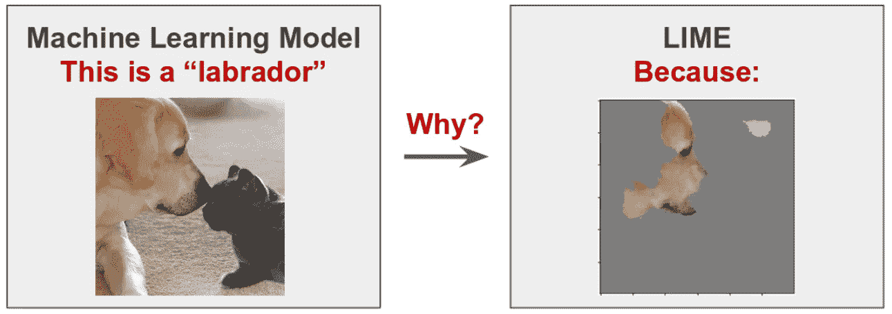

# 流行的解释方法有哪些？

> 原文：<https://towardsdatascience.com/what-are-the-prevailing-explainability-methods-3bc1a44f94df?source=collection_archive---------7----------------------->

图片作者([艾瑞泽艾](https://arize.com/))

## *欢迎来到“切片”，这是一个新的博客系列，解释了 ML 概念的本质*

*与*[*Amber Roberts*](https://arize.com/blog/introducing-amber-roberts/)*合作撰写，ML 销售工程师 at Arize AI*

机器学习(ML)的采用导致了一系列人工智能(AI)应用，这些应用涉及语言处理、计算机视觉、无监督学习甚至自治系统等不断增长的领域。

随着模型复杂性的增加，反思和理解模型为什么做出特定预测的能力变得越来越困难。它也变得越来越重要，因为 ML 模型做出的预测越来越影响我们生活的重要方面——从房屋贷款申请的结果到工作面试、[医疗](https://www.wsj.com/articles/medical-records-data-offers-doctors-hope-of-better-patient-care-11638543613)或[甚至监禁决定](https://www.technologyreview.com/2019/01/21/137783/algorithms-criminal-justice-ai/)。

**可解释性**是一种技术，旨在确定哪个模型特征或特征组合导致了特定的模型决策。比如一个模特是不是因为眼睛而认定某个动物具体是拉布拉多犬？鼻子？耳朵？还是各种各样的组合？

[图像信用:](https://nbviewer.org/url/arteagac.github.io/blog/lime_image.ipynb#Interpretable-Machine-Learning-with-LIME-for-Image-Classification)用 LIME 进行图像分类的可解释机器学习

机器学习模型可能会根据看似不合理的解释给出答案。为了理解*为什么*给出一个推论，使用了可解释的方法。这允许模型构建者以更有目的和更程序化的方式改进模型，以产生期望的结果或调整标准。然而，值得注意的是，可解释性并没有解释模型是如何工作的——相反，它提供了一个解释人类可以理解的反应的基本原理。

这篇文章的目标是强调不同的可解释方法，并演示如何将它们合并到流行的 ML 用例中。

## 解释可解释的人工智能

在机器学习领域，深度学习模型用于进行复杂的预测和决策。这些高级模型为各种领域产生了令人难以置信的发现，然而，由于其内部工作的不透明性，它们被戏称为“黑盒”。因此，对于工程师来说，追溯一个预测的根本原因是非常困难的，这就是 ML 可解释性方法和技术发挥作用的地方。

在基于一组特征预测房价的情况下，可解释性对各种特征(平方英尺、卧室数量、邮政编码、最后销售价格等)的重要性进行分类和标准化。)到房屋销售价格的预测。

模型可解释性示例图像由作者(阿里泽艾)

ML 可解释性有哪些不同的方法？

基于用例和环境，团队可以使用不同的方法来解释。这些通常由以下因素驱动:

*   模型类型:神经网络、树、基于图像或基于语言
*   无论您的团队是否可以直接访问模型
*   速度与精度的权衡
*   计算成本
*   全局和局部特征重要性
*   人工智能治理、风险管理和合规需求

***TL；博士:*** *可解释性是工具箱中的一个工具，帮助团队理解他们的模型所做的决策，以及这些决策对他们的客户/用户以及他们公司底线的影响。这本身就是一种近似，没有“完美”的解释者——每种方法都有一个权衡。*

在快速概述了 SHAP 和莱姆之后，我们将把重点放在特定模型和模型竞争的[可解释性技术](https://arize.com/blog/what-are-the-prevailing-explainability-methods/)。

## 什么是 SHAP？

SHAP(**Shapley Additive explations)**是一种用于分解复杂模型的单个预测的方法。SHAP 的目的是计算每个特征对预测的贡献，以便识别每个输入的影响。SHAP 解释技术使用植根于合作[联盟博弈论](https://en.wikipedia.org/wiki/Cooperative_game_theory)的原理来计算沙普利值。就像合作博弈理论最初看起来如何识别玩家群体之间的合作(“联盟”)如何有助于联盟整体的收益一样，同样的技术也用于 ML 中来计算特征如何有助于模型的结果。在博弈论中，某些玩家对结果的贡献更大，而在机器学习中，某些特征对模型的预测贡献更大，因此具有更高的特征重要性。

在人工智能领域，这些复杂的模型极大地受益于一种经过验证的方法，这种方法能够为非线性模型提供预测。Shapley 值是所有可能联盟的所有边际贡献的平均值。数据实例的特征值作为联盟成员运行。Shapley 值的解释是以一种附加方法的形式来表达的，以归因于一个线性模型。SHAP 值不仅揭示了特征的相关性，还揭示了特征对预测的积极影响还是消极影响。在下面的欺诈模型示例中，特征“目的”和“贷款金额”不成比例地帮助确定模型是否预测欺诈。

图片由作者提供(Arize AI) | [在](https://docs.arize.com/arize/product-guides/explainability) [ML 监控和可观察性平台](https://arize.com/ml-observability/)中使用可解释性:SHAP 特征重要性，以平均绝对 Shapley 值度量

值得注意的是，基于内核的 SHAP 也有扰动，但这些都是基于背景或参考数据集。建立线性模型以基于扰动提取 Shapley 值。

## 什么是石灰？

LIME，或 [**局部可解释模型不可知解释**](https://arxiv.org/pdf/1602.04938.pdf) ，是一种通过用每个预测的可解释模型近似“黑盒”来提供局部 ML 解释的技术。这些局部模型是通过理解模型输入中的扰动如何影响模型的最终预测而创建的。

LIME 试图通过训练一个更易解释的模型(如线性模型)来了解特定示例的特征与模型预测之间的关系，该模型具有从原始输入的微小变化中导出的示例。在训练结束时，可以从线性模型学习到高于特定阈值的系数的特征中找到解释(在考虑一些归一化之后)。这背后的直觉是，线性模型发现这些特征在解释模型的预测中最为重要，因此对于此局部示例，您可以推断每个特征在解释模型所做预测中的作用。

假设您有一个黑盒模型，您只能访问推理数据和相应的模型预测，而不能访问初始训练数据。LIME 创建了一个新的数据集，由扰动的样本及其相应的黑盒模型预测组成。

在这个新的数据集上，LIME 训练了一个可解释的模型，该模型通过采样实例与感兴趣实例的接近度来加权。可训练模型应该是机器学习模型预测的局部良好近似，但不一定是良好的全局拟合。

LIME 可用于表格、图像或文本数据集。下面的一碗面包的例子有谷歌的 Inception V3 神经网络对图像分类的前两类(百吉饼，草莓)的石灰解释。对“百吉饼”的预测和解释非常合理，即使预测是错误的——显然没有百吉饼，因为中间的洞不见了。

图片来源:[克里斯托夫·莫尔纳尔](https://christophm.github.io/interpretable-ml-book/lime.html)

## 选择 SHAP 还是莱姆:特征重要性与价值归属

SHAP 的可解释性方法旨在将一个结果——比如说，一个房价预测——归因于一个可测量的特征组合。我们认为这是一个模型的输出对一组输入的统计属性。例如，在 243 万美元的总房价预测中，房子的 4100 平方英尺贡献了 110 万美元。

LIME 方法生成了一组特征重要性，但是没有将这些特征重要性与模型输出的确切属性联系起来。例如，LIME 无法告诉您所贡献的平方英尺对预测房价的确切金额，但它可以告诉您该预测最重要的一个或多个要素。

***TL；博士:*** *行业中的 ML 团队经常同时使用 SHAP 和 LIME，但是他们使用 LIME 来获得单个预测的更好解释，使用 SHAP 来理解整个模型以及特性依赖。*

就计算时间和成本而言，LIME 比 SHAP 快。然而，虽然 Shapley 值需要很长时间来计算，但 SHAP 使计算全球模型解释所需的许多 Shapley 值成为可能。LIME 对于表格、文本和图像数据仍然很有用，尤其是在使用未解释的函数对模型进行训练的情况下。也就是说，由于 LIME 用一个更易解释的模型来近似这些模型，所以在 LIME 的复杂性和 LIME 的可信度之间有一个折衷。

## 模型类型不可知和模型类型特定的可解释方法

特定于模型的方法通过探索和访问模型的内部来工作，例如解释线性模型中的回归系数权重或 P 值，或者计算某个特征在系综树模型中使用的次数。

模型不可知的方法调查训练模型的 I/O 对之间的关系。它们不依赖于模型的内部结构。当没有理论或其他机制来解释模型中发生的事情时，这些方法是有用的。

# 特定型号

## 什么是 TreeSHAP？

树 SHAP 的图片作者([阿里泽艾](https://www.arize.com))

**TreeSHAP** 是一个快速解释器，用于分析 [Shap python 库](https://github.com/slundberg/shap)中的决策树模型。TreeSHAP 是为基于树的机器学习模型设计的，如决策树、随机森林和梯度提升树。TreeSHAP 是作为 KernelSHAP 的快速、*特定于型号的替代产品*提供的。然而，它有时会产生不直观的特征属性。

鉴于 XGBoost 的流行，TreeSHAP 是各种团队大量使用的解释器方法。树解释器利用树算法的结构来提取和生成 SHAP 值，比内核解释器快得多。

***TL；DR:*** *如果你有 XGBoost 或者 LightGBM，TreeSHAP 是一个很好的快速解释器。*

TreeSHAP 以多项式时间计算，而不是指数时间。基本思想是同时沿着树向下移动所有可能的子集。要计算单树预测，您需要跟踪每个决策节点中子集的数量。这取决于父节点的子集和 split 函数。

## 神经网络:深层解释器

上图描述了深度解释器(深度 SHAP)的工作。图片作者([艾瑞泽艾](https://arize.com/resource/arize-platform-demo/))

***TL；DR:深度解释器*** *(深度 SHAP)是一种可解释的技术，可用于基于神经网络架构的模型。这是最快的神经网络解释方法，并且基于运行原始* [*深度提升算法*](https://papers.nips.cc/paper/2017/hash/8a20a8621978632d76c43dfd28b67767-Abstract.html) *的基于 SHAP 的版本。*

利用 SHAP 值来解释深度学习模型(神经网络)预测的一种流行方法是使用[方法](https://shap-lrjball.readthedocs.io/en/latest/generated/shap.DeepExplainer.html) DeepExplainer。DeepExplainer 运行在深度学习框架上，通过使用 DeepLIFT 和 Shapley 值为神经网络模型添加可解释性。DeepExplainer 是 [DeepLIFT](https://arxiv.org/abs/1704.02685) (深度学习重要特征)的增强版，这是一种通过反向传播网络中所有神经元对输入的每个特征的贡献来分解神经网络对特定输入的输出预测的方法。

Lundberg 和 Lee，NIPS 2017 表明，可以选择 DeepLIFT [中的每节点属性规则](https://arxiv.org/abs/1704.02685)来逼近 Shapley 值。通过对许多背景样本进行积分，DeepExplainer(深度 SHAP)估计近似的 SHAP 值，使得它们总计为传递的背景样本上的预期模型输出和当前模型输出之间的差(f(x)-E[f(x)]。

## 神经网络:期望梯度和综合梯度

预期梯度和综合梯度都是可解释的技术，可用于神经网络模型。

***TL；DR:*** *期望梯度是一种对可微分模型有用的快速解释技术；它提供了不同于深度解释器的近似，并且比深度解释器慢。综合成分法是一种古老的地方方法，有助于解释每一个单独的预测。*

**预期梯度**是一种对可微分模型有用的快速解释技术。你可以把期望梯度看作是基于 SHAP 的集成梯度，一种更古老的可解释技术。它将 Shapley 博弈论方法扩展到了构成要素，因此特征属性的输出总和等于输出。

**集成梯度**是一种将分类模型的预测归因于输入特征的技术。它可用于可视化输入要素和模型预测之间的关系。这是一种局部方法，有助于解释每个单独的预测。例如，在[时尚 MNIST 数据集](https://www.tensorflow.org/datasets/catalog/fashion_mnist)中，如果我们获取一只鞋的图像，那么正属性是图像的像素，其对将图像分类为鞋的模型产生积极影响。积分梯度法主要用于识别模型中的误差，其中可以进行校正以提高模型的精度。

## 线性回归:线性 SHAP

**线性 SHAP** 是一种为线性回归模型设计的可解释方法。它是特定型号的，速度很快。

线性回归模型将目标预测为其输入的加权和。学习到的关系的线性有助于解释。统计学家、计算机科学家和其他涉及定量问题的人长期以来一直使用线性回归模型。

# 模型类型不可知

## KernelSHAP 是什么？

[内核 SHAP](https://arize.com/blog/what-are-the-prevailing-explainability-methods/) —输入的缓慢迭代|作者图片( [Arize AI](https://arize.com/platform-overview/) )

KernelSHAP 是一种缓慢的、基于扰动的 Shapley 方法，理论上适用于所有类型的模型，但很少被野外的团队使用(至少在生产中)。

***TL；DR:*** *KernelSHAP 往往太慢，除了小数据之外，无法在实践中广泛使用。这也容易在团队中引起混乱。当团队抱怨 SHAP 慢时，通常是因为他们测试了 KernelSHAP。*

KernelSHAP 通过计算每个特征值对实例“x”的预测的贡献来工作。KernelSHAP 由五个步骤组成:检查联盟，获得每个联盟的预测，使用核 SHAP 计算每个联盟的权重，创建加权线性模型并返回 Shapley 值“k”，即线性模型的系数。

## 什么是代理模型？

代理模型的工作，由 Arize AI 提供

**代理模型**是一种可解释的方法，旨在根据实际模型的预测构建透明模型。模型是与模型数据并行构建的。当感兴趣的结果不容易直接测量时，使用它，因此使用结果的模型来代替。

***TL；*** *如果没有原始模型提取 SHAP，代理模型很有用；您可以构建模型决策的代理。对于监管用例来说，它不太理想，因为它高度依赖于模型看到的数据。*

## 什么是个体条件期望(ICE)？

单个条件解释(ICE)图将每个实例可视化一行，以显示当特征发生变化时，实例的预测如何变化[。](https://christophm.github.io/interpretable-ml-book/)

虽然 ICE 曲线可以揭示不同的关系，但是 ICE 曲线要求将两个要素绘制在多个重叠的表面上，这可能很难阅读。

按年龄划分的宫颈癌概率冰图。每条线代表一个人。对大多数人来说。随着年龄的增长，预测的癌症概率增加。对于一些预测癌症概率高于 0.4 的女性，该预测在较高年龄时不会发生太大变化。图片来源:[克里斯托夫·莫尔纳尔](https://christophm.github.io/interpretable-ml-book/lime.html)

# **结论**

随着研究的进行，可解释性是一个越来越受欢迎的领域。当你探索不同的解释方法时，希望这本入门书是有帮助的。

# 联系我们

如果这个博客引起了你的注意，并且你渴望了解更多关于[机器学习可观察性](https://arize.com/platform-overview/)和[模型监控](https://arize.com/model-monitoring/)，请查看我们其他的[博客](https://arize.com/blog/)和 [ML 监控](https://arize.com/ml-monitoring/)上的资源！如果您有兴趣加入一个有趣的 rockstar 工程团队，帮助模型成功生产，请随时[联系](https://arize.com/contact/)我们，并在此处[找到我们的空缺职位](https://arize.com/careers/)！