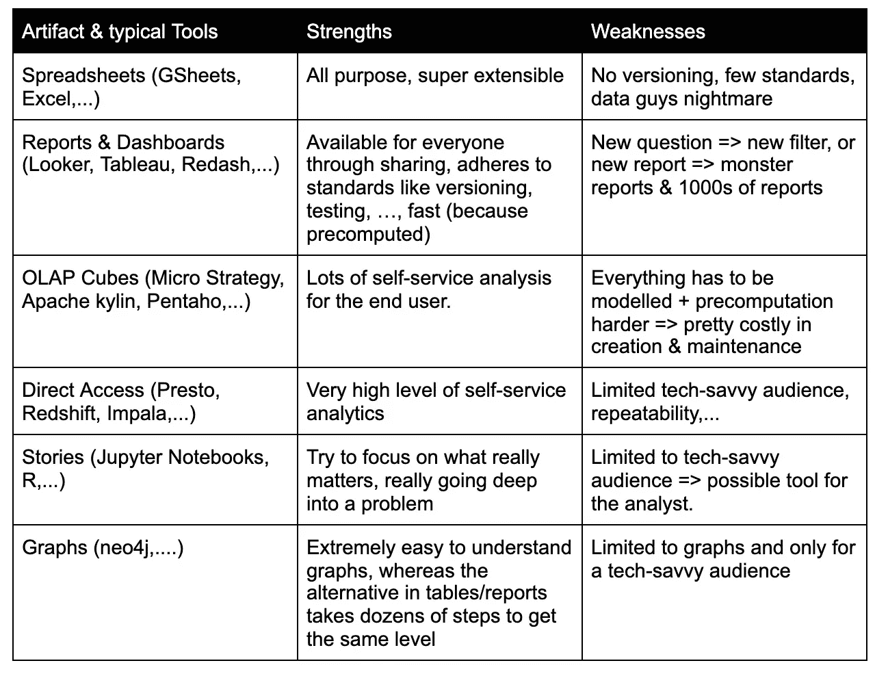
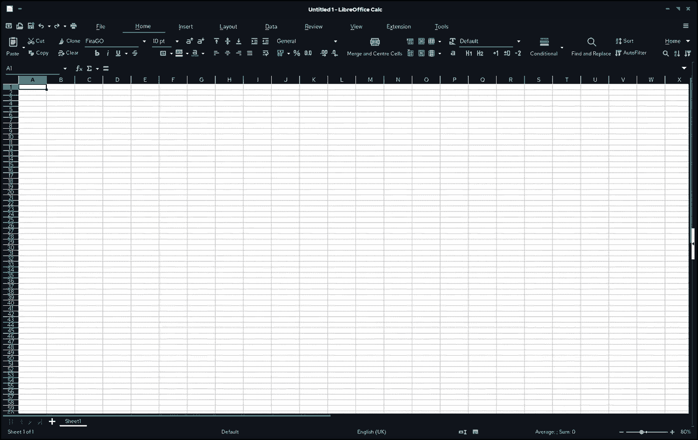
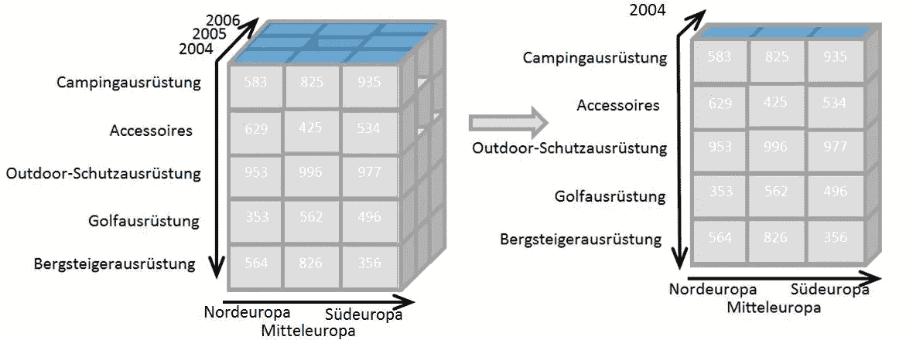

# BI 工具能做什么——你应该知道的六种不同的 BI 工件

> 原文：<https://towardsdatascience.com/what-bi-tools-can-do-the-six-different-bi-artifacts-you-should-tknow-b7f9ab4dad20?source=collection_archive---------30----------------------->

## 仪表板、图表、报告、电子表格、OLAP 立方体或直接 SQL 访问？

六件 BI 文物。通常，公司会经历一个电子表格->报告和仪表板->其他地方的旅程。

神器，来源于两个拉丁词，arte“通过技巧”和 factum“制造”。有目的地巧妙创造的东西。一个很好的词来描述由开发过程创造的东西。

在商业智能的学科中，在公司中收集“技术和过程”来系统地分析数据，我发现六个工件是大多数过程的基石。

在大多数关于数据架构的文章中，它们中的一些被遗漏了，或者至少适当的工具被遗漏了，也许是有意的，也许不是(例如，参见 a16z 上的[精彩文章，该文章主要关注报告、仪表板&临时访问)。).](https://a16z.com/2020/10/15/the-emerging-architectures-for-modern-data-infrastructure/)

我认为数据的唯一价值是改善一些单位的决策。为此，我们需要回答一系列问题。但是根据问题的不同，使用其中一个工件来回答它们要容易得多。

换句话说:

"如果电子表格实际上是正确的答案呢？"([特里斯坦得心应手](https://blog.getdbt.com/future-of-the-modern-data-stack/) *)*

因为有时候，就是这样。有时它是一个报告、一个 OLAP 立方体或一个直接访问管道。

# 六件 BI 文物

你应该记住的六个 BI 神器是…

*   普通的旧电子表格
*   视觉材料、报告和仪表板
*   古老的 OLAP 立方体
*   直接访问管道(通常通过 SQL)
*   写好的“故事”，笔记本
*   现代的东西，图形(比如图形数据库用户界面)

# 大多数数据最终用户的现实

那么，对于大多数数据终端用户来说，现实是怎样的呢？公司通常不会提供所有六种工件。而工具也没有提供。此外，仅仅为了找到正确的视角而经历这么多不同的数据查看方式似乎很令人困惑。然而，这意味着对于我们的绝大多数问题，我们将有一个次优的工具来回答它们。

这就是数据最终用户的生活。

但是事情是变化的，至少你通常会有不止一个可用的工件，所以了解所有这些工件并理解何时使用哪一个是有意义的。

# (1)普通的旧电子表格

文件基金会和贡献者。截图:vul sphere[MPL 2](https://www.mozilla.org/en-US/MPL/2.0/)<>或 [LGPL](http://www.gnu.org/licenses/lgpl.html) ，通过维基共享。

电子表格是 1979 年 Apple II 中的 VisiCalc 自带的。很长一段时间了。出于同样的原因，它们被广泛采用，可以通过任何文件共享方式共享，几乎任何人都可以使用。

电子表格允许绝大多数的数据、图形和计算操作。如果并排比较，电子表格将拥有它，因为它们的可扩展性和巨大的功能范围。

然而，电子表格让大多数数据人员感到恶心。两个原因可能是，由于它们的特性范围，它们不太方便。而且由于他们的地方性，他们不遵守共同的标准。您有多经常因为忘记保存电子表格而导致笔记本电脑崩溃？

是的，当你处理数据时，这是不应该发生的。它不具备开发良好、经过测试和版本化的数据工具。

尽管如此，在本地环境处于前沿的地方，在人们大量使用电子表格的地方，在开发、测试和版本控制不那么重要的地方，电子表格都有它们的位置。

*常见的电子表格工具有 Google Sheets、Excel、Numbers 等。*

# (2)报告和仪表板

报告和仪表板有点像云化的电子表格。虽然从技术上来说，并不是所有的应用程序都必须实际存在于云中，有些应用程序允许你保存一个本地副本，这样你就可以自己处理了，但是这种集成使得它们非常好用。

报告和仪表板工具将这一切展现在桌面上，集成到数据环境中，并进行适当的共享。对于电子表格来说，要获取数据，要么必须导出它(这对于数据转储来说非常有用)，要么通过一些自定义功能将它连接到数据源。

报告和仪表板工具通常由开发团队配置，以连接到您需要的所有资源。此外，它们允许个人或团队提供大量标准报告和仪表板，并与整个公司共享。

这使得 report & dashboard tools 成为“在感觉到电子表格大材小用之后”的最佳去处。

尽管如此，报告大多是“基于表格”的，它们允许过滤、排序等。大部分是“二维”的东西。所以这其中的问题是:如果你有一个新问题，有人必须为你扩展一个报告，修改一个过滤器，或者创建一个新的。

= >结果可能是包含 1000 个过滤器的 63 页报告。

因此，在感受到电子表格的痛苦后，报告和仪表板工具通常是公司的归宿，但它们也可能以电子表格的痛苦而告终…

*常见的报表&dashboard 工具有 Metabase、redash、looker、tableau 等。*

# (3)OLAP 立方体

信息百科，CC BY-SA 3.0 ，通过维基共享。

在数据之旅的某个地方，一些公司开始意识到一些数据组合需要进行大量的“分析”。它们被过滤、向下钻取、排序、与另一种数据类型组合、再次过滤等。在报告表单中这样做意味着您必须为所有不同的数据组合准备大量的报告。典型的例子包括销售数据以及客户类型、年月、产品组等。

因此，1993 年，一个名叫 Edgar F. Codd 的人发明了 OLAP 立方体，这是一种对数据“立方体”进行切片和切块的简单方法，数据“立方体”本质上不再是一张表，而是一组 n 维数据。

“咄，为什么销售额比上个月下降了？—让我们先检查一下这个事实”，“啊，让我们看看哪些客户群买得更少”，“mmmh 仍然看不到任何东西，让我们改变到产品类型的角度”，“啊，我看到产品类型 X 有一个很大的突破”，“让我们看看人们在转换漏斗的哪些步骤中离开得最多，…”……..等等都是典型的 OLAP 分析。

一个 OLAP 立方体实际上相当于一份有 1000 个过滤器的 63 页报告，但处理起来要好得多。但是如果你需要那种程度的灵活性。大多数公司只需要一些特定类型的核心数据组合。

成本:报告有趣的部分是因为它们是“固定的”,它们可以预先计算，所以它们真的很快(可以被制造出来)！OLAP 立方体也可以做得很快，但这意味着你必须付出相当大的努力，因为你必须找到“运行最多的查询”，然后聚集很多。因此，一个 OLAP 立方体可能比你的一堆报告要慢，而且花费更多。

因此，如果我们看到某些基础数据需要进行大量的切片和切割，公司可能会使用 OLAP 立方体。立方体将比 100 个报告更容易使用，但是它也将携带相当多的费用。成本在很大程度上取决于底层的“维度”，因此底层的数据越少，成本就越低。那么会发生什么呢？你最终会得到怪物立方体，因为人们喜欢加上“只有这一个维度”。事实证明，这样做会使立方体变慢，并增加开发成本。最后，你得到了一个昂贵而缓慢的立方体…

尽管如此，它还是比 100 份报告简单得多…

*典型的 OLAP 工具是 Pentaho、MicroStrategy 或 Apache Kylin。*

# (4)直接访问

那么，我们如何能够在不产生 OLAP 怪物的情况下对大量数据组合进行深度分析呢？很简单，我们给人们技能去做，就像 OLAP 发动机在引擎盖下做的那样！我们让他们(通常是 SQL)访问我们的底层数据。我们对一些核心实体建模，并适当地记录它们。

这是一个很好的方法，但它也意味着提供更大的查询引擎，分解长时间运行的查询的方法，最重要的是，你需要一个非常懂技术的观众。我们可能还需要一个好的界面，这样人们就可以保存查询。

*正在使用的工具:Presto、AWS Athena、…*

所以我们可能仍然对报告、仪表板、OLAP 立方体和直接访问不满意。

# ⑸故事/笔记本

为了减轻这一点，一些公司在决策者和数据工程师之间有一些懂技术的人，“分析师”。他们使用报告、直接访问数据和创建深度分析来回答问题。

我喜欢“[仪表盘已死](/dashboards-are-dead-b9f12eeb2ad2)”这篇文章，其中泰勒·布朗洛解释了为什么他们把 63 页的报告变成了一个可爱的笔记本——一个故事。其实是那篇文章让我写了这篇。我真的很喜欢他关于杀死一个恐怖神器，把他们所有的报道都改成“故事”的热情。

如果你看一下技术雷达，这是真的，泰勒·布朗洛使用的笔记本电脑，正在[越来越多地生产](https://www.thoughtworks.com/de/radar/techniques/productionizing-notebooks)。我喜欢这款笔记本的主要特点是它能够讲述一个小故事。一个普通的老记者无法讲述的故事。

然而，我们仍然依赖于我们的技术人员。最重要的是，在报告中过滤比在笔记本中更容易(尽管也是可能的)。

*常见的工具有 Jupyter、上面提到的 Count 以及更多…*

# (6)图表

最后，一些公司使用图表。我是探索图形的图形用户界面的忠实粉丝。因为我认为，今天的许多企业实际上有很大一部分商业模式是“以图表的自然形式出现的”。

我还认为数据最好以其自然形式进行探索。就像因为扭曲，在地球仪上探索地球比在几十张卡片上探索要容易得多，我发现探索一个可视化的图形要容易得多。

图形用户界面实际上很好地让你显示一个完整的图形，或者让你过滤子图，过滤出新的图形，或者让你遍历它。

因此，如果您的业务模型中确实嵌入了某种图形，我建议您将图形用户界面作为探索问题的工具。当然，缺点是就像 SQL 直接访问一样，有些人必须精通技术才能做到这一点，但是当前的图形语言和 SQL 一样简单。

*常用工具有 neo4j 等。*

# 到处都是弱点

听起来每个艺术品都有严重的弱点。然而，我们真的不想有太多。这才是真正的困境。

我写这些是为了提醒自己。我们在考虑把我们的主要艺术品换成另一个。我喜欢记住，无论我们做什么，都不会尽善尽美。也不会是永久的。变化将会到来，所有三个组成部分，数据源，使用数据的人和他们的需求都会发生变化。

# 那么我们能做些什么呢？

我们基本上必须做我们在软件架构的其余部分做的同样的事情。

我们可以建立模块化的东西，架构，我们可以快速交换我们的 EL (T)中的 EL。在那里，我们可以快速将我们的存储、报告工具换成基于笔记本的架构。

我们可以建立进化的架构，在其中我们非常清楚我们的拟合函数，我们对当前问题的答案的质量。我们知道我们将采取小的迭代步骤来提供更好的答案。

就是这样！

# 进一步阅读

*   Tristan Handy 谈现代数据堆栈的未来。
*   [A16zs 关于现代数据架构的帖子](https://a16z.com/2020/10/15/the-emerging-architectures-for-modern-data-infrastructure/)。
*   [仪表板之死](/dashboards-are-dead-b9f12eeb2ad2)。