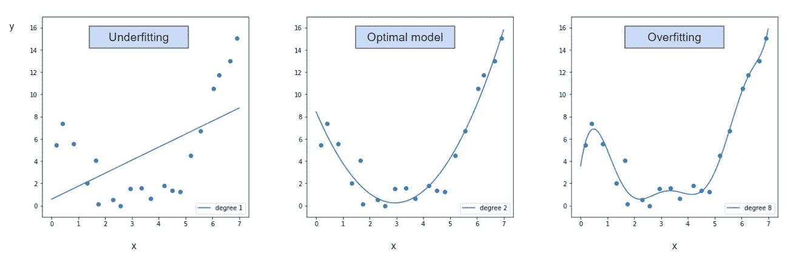
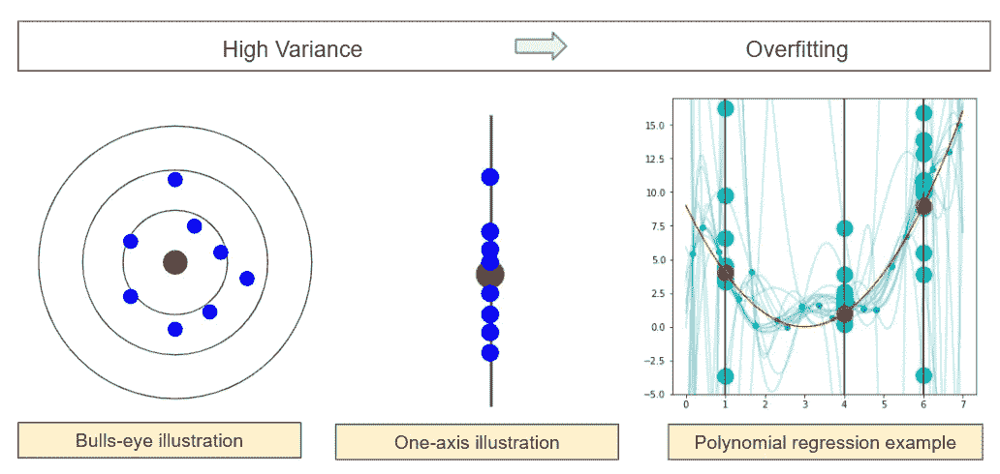

# 偏差-方差靶心图真正代表了什么

> 原文：<https://towardsdatascience.com/what-bias-variance-bulls-eye-diagram-really-represent-ff6fb9670993?source=collection_archive---------18----------------------->

## [实践教程](https://towardsdatascience.com/tagged/hands-on-tutorials)

## 它与欠拟合和过拟合有什么关系

在寻找偏差-方差权衡时，我们可以看到下面的**靶心图**:


偏差-方差的靶心图—图片由作者提供

它们看起来直观醒目，用一些蓝点来表示偏差和方差。但是它们到底是什么意思呢？中心点代表目标，但蓝点真正代表什么？这些牛眼是如何与欠适和过适联系在一起的？


照片由[维托达·克莱恩](https://unsplash.com/@little_klein?utm_source=medium&utm_medium=referral)在 [Unsplash](https://unsplash.com?utm_source=medium&utm_medium=referral) 上拍摄

# 与过度拟合和欠拟合的关系

偏差-方差权衡与**过拟合**和**欠拟合**的概念有关。为了说明这一点，我们可以举多项式回归的例子。在下面的例子中，x 和 y 之间的真实关系是二次的

*   所以如果我们使用简单的线性回归，模型是**欠拟合**；
*   如果多项式的次数太高(例如 8)，那么模型**过拟合**。
*   **最优**模型为二次模型。



多项式回归、欠拟合和过拟合—作者图片

现在，如果我们回到靶心图，关系如下所示:

*   **最优**模型对应低方差和低偏差。(好吧，可以理解)
*   **过拟合**对应高方差低偏差。(但是为什么呢？如前图所示，它与 8 次多项式回归有什么关系？)
*   **欠拟合**对应高偏差和低方差。(但是为什么呢？它与上图中的简单回归有什么关系？)
*   那么高方差和高偏差呢？什么模式会导致这种情况？


偏差-方差与过度拟合和欠拟合-作者图片

如果我们将它们放在一起，我们如何将靶心中的点与回归图中的数据点联系起来？


# 更准确的表述

乍一看，靶心图还是挺直观和醒目的。但如果我们真的试着问自己这个问题:每个预测点都有两个坐标？**两个维度是什么？**

然后我们意识到眼睛只是目标变量值的艺术表现。因为我们通常**只有一个目标变量**。所以要想更准确，应该只展示一个维度。

中间的红点是我们试图预测的真实值(一个特定的观察值)。蓝点是我们建立的不同模型的预测。

因此，如果我们想更准确地描述目标值和预测值之间的比较，靶心将变成只有一个轴，它代表目标变量。


那么，它们到底代表了什么，我们怎样才能创造出一个具体的模型例子呢？我们编码吧。

# 多项式回归模型

我们将在以下过程中创建多个模型来说明(欠拟合和过拟合)与(偏差-方差权衡)之间的关系:

*   首先，我们选择从一个已知的函数生成一些简单的数据。
*   然后我们可以试着创造模型
*   对于一个或多个新的观察值，我们可以进行预测，并查看方差和偏差。

## 生成数据

我们可以生成一些真正的二次关系的数据。

```
import numpy as np
import pandas as pdn = 20
x = np.linspace(0,7,n) + np.random.randn(n)*0.1def f(x):
    return (x-3)**2y = f(x)+np.random.randn(n)
```

我们可以用红色的实函数来绘制数据。


## 不适合的模型

为了用以前的数据创建欠拟合模型，我们可以创建简单的线性回归。利用从原始数据集中选择的一些训练数据，我们可以创建一些模型。

```
for i in range(20):
    model = make_pipeline(PolynomialFeatures(1), LinearRegression())
    X_train, X_test, y_train, y_test = train_test_split(X, y, test_size=0.5)
    model.fit(X_train, y_train)
    y_plot = model.predict(X_seq)
    plt.plot(X_seq, y_plot,c=”c”)
    plt.scatter(4, model.predict([[4]]),s=300,c=”c”)
```

如果我们对 4 的值进行预测，我们可以得到下面的图:

*   红点是真正的目标值
*   蓝点是由训练数据样本创建的模型(简单线性回归)的预测。


现在，我们可以清楚地看到偏见。我们可以预测几个值


现在，让我们回顾一下不同的插图:


## 过度拟合的模型

对于过拟合，我们可以通过改变多项式的次数来创建相同的比较。

```
for i in range(20):
    model = make_pipeline(PolynomialFeatures(8), LinearRegression())
    X_train, X_test, y_train, y_test = train_test_split(X, y, test_size=0.5)
    model.fit(X_train, y_train)
    y_plot = model.predict(X_seq)
    plt.plot(X_seq, y_plot,c=”c”)
    plt.scatter(4, model.predict([[4]]),s=300,c=”c”)
```



## 最优模型

当多项式的次数为 2 时，我们可以清楚地看到模型的预测具有低偏差和低方差。


# 回归树模型

我们也可以用回归树来说明


# 结论

我希望现在你能更准确地看到偏差-方差靶心。

如果是这样，最后一件事:什么样的模型可能具有高方差和高偏差？