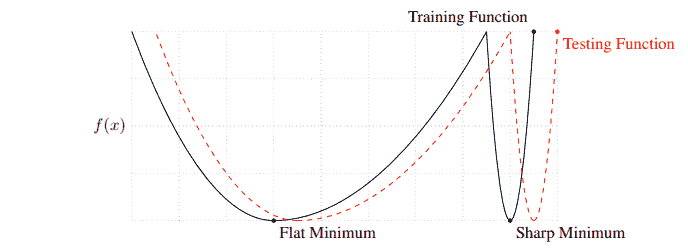
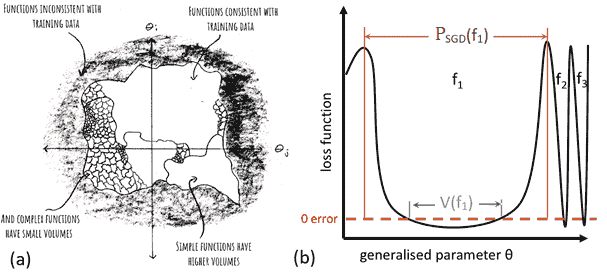
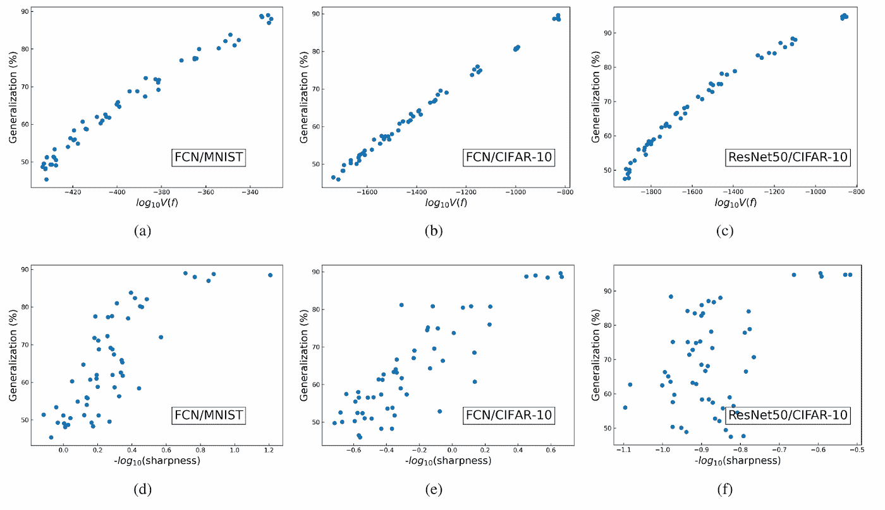
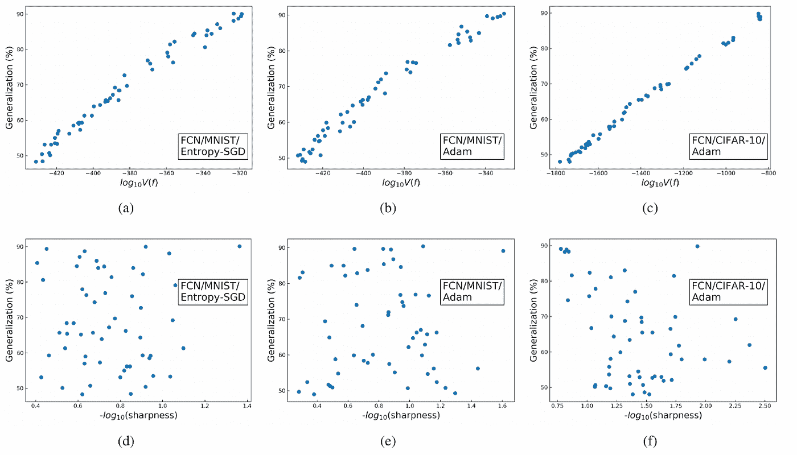
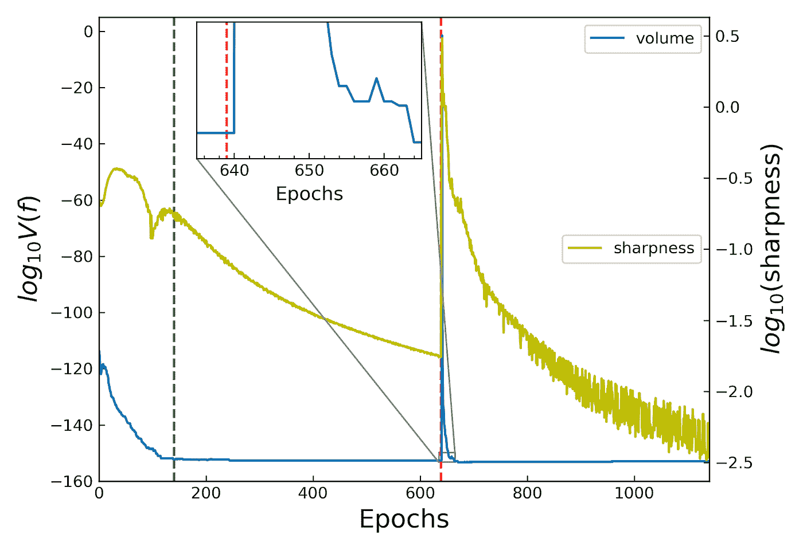

# 关于神经网络为什么会泛化，平坦度能教会我们什么？

> 原文：<https://towardsdatascience.com/what-can-flatness-teach-us-understanding-generalisation-in-deep-neural-networks-a7d66f69cb5c?source=collection_archive---------32----------------------->

## [思想和理论](https://towardsdatascience.com/tagged/thoughts-and-theory)

## 它的不足之处在哪里？

这是一系列总结工作的第三篇文章，旨在提供深度神经网络(DNNs)的一般化理论。简而言之，[的第一篇文章](/neural-networks-are-fundamentally-bayesian-bee9a172fad8)总结了用随机优化器(如 SGD)训练的 dnn 在参数空间中找到概率与其体积成比例的函数的证据，而[的第二篇文章](/deep-neural-networks-are-biased-at-initialisation-towards-simple-functions-a63487edcb99)认为这些大体积函数是“简单的”，因此解释了为什么 dnn 会泛化。

在下文中，我们总结了[1]中的结果，这些结果解释了为什么“损失前景的平坦性”已被证明与一般化相关，这是一个众所周知的结果(例如参见[5])。他们提供了大量的经验证据，表明这种相关性实际上是(1)局部平坦性和周围函数的体积之间的弱相关性，和(2)体积和一般化之间的强相关性的组合。这种结合在“平坦”和概括之间产生了微弱的相关性。

它是和[张硕丰](https://medium.com/@sofuncheung16)一起写的，他是【1】的第一作者。

## **简介和背景**

自 20 世纪 90 年代以来，直觉上认为损失景观的局部平坦性与深度 DNNs 中的良好概括相关，Hinton 和 Schmidhuber 认为，由于更平坦的最小值需要更少的信息来描述，它们应该比尖锐的最小值更好地概括(根据奥卡姆剃刀原理)。由于这种最初的兴趣，已经开发了许多不同的局部平坦度测量，并且已经发现设计来寻找平坦区域的算法可以改进一般化。

**图 1:** 来自 Keskar 等人【5】，其中平坦极小值和良好概括之间的联系被重新构建，以这幅漫画作为直觉。如果测试损失函数与训练损失函数略有不同，则在平坦最小值中，训练损失和测试损失之间不会有太大差异。然而，在尖锐的最小值中，在测试和训练损失之间可能有实质的差别。

> 尽管有这些工作，所有的平坦度测量都有严重的问题:它们受到α缩放问题的困扰:对于一个 ReLU 激活的 DNN，你可以通过(某个常数)α和 1/α分别缩放两个相邻层的权重，并且**不会改变 DNN** 在数据上表达的函数，因此不会影响泛化。不幸的是，(大多数)平坦度测量**在α缩放后会有很大的变化**。

更糟糕的是，α缩放只是*一个*重新参数化*的*例子，不会改变函数。这个*重新参数化*可以是层方式的，也可以是神经元方式的，这取决于具体的 DNN 架构。

许多工作已经为 SGD 训练的 dnn 发现了以下情况:如果 SGD 在损失函数中找到平坦的最小值，则平均而言，网络将比如果 SGD 找到尖锐的最小值概括得更好(参见**图 1** 以获得该论点的漫画)。然而，α-标度论点表明，任何平坦的极小值都可以变得任意尖锐，而不改变函数，*以及一般化。*

> 因此，平坦性不可能是概括良好的函数的定义特征。

在[2，3，4]中提出，我们应该开始考虑**参数空间**和**功能空间**之间的关系。毕竟，dnn 是高级函数逼近设备，很明显参数的选择相对于参数产生的函数来说是次要的 *。*我们需要问以下两个问题:

1.  函数空间中的什么性质赋予函数良好的推广性？
2.  平坦是如何融入其中的？

## 深度神经网络的函数空间观

dnn 是从输入空间 *X* 到输出空间 *Y* 的参数化函数。更具体地说，**参数θ的选择决定了深度神经网络表达什么函数 *f : X→Y* :我们将把它写成 Y =*f(X；θ)* 。**

对于某些数据集 *D，*有一个“真”函数 *f* : X→Y* 描述了如何将 *D⊂ X* 中的输入映射到 *Y* 中的输出(其中 *D* 是数据流形)。我们的神经网络的工作是在给定一些训练数据 *S ⊂ D* 的情况下，尝试在整个 *D* 上精确地逼近 *f** 。需要强调的是，在训练之后，神经网络所表达的功能在 *S* 上总是相同的(如果你在 *S* 上训练到 100%的准确度)，但是在 *D* 的其余部分上可能不同。这些差异会导致不同的概括错误。

例如，考虑 MNIST: *X* 是 *28×28* 灰度图像的空间， *Y* 是标签*{ 0–9 }的空间，f* 是从图像到标签的映射， *D* 是 *X* 中对应于手写数字的部分， *S* 是这些图像的子集。

更多细节和示例见[第一篇文章](/neural-networks-are-fundamentally-bayesian-bee9a172fad8)。

在我们继续之前，我们需要定义[1]的中心量(参见**图 2** 的图示):

*   *V(f)* 是某个神经网络的参数空间中的体积(具有高斯度量),使得*f(x；θ)=f* (x)。这意味着两件事:(1)所有函数的“总体积”是 1，以及(2)因此， *V(f)* 是参数空间的分数，这使得神经网络表达 *f.*
*   *Pₒₚₜ ( f | S )* 是像 SGD 这样的随机优化器在 s 上训练到 100%精度后找到函数 *f* 的概率
*   *V( f | S) = P(S | f ) V(f) / V(S)，*其中 *V(S)* 是与一个训练集 *S，*和 *P(S | f )* =1 如果 *f* 与 *S* else 0 一致。

**图 2:** 这两个图总结了前两篇帖子中的论点。(a)是参数空间的动画，显示了当你根据训练集 *S* 对其进行划分时会发生什么。有些功能在 *S* 上不能很好地执行，而在那些有组合体积的功能中， *V(S)，*中，有些功能比其他功能占据了更多的体积。有人认为具有大的 *V(f)* 的函数“更简单”,因此更容易推广。量 *V( f | S)* 是 *f* (某白函数)的体积除以白函数的总面积。(b)认为，如果*v(f | s)*有一个很大的范围，那么你期望 *Pₒₚₜ ( f | S ) ≈ V( f | S)* 。

[3]中的大量经验证据表明，DNNs 中的良好概括有以下三个原因:

1.  *Pₒₚₜ ( f | S ) ≈ V( f | S)* 用于优化器训练的 DNNs
2.  体积较大的函数 *V(f)* 比体积较小的函数 *V(f)* 概括得更好
3.  [3]中的论点表明，这是因为高容量功能“简单”

> 直观地说，(1)是说优化者发现函数的概率与它们在参数空间中占据的体积成比例。优化器的选择将少量影响第一个近似等式，这可以解释一般化中的小变化。

需要澄清的最后一点是:我们如何度量函数的差异？当然，我们不可能计算所有可能数据的差异。相反，我们使用一个小的测试集 *E⊂ D* 。我们根据功能在 *E* 上的表现来区分它们。例如，假设你在大小为|S|=50000 张图片的训练集 *S* 上训练 MNIST，直到 100%的训练准确率。使用该停止条件训练的任何网络将在 *S* 上模拟相同的函数 *f* (即，它将以相同的方式对所有图像进行分类)。然而，根据随机种子，神经网络将在看不见的图像的测试集 *E* 上找到不同的可能分类。在图 2a 的漫画中，每个白色区域对应于这些看不见的图像的不同分类。这是一种对函数进行“粗粒化”的方法，因此我们可以以一种有意义的方式计算像 *V(f |S)* 这样的量。

该功能通常根据 *X* 中的一些数据 *D* 来定义。还有几个类似的微妙之处，这里有完整的解释。
注意，在第一篇文章中， *V(f|S)* 被标为 *Pᵦ(f|S)* 以强调这个量的贝叶斯解释。

## **平坦度和体积与泛化的关系如何？**

所以，我们想问下面的问题:一般化是由前一节给出的论点解释的吗，或者平坦性有什么要补充的吗？

在 *V(f)* 范围内，局部*平坦度*可能有所不同，但似乎可以感觉到，高音量的函数平均来说比小音量的函数更平坦(考虑**图 2b** )。

> 然后，假设在体积和一般化之间有很强的相关性，体积和平坦度之间的弱相关性可能足以给出一般化和平坦度之间的弱相关性。

[1]的主要结果提供了支持这一主张的大量经验证据。

平坦度和一般化之间的相关性高度依赖于优化器，并且比体积和一般化之间的相关性弱得多(即使忽略平坦度-一般化相关性可以通过α缩放任意确定)。以下结果使用[5]中的最差情况锐度指标。为了迫使优化器找到泛化能力差的函数，将由错误标记的数据组成的“攻击集”*添加到训练数据中。*

**

***图 3:**MNIST 和 CIFAR-10 上音量 *V(f)* 锐度和泛化精度的相关性。对于 MNIST |S|=500，| E | = 1000 对于 CIFAR-10 |S|=5000，|E|=2000。攻击集大小|A|从 0 到|S|不等，并生成具有不同泛化性能的函数。(a)-(c)分别描述了 MNIST FCN、CIFAR-10 FCN 和 CIFAR-10 Resnet-50 的概化和数量之间的关系。(d)-(f)显示了相同的三个数据集-架构对的泛化能力和清晰度之间的相关性。在这个实验中，所有的 dnn 都用普通的 SGD 训练。*

**

***图 4:** SGD 变体可以打破平坦度-一般化相关性，但不能打破体积-一般化相关性。这些图示出了在(a)和(d)上训练的 FCN 的泛化与音量或锐度的关系——具有熵-SGD 的 MNIST；(b)和(e)——MNIST 和亚当；(c)和(f)——带有自动监测系统的 CIFAR-10。对于与图 3 中相同的 S 和 E。请注意，与体积的相关性实际上与普通 SGD 相同，但与平坦度的相关性变化很大。*

*当我们在训练时直接比较同一 DNN 的平坦度和体积时，我们看到了更有趣的东西。在**图 5** 中，我们测量了在 MNIST 训练的 FCN 在每个时期的音量和锐度。在第 140 个时期达到零训练误差，我们又过度训练了 1000 个时期。从初始化开始，清晰度和音量都降低，直到达到零训练误差。随后，体积保持不变，但交叉熵损失继续减少，正如这类分类问题所预期的那样。这导致锐度降低，即使函数、音量和训练误差不变。这表明平坦度是一个相对的概念，例如，取决于训练的持续时间。*

*我们还研究了α缩放:**图 5** 还显示了您可以执行α缩放并影响锐度，而无需更改函数。如插图所示，由于函数 f 不变，体积在α缩放时最初是不变的。然而，α缩放可以将系统驱动到参数空间的不寻常部分，在损失函数中具有陡峭的梯度，这意味着 SGD 几乎立即脱离零训练误差流形。然而，该系统很快就松弛到基本相同的功能和体积。这一经验发现进一步表明了平坦性论点的局限性，同时加强了功能空间视图和体积作为与良好概括相关联的良好属性。*

**

***图 5:** 锐度和音量如何随时代演进。在每个时期，我们计算|S|=500 的 MNIST FCN 的锐度和音量。绿色虚线表示时期 140，在该时期达到零训练误差并且后训练开始。红色虚线表示时期 639，其中α = 5.9 时发生α缩放。在α缩放时，清晰度显著增加，但随后又迅速降低。插图显示，在α缩放后，音量最初没有变化。然而，大梯度意味着在随后的 SGD 步骤中，在恢复到(几乎)相同的功能和体积之前，功能(和体积)会发生变化。*

## ***结论***

*我们讨论了以下结果:*

1.  *随机优化者发现函数与它们在参数空间中占据的体积成比例(有点直观)。*
2.  *高容量函数(最常见的函数)更可能是“简单”的，因此概括得更好(因此 DNNs 概括得更好)。*
3.  *这些高音量函数在很大程度上比低音量函数局部更平坦。*

*因此，在平坦度和一般化之间观察到的弱相关性是由于(弱)平坦度-体积相关性和(强)体积-一般化相关性的组合。*

*注意，这是对[1]的删节总结。因此，我们把重点放在了我们认为最重要的部分，因此可能忽略了一些有趣的细节。*

## ***参考文献***

*[1]张硕丰，艾萨克·里德，吉列尔莫·瓦莱·佩雷斯，阿德·路易.为什么平坦度与深度神经网络的泛化相关。(2021)
【2】c .明加德，g .瓦莱-佩雷斯，j .斯卡尔斯，a .路易。SGD 是贝叶斯采样器吗？嗯，差不多了。(2020)[https://arxiv.org/abs/2006.15191](https://arxiv.org/abs/2006.15191)
【3】c .明加德、j .斯卡尔斯、g .瓦莱-佩雷斯、d .马丁内斯-卢比奥、v .米库利克、a .路易斯。神经网络先验地偏向于低熵函数。(2019)[https://arxiv.org/abs/1909.11522](https://arxiv.org/abs/1909.11522)
【4】g .瓦莱-佩雷斯，c .卡马戈，a .路易。深度学习泛化是因为参数-函数图偏向简单函数。(2018)[https://arxiv.org/abs/1805.08522](https://arxiv.org/abs/1805.08522)关于深度学习的大批量训练:泛化差距和尖锐极小值(2016)。[https://arxiv.org/abs/1609.04836](https://arxiv.org/abs/1609.04836)*