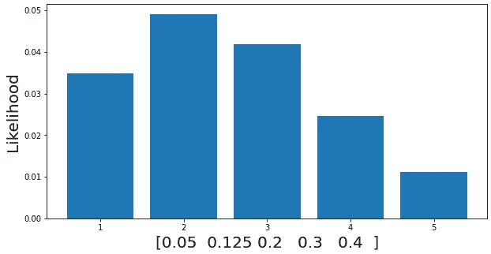

# 关于概率的概率，篮球奇才凯文·杜兰特能教些什么？

> 原文：<https://towardsdatascience.com/what-can-kevin-durant-teach-about-the-probability-of-a-probability-7eaa43366896?source=collection_archive---------28----------------------->

## 让我们用上周日比赛中凯文·杜兰特的三分线来理解贝塔分布。

## 背景

上周日，密尔沃基雄鹿队以 11 分的优势击败布鲁克林篮网队，在东部半决赛中以 2 比 2 平。然而，网队的明星前锋凯文·杜兰特又一次贡献了出色的数据，但在三分线上的表现却非常糟糕。杜兰特是一个非凡的，非常高效的得分手，是有史以来最伟大的得分手之一，所以看到他八次三分球尝试中只有一次是很奇怪的。根据回归均值，杜兰特很可能会逆转他的统计数据，让事情变得公平。然而，我们可以从他相对低调的表演中获得一些振奋人心的见解。(PS:杜兰特 49 分 17 篮板 10 助攻点亮第五场，三分球 4/9)。

虽然篮球兴趣不是这篇文章的先决条件，但我希望你理解贝叶斯定理，概率分布(二项式和连续分布的基础)。


Photo by [鸣轩 冷](https://unsplash.com/@mingxuan_leng?utm_source=medium&utm_medium=referral) on [Unsplash](https://unsplash.com?utm_source=medium&utm_medium=referral)

## 1.得分效率和掷硬币

从统计学的角度来看，每个 NBA 球员都可以被认为是硬币的主人。然后，我们可以用数学方法模拟每个球员通过掷硬币获得三分的机会。如果硬币正面朝上，玩家得分。因此，每个玩家的三分统计线都遵循二项分布，其中*得分概率= P(H)= P。*难题是估计硬币正面落地的概率(P)。

让我们重温一下杜兰特的 1/8 统计线。遗憾的是，由于我没有观看比赛(支持雄鹿！)，我不知道他投篮不中的顺序。我们假设他犯了第一个错误，其余的都是错误。因此，我们的数学模型得出以下结果(顺序并不重要):

**凯文·杜兰特的三点尝试:H，T，T，T，T，T，T，T**

如果没有杜兰特职业生涯的先验知识，推断他得分的概率 P(H)=p=1/8 是合理的。本质上，根据他的数据，杜兰特有 12.5%的机会在他的第 9 次尝试中得分。

现在，让我们用贝叶斯统计来理解这一点。我们认为杜兰特投中三分球的概率是一个变量 p。接下来，我们评估杜兰特最有可能投中上述统计线的 p 值。这是一个基本的最大似然估计问题。使用贝叶斯定理，我们得到:


作者图片

上式有 P(p)项。很诡异，不是吗？毕竟 p 本身就是一个概率。我们必须确定这些概率之间的差别。P(H)=p 是杜兰特硬币落地头的几率(杜兰特三分命中)。P(p)是 p 等于特定值的概率。例如，如果 p=0.3，杜兰特有 30%的可能性投进三分球。P(p=0.3)量化了杜兰特投中三分球的概率是 0.3 的概率有多大。

> 总之，通过计算上面的 lhs，我们可以量化 p 等于值 p 的可能性。

P(Statline|p)是见证杜兰特 1/8 stat 线的几率给定他的三分得分概率为 p，如上所述，它遵循二项分布。


作者图片

熟悉贝叶斯统计应该有助于你回忆分母，P(统计线)是一个常数。此外，对于最大似然估计，P(p)遵循均匀分布。也就是说，我们假设 p 同样可能是 0 到 1 之间的任何值。因此，最大化 P(p|Stat-line)与最大化 P(Stat-line|p)是等价的。你可以承担所有计算的负担，或者相信我 P(p|Stat-line)对于 **p=1/8** 是最大的。

> 上述结果表明，如果杜兰特的三分得分概率为 1/8，那么他最有可能打出 1/8 的统计线

我们的下一步是确定 p 不是 1/8 的概率。 ***同样，由于 P(Stat-line)是一个常数，P(p)是均匀的，所以绘制 P(Stat-line|p)和度量可能性 P(p|Stat-line)就足够了。***

假设 p=0.05，0.125，0.2，0.3 和 0.4。



作者图片

如前所述，P(H|Stat-line)在 p=0.125 时最大。然而，有一个合理的概率 p=0.2。类似地，尽管很少，p 仍然有可能等于其他值。

我们可以扩展上面的过程来绘制范围(0，1)中更多的 p 值。


作者图片

```
import numpy as np
import matplotlib.pyplot as plt
n=[20,30,100,1000]
f,ax=plt.subplots(2,2,figsize=(20,10))
ax=ax.flatten()
for i in range(0,4):
 P=np.linspace(0,1,n[i])
 Y=P*(1-P)**7
 ax[i].plot(P,Y)
 ax[i].set_title(str(n[i])+'points in range (0,1)')
 ax[i].set_ylabel('Likelihood',size='15')
 ax[i].set_xlabel('p',size='15')
```

请注意，当我们绘制更多 p 值的可能性时，我们会倾向于平滑连续的曲线。这暗示了这里有一个概率分布， ***概率分布的概率准确地说是*** ，埋在上面的情节里。

## 2.发掘分布

好吧，我们在杜兰特的 P(p|stat-line)似然图中建立了一个概率分布函数(pdf)的存在。如何获取？让我们反弹到 P(p|Stat-line)并解密贝叶斯方程。


作者图片

如果你学过连续概率分布，你一定学到的第一件事就是 pdf 曲线下的面积总是 1。因此，如果我们的目标是收集 P(p|Statline)的 pdf，我们可以将函数 P(Statline|p)除以它的面积，这正好等于 P(Stat-line)，这是我们在上面的图中忽略的常数。


作者图片

接下来，由于 P(p)遵循 0 和 1 之间的均匀分布，我们应该用差分 dp 来代替它。不要被它在等式中的存在所困扰。它在 pdf 的情节中没有任何作用。因为 L.H.S 是 p=P(某数)位于区间(a


作者图片

你认识上面的功能吗？你遇到过吗？没有任何证据，我向你保证，这是臭名昭著的测试版。


作者图片

杜兰特的得分概率(p)因此，基于 1/8 的 stat 线，遵循参数为 2，8-beta(2，8)的 beta 分布。(比较贝塔函数方程和 P(p|Statline))贝塔分布服从一个有趣的规律。

## **3。贝塔分布的附加性质**

首先，beta(1，1)只不过是一个均匀分布。记住，我们假设 P(p)服从均匀分布。在机器学习行话中，P(p)是先验，P(p|Stat-line)是后验。

> 为了估计概率分布，分析师建立一个先验的、有根据的分布猜测。在观察数据后，他们求解上述贝叶斯方程并计算后验概率，即修正的估计值。

在我们的问题中，先验是β(1，1)，后验是β(2，8)。我们知道杜兰特投了 1/8 篮。从硬币的角度来看，八次投掷中，只有一次正面朝上。利用 toss 结果，你能把先验和后验联系起来吗？


作者图片

我们可以对此进行概括。如果有一个 beta 先验，其中参数 x，y- x 表示正面，y 表示反面，并且一个观察数据集有 h 个正面和 t 个反面，那么后验将是 beta(x+h，y+t)。你可以通过进行所有的计算来验证这一点。很简单。

## **4。更新凯文·杜兰特的先前**

到目前为止，我们将凯文·杜兰特的三分得分能力建模为抛硬币。我们从一个统一的先验β(1，1)开始，并根据一个游戏将其更新为β(2，8)。将此作为一种赌博策略将是残酷的。是我们弥补的时候了。

在接下来的第五场比赛中，杜兰特三分球 9 投 4 中。重新评估后，他的后角是β(6，13)。


作者图片

根据第五场比赛的数据，杜兰特投中三分(抛头)的概率似乎最有可能在 0.3 左右。接下来，让我们用他前三场比赛的统计数据来计算后验概率。

游戏 1:1/4；游戏 2:4/6；游戏 3: 3/8

在考虑了所有 5 款游戏后更新了后验版:beta(14，23)


作者图片

最新的函数在 p=0.378 时达到最大值，非常接近杜兰特职业生涯的平均值 0.384。或许，**的佐证*回归到了*的意思**。此外，了解 pdf 如何在具有额外数据的精简区域中膨胀。贝塔曲线 的垂直膨胀或 ***递减平坦，在继承了更多数据后，流露出对特定概率估计的乐观。***


作者图片

这是对凯文·杜兰特三分成功率概率建模的一次适度尝试

## 结论

在本文中，我试图提供一个直观的测试版背景。虽然我们关注的是三分球，但我们同样可以模拟任何其他遵循二项式分布的统计类别(抛硬币特性)。概率的 ***概率的*** 是一个难以解释的奇异理论。我希望你现在对此有所了解。更重要的是，beta 分布的特征，特别是降低的平坦度，是一个数学上的理由，解释了为什么一个人不愿意购买一个只有十个评价的 5 星产品(阅读更多相关内容)。根据最新数据，这一评级肯定会有所不同。谢谢你坚持到最后！

## 参考

[https://www . basketball-reference . com/季后赛/2021-NBA-东部-半决赛-雄鹿-篮网. html](https://www.basketball-reference.com/playoffs/2021-nba-eastern-conference-semifinals-bucks-vs-nets.html)