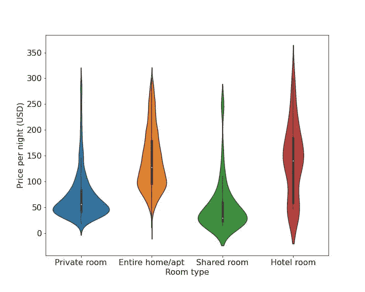
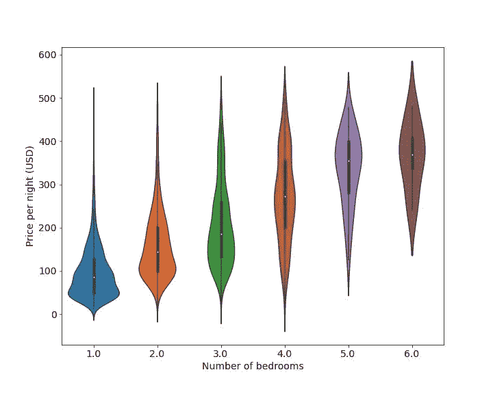
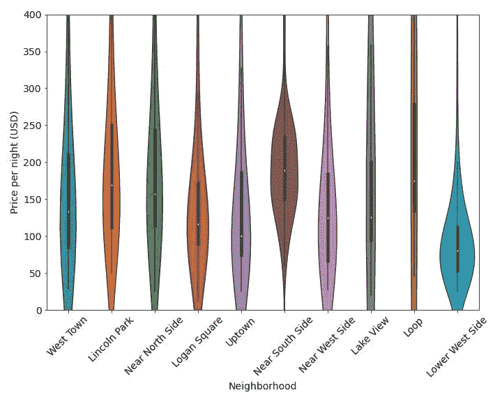
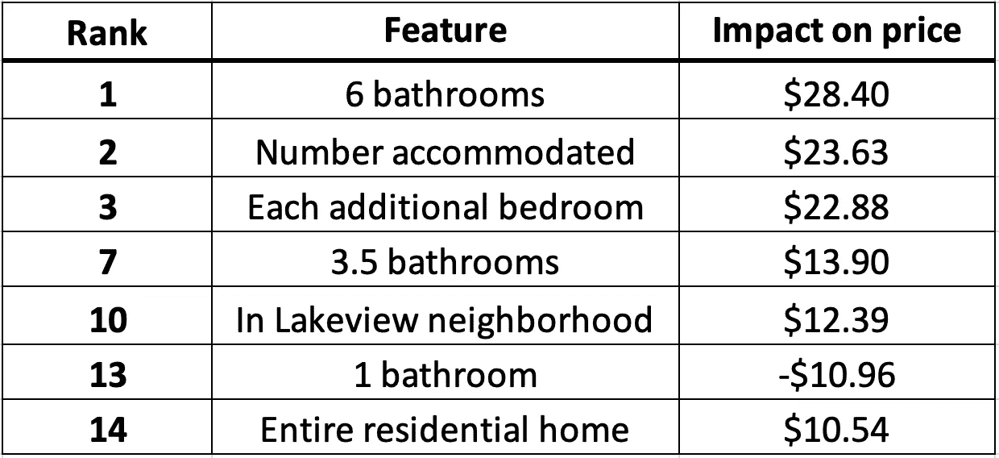
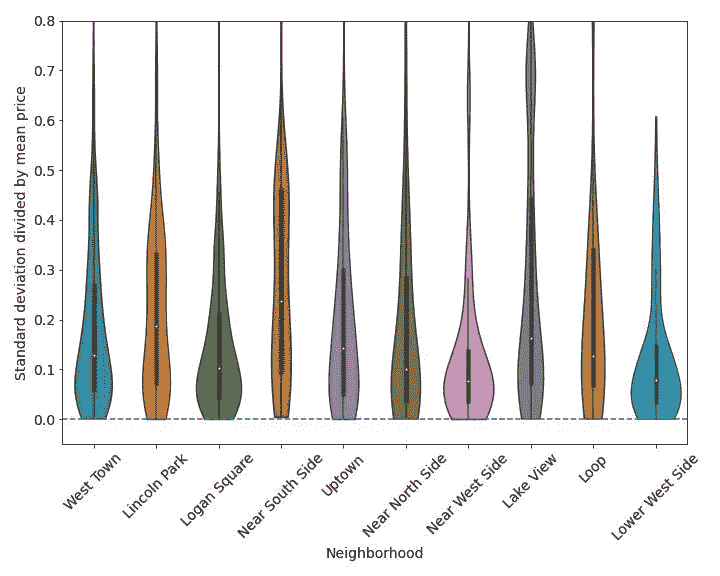
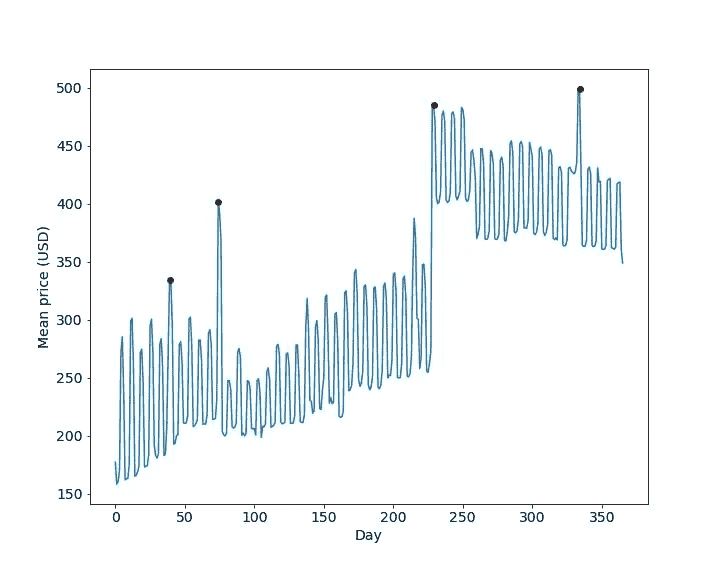
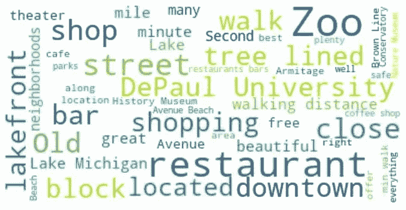
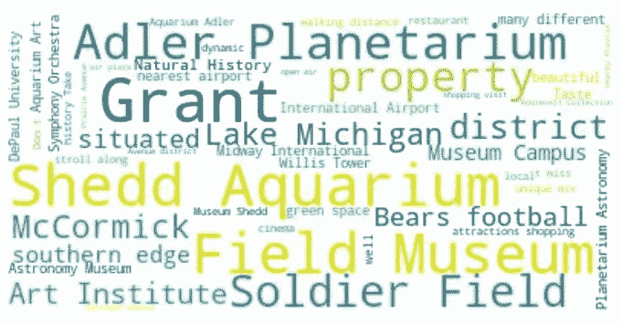

# 我们能从开放的芝加哥 Airbnb 数据中学到什么？

> 原文：<https://towardsdatascience.com/what-can-we-learn-from-open-chicago-airbnb-data-932d1dd0276?source=collection_archive---------13----------------------->

## 潜在的房东和房客都可以从免费提供的数据中了解到很多关于价格和位置的信息

图片来源:J. Crocker，via [维基共享资源](https://commons.wikimedia.org/wiki/File:2010-02-19_16500x2000_chicago_skyline_panorama.jpg)

在天气暖和的时候去芝加哥玩很有趣，但是想出住在哪里和在 Airbnb 上找到最划算的地方却很有挑战性。我最近发现 Airbnb 公开了大量他们的数据——当然，这要求我利用一些机器学习和统计来理解它。

具体来说，这里有一些我想回答的问题:

1.  哪些因素对上市价格的影响最大？息息相关:如果我刚在芝加哥买了一套房产，想在 Airbnb 上挂牌，应该定什么价格？
2.  一年中，哪些社区的房价变化最大？
3.  根据主持人给出的描述，我们可以了解到一些街区的什么特征？

我回答这些问题的代码和推理可以在这个 [Github 库](https://github.com/tdauer2718/airbnb-chicago)的 Jupyter 笔记本中找到。这个项目的数据是(在 2021 年 11 月 29 日)从 Airbnb 内部的[下载的，这使得它可以在](http://insideairbnb.com/get-the-data.html)[知识共享署名 4.0 国际许可](http://creativecommons.org/licenses/by/4.0/)下使用(免责声明在这里是)。

# 第一部分:价格建模

上面第一个问题基本上是关于价格建模的。这些数据包括每份房源的几十个特征，比如卧室数量、它所在的街区以及提供的便利设施。每个列表的每夜价格也给定了，因此有足够的信息来训练一个*模型*，该模型在给定列表中其他信息的情况下预测价格。

我最初的猜测是什么对价格影响最大？卧室的数量，邻居，和“房间类型”(共享房间，整个房子，等等。).我喜欢使用 violin plots 快速获得洞察力，它超越了平均值或中值等简单的统计数据，以直观清晰的方式提供了有关更广泛分布的大量信息。首先，我们来看看价格与房型的关系:

作者图片

对于给定的房间类型，给定价格的小提琴的宽度告诉我们这个价格有多常见，中间的白点代表中值价格。我们发现房间类型和价格之间有很强的相关性:整个家庭/公寓比合租房间要贵得多，酒店房间的价格显然相差很大。

价格也与卧室数量密切相关，并在一定程度上取决于社区:

作者图片

作者图片

一种叫做弹性网的技术对于定量评估不同因素的重要性是有用的。这是一个“智能”回归程序，试图自动找出哪些信息不会影响价格。此外，最终模型参数(即系数)的大小表明哪些因素最重要。

那么，弹力网给了我什么？以下是一些最重要的因素:

作者图片

请注意，所有这些功能都有积极的作用，除了只有一个浴室——当跟团旅行时，只有一个浴室会很不方便！事实证明，前九个因素都与房产大小有关:卧室、浴室的数量，或者可以容纳的人数(不幸的是，没有提供平方英尺)。

弹性网络模型在确定特征重要性方面做得很好，但它不是最好的价格预测器:它的中值误差为 31%。我尝试了其他几种模型；我取得的最好成绩是所谓的 k-最近邻模型，中值误差为 22%，这意味着对于大约一半的房源，它预测的价格在其标价的 22%以内。我可以用这个模型来为假设的芝加哥未来上市定价；例如，参见我的 [Github 库](https://github.com/tdauer2718/airbnb-chicago)。

# 第二部分:价格随时间的变化

如果我住在芝加哥的一套公寓里，想赚些外快，一个合理的做法可能是偶尔通过 Airbnb 出租我的房间或整个地方。当然，有客人来会带来一些不便，特别是如果我决定租下整个地方，并且在那段时间不得不找其他地方住，所以我会选择价格最高的时候。如果我是一个潜在的买家，我也会想知道哪些社区最适合实施这种策略——因此，问题是，随着时间的推移，哪些社区的价格变化最大？

对于每一处房产，我查看了其价格在一年中的标准差(可变性的一种度量)，然后除以其全年的平均价格。例如，如果某项资产的结果是 0.2，那么该资产的价格在一年中平均变化约 20%。然后我看了看这些数字按街区的分布，得到了如下的小提琴图:

作者图片

有些社区，比如近西区和下西区，看起来不太适合实施我的策略。价格没有太大的变化:很少有房产的价格变化超过 30%。我不会从我的策略中获益多少。另一方面，Near South Side 看起来特别有前景，随着时间的推移，许多地方的价格波动很大。

因此，对我来说，更仔细地观察一下附近的南区，分离出哪些时段特别有利可图是有意义的。为了深入了解这一点，我可以绘制出这一地区一段时间内的平均房价:

近南区的房屋在一年中的平均价格。第 0 天是 2021 年 10 月 18 日。红点从左到右分别是 11 月 26 日星期五；12 月 31 日星期五；6 月 4 日星期六；9 月 19 日星期六。图片由作者提供。

显然，我应该把重点放在列出我周末出租的房子上；工作日的价格要低得多。我还应该在夏季更频繁地租房，从六月的第一个周末开始。我不应该太担心新年过后的租房问题，因为那时房价很低，变化也不大。最后，我可以在感恩节和新年周末以及九月中旬得到一个高价格(我猜这种需求是由许多大学生搬进来驱动的)，所以我真的应该试着在这些时间租房。

# 第三部分:邻里是什么样的？

主人通常会简单描述一下他们房产所在的社区。从这些对附近房产的描述中，我可以了解到什么样的社区特征？

回答这个问题的一个很好的工具是“单词云”，它显示描述中最常见的单词，最常见的单词显示为最大的单词。这是林肯公园的一个:

作者图片

在我看来，密歇根湖、动物园、德保罗大学、自然和历史博物馆、一所温室和市区都在林肯公园附近。关于出行，我猜很多东西都在步行距离之外，棕色线穿过它。我猜这是一个相对古老的街区，有很多树，但附近也有很多购物场所，还有很多咖啡馆、餐馆和酒吧。我去过林肯公园，所以我知道上面单词云的这些建议是相当准确的。

我不太熟悉的近南区怎么样？

作者图片

难怪这个地区的物价在某些时候会很高。菲尔德博物馆、阿德勒天文馆、谢德水族馆、格兰特公园、自然历史博物馆和艺术学院都在附近。麦考密克会议中心就在附近，这也可以解释为什么这里的价格随时间的变化很大(当镇上有会议时，需求急剧增加)。熊队在这里的士兵球场比赛，这也可能在足球赛季的周末产生更多的需求。

显然，还有改进的空间和各种进一步的问题需要回答。我如何创建一个更好的定价模型？20%左右的中值误差仍然很高。此外，我如何确定最优价格(即最大化预期回报)，而不仅仅是预测实际列出的价格？也许一些主机使用的价格太低或太高，通过更好的定价模式可以赚更多的钱。此外，数据中还提供了关于评论分数的信息，这将有助于主机了解哪些因素对糟糕的评论影响最大——这是另一个有趣且潜在棘手的建模问题。

一个复杂而重要的话题是 Airbnb 对住房负担能力的影响。提供数据来评估这一点是 Airbnb 内部[的一项关键任务。虽然我预计非居民东道主会产生最大的影响，但在我看来，所有潜在的东道主都应该在其所在的城市进一步研究这一点。这是另一篇文章的主题，它必须整合来自另一个来源的关于长期租赁价格的数据。](http://insideairbnb.com/about.html)

我希望你喜欢我的帖子！请随意查看[我的代码](https://github.com/tdauer2718/airbnb-chicago)，如果有任何建议或研究想法，请联系我。