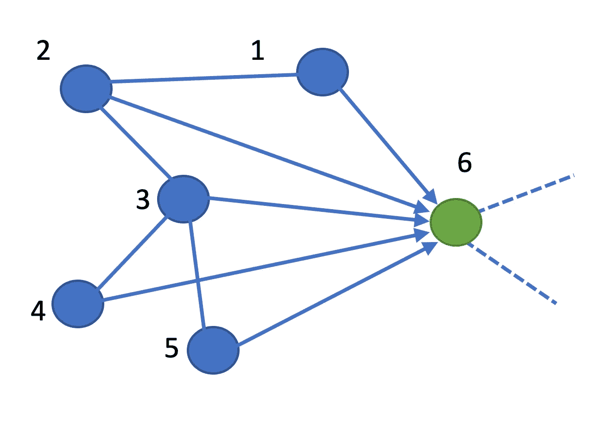
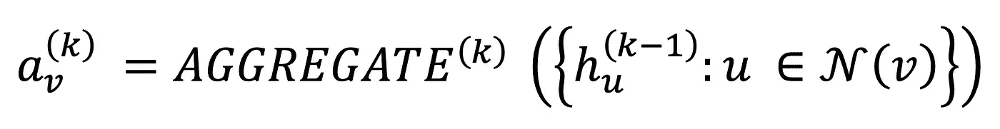
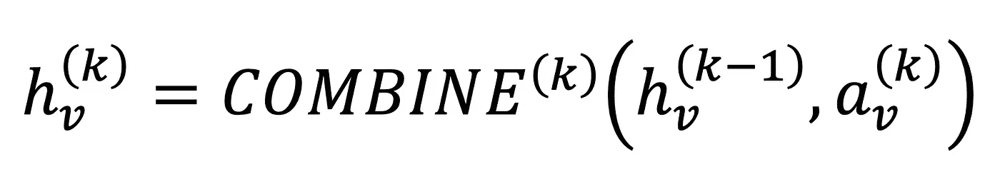
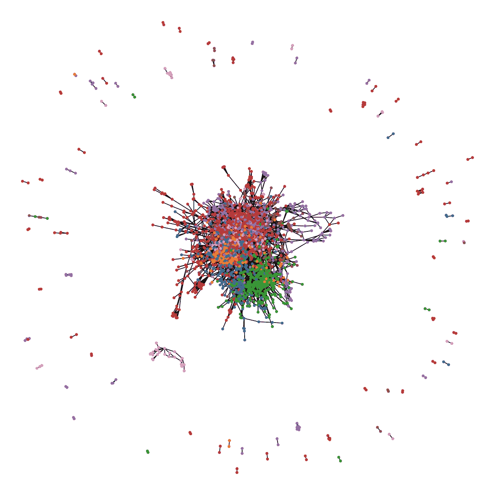
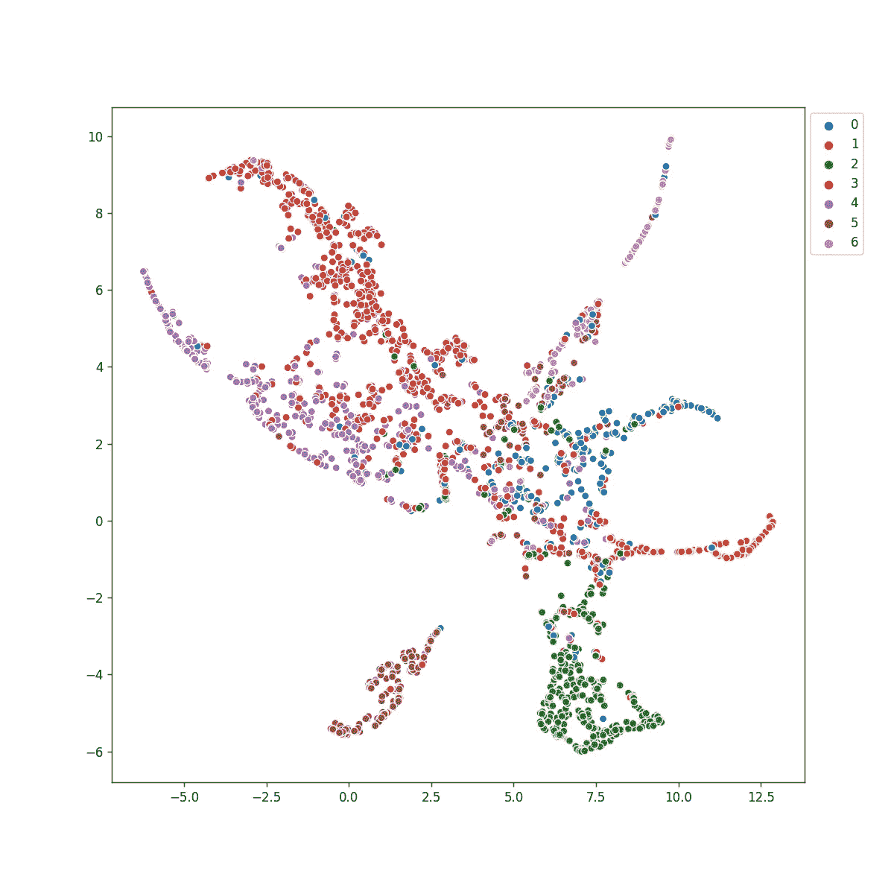
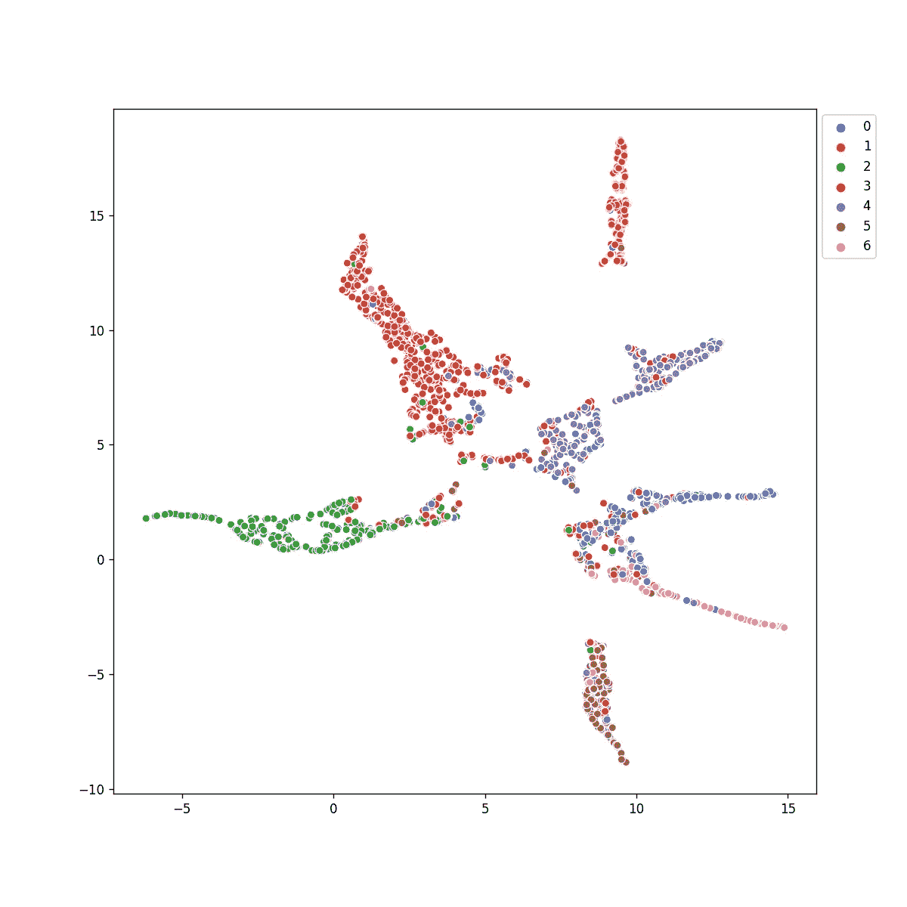

# 你能用 GNNs 做什么

> 原文：<https://towardsdatascience.com/what-can-you-do-with-gnns-5dbec638b525?source=collection_archive---------16----------------------->

## 图形神经网络的操作、效用和优势

由于图形数据结构无处不在的特性，图形神经网络(GNN)越来越受欢迎。图表使我们能够在诸如(但不限于)生物学、社会学、生态学、视觉、教育、经济学等领域对许多不同的科学问题进行建模。此外，图形表示使我们能够处理大规模的非结构化数据。

在本文中，我将展示如何在分类、聚类和可视化等任务中使用简单的 GNN。我将使用一个 GCN(图形卷积网络)运行的例子。这将为你提供巨大的直觉，将意识形态扩展到自己的领域。


艾莉娜·格鲁布尼亚克在 [Unsplash](https://unsplash.com/s/photos/network?utm_source=unsplash&utm_medium=referral&utm_content=creditCopyText) 上的照片

# GNN 的形式表示

任何 GNN 都可以表示为包含两个数学运算符的层，**聚合函数**和**组合函数**。使用 **MPNN** (消息传递神经网络)框架可以最好地理解这一点。



图:**作者图**

## 聚合

如果我们考虑上面的示例图，聚合器函数专门用于组合邻域信息。更正式地说，聚合可以表示为:



作者引用的等式([https://arxiv.org/pdf/1810.00826.pdf](https://arxiv.org/pdf/1810.00826.pdf))

简单来说，第 **k** 个 GNN 层的节点 **v** 的邻域聚合是用层 **k-1 的邻居节点 **u** 、 **hᵤ** 的激活来表示的。**v 的邻居表示为 **N(v)** 。在第一层 **k-1=0** ，即回退到节点特性。在第一层中，我们简单地聚集邻居的初始特征。在 GCN 的情况下，聚合器简单地是度归一化的平均值(每个消息通过 **v** 和 **u** 的度的乘积的平方根来归一化)。只要操作是顺序不变的(结果不会被混洗改变)，人们可以想到各种聚合器，例如 max、mean、min 等。

## 结合

邻居信息与节点本身的组合在下面的等式中正式表示。



方程式由作者引用([https://arxiv.org/pdf/1810.00826.pdf](https://arxiv.org/pdf/1810.00826.pdf))

这里可以使用不同的操作，例如连接、求和或元素池操作。不同的 GNN 架构依赖于不同的功能。GCN 使用平均值，我们将在下面讨论。

在上面的**图**图中，我们可以通过`X1/(sqrt(7×2))`来聚合节点 1 到 6 的特征，X1 是节点 1 和 7 的特征，2 分别是节点 6 和 1 的度。对于每个节点，我们可以这样做。直观地说，我们可以认为这是每个节点通过平均其出度向其他节点传递消息，然后通过平均其入度接收其他节点的消息。因此得名 **MPNN** 。

对于邻接矩阵 **A** 和度矩阵 **D** 具有特征 **X** 的图 **G(V，E)** ，这可以通过 **D^(-1/2)XAD^(-1/2)** 轻松实现。通常情况下，邻接矩阵加上 ***I*** (单位矩阵)来体现节点自身的特征。在这种情况下， **A** 表示为**—**(A 帽)并且 **D** 被替换为 **D 帽**，其中 **D 帽**对应于 **A 帽**。此时，我们已经在几个矩阵运算中执行了聚合和组合。得到的矩阵被馈送给可训练的可微分函数***【ɸ】***，该函数通常是 MLP(多层感知器)，即神经网络。

## 堆叠层

我们讨论了在 **GNN 层**中会发生什么，现在想象我们堆叠几个这样的层。这意味着我们在邻接矩阵上做更多的乘法。如果你熟悉随机游走， **D^(-1)A** 被称为转移矩阵。其用于幂迭代直到收敛，以找到从给定节点到另一个节点的随机行走概率。直观上，我们添加的 GNN 层数越多，聚合的跳数就越多。或者换句话说，在一层之后，我们有节点及其邻居的信息。当我们再次这样做时，邻居(他们有他们的邻居)被再次聚集。因此是 2 跳，依此类推。

> 示例时间！

# PyTorch 几何框架

使用 pytorch 几何库可以很容易地实现 gnn。在那里，您可以找到 GNNs 的许多实现和一个消息传递类，以供您自己的定制实现使用。请点击以下链接查看。

 [## PyTorch 几何文档- pytorch_geometric 1.7.2 文档

### 它由对图形和其他不规则结构进行深度学习的各种方法组成，也称为几何深度学习…

py torch-geometric . readthedocs . io](https://pytorch-geometric.readthedocs.io/en/latest) 

## Cora 数据集

我们将使用受欢迎的 Cora 数据集，它由 7 类科学出版物组成。它通过引用连接，引用代表节点之间的边，这些节点是研究论文。



作者图片

使用 networkx 的图形可视化产生了上面的图像。我们可以看到很少的颜色聚集在一起，但我们从任何一种满足感。因此，让我们降低特性的维度，并进行更多的探索。

## UMAP 论特征

解释数据的一个简单方法是查看那里有什么以及它们是如何放置的。UMAP 是一个非常有用的多元学习工具，它让我们能够做到这一点。让我们想象一下。


作者图片

我们可以看到一些类的本地化，但并不完美。上述操作的简化代码如下(完整代码在文末)；

```
# essential imports that will be needed throughout the blog
import torch
import torch.nn.functional as F
from torch_geometric.datasets import Planetoid
from torch_geometric.nn import GCNConv
import matplotlib.pyplot as plt
import seaborn as sns
import umap
import networkx as nx
import numpy as npdataset = 'Cora'
path = "./"
dataset = Planetoid(path, dataset, transform=T.NormalizeFeatures())
data = dataset[0]embd = umap.UMAP().fit_transform(data.x.numpy())
plt.figure(figsize=(10, 10))
sns.scatterplot(x=embd.T[0], y=embd.T[1], hue=data.y.numpy(), palette=palette)
plt.legend(bbox_to_anchor=(1,1), loc='upper left')
```

我们肯定不满意我们所看到的，所以让我们试试 GCN，看看可视化。我的网络如下(由我从 [pytorch 几何 github 实例](https://github.com/rusty1s/pytorch_geometric/blob/master/examples/gcn.py)修改而来)；

```
class Net(torch.nn.Module):
    def __init__(self):
        super(Net, self).__init__()
        self.conv1 = GCNConv(dataset.num_features, 16, cached=True)
        self.conv2 = GCNConv(16, 16, cached=True)

        self.fc1 = torch.nn.Linear(16, dataset.num_classes) def forward(self):
        x, edge_index, edge_weight = data.x, data.edge_index,
                                          data.edge_attr
        x = self.conv1(x, edge_index, edge_weight)
        x = F.relu(x)
        x = F.dropout(x, training=self.training)
        x = self.conv2(x, edge_index, edge_weight)
        x = F.relu(x)
        x = F.dropout(x, training=self.training)
        x = self.fc1(x)

        return F.log_softmax(x, dim=1) 
```

我们可以使用以下代码对此进行训练:

```
device = torch.device('cuda' if torch.cuda.is_available() else 'cpu')
model, data = Net().to(device), data.to(device)
optimizer = torch.optim.Adam([
    dict(params=model.conv1.parameters(), weight_decay=5e-4),
    dict(params=model.fc1.parameters(), weight_decay=5e-4),
    dict(params=model.conv2.parameters(), weight_decay=0)
], lr=0.01)def train():
    model.train()
    optimizer.zero_grad()
    F.nll_loss(model()[data.train_mask],
                   data.y[data.train_mask]).backward()
    optimizer.step()
```

注意，在 Conv 层 2 中缺少 L2 正则化子，这是 GCN 的作者凭经验决定的(【https://github.com/tkipf/gcn/issues/108】[)。](https://github.com/tkipf/gcn/issues/108)

可视化后，输出如下所示；



作者图片

我们可以看到，不同的阶级有着非常明显的区别。这里，训练以 **0.7800** 的测试精度结束。我们能再多操纵一下吗？让我们看看。

## 嵌入损失

神经网络可以看作是连续的可微函数。分类本质上是学习预测的决策边界。点击此处了解更多关于决策界限的信息；

[](/logistic-regression-and-decision-boundary-eab6e00c1e8) [## 逻辑回归和决策边界

### 理解逻辑回归及其在分类中的效用

towardsdatascience.com](/logistic-regression-and-decision-boundary-eab6e00c1e8) 

总之，如果我们强迫网络有更好的边界，我们可以有更好的可视化。这意味着，我们应该能够分别看到这些类。这在我们可视化集群数据时特别有用。我们能做的一件简单的事情是:

1.  请 GNN 更紧密地嵌入类似的类
2.  请 GNN 进一步嵌入不同的类

请注意，嵌入是网络的最终层输出或分类输出。在这种情况下，我们可以使用点积作为距离的度量。对于这种损失，我们准备如下的数据点对；

```
y_neg_pairs = []
y_pos_pairs = []data_idx = np.arange(len(data.x))
for idx1, y1 in enumerate(data.y[data.train_mask].cpu().numpy()):
    for idx2, y2 in enumerate(data.y[data.train_mask].cpu().numpy()):
        if idx1 > idx2 and y1!=y2:
            y_neg_pairs.append([idx1, idx2])
        if idx1 > idx2 and y1==y2:
            y_pos_pairs.append([idx1, idx2])y_neg_pairs = np.array(y_neg_pairs)
y_pos_pairs = np.array(y_pos_pairs)
```

我们修改的损失函数如下:

```
model_out = model()[data.train_mask]
    y_true = data.y[data.train_mask]
    nllloss = F.nll_loss(model_out, y_true) #Negative loss
    disloss_neg = F.logsigmoid(-1 * (model_out[y_neg_pairs.T[0]]*model_out[y_neg_pairs.T[1]])).sum(-1).mean()

    #Positive loss
    disloss_pos = F.logsigmoid((model_out[y_pos_pairs.T[0]]*model_out[y_pos_pairs.T[1]])).sum(-1).mean()

    loss = 10 * nllloss - disloss_neg - disloss_pos
```

请注意，我们处理点积的极性，并将其传递给 logsigmoid，以获得基于点积的损耗。如果你感兴趣，这可以在 GraphSAGE paper([https://arxiv.org/abs/1706.02216](https://arxiv.org/abs/1706.02216))下研究。

现在我们的训练以损失 **0.7720** 结束，比以前略有下降。让我们想象一下 GNN 和 UMAP 的输出。



作者图片

我们可以看到集群现在更好了，噪音也稍微小了一些。尽管我们的准确度较低，但我们有更好的聚类分离。实际上，较小的测试损失是由于簇的不确定性。我们可以看到一些点自信地位于错误的颜色群中。这本质上是数据的性质决定的。

## 将该思想扩展到无监督聚类

当我们没有标签，只有特征和图形时，我们如何扩展这个想法。这已经在 GraphSAGE 中讨论过了。简单的想法是使用图拓扑将更近的节点嵌入更近的节点，反之亦然。代替我们的正对和负对，我们可以有直接连接对和随机对分别作为正对和负对。这在各个领域都显示了良好的效果，这是另一天的主题！😊

我希望你喜欢这篇文章，我相信这对你的研究也会有用！

和其他文章一样，这篇文章也附带了[笔记本](https://gist.github.com/anuradhawick/bd2eb3f4e5f9c8030f8125d97dc686ac)！