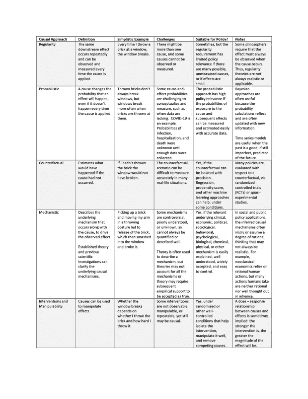

# 什么导致什么，我们怎么知道？

> 原文：<https://towardsdatascience.com/what-causes-what-and-how-would-we-know-b736a3d0eefb?source=collection_archive---------27----------------------->

## [提示和技巧](https://towardsdatascience.com/tagged/tips-and-tricks)

## ***面对关于新冠肺炎、气候变化、种族主义和其他争议的大量错误信息，数据科学家可以使用可靠的因果推理来帮助我们找出该相信什么***

马库斯·温克勒摄于 unsplash . com:Markus-Winkler-yypmca 32 u _ M-unsplash . jpg

我们天生渴望了解为什么重要的事情会发生或可能发生，这是我们寻找因果关系的特征。然而，根据波兰经济学家和哲学家 Mariusz Maziarz (2020)的说法，2000 多年的思考并没有让我们就什么是因果关系或如何安全地断言因果关系达成一致。这使得人们很难区分真相和炒作。

根据 James Woodward (2005)的说法，哲学家从两个方面思考因果关系:

1.它是什么，我们如何推断因果关系，和/或

2.不同群体的人如何理解因果关系。

伍德沃德的第二点很重要，我会在另一篇文章中再谈。例如，我们如何理解(或未能理解)因果关系决定了我们如何解释关于新冠肺炎起源的陈述；测试对它的效用；应该如何、何时以及为谁进行测试；社会距离、遮蔽和疫苗是否真的有效；又是为了谁。

我们如何思考因果关系，以及我们选择如何推断因果关系，也决定了我们在哪里以及如何寻找因果关系。这在科学、医学和公共政策中很重要。我们对因果推理的假设和方法经常导致公共政策在应对气候变化或新冠肺炎等感知威胁时可能效果不佳。它们还影响联邦或私人资助的癌症研究投资规模、打击国内外恐怖主义、种族主义、健康和福利计划以及许多其他问题。

一种因果机制是否应该适用于所有人，或者因果关系是否会因性别认同、年龄、种族、民族、教育、地区、国家、时间段或收入水平而有所不同？我们将在下次调查这些问题。为了做好这一点，我们需要一个基本概念的基础，即一件事或事件引起另一件事或事件意味着什么，以及我们应该如何试图推断因果关系。我们还必须明白如何处理主要基于拙劣因果推理的错误信息(更不用说明目张胆的政治议程和权力欲了)。在这篇文章中，我将通过总结该领域领先专家的工作来提供基本的基础。

哪些因果观念引导着我们的思维？

关于因果关系的争论渗透到几乎每一个社会问题中，我们分裂的政治、离奇的阴谋论的存在以及关于哪些理论是阴谋还是真实的分歧都证明了这一点。因果推理方法(例如，我们如何决定我们幸福或疾病的真正原因)在许多问题上有很大不同。

例子包括观察到的原因和其声称的结果之间应该存在多长时间(如果有的话),以及关于安全地假设情况或事件确实是因果关系所需的证据的类型和数量的分歧。是事件 A 导致了结果 B 还是 B 导致了事件 A？或者，我们观察到的 B 的下游变化是否完全是由其他原因引起的？进行更多的测试会导致 COVID 病例的增加吗，正如一些知名人士所建议的那样，或者这些额外的测试只是发现了更多由于其他更可能的原因而已经存在的病例？

在某些情况下，A 和 B 可能会循环工作，相互造成。例如，投资股票市场可能会产生更高的收入和财富，这些收益可能会刺激更多的股票投资。这些先有鸡还是先有蛋的场景可能很难解析。

丹尼尔·塔特尔在 Unsplash.com 上的照片:丹尼尔-塔特尔-BPGPk_n7rkc-unsplash.jpg

Maziarz 和其他哲学家研究了五种分离因果影响的方法，包括如下。我们可以用这些来改进我们的因果推理，下面有一些附带条件。

**规律性**假设一个原因总会产生一个结果，没有例外。自然法则提供了行为规律性的例子。由重力引起的定期发生的波浪作用和潮汐就是例子。一些早期的哲学家要求必须存在一个“B 总是遵循 A”的模式来推断因果关系。

**概率推理**不要求一个原因每次都会产生一个结果。在这种情况下，原因提高了*其结果的概率*，但是结果并不总是发生。吸烟与心脏病和各种癌症之间的关系就是这样的例子——不是每个吸烟者都会患这些疾病，但有很高比例的人会。

**反事实推理**提出了如果 A 没有发生，事情会如何不同的问题。关于政府是否应该扩大失业救济以减少疫情经济困难的争议可以被视为对反事实情景的分歧。比如，一些人认为每周额外提供 300 美元的失业救济金导致了美国劳动力短缺。他们说，如果我们不这样做(即，在反事实情景下)，更多的失业工人将寻找工作。不过，到目前为止，支持这种反事实观点的证据还很薄弱。在扩大的新冠肺炎福利到期后，劳动力短缺几乎没有改善，因此每周额外的 300 美元可能不会导致工人短缺(Combs 等人，2021)。

**机械推理**是另一个“如何”的问题，通常涉及深入探究 A 如何导致 b。例如，辉瑞和 Moderna 疫苗如何给新冠肺炎带来高水平免疫力的 mRNA 科学导致了因果关系的直接解释。这项科学极大地影响了这些疫苗的制造、储存、分发和应用，从而降低了 COVID 的住院率和死亡率。

**操纵推理**指的是“做 A”，而不是让 A 自然发生。这里的含义是，人类或其他对 A 的干预导致了结果 B。相关的问题包括，要使 B 可见需要多少 A，如果我们改变了 A 的水平，那么我们可以期望看到多少 B？旨在寻找最安全和最有效的新药剂量的研究就是操纵的例子。最低工资、就业和购买习惯之间的关系也说明了操纵因果关系的影响。

每种方法都有细微差别或亚型，它们在潜在的哲学基础、挑战和对公共政策的适合性方面有所不同，Maziarz 将他的大部分文本致力于这些问题。他还描述了这些因果推理方法在应用时如何相互重叠。下表大致基于他的工作，并呈现了我对他描述的五种方法的总结。

表 1:因果推理方法概述

当我们推断因果关系时，有五种方法可供选择，是否有一种方法在所有情况下都是最好的？不幸的是，每种方法都有优点和缺点，这些都是特定情况下的。表格中只列出了一些利弊。请参阅许多其他参考资料。

**数据科学家如何提高因果推理？**

考虑因果关系的多种方法将增加我们的因果解释是正确的可能性。如果几个(甚至至少两个)有效的方法已经被应用并导致一致的结果，并且如果其他执行良好的因果关系推断方法没有很快否定这些一致性，那么我们更有可能正确地推断出干预是否是真正的因果关系。

Russo 和 Williamson (2007)提供了这一概念的一个例子，他们说，将机械论和概率学方法结合起来，可以在医疗保健应用中产生关于因果关系的更强有力的见解。当药物或疫苗的作用机制及其预期效果发生的概率已知时，对因果关系的合理推断是可能的。

在无法进行精心设计和执行的随机对照试验的情况下，多重因果方法尤其有用。这种随机对照试验通常将理论与机械、操纵和/或反事实方法相结合。因此，RCT 可能会分离出干预对感兴趣结果的影响。执行良好的随机对照试验通过调整许多可测量和不可测量的因素来做到这一点，否则这些因素可能会混淆因果解释。

然而，在很多情况下，由于后勤、伦理、行为、预算或其他原因，RCT 无法进行。在这种情况下，好的准实验或其他仔细的研究也可以应用多种因果推理方法。综合起来，这些将导致更强的因果关系陈述，我们可以休息我们的帽子。

例如，在不同的情况下，通过不同的手段在不同的物种之间复制科学研究，并通过对烟草公司行为的新闻调查得到加强，导致吸烟导致癌症的广泛接受。没有 RCT 可以在人类身上解决这一假设，因为将吸烟状态分配给人们来看谁最终会得病，谁不会得病，这是不可能的，也是不道德的。

另一个例子是利用 DNA 研究来宣告那些被判无罪的人无罪，尽管早期的证据表明事实正好相反。例如，如果从留在谋杀现场的体液中提取的 DNA 表明嫌疑人不太可能犯罪(因为嫌疑人与可能的罪犯没有相同的 DNA 特征)，他或她可能没有谋杀受害者。这将是一个概率因果推理的例子。

在这些领域和其他领域进行良好的概率、机械、反事实或操纵研究有助于阐明因果路径。他们还可以提供证据，证明早期调查中的错误成本。

**局限性和进一步探索**

已经有一些关于因果关系的有用的教科书和文章，作者是著名的思想家，他们在学术出版社和同行评审期刊上发表文章。他们的一些原理和方法已经在*走向数据科学*或*媒体*的其他地方的短文中描述过。我没有必要在这里详述他们在方法论上的贡献，也不可能在这么短的篇幅里给他们应有的空间。相反，我在这里的意图是提出 Maziarz (2020)描述的关于因果推理的哲学观点，然后将这些哲学与 Pearl (2009)、Morgan 和 Winship (2015)以及其他人(例如 Pearl 和 Mackenzie (2018))提到的一些原则和方法联系起来；Woodward (2005 年)，以及 Russo 和 Williamson (2007 年)。

影响研究设计和方法的哲学和原则的深思熟虑的结合对于数据科学家和其他研究人员来说是非常有价值的。这将有助于他们为雇主、消费者和政策制定者令人信服地描述什么导致了什么，什么没有，以及如何最好地解决令人烦恼的商业或社会问题。在这次努力中，我只是触及了表面。

卡伦·艾姆斯利在 Unsplash.com 上的照片:kalen-emsley-G1qxBDxM8vE-unsplash.jpg

因此，这篇文章留下了许多未被覆盖的领域。我没有提到的其他重要问题包括:

***如何应用五种方法中的每一种？每种方法的适当步骤是什么？Morgan 和 Winship (2015)在文中对社会科学研究中使用的反事实的原则和方法进行了全面的回顾。他们提出了一些问题，比如在决定学生在学校的表现以及他们成年后最终能挣多少钱时，家庭背景和内在智力哪个更重要。摩根和温希普还阐述了社会经济地位是否会导致健康水平和死亡率的差异。Maziarz (2020 年)回顾了所有五种因果推断方法的文献和若干应用，侧重于许多领域的经济政策分析。***

采用坚实的概念或理论框架如何指导因果分析？ 我读过的每一本关于人工智能、机器学习、深度学习的教科书都强调依靠坚实的理论和人类专业知识进行指导的价值。Pearl (2009)和 Morgan 和 Winship (2015)也是如此，他们描述了如何使用有向无环图来直观地显示因果关系。我们生活在一个不确定的世界，但是如果可靠的理论和方法被反复应用，不确定性并不排除因果推理。

这五种方法的影响力和受欢迎程度如何？对一种方法或特定方法组合的偏好在多大程度上帮助或伤害了对因果理解的探索？ Maziarz (2020)在经济政策研究中解决了这些问题，Morgan 和 Winship (2015)为其他社会科学解决了这些问题。例如，在过去几十年的社会科学研究中，匹配干预和控制对象，或者在分析中给予这些对象不同权重的倾向得分方法已经大受欢迎。然而，像任何其他方法一样，倾向分数可以应用得好或不好，导致正确或不正确的因果陈述。摩根和温希普提供了详细的例子。

***读者如何区分好的因果方法和那些来自非科学阴谋论的方法？Pearl(2009)的文章关注的是关于吸烟和癌症的争议，但他和他的合著者 Dana Mackenzie (2018)描述的因果阶梯方法对于找出许多阴谋论的错误也非常有用。他们的因果阶梯包括 Maziarz (2020)描述的五大因果方法中的几个，并在上表中进行了总结。关于新冠肺炎，其他研究人员正在应用对生物化学原理的强烈依赖，以及描述人体如何工作的机制的清晰说明，以帮助消除许多关于 COVID 疫苗的错误信息。***

***因果论错了的代价是什么？几十年来，关于吸烟的争论引发了数以百万计的心脏病、中风、残疾和死亡，我们看到了这些代价；Pearl (2009)很好地解决了这个问题。***

我们也看到了今天错误的因果关系的代价，更多的病例，长期残疾和不必要的死亡，因为错误信息专家继续对所谓的新冠肺炎不严重的毫无根据的观点和口罩的有限效用，社会距离，测试和疫苗。不幸的是，错误信息的成本(即在关于 COVID 的争论中滥用因果推理的成本)被政治法令放大了，因为政治家错误地禁止或限制了使用有效的方法来解决疫情。

关于气候变化，犯错的代价可能从应对气候变化的资金不足或使用不当，一直到地球温度持续上升带来的生存威胁。关于因果关系的争论(例如，人类是否导致了全球变暖，我们真的能控制它吗？)还会继续。

科学指导下的有充分根据的因果解释可以为关于这些和许多其他争议的有益讨论提供基础，但只有当我们真正愿意资助好的研究并在安全的环境中进行尊重和深思熟虑的讨论时。

**结论**

虽然在过去的 30 年里，因果推理取得了重大进展，特别是由于上述作者及其同事的影响，但仍有许多问题需要解决。应用可靠的因果理论、原则和方法的数据科学家将帮助我们理解世界的真实运作方式。利用合理的因果推理方法，以及其他方法来对抗错误信息，将带来更好的研究、更聪明和更有效的公共政策，以及我们这个星球上更好的健康和福祉。

**鸣谢**

我要感谢 Mariusz Maziarz 博士审阅了本文的草稿，并提供了许多有用的评论，澄清了我对因果推理的理解和介绍。任何遗留的错误都是我的。

**参考文献**

K.Coombs，A. Dube 和 C. Jahnke 等人，提前撤销疫情失业保险:对收入、就业和消费的影响，[https://files . michaelstepner . com/pandemicUIexpiration-paper . pdf](https://files.michaelstepner.com/pandemicUIexpiration-paper.pdf)

米（meter 的缩写））Maziarz,《经济学中的因果关系哲学》( 2020 年), Routledge-Taylor & Francis 集团，纽约

南 L. Morgan 和 C. Winship C,《反事实和因果推理:第二版》( 2015 年),剑桥大学出版社，英国剑桥

J.珀尔，《因果关系:模型、推理和推论》，第二版(2009 年)，纽约剑桥大学出版社

J.Pearl 和 D. MacKenzie,《为什么之书:因果的新科学》( 2018 年),纽约基础图书公司

F.Russo 和 J. Williamson，解释健康科学中的因果关系(2007)，科学哲学中的国际研究 21(2):157–170

J.伍德沃德，《让事情发生:因果解释理论》(2005)，牛津大学出版社，英国牛津