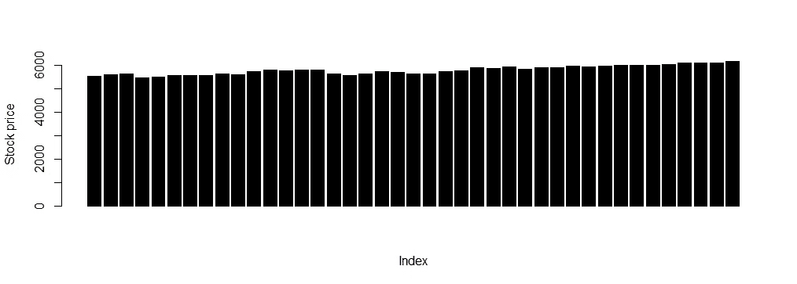
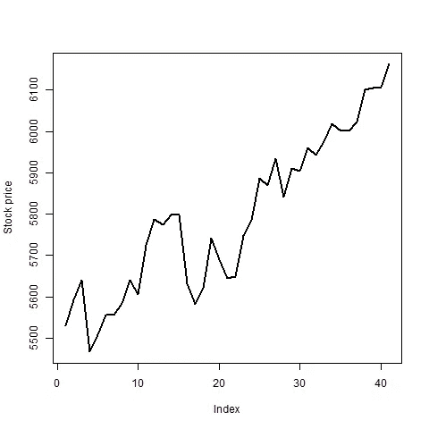
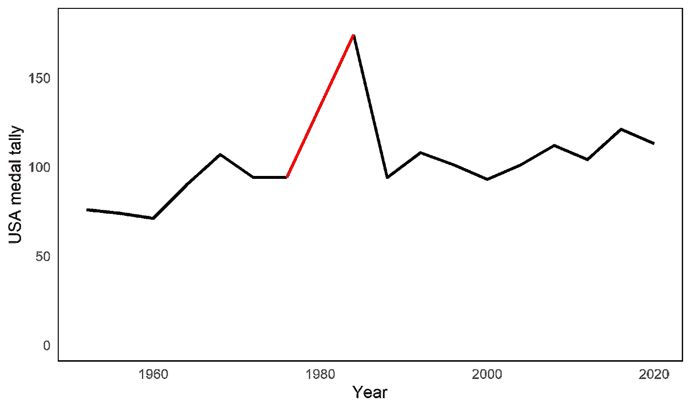
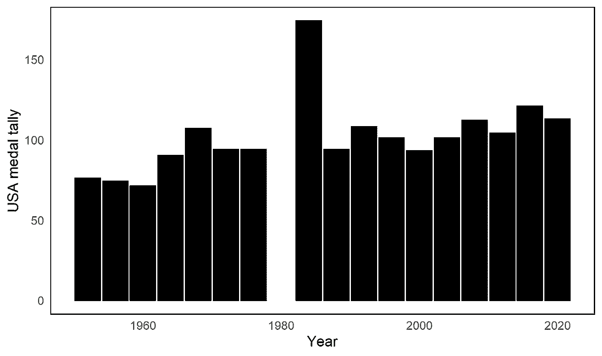

# 可视化时间序列时使用哪种图表类型

> 原文：<https://towardsdatascience.com/what-chart-type-to-use-when-visualizing-time-series-e0f1a779f2f7?source=collection_archive---------18----------------------->

## 关于可视化时序数据时如何以及何时选择条形图而不是折线图的提示

杰克·希尔斯在 [Unsplash](https://unsplash.com?utm_source=medium&utm_medium=referral) 上的照片

D 数据可视化是向更广泛的受众传达信息的强大工具。这意味着除了使用正确的配色方案、字体大小和字体类型之外；使用适当的图表类型来描述数据也很重要。

本文的重点，从标题可以清楚地看出，是时间序列。按照惯例，我们把时间序列想象成线形图。但是，如果我说这不总是正确的，我们甚至可以使用条形图来可视化时间序列。你会说我在歪曲数据吗，或者用条形图代替折线图可以吗？或者在使用条形图而不是线图时有例外吗？

为了理解这一范式，首先，让我们看看维基百科上的时间序列定义:

> 在数学中，**时间序列**是按时间顺序索引(或列出或绘制)的一系列数据点。最常见的是，时间序列是在连续的等间隔时间点取得的序列。因此，它是一个离散时间数据序列。时间序列的例子有海潮的高度、太阳黑子的数量和道琼斯工业平均指数的每日收盘价。

这意味着时间序列中的数据点是离散值，但如果与前面的点存在关系，则是连续的。如果我们看看股票市场，以前的事件会严重影响当前的价格。因此，我们可以有把握地说，历史数据影响当前数据，因此是连续的。我们使用线图来可视化这些类型的时间序列。因为两个数据点之间的斜率可以提供信息，或者我们可以对数据进行插值以提取新的信息。

另一种时间序列是数据点不相关的情况。这些类型的时间序列就像比赛，世界纪录，或者，比如说，一个国家获得的奥运奖牌。对于这种类型的时间序列，计算相邻数据点之间的斜率或对数据进行插值不会增加任何值。因为历史数据之间的关联非常弱。在这种情况下，最好使用条形图来表示数据。

现在的问题是，在处理时序数据时，应该选择哪种图表类型。试着回答以下问题。这些问题的答案将引导您找到最能代表您所追求的时间序列的图表类型。

—您正在处理什么类型的时间序列？

—当前数据是否受到历史数据的影响？

—对数据进行插值有意义吗？

—数据点之间的时间间隔是小还是大？

回答上述问题将有助于识别数据随时间的变化情况，并指导您选择正确的图表来显示时间序列。

## 具有相关观察值的时间序列

我们将使用来自 R 提供的内置数据的`EuStockMarkets`数据集，并将时间序列绘制成条形图和线图。

第一个图是一个条形图，其中每个条形都是一个离散值，这种类型的图不能提供任何关于任何两个连续指数之间股票表现的信息。这是因为我们无法对数据进行插值，因为运行指数之间没有连续性。

作者图片

如果我们将上述数据重新绘制成一个线图，那么该图将提供两个相邻指数之间的更多信息。由于指数基本上是一个时间单位，所以对数据进行插值更容易从数据中获得隐藏的见解，这在使用条形图时是不可能的。

## 具有不相关观测值的时间序列

现在，我们使用另一个数据集创建相同的绘图类型。这里，我们将使用美国奥运会总奖牌榜(数据来源:[维基百科](https://en.wikipedia.org/wiki/United_States_at_the_Olympics))。

我们用线性插值(红色区域)将奥运会奖牌数据绘制成折线图，以计算 1980 年获得的奖牌的缺失值。这种图表类型是不正确的选择，因为这里提供的数据与美国队以前和将来的表现无关。一种说法是，两次不同奥运会的参赛队伍可能不一样，比赛场地不一样，天气也不一样，这都会影响运动员的表现。

作者图片

我们再一次用条形图描绘出美国队在奥运会上获得的奖牌总数。对于 1980 年，我们没有绘制数据，因为美国没有参加在俄罗斯举行的奥运会。在下面的图表中，我们要看的是该队在每届奥运会上的表现，所以用缺失值来预测该队在 1980 年的表现是不明智的，因为该数据与过去或未来的表现无关。

作者图片

## 结束语

从上面的例子中我们看到，当处理具有相关数据点的时间序列时；将数据绘制成线形图是一种很好的做法。如果数据是不相关的，那么条形图比折线图更好。

确定要实现的图表类型的最佳方法是通过询问数据。理解数据，理解它实现或描述的内容，可以打开正确表示数据的大门，而不会有错误的表述。它不仅对当前场景有效，也适用于其他图表类型。确保通过可视化呈现的数据向观众传达了正确的信息。

我撰写的其他与数据可视化相关的文章:

</six-guidelines-for-good-visualizations-7c1831cda29f>  </hands-on-tutorial-f2ee5dc4d0a8>  </master-data-visualization-with-ggplot2-pie-charts-spider-plots-and-bar-plots-899a07a15827>  </data-visualization-using-ggplot2-5-features-worth-knowing-c0447a760335>  </creating-your-own-color-palette-for-data-visualization-part-2-7b02ebc31c19>  

*可以在* [*LinkedIn*](https://www.linkedin.com/in/abhinav-malasi/) *和*[*Twitter*](https://twitter.com/malasi_abhinav)*上与我连线，跟随我的数据科学和数据可视化之旅。或者您可以在 Medium 上关注我，了解有关 R 和 ggplot2 包的数据可视化的最新文章。*