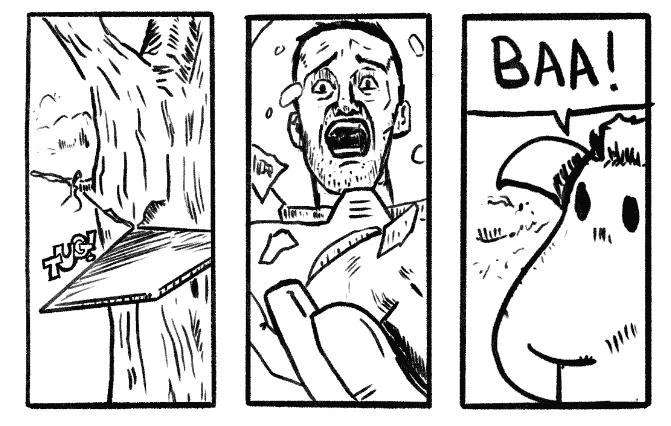
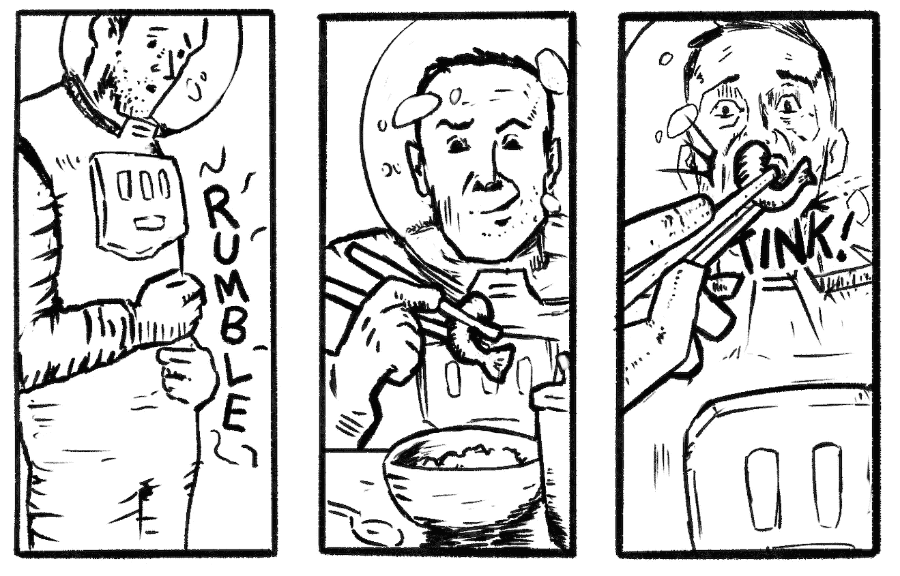
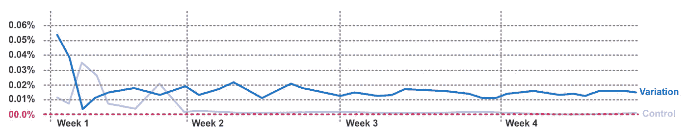
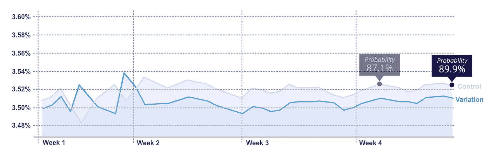

# 关于 A/B 实验分析，漫画能教会我们什么

> 原文：<https://towardsdatascience.com/what-comics-can-teach-us-a-b-experiment-analysis-c1ba70e50d0c?source=collection_archive---------39----------------------->

## 运用漫画转场的原理讲述风险、回报和确定性的故事

作者图片

当我刚开始运行 web 实验时，我主要是设计和开发它们。一旦这些实验结束，它们就会去找一位分析师，我会被告知测试是否具有*【统计显著性】*。

CRO 的顾问和分析师总是被问到，在给定特定结果的情况下，对于一项实验，什么是正确的决定。但是，我们是否总是拥有有效建议所需的信息？**我们确定我们知道我们的实验传达给我们什么吗？**

即使在我更多地参与事物的分析方面之后，使用频繁主义的统计术语如“显著性”、“p 值”、“置信区间”、“z 得分”和“功效”都是抽象的概念**难以** **可视化**和**难以** **沟通**。当然，它们会给我们一个布尔型的“是”或“否”的回答，但这对需要细微差别的实验有用吗？

这些统计术语让我想起了斯科特·麦克劳德(Scott McCloud)在他的优秀著作《理解漫画**》中描述的“不符合逻辑的”画面过渡(作为一名* [*漫画作家和漫画小说家*](https://iqbala.com) *，我倾向于从画面的角度来思考)。**

*《剑桥词典》对不符合逻辑的定义是:*

> **“与前一个陈述的意思不一致的陈述”**

*在书中，Scott 引用了非推理作为面板到面板转换的例子:*

**

*图片作者。一个**不合理的**面板过渡*

*非推理对于传达情绪和设定基调非常有用。他们邀请读者建立他们自己的联系，因此对一系列图像有意义。结果是一种主观体验——天生的个人和内省。*

*他提到了另一种更常见的面板到面板的过渡形式(希望是您更熟悉的一种):*

**

*图片作者。一个**行动到行动**面板过渡*

*这是一个“行动到行动”的面板转换。他们更不愿意被解读。在这里，作者可以更好地控制他们传达给读者的内容，因此，能够进行更加客观和直接的交流。*

*这与分析和统计有什么关系？嗯，**漫画和面板过渡是一种交流方式**。这里传达的信息恰好是一个通过一系列连续面板讲述的故事。*

*如果我们将统计术语和数据视图视为*面板*，那么我们需要确保避免不符合逻辑的情况。相反，我们需要确保这些小组相互合作，像*行动到行动*小组过渡那样更明确地传达信息。*

*在《赤裸裸的统计》中，查尔斯·惠兰写道:*

> *“《纽约时报》指出，‘数据仅仅是知识的原材料。’统计是我们利用信息达到某种有意义的目的的最有力的工具……”*

*换句话说，统计学是从数据中提取*含义*的有力工具。但是我们试图从我们的实验中收集到什么意思呢？*

*嗯，我们通常想知道我们的下一步行动应该是什么。为了理解这些行为，我们可以根据目标将实验分为两类:*

***转化成功实验**:这是为了获得转化成功而探索假设的地方。对于这些类型的实验，我们想知道我们的假设是否得到了验证。如果没有，那我们有什么可以学习的吗？*

***去风险实验:**在这种类型的实验中，人们希望“去风险”某个特性或变更。我们并不特别期待这些测试的胜利，而是确保*没有变化的负面影响*。我们想知道变异是否可以安全发射。我们会对一个“平淡”的结果感到满意。我们通常也在这里寻找一个快速的结果。*

**去风险*型实验的挑战在于，我们应该让实验运行多长时间才能确保结果平稳？这是一个很难回答的问题，因此有一种趋势是，这些实验会运行很长一段时间，以“收集更多的数据”。*

*在上面的两个例子中，当我们有明确的输赢时，frequentist 方法提供的布尔响应通常是好的。除此之外，他们都不是超级有用的。*

*我们的统计数据需要能够满足上述两种类型的测试。我们需要的是能够告诉我们*风险、回报*和*确定性*的统计视图。*

*我在寻找数据的不同视图，这些视图协调一致地工作，构建一个类似*行动对行动小组*的序列。结合起来，这些将传达我们需要的意义(或故事)。*

*希望结果能够为分析师和利益相关者提供更清晰的决策过程。*

*我还希望减少实验的运行时间。尤其是那些运行时间过长的去风险实验。所有这些以及*减少了对高度专业化的统计知识的依赖*——毕竟，频率主义者的方法是复杂的。*

*在我研究的过程中，我偶然发现了克里斯·斯图基奥的观点:一项研究揭示了对常客研究结果的普遍误解。辩论的另一方也有 T2 的文章。以及文章[辩论辩论本身](https://cxl.com/blog/bayesian-frequentist-ab-testing/)。*

*我很幸运在 Trainline 有一个惊人的数据科学团队，作为一个项目来进一步研究这个问题。他们提出了前面提到的克里斯·斯图基奥为 VWO 设计的预期损失。*

*克里斯解释了这种方法:*

> *计算一个后验概率，用它来估计你选择 A(或 B)的预期损失是否低于关心阈值。如果是，停止测试。”*

***预期损失**让我们看到了与选择测试的*特定变体*相关的“风险”——即选择变体与对照的转换成本是多少？*

*特定变异的风险越低越好。特定变体的理想风险为零。*

*你可以在这里阅读更多关于[预期损失](https://www.chrisstucchio.com/blog/2014/bayesian_ab_decision_rule.html)。你也可以阅读他的主题为的白皮书。这里就不赘述细节了。我也不会讨论贝叶斯的定义。有很多关于那个[的在线资源，包括这个](https://medium.com/@shankyp1000/bayesian-statistics-explained-in-simple-terms-with-examples-5200a32d62f8)。*

*我将介绍的是**预期损失**的一个示例实现。例如，观察一段时间内累积的数据*似乎是贝叶斯方法。为每个测试变量绘制一个预期损失线图是有意义的。**

**这里有一个例子*(这是基于大量实际实验的模型)*:**

****

**图片作者。风险的故事。随着时间的推移绘制的累积“预期损失”。越低越好。**

**这个观点传达了我们实验中每个变异组的风险。风险越低越好。所以最接近零的变量是最好的。在上面的例子中，这就是控件。**

**我们可以看到，这条线本身就讲述了一个故事。开始时，数据通常过于嘈杂，无法读取。每个变量的预期损失线相互交错。一段时间后，线条趋于稳定，变得更加稳定。**

**我们可以选择给**预期损失**赋予一个货币值，以获得货币形式的风险。**

**但是*风险*只是一部分。下面是图片的另一部分*(同样，这是基于多次实际实验的实体模型)*。**

****

**图片作者。奖励的故事。随时间绘制的累积“转换率”。越高越好。**

**在这里，我们展示一下*奖励*的故事。我们展示了随着时间的推移每个变量的累积转化率*。从这个角度来看，越高越好。***

**我们现在开始讲述一个更好的实验故事。这个观点有点像预期损失观点的*逆*。控制组现在在最上面，因为它比变化组转化得更好。**

**随着时间的推移跟踪贝叶斯概率以及转换线图也很有用。这让我们看到了我们的*确定性水平*。这类似于频率主义术语中的显著性水平。它告诉我们什么是**控制实际上比变异更好的概率**。**

**既然我们已经有了讲述我们故事的所有片段，那么定义规则和过程来描述*我们应该如何*看待上面的视图是很有用的。**

**例如，我们可以进行一些*稳定性检查*，比如确保两个线形图显示过去七天数据的稳定读数，也就是说，线不应该交叉，而是显示过去七天的一致性。**

**然后检查转换率表现，以确定表现最佳的变量。在上面的例子中，*控制组*表现最好。**

**接下来，我们检查*确定性*水平。如果确定性不明确*(例如，概率略低于 90%)* ，那么我们应该检查预期损失，以验证无论如何推出变体会带来多大的损失风险。**

**当我们将这一过程与数百个以前的实验进行对比时，我们确实发现结果更加清晰。值得注意的是，预期损失从未与之前的 frequentist 统计观点相矛盾，相反，它提供了一个更微妙的观点。**

**当与新实验的频率统计数据一起追踪时，我们发现这种观点确实增加了数据阅读的清晰度。从而为需要细微差别的实验提供了更清晰的图像。**

**由于这种清晰性，结果是减少了实验的运行时间，因为分析师更有信心调用测试的结果。利益攸关方也能更好地了解情况以做出决策。**

**所有的测试仍然运行一个最小的运行时间，但是有更少的实验连续运行数周而没有结果被调用，特别是那些被报告为“平淡”的实验。**

**此外，测试可以用更少的流量运行，在需要的地方用确定性换取风险。因此，这对于初创公司和小型企业来说非常有用，它们的流量水平不如大型企业。**

# **结论**

**像漫画一样处理实验统计数据确实有助于给我们想要得到的*含义*带来清晰和意义。**

**通过弄清楚我们的*的含义*，并反向工作以确保统计和数据视图(我们的面板)能够提供它，可以帮助我们做出更好、更明智的决策。尤其是在需要更多细微差别的情况下。**

**我希望这能帮助其他人将这些原则应用到他们的工作中。如果你觉得这很有趣或有用，请告诉我，我很乐意收到你的来信。同时，感谢 Chris Stucchio 对预期损失函数实验的惊人贡献。**

# **关于我**

**我是**伊克巴尔·阿里**，[漫画作家](https://iqbala.com) ，前 Trainline 优化主管。**

**我现在通过培训、建立流程和讲述他们的数据故事来帮助公司的实验项目取得成功！**

**这是我的 [**LinkedIn**](https://www.linkedin.com/in/iqbalhussainali/) 如果你想联系。**