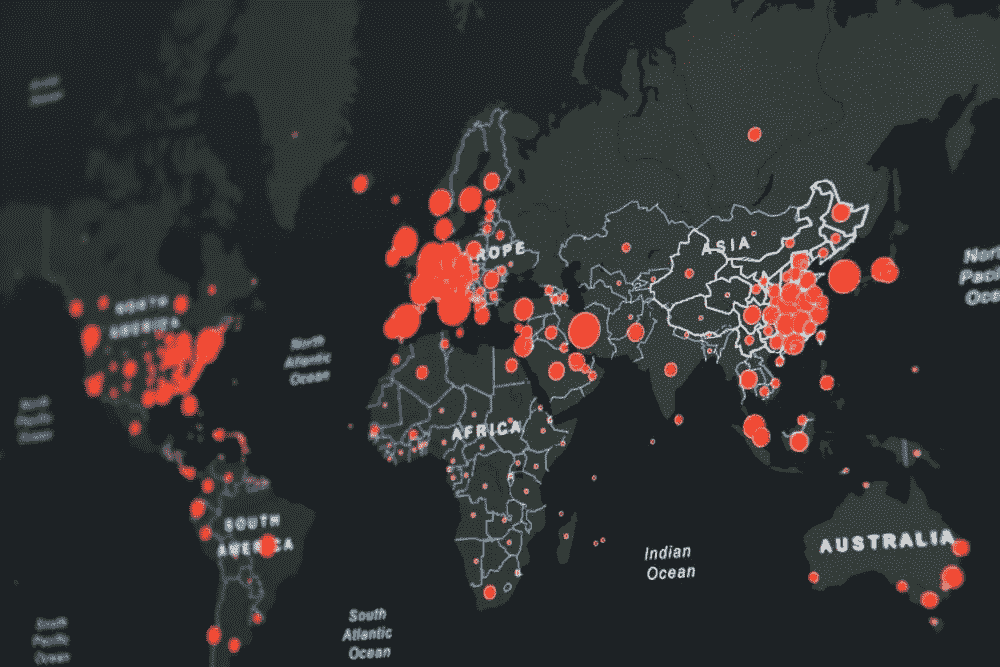

# 数据科学贸易技术是什么样的，为什么我们需要它

> 原文：<https://towardsdatascience.com/what-data-science-tradecraft-looks-like-and-why-we-need-it-9e16504c7101?source=collection_archive---------23----------------------->

## 如何实现计算透明性的指南

在 [Unsplash](https://unsplash.com/?utm_source=medium&utm_medium=referral) 上由 [anyaberkut](https://www.istockphoto.com/portfolio/anyaberkut?mediatype=photography) 拍摄的照片

对于许多不熟悉统计学或算法如何运作的公众消费者来说，数据科学可能会令人望而生畏。这些盲点会让最终用户不确定流程是如何工作的，或者呈现的信息是否有偏差 ***。****标准化计算分析* 的发展将有助于增加技术过程的透明度，而这一过程并不容易被大多数消费者所理解。目前，各种组织发布显示数据的仪表板、统计数据和图表，这些数据不是以标准格式或普通客户可以理解的方法呈现的。透明度是必需的，以便消费者能够理解数据来自哪里，它是什么类型的数据，以及数据是如何被聚合以实现显示的结果。操纵数据或错误显示数据的方法有很多种；这些问题可能源于数据科学家的无能、缺乏经验或缺乏兴趣，因为缺乏执行这种严格性的标准。

***新冠肺炎疫情强调了公开数据透明度和准确性的必要性。***

马丁·桑切斯在 [Unsplash](https://unsplash.com/?utm_source=medium&utm_medium=referral) 上拍摄的照片

2020 年 5 月，一名负责创建该州新冠肺炎仪表板的佛罗里达州数据科学家被解雇，因为她质疑该州官员对可访问性和透明度的承诺。Rebekah Jones 声称，她的上司坚持显示不正确的数据，以证明尽快在佛罗里达开业是合理的。她随后利用捐赠的资金创建了一个公开可用的新冠肺炎仪表板，该仪表板持续显示比佛罗里达州官方仪表板更高的新冠肺炎病例。从时间的角度来看，她的作品似乎已经得到了 ***的验证。*否则，那些有政治目的和不太正直的人很容易歪曲公共信息，如果他们愿意的话。**

我花了 12 年时间，仿照 Rich Heuer 的[结构化分析技术](https://www.cia.gov/static/955180a45afe3f5013772c313b16face/Tradecraft-Primer-apr09.pdf)编写分析评估，并在大学研究他的工作，后来在国防情报局担任专业分析师职业教育(PACE)讲师。在过去的几年里，我作为一名数据科学家在国防部工作，这让我确信*数据科学界将从标准化的结构和透明性中受益匪浅*。国防部采用由情报界(ic)创建的被称为“结构化分析技术”的分析方法，以增加分析过程的系统性严谨性，并抵消认知偏差。这些方法采用工具和技术，帮助 IC 成员向决策者提供经过全面分析的信息。

***数据科学依赖于完善的科学方法和严谨性。因此，它还应该使用科学界开发的所有方法和工具来记录、验证和证实自己的研究。***

照片由 [Aaron Burden](https://unsplash.com/@aaronburden) 在 [Unsplash](https://unsplash.com/?utm_source=medium&utm_medium=referral) 上拍摄

商业行业中使用的数据科学应用程序也应利用结构化分析技术，因为这些产品通常用于告知公众或帮助客户做出高级决策。在每种形式的信息收集中，数据的有效性、完整性和准确性都是重要的考虑因素。使用透明的计算分析可以满足消费者的这些顾虑，并使用户能够了解数据的来源和类型，以及如何汇总数据以产生呈现的结果。本文提供了在将数据科学应用于公共消费产品时实现必要的*计算透明性*的指导。

本文确定了数据科学从业者在生产发布产品时应该采用的五种方法。这些方法确保在数据科学流程中正确应用科学建立的贸易技巧和严谨性。每种方法都是针对情报部门指令 203“分析贸易标准”中规定的九种分析贸易标准中的一种或多种而制定的

**透明计算分析**

以下方法应用于计算机算法和数据可视化:

可重复计算

代码可用性描述

数据存档

解释基本原理

替代计算

**可重复计算:**

使用计算机计算的出版产品必须能被其他用户复制。代码透明性是可复制性的关键。如果在不同的硬件上运行，对用户的文件目录做出错误的假设，或者使用不同的设置编译信息，即使是相同的代码也可能无法产生相同的输出。因此，计算必须包括参考部分中所有相关数据的文档，包括文件和存储目录，以及与算法或可视化相关的代码，以确保产品能够准确再现。使用的实际代码、参数和数据的描述也使用户能够验证发布的结果是正确的，并且数据与发布的结果一致。

在没有查看基础数据和使用的算法的情况下，不应公布数字。关于如何提取用于计算的数据的文档也必须在参考部分注明。这使得其他人能够重新运行分析，再现结果，并重新使用数据来建立研究。同样，从计算分析中得到的产品必须为后续用户提供足够的信息，以便能够重现结果并访问代码及其数据，用于他们自己的分析。

**代码可用性描述:**

应始终提供“代码可用性声明”来描述如何访问代码或算法，以及是否存在任何访问限制。在有限制的情况下，代码仍应可供具有适当访问权限的个人使用。该声明还应提供请求访问的联系方式。

**数据归档:**

*发布的产品*中的数据应归档(即保存)在可共享的存储库中。此外，数据集应在关键点“冻结”,并记录为什么选择这些关键点，数据的连续版本应易于识别。数据科学家可以使用版本控制软件(如 Git 和 GitHub)记录和共享数据集的精确版本以及他们使用的工具，允许在必要时检索特定版本。与其他方法一样，访问数据归档文件的过程应在参考部分注明。

**原理解释:**

数据科学家应该就*为什么选择*他们特定的数据集和算法提供一个解释。如果使用了这种方法，它们应该清楚地描述使用了哪些数据来训练模型，以及为什么选择这些数据。对于数据可视化工具，数据科学家应该记录使用了什么数据、从哪里获得的数据、使用了什么代码(如果有的话)来处理数据，以及为什么选择最终的方法。如果在算法的公式中有*假设*，应该清楚地解释和记录它们，以及为什么选择和部署特定算法的原因描述。同样，如果对使用的数据有限制，应该列出这些限制的理由，以便用户了解这些选择。

**替代计算:**

最后，数据科学家应该为用户提供关于替代算法和计算的信息。在创建数据科学产品时，可以采用各种方法，分析师必须清楚地描述为什么使用或不使用各种替代方法。应提供类似的解释，说明在出版的产品中使用了何种统计方法进行计算。

照片由[米卡·鲍梅斯特](https://unsplash.com/@mbaumi)在 [Unsplash](https://unsplash.com/?utm_source=medium&utm_medium=referral) 上拍摄

在我们的社会中，虚假信息的使用越来越多，这迫切需要科学界在过程中变得更加透明，应用 [Richard Huer 的](https://www.ialeia.org/docs/Psychology_of_Intelligence_Analysis.pdf)历史悠久的科学方法是应对这些不断演变的社会问题的一种方法。虽然许多传统的分析贸易标准不能直接适用于数据的“处理”，但在检查复杂的数据集以及开发算法时，应该使用这些标准。这些由此产生的标准有助于使一个人的工作变得透明，以便没有创造该产品的人能够理解信息是如何获得的，以及结论是如何从中得出的。虽然社会可能正在处理日益突出的虚假信息，但在已发布的数据科学产品中采用透明的计算分析可以提供由科学界开发的可演示的方法，数据科学家可以遵循，消费者可以理解。

*脚注:一、可再现的计算、代码可用性描述和数据归档方法解决了分析贸易标准一“正确描述潜在来源的质量和可信度”，七“解释分析判断的变化或一致性”，八“做出准确的判断和评估”。基本原理的解释涉及标准二“正确表达和解释与主要分析判断相关的不确定性”，三“正确区分潜在的情报信息和分析师的假设和判断”，六“使用清晰的逻辑论证”，九“在适当的情况下纳入有效的视觉信息”。替代计算解决了分析贸易标准四“合并了替代分析”的问题，尽管分析贸易标准五“证明了客户相关性并解决了问题”并不直接适用于计算机计算，但是从这些计算中得出的任何分析都是适用的。*

参考文件:

国家情报总监办公室。2015 年 1 月 2 日。[https://www . dni . gov/files/documents/ICD/ICD % 20203% 20 analytic % 20 standards . pdf](https://www.dni.gov/files/documents/ICD/ICD%20203%20Analytic%20Standards.pdf)

一个数据透明的工具包正在形成。2018 年 8 月 20 日。[https://www.nature.com/articles/d41586-018-05990-5](https://www.nature.com/articles/d41586-018-05990-5)

塞布丽娜·洛洛，有限责任公司，佛罗里达州新冠肺炎仪表板的设计者，已经被撤职。CBS 12 新闻。2020 年 5 月 18 日。[https://cbs12 . com/news/local/woman-who-designed-floridas-新冠肺炎-dashboard-has-removed-from-her-position](https://cbs12.com/news/local/woman-who-designed-floridas-covid-19-dashboard-has-been-removed-from-her-position)。

史密斯，y，安布里特，瑟诺亚，约翰，M，嬉皮士，a，希利。数据科学家凯西·奥尼尔:算法是嵌入在代码中的观点。2017 年 8 月 26 日。[https://www . naked capitalism . com/2017/08/data-scientist-cathy-oneil-algorithms opinions-embedded-code . html](https://www.nakedcapitalism.com/2017/08/data-scientist-cathy-oneil-algorithmsopinions-embedded-code.html)

斯塔尼兰，硕士(未注明)。自然研究期刊试用新工具加强代码同行评审和出版。2018 年 8 月 08 日。[http://blogs . nature . com/of schemesandmemes/2018/08/01/nature-research-journals-trial-new tools-to-enhance-code-peer-review-and-publication](http://blogs.nature.com/ofschemesandmemes/2018/08/01/nature-research-journals-trial-newtools-to-enhance-code-peer-review-and-publication)

威尔逊，a .，施密特，m .，施密特，l；《哈佛数据科学评论》。2019 年 11 月 01 日。[https://hdsr.mitpress.mit.edu/pub/qkgyckh8/release/2](https://hdsr.mitpress.mit.edu/pub/qkgyckh8/release/2)

Yenni，g .，Christensen，e .，Bledsoe，e .，Supp，s .，Diaz，r .，White，e .为动态数据开发现代数据工作流。2018 年 1 月 1 日。[https://www.biorxiv.org/content/10.1101/344804v1](https://www.biorxiv.org/content/10.1101/344804v1)

美国政府。贸易初级读本:提高情报分析的结构化分析技术。2018 年 3 月。[https://www . CIA . gov/static/955180 a 45 AFE 3 f 5013772 c 313 b 16 face/trade craft-Primer-apr 09 . pdf](https://www.cia.gov/static/955180a45afe3f5013772c313b16face/Tradecraft-Primer-apr09.pdf)