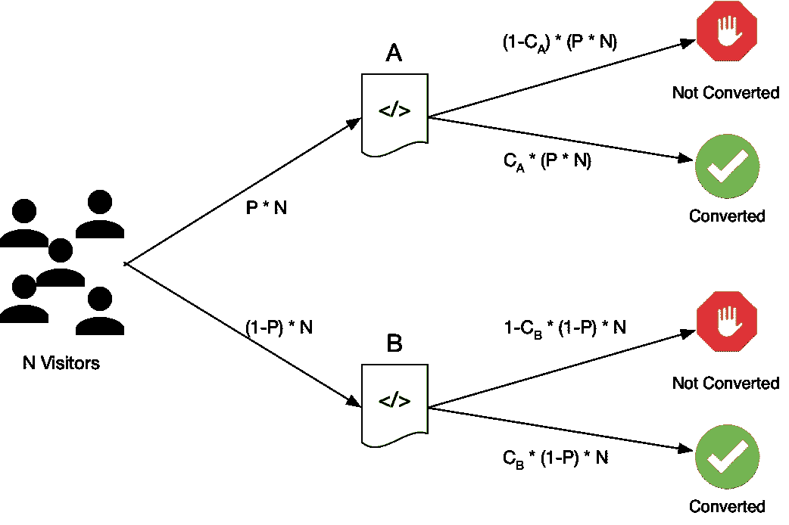

# A/B 测试测量什么？

> 原文：<https://towardsdatascience.com/what-does-an-a-b-test-measure-adebf56ae68a?source=collection_archive---------36----------------------->

## 提示:这不是大多数人想的那样

作者图片

A/B 测试是客观衡量营销支出、网站功能(如语言、视觉效果、字体)和许多其他业务流程的黄金标准。这是你在商业中所能得到的最接近“物理实验”的东西。这也是许多困惑和误解的来源。在深入 A/B 测试实际测量什么之前，让我们先讨论一下什么是 A/B 测试。A/B 测试由我们想要测试的东西的两个版本定义，版本 A 和版本 B，有时也被称为测试和控制，它们将被暴露给随机选择的参与者。这是通过将参与者随机分配到测试组或对照组来实现的。一旦分配完毕，测试组的参与者将接触版本 A，而控制组的参与者将接触版本 b。然后将测量参与者对每个版本的反应，以确定两个版本之间是否有任何差异。

参与者的随机化对于正确的 A/B 测试至关重要，因为它保证了测试组和对照组的人口统计数据在统计上是相同的。例如，假设你是一家利用电视、广播和在线搜索进行营销的企业；你正在评估再营销广告(那些在互联网上跟随你的展示广告)增加销售的潜力。你要确定再销售广告是否会增加任何*增量*销售额，因为把钱花在已经转化的人身上只会增加你的每次收购成本，而不会增加任何新的销售额。不幸的是，不可能找到一群不看电视和广播，并且在寻找他们想买的东西时从不使用在线搜索的人。但是如果你*随机*将你网站的访问者分成测试组和对照组，你最终会得到两个看电视、听广播和上网搜索的群体，他们的方式在统计上是相似的。这意味着，在一切都相同的情况下，测试组和对照组将以完全相同的(统计上)速度产生销售额。如果测试组在一个月内产生 100 笔销售，那么对照组将产生几乎相同数量的销售(例如，99、100 或 101)。测试组和对照组之间的任何差异都是随机产生的。

现在，当你对再销售广告进行 A/B 测试时，你在测试组和对照组之间引入了一个重要的区别:测试组接触到了再销售广告，而对照组没有。这意味着人群之间的唯一区别是你引入的东西:对再销售广告的暴露。过了一段时间后，你计算测试组创造了多少销售额，并与控制组创造的销售额进行比较。如果销售数量相差很大，那么你可以确信，相对于控制组而言，接受再销售广告确实改变了测试组的行为。简而言之，这就是 A/B 测试的作用。

那么 A/B 测试到底测量什么呢？根据我的经验，大多数人会说 A/B 测试衡量的是哪个版本更好。不正确。A/B 测试衡量结果是否取决于接触版本 A 或版本 B；而不是哪个版本更好。结果可能是版本 A 更好*或者版本 A 更差*。A/B 测试只是衡量版本 A 和版本 B 之间有多大的差异，而不是哪个更好。这是一个微妙但重要的差异(我们将在一分钟内解释它为什么重要)。从技术上讲，统计学家会说 A/B 测试决定了“你是否应该拒绝或接受零假设。”什么是零假设？这是以下简单英语陈述的一个花哨术语:结果不取决于接触版本 A 或版本 B。如果 A/B 测试结果告诉你拒绝零假设，那么它告诉你结果确实取决于你接触的版本。

但是你如何确定结果是好是坏呢？在再销售广告 A/B 测试的例子中，你看销售的数量。如果测试组产生了 200 笔销售，而控制组产生了 100 笔销售，那么你知道接触再销售广告对销售有好处。但是如果测试组产生了 50 笔销售，而控制组产生了 100 笔销售，那么你就知道接触再销售广告对销售是不利的。A/B 测试不能告诉你结果是好是坏，只能告诉你测试和控制之间的差异是“真实的”；暴露于版本 A 或版本 B 确实会影响结果。在本例中，如果测试组获得 200 个销售，A/B 测试可能会告诉您拒绝零假设，如果测试组获得 50 个销售，它也可能会告诉您拒绝零假设。在这两种情况下，A/B 测试只是告诉你你看到的差异是“真实的”,而不是随机的。你必须看结果来决定它是积极的还是消极的(这取决于上下文)。

有些人可能会认为这是吹毛求疵。当然，也许 A/B 测试并不能直接告诉你版本 A 比版本 B 好还是差，但是听起来它确实是测试的直接逻辑结果。这是真的，除非业务用户经常会问这样的问题:*那么，如果 A/B 测试表明版本 A 比版本 B 好，置信度为 99%,那么实际上版本 A 比版本 B 差的概率是多少？是 1%吗？*肯定不是！如果考虑零假设(即，结果不依赖于暴露于版本 A 或版本 B ),那么结果告诉你的是，在 100 个相同的测试中，99 个会证明暴露于版本 A 会导致与暴露于版本 B 不同的结果，但是 100 个相同的测试中有 1 个会表明版本 A 和版本 B 之间实际上没有差异。使用再营销的例子， 你可能以 99 次测试结束，其中测试组产生了大约 200 次销售(在每次测试中)，但在 100 次测试中的 1 次测试中，测试组只产生了 110 次销售(相比之下，对照组产生了 100 次销售)，这意味着看起来再销售广告对结果的影响非常小，如果有的话。

没有真正的方法知道“版本 A 实际上比版本 B 差的可能性有多大？”不进行实验也不看结果。有一些技术可以让你感觉到这种可能性有多大，但这不是 A/B 测试的直接结果。您可以使用的一种技术是估计参数的置信区间，但这只能在 A/B 完成后进行。例如，再次使用再销售广告的例子，假设测试组产生了 200 笔销售，而控制组产生了 100 笔销售。人们可以得到每组的人数，然后用销售额除以每组的人数来计算“销售率”。例如，如果测试组的销售率为 20%，而对照组的销售率为 10%，那么您可以计算出测试组销售率的 95%置信区间为 15% — 25%，而对照组为 6% — 14%(这些数字是虚构的)。人们会有一种很好的感觉，实际上，再销售广告不太可能让事情变得更糟。

顺便说一下，对于那些更有技术头脑的人来说，关于为什么统计测试的结果不能直接告诉你参数的真实值的正式答案是，置信区间是参数空间的一部分，而统计测试的接受区域是样本空间的一部分。