# 数据块是做什么的？

> 原文：<https://towardsdatascience.com/what-does-databricks-do-8a6c4ef9071b?source=collection_archive---------4----------------------->

## 平台概述及其使用体验

第四十二任在 [Unsplash](https://unsplash.com/s/photos/lego-bricks?utm_source=unsplash&utm_medium=referral&utm_content=creditCopyText) 上拍摄的

# TL；速度三角形定位法(dead reckoning)

Databricks 是一个云数据平台，旨在帮助解决以下事实:

*   随着公司开始从许多不同的来源收集大量数据，越来越需要一个单一的系统来存储这些数据
*   使图像、声音和其他非结构化数据易于访问以用于训练 ML 模型需要不同的架构方法

***现在，选择自己的道路*** —想了解 Databricks 这个数据平台吗？继续章节 1️⃣想跳过来看看用起来是什么感觉？跳转到 2️⃣部分

# 1.Databricks 平台基础

为了理解 Databricks 做什么，首先理解用于收集企业数据的系统是如何发展的，以及为什么，这一点很重要。

## 🤷🏽‍♂️数据仓库，湖泊…和湖边小屋？

在之前，我已经写过关于集中存储数据的必要性，以便最有效地利用它。数据仓库旨在将组织中不同的数据源整合在一起。

数据仓库的概念早在 20 世纪 80 年代就已经存在[1]。其想法是，来自运营系统的数据将流入数据仓库，以支持业务决策。

几十年过去了，简陋的数据仓库有一些非常明显的局限性:

*   通常没有支持 ML 用例的内置功能——即使用数据提出更多预测性问题的能力。
*   在存储和检索新的、复杂的非结构化数据格式时，它们缺乏灵活性和可扩展性。

当然，Snowflake 和 Redshift 等现代云数据仓库(CDW)的出现有助于解决内部部署产品的“可扩展性”限制。

BigQuery 中类似于 [BQML](https://cloud.google.com/bigquery-ml/docs/introduction) 的产品特性也开始迎合数据仓库中内置 ML 功能的缺乏。

但是，它们仍然没有解决如何存储、管理和洞察当今各种各样的数据类型的难题。

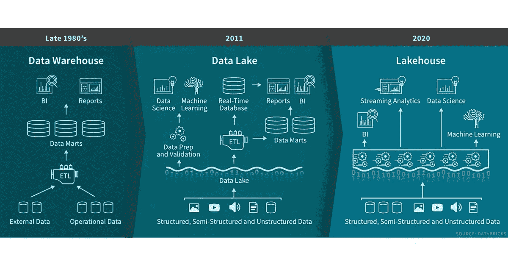

*图 1:从数据仓库到 Lakehouse 的演变，Databricks 网站。*

继续沿着图 1 中的进化尺度，数据湖紧随其后。它们提供了一种以原始格式存储大量结构化、半结构化和非结构化数据的方法。

它们在历史上是用商用硬件(存储和计算)构建的，与某种分布式处理框架(如 [Hadoop](https://hadoop.apache.org/) )结合使用。

问题是数据湖有成为垃圾场的趋势，因为它们:

*   缺乏轻松管理和控制存储在其中的数据的功能；有些人甚至称之为“数据沼泽”！
*   不要支持[事务](https://www.geeksforgeeks.org/acid-properties-in-dbms/)的概念，也不要强制执行任何类型的数据质量标准。

为了不同的数据处理目的，您可以将大量的产品附加到一个数据湖中，这很快就会造成难以管理的体系结构混乱。

➡️ **进入数据仓库**

为了解决我们到目前为止讨论的与数据仓库和湖泊相关的挑战，最近的“lakehouse”概念增加了几个关键的改进:

*   **数据湖的元数据层** —这是一种跟踪表格版本、数据描述和强制数据验证标准的方法。
*   **新的查询引擎设计**在数据湖上提供高性能的 SQL 执行，例如 [Apache Spark](https://spark.apache.org/) 。
*   **数据科学和机器学习工具的优化访问**—这使得处理后的数据可以以适合 ML 的开放数据格式提供，从而加快了模型的实验和开发。

**Databricks 旨在在一个统一的、基于云的平台上实施数据湖库概念**。

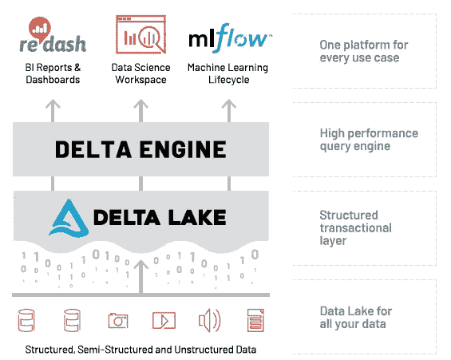

*图 2: Databricks 数据平台高层架构，Databricks 网站。*

Databricks 位于您现有的数据湖之上，它还可以连接到各种流行的云存储产品，如 AWS S3 和谷歌云存储。

**分解 Databricks 数据平台架构中的层:**

*   Delta Lake 是为数据湖带来可靠性的存储层。Delta Lake 提供了 ACID 事务、可扩展的元数据处理，并统一了流式和批量数据处理。Delta Lake 运行在您现有的数据湖之上，并且与 Apache Spark APIs 完全兼容。
*   Delta Engine 是一个优化的查询引擎，用于高效处理存储在 Delta Lake 中的数据。
*   此外，还有一些内置工具可用于支持数据科学、BI 报告和 MLOps。

上述所有组件都紧密集成在一起，可以从一个“工作区”用户界面(UI)访问，该界面可以托管在您选择的云上—下一节将详细介绍！

# 2.启动并运行

我总是试图“走自己的路”，所以我决定给 Databricks 一个旋转，作为我这篇文章研究的一部分…

## 👩🏾‍💻设置

Databricks 提供了 14 天的免费试用，你可以在你的云上运行。我使用谷歌云平台(GCP)，因为我对它最熟悉，但它也可以在 AWS 和 Azure 上使用。

设置很简单，在 GCP 市场快速搜索“数据砖块”就可以进入一个页面，在那里我可以注册试用。

试用“订阅”完成后，您可以从 GCP 的 Databricks 菜单项获得一个链接，以管理 Databricks 托管帐户管理页面上的设置。

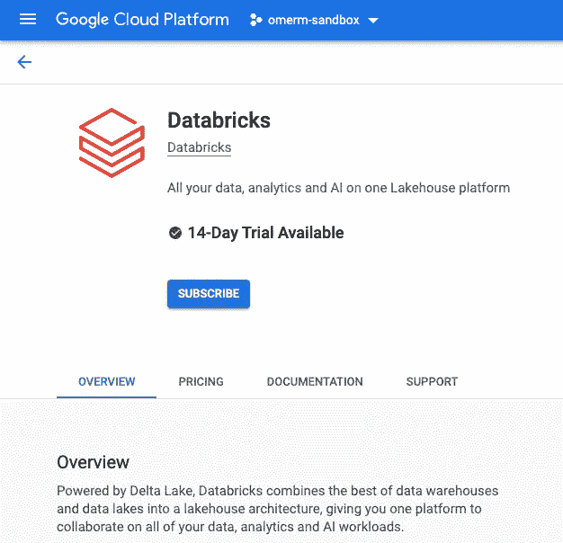

*图 3:数据块的 GCP 市场设置*

下一步是创建一个“工作空间”，它是访问您的资产和处理数据块的环境。您可以通过外部 Databricks Web 应用程序来实现这一点，它实际上是您的[控制平面](https://en.wikipedia.org/wiki/Control_plane)。

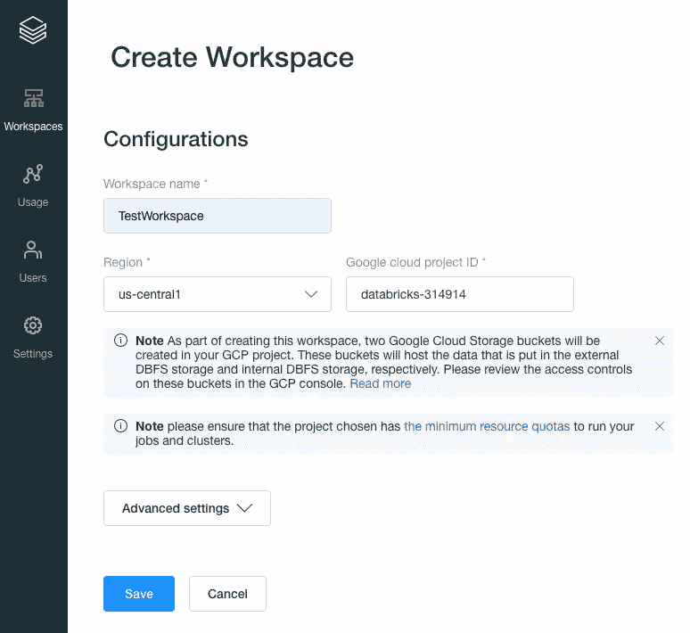

*图 4:数据块—创建工作空间*

“创建工作区”这一操作基本上是在您的 GCP 项目中启动一个三节点 Kubernetes 集群，使用 [GKE](https://cloud.google.com/kubernetes-engine) 来托管 Databricks 运行时，也就是您的[数据平面](https://en.wikipedia.org/wiki/Data_plane)。

这一区别非常重要，因为您的数据始终驻留在数据平面的云帐户和您自己的数据源中，而不是控制平面中，因此您保持对数据的控制和所有权。

⚠️ **小心**

Databricks 试用版仅涵盖您对其平台的使用，您仍然需要为创建工作空间和运行任何作业所消耗的任何云资源买单。

⚠️ **警告**

随着我们的工作空间被提供，我们被提供了一个 URL，它将我们带到一个单独的 UI 来实际使用数据块。

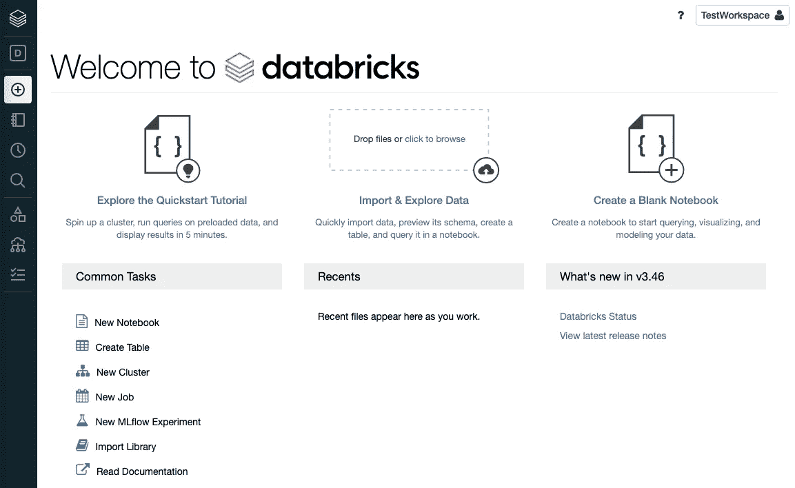

*图 5: Databricks Workspace UI —数据科学&工程背景*

您可能想做的第一件事是通过上传文件、连接到受支持的数据源或使用合作伙伴集成在 Delta Lake 中创建表。

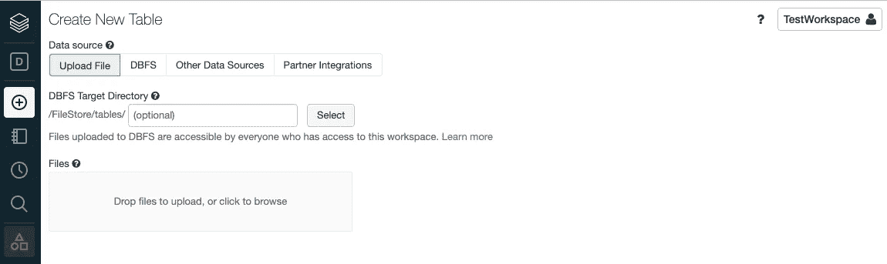

*图 6:数据块—创建表格*

接下来，为了创建 Delta Engine 作业或运行笔记本来分析您的数据，您需要创建一个“集群”。

Databricks 集群是一组计算资源和配置，您可以在其上运行数据工程、数据科学和数据分析工作负载。

请注意，这至少会增加三个虚拟机、一个驱动程序和两个工作人员(最多可扩展到八个)。

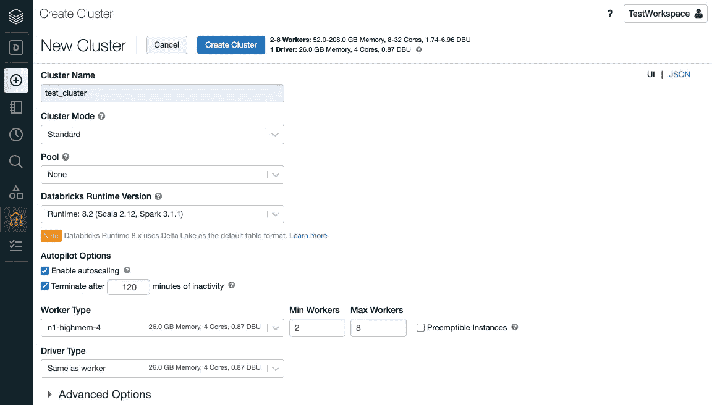

*图 7:数据块—创建集群*

集群上的 Databricks 运行时是基于 Apache Spark 的。事实上，Databricks 中的大多数工具都基于[开源技术和库](https://databricks.com/product/open-source)。他们甚至以开源方式发布了关键组件，如 Delta Lake 和 MLflow。

🚨**顶尖提示**

如果您只是在自掏腰包，请确保减少“在 *n* 分钟不活动后终止集群”的时间，以节省您的云消耗成本。另外，如果您已经完成了试验，不要忘记删除集群和工作区。

🚨**顶端提示**

群集配置需要几分钟时间，然后您可以将其“连接”到笔记本电脑或将其用于“新工作”任务。

总的来说，我发现用户体验干净、直观，而且试用起来相当顺畅。

## 🤖数据块上的机器学习

Databricks UI 有一个漂亮的小上下文切换，这取决于用户的角色和他们想从平台中得到什么。

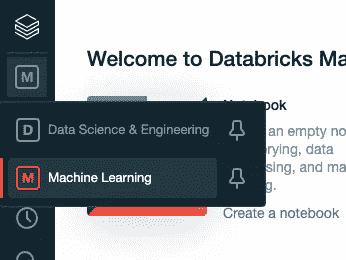

*图 8:数据块—在工作空间中切换用户上下文*

我从之前的“数据科学和工程”背景中切换出来，快速浏览一下“机器学习”提供了什么。

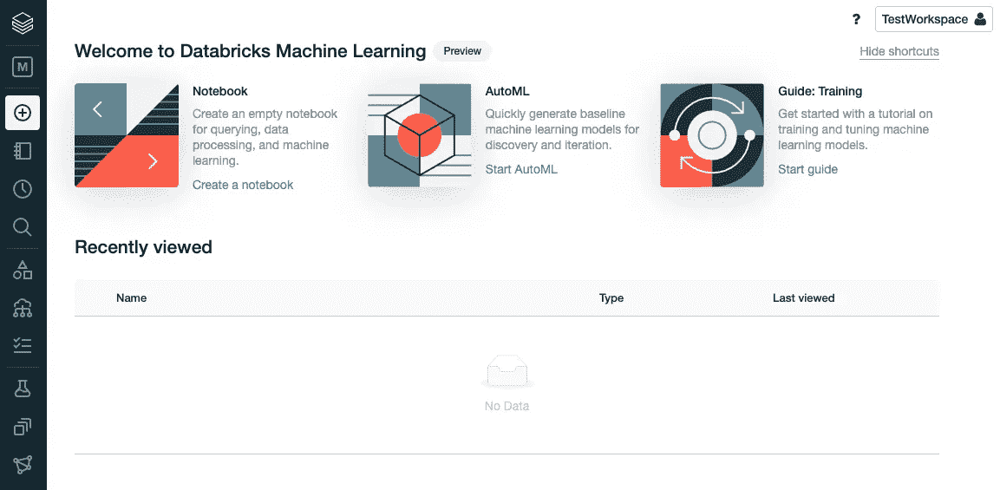

*图 9: Databricks Workspace UI —机器学习上下文*

从这里我们可以:

*   创建笔记本，
*   使用 AutoML 或
*   管理实验、特征存储和训练模型

我决定使用“钻石”样本数据集尝试一下他们的 AutoML 功能，如果您运行“快速入门教程笔记本”(见图 5)，就会创建该数据集。

您必须编辑并重新启动之前创建的集群，使其成为使用“Databricks Runtime for ML”的集群，或者创建一个新的集群。

除此之外，实验配置非常简单——选择最大似然问题类型(在撰写本文时是分类或回归)、数据集、预测目标，然后开始。

*图 10:数据块—配置 AutoML 实验*

AutoML 功能的透明度给我留下了非常深刻的印象。我用过的一些 AutoML 工具可能有点像“黑箱”,因为你不知道具体的步骤，比如数据处理在后台进行。

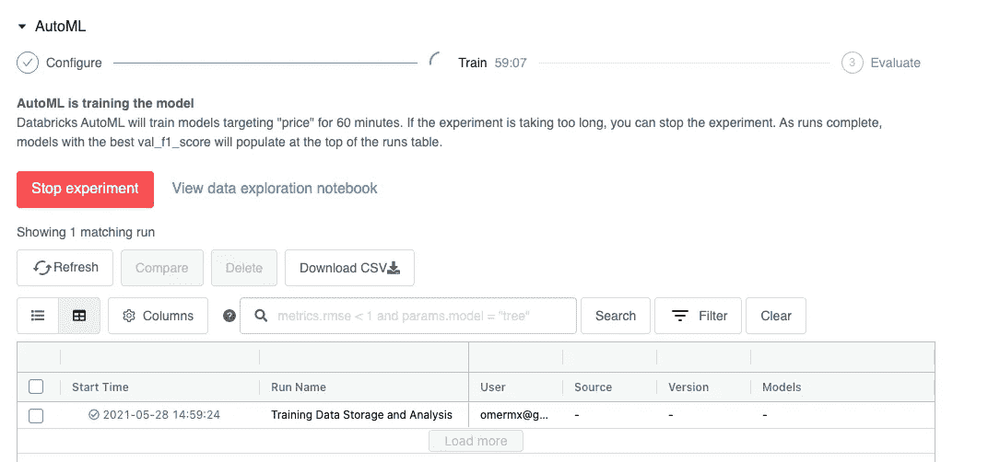

*图 11: Databricks — AutoML 实验进度指示器*

Databricks 会自动生成一个数据探索笔记本，阐明准备步骤，如数据分析、缺失值和相关性。我觉得这很棒。

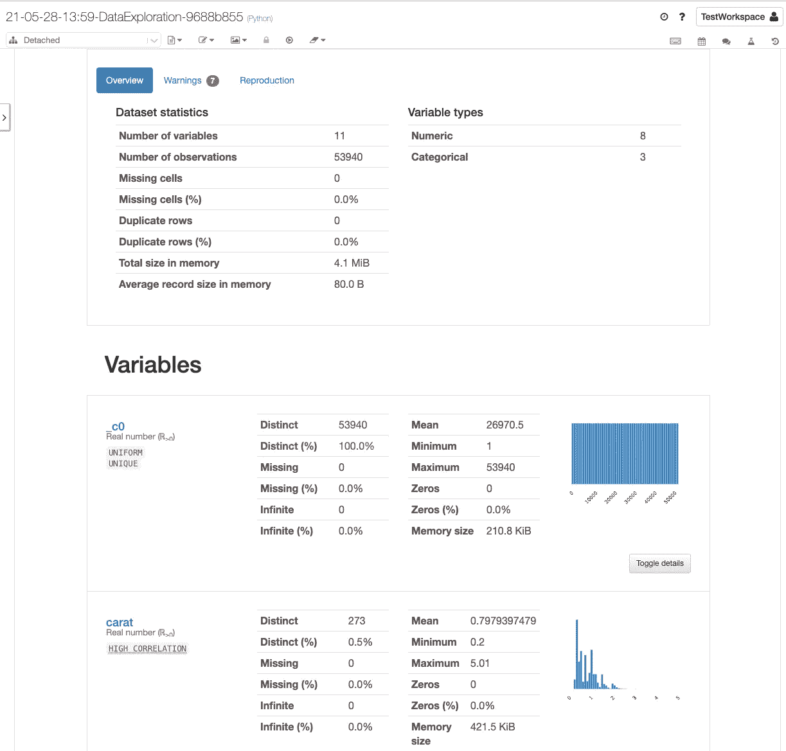

*图 12:数据块—数据探索笔记本*

随着实验的进行，不同训练运行的细节被添加到表格中，包括使用的模型和特定参数。

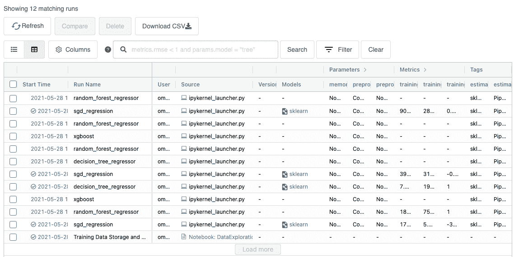

*图 13:数据块— AutoML 实验运行*

一旦实验完成，根据优化目标，表格按产生最佳结果的运行排序——在本例中为 [RMSE](https://www.geeksforgeeks.org/ml-mathematical-explanation-of-rmse-and-r-squared-error/#:~:text=RMSE%3A%20Root%20Mean%20Square%20Error,%2C%20(3%2C%206).) 。

与数据探索步骤类似，您也可以深入到代表特定运行的笔记本中。它将展示构建模型的所有步骤，甚至包括使用诸如 SHAP 这样的可解释库来突出变量的重要性。

这是对常见的 AutoML 产品的一个很好的改进，对于那些刚接触 ML 的人来说，这也是一个很好的方法来学习以迭代和交互的方式训练一个模型的步骤。

## ⚖️初步印象

我从未打算写一篇全面的产品评论😅。但是我想至少说明一下 Databricks 是做什么的，并分享一下我使用它的简短经验！这里有一个总结:

**设置:**

我不能代表其他的云，但是在 GCP 的安装相对来说没有什么痛苦。从 marketplace 进行一次点击订阅和设置，然后所有其他事情都在 Databricks 帐户管理或工作区 UI 中进行。

**易用性:**

我发现用户界面干净直观。我可以轻松地执行我想要完成的任务，而不需要参考文档。

它也有一些不错的东西，如 AutoML 实验生成的数据探索和实验运行笔记本。

**成本:**

对我来说，当我将数据块与 GCP 已经非常强大和集成的数据科学和 ML 用户体验(如 [Vertex AI](https://cloud.google.com/vertex-ai?hl=en) )进行比较时，数据块的成本并没有真正增加。然而，并不是每个人都使用 GCP。

Databricks 不是[无服务器](https://en.wikipedia.org/wiki/Serverless_computing)，也没有“完全托管”选项，因此与某些云平台上的原生产品相比，准入门槛相对较高。但是我想这是不可知云的代价。

**总体:**

Databricks 是从数据湖到分析和 ML 的真正统一的体验。我还没有看到任何其他的东西像这样符合所有的条件。入门的成本很高，但它确实为一个古老的问题提供了一个云不可知的解决方案。

鉴于其在该生态系统中的根基，它也非常适合那些想要从更传统的 Spark 环境过渡的人。

希望这篇文章对你有用，如果有用，请分享。我也很想知道你对这篇文章的看法，所以请使用下面的评论或 [twitter](https://twitter.com/theomermahmood) 联系我们！

# 📇参考

[1]维基百科，数据仓库，[https://en.wikipedia.org/wiki/Data_warehouse#History](https://en.wikipedia.org/wiki/Data_warehouse#History)

# 📚有用的资源

*   [Databricks 免费试用](https://databricks.com/try-databricks)
*   [阿帕奇星火指南](https://spark.apache.org/docs/latest/index.html)