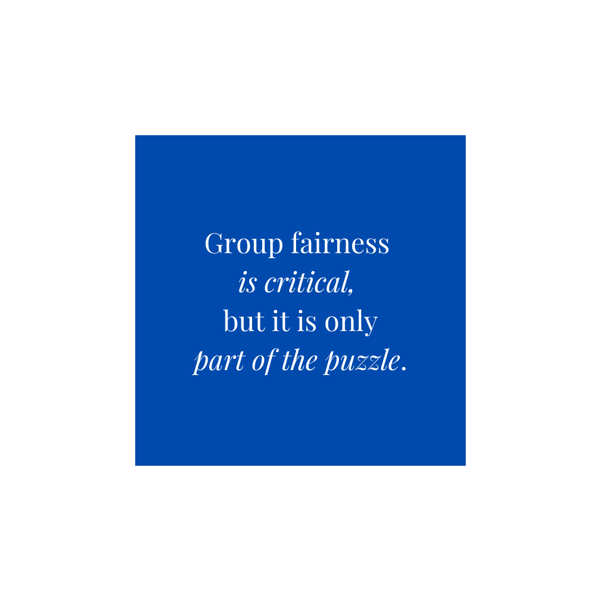
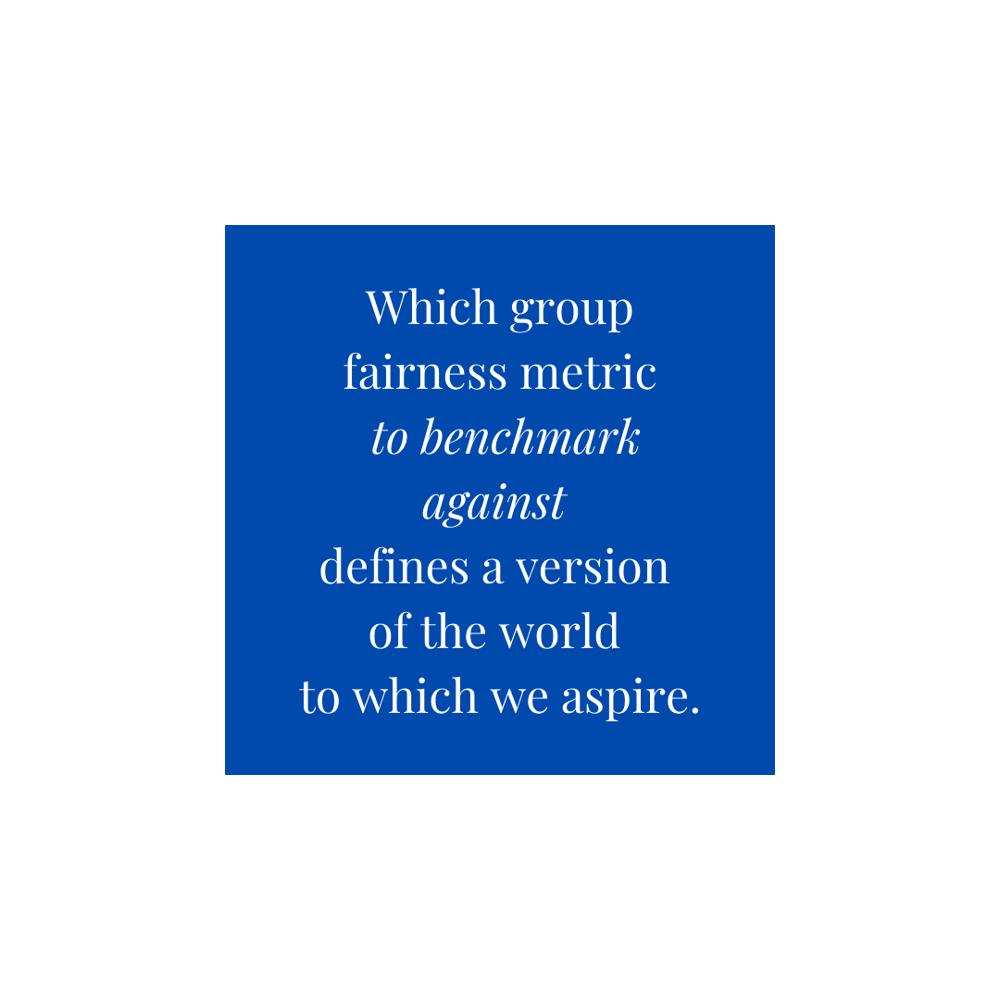

# 公平是什么意思？衡量和理解公平

> 原文：<https://towardsdatascience.com/what-does-it-mean-to-be-fair-measuring-and-understanding-fairness-4ab873245c4c?source=collection_archive---------27----------------------->

## 值得信赖的人工智能

## 让我们将公平从抽象的目标转化为机器学习模型的现实。

机器学习在面部识别和在线广告等应用中无处不在——然而，这些 ML 模型中的许多都显示出无意和有害的[种族](https://news.mit.edu/2018/study-finds-gender-skin-type-bias-artificial-intelligence-systems-0212)和[性别](https://www.cmu.edu/news/stories/archives/2015/july/online-ads-research.html)偏见的明显证据。因此，机器学习系统中的公平性是当今的一个热门话题。获得人工智能效率优势的企业也必须特别小心和专业，以确保他们的模型是准确、可信和公平的。

[廷杰律师事务所](https://unsplash.com/@tingeyinjurylawfirm)在 [Unsplash](https://unsplash.com/) 上拍摄的照片

很难准确定义“公平”的含义。从根本上来说，公平需要对公平平衡的渴望。由此，自然会出现这样的问题:我们要在谁之间实现公平？公平是指群体之间总体上的平等结果吗？还是个体之间？我们如何在数学上将“公平”定义为一个量？

在实现现实世界模型的公平性时，我们确定了三个关键原则:

1.  重要的是要考虑个人和群体的公平观念。
2.  公平不仅仅是一个衡量标准。公平是(a)的*工作流程***识别偏差**(两个或两个以上群体完全不同的结果)；(b)执行**根本原因分析**以确定差异是否合理；以及(c)采用**有针对性的缓解策略**。
3.  **公平性指标不是一刀切的。**使用公平指标的分类法，我们可以挑选那些最适合当前特定场景的指标。

在这篇博文中，我们将讨论如何将公平从抽象的目标转化为机器学习模型的现实。

# 个人和群体的公平观

通常，公平被认为是一个在两个群体之间实施的概念。一个被广泛引用的例子是 ProPublica 对 NorthPointe 公司提供的犯罪风险评估的分析。ProPublica 对 NorthPointe 预测的评论显示，与白种人相比，预测被监禁的人是否会再次犯罪的算法对非洲裔美国人有偏见。该算法错误地将黑人被告标记为未来的惯犯，其错误识别白人被告的比率几乎是白人被告的两倍。白人被告更经常被错误地认定为未来犯罪的风险较低。

这种公平的概念作为群体之间的一个概念，可以进一步阐述，以分析子群体。例如，麻省理工学院的研究人员表明，主要技术提供商的[面部识别软件在分析深色皮肤女性的图像时会有](https://news.mit.edu/2018/study-finds-gender-skin-type-bias-artificial-intelligence-systems-0212)明显更高的性别识别错误，这表明了性别和肤色交汇处的子群在模型有效性方面的差异。

群体公平至关重要，但这也只是难题的一部分。回想一下[苹果卡](https://www.nytimes.com/2019/11/10/business/Apple-credit-card-investigation.html)的调查，在卡发行后不久，女性声称她们获得了较低的信用额度，甚至被拒绝使用苹果的信用卡，而她们的丈夫(他们与他们混合了资金)却被接受了信用额度，通常是较高的信用额度。在这种情况下，算法的个体公平性受到质疑。在这种情况下，我们希望通过比较各种具有相似特征的男性和女性来衡量批准算法的公平性，而不是看该模型是否在群体层面上存在歧视(女性对男性)，而是看它是否专门伤害了具有相似财务特征的个人(在这种情况下是配偶)。这种类型的分析，由 Dwork 等人创造的个体公平性，试图确保相似的个体被模型以相似的方式对待。

苹果卡的情况也是一个例子，公平和人工智能的另一个大挑战，模型可解释性，是不可分割地联系在一起的。不仅财务状况相似的个人似乎有着大相径庭的结果，信用卡的发行者苹果和高盛也无法快速简单地解释算法是如何工作的，为什么它会产生完全不同的结果，以及这些结果是如何证明的。感知到的不公平和无法解释一个模型会产生严重的后果。在开始发行信用卡的短短几个月内，苹果和高盛发现自己受到了金融监管机构的调查。

# 根本原因分析和明智的缓解措施

假设我们建立了一个信贷决策模型来决定个人是否应该获得贷款。该模型基于不使用任何特定人口统计特征(如性别或种族)的数据进行训练。然而，当事后评估结果时，可以看到该模型发现支持率和种族之间存在轻微的相关性。这是一个不公平的结果吗，因为该模型通过其他变量，如邮政编码或姓氏，来构建种族的[代理？或者这个结果是合理的和公平的，因为模型使用了一组合理的特征，并且恰好存在相关性？](https://www.consumerfinance.gov/data-research/research-reports/using-publicly-available-information-to-proxy-for-unidentified-race-and-ethnicity/)

重要的是，通过根本原因分析彻底调查任何可能的不公平。利用像 [TruEra](http://truera.com/) 这样的人工智能质量解决方案，其中包括公平性分析，模型构建者不再对模型或数据的底层问题视而不见。深入研究这种差异的特征级驱动因素对于确定模型的行为是否合理至关重要。地理数据推动了特定种族人口的高接受率吗？还是模型以合理的方式使用了像收入这样的特征，但恰好收入与种族相关？通过执行根本原因分析，将抽象的公平性指标与模型及其输入数据联系起来，数据科学家或业务主管可以确定模型的决策是否合理，如果不合理，从哪里开始缓解流程。

# 选择一个组公平性度量

公平是一个敏感的概念。决定用哪种群体公平指标作为模型的基准，就定义了我们所向往的世界。我们是否希望确保男性和女性获得完全平等的机会？还是相反，我们想要确保被模型接受的不合格者的比例在性别上大致相等？这些细微的差别对一个模型的公平性有着巨大的影响，使得度量标准的选择成为一个必要的和有意的行为。

虽然有几十种公平指标的定义在某些情况下可能都是有效的，但出于本文的目的，我们将缩小一点，简要谈谈这些公平指标如何描述不同的理念。

一套内在对立的世界观是*所见即所得*(所见即所得)和*我们都是平等的* (WAE)区别。让我们考虑一下 SAT 分数的情况。所见即所得的世界观假设观察(你的 SAT 分数)反映了完成任务的能力(在学校表现良好)，并认为这些分数非常有助于预测大学的成功。然而，WAE 的世界观可能会断言，由于社会原因，SAT 分数存在结构性偏差，平均而言，所有群体都有同等的能力在大学里取得好成绩，即使我们无法通过 SAT 分数观察到这一点。如果你相信所见即所得，那么一个完全准确的模型必然是公平的，因为它将与你手头的标签/观察相匹配。相反，WAE 的信徒会试图确保结果在群体中的平等分布，不管他们观察到的标签是什么，因为在他们看来，准确性并不需要公平。

在 WAE 和 WYSIWYG 之间有一个滑动的尺度，许多度量标准位于这两个对立的公平概念之间。这两个阵营之间有一种天然的紧张关系，因为两者不可能同时得到满足。在现实中，公平指标通常是不相容的。明智的做法是后退一步，而不是盲目地将一个模型与各种公平指标进行对比。对于您的问题，您认为什么目标是“公平”的？哪一个公平指标能够体现这一目标？这是一个有意的、通常也是困难的选择——在考虑端到端公平工作流时，这一点极其重要。

# 把所有的放在一起

在这篇博文中，我们讨论了创建全面公平工作流以确保更公平的机器学习模型的三个关键点。为建立更好更值得信赖的模型干杯！🍻

*Russell Holz 对本文有贡献。*