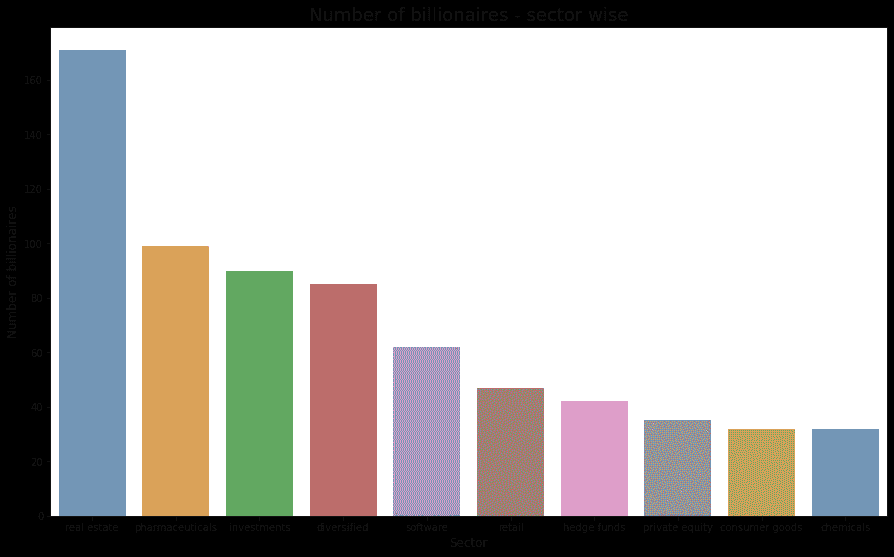
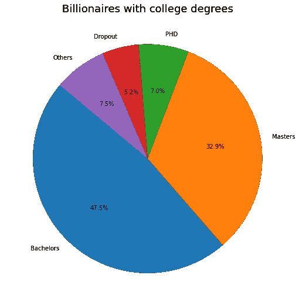
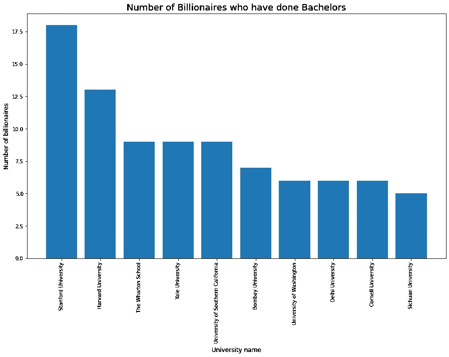
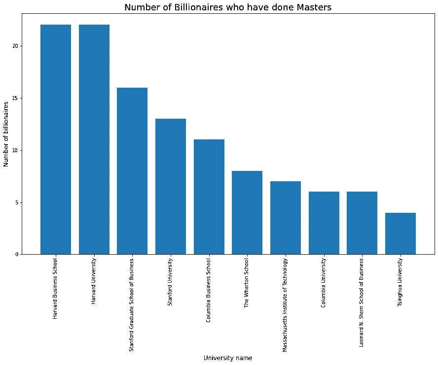
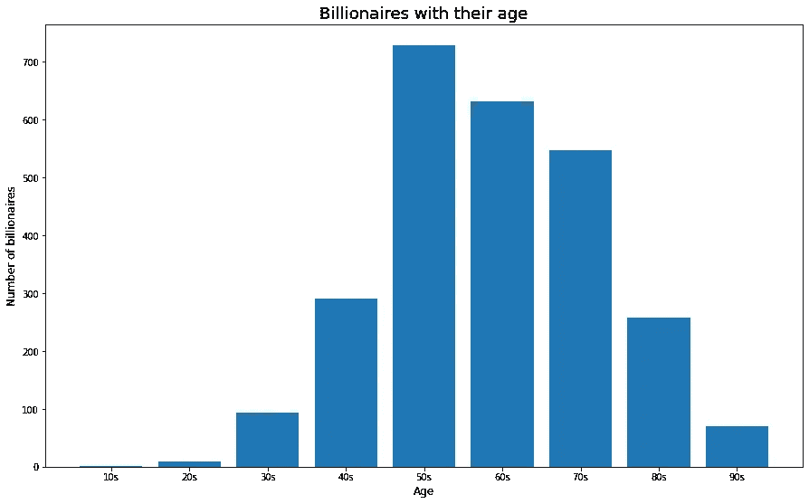
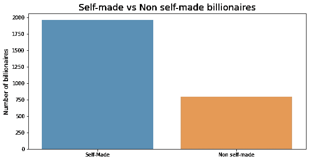
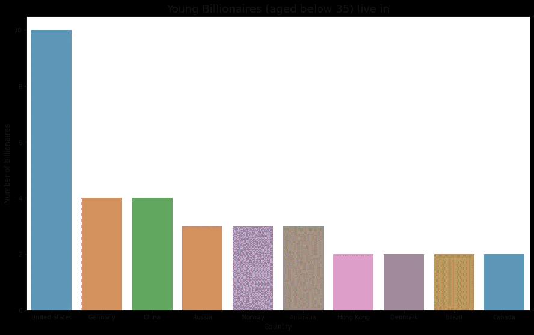
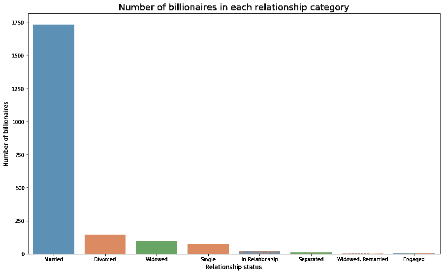
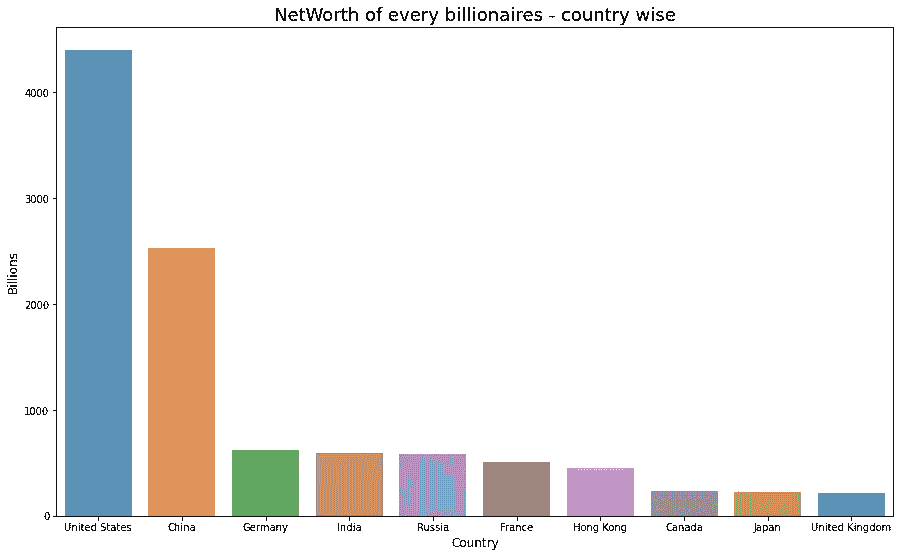
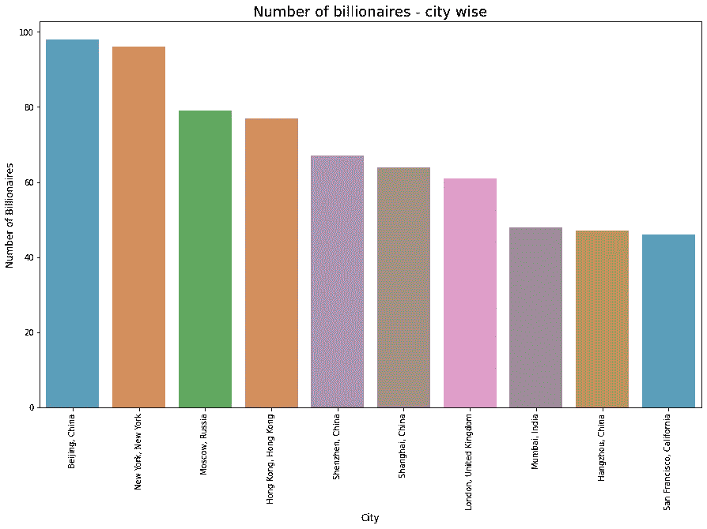

# 成为亿万富翁需要什么？

> 原文：<https://towardsdatascience.com/what-does-it-take-to-become-a-billionaire-d875be838781?source=collection_archive---------25----------------------->

## 这里有一个关于如何成为亿万富翁的分析解决方案。

## 简介:

看了标题你可能会兴奋。“亿万富翁”——多么花哨的词，对吧？

我有什么资格写这个话题呢？我是亿万富翁之一吗？—显然，不是！！。但我希望我是一个。

我写这篇文章是为了给你一些成为亿万富翁的财务建议或忠告吗？没有。

那么，我是谁？我们在这里要做什么？——我是福布斯亿万富翁历史数据集的分析师。我们将研究这些数据，并回答 10 个最关键的问题。

你想知道我们将要找到答案的所有问题是什么吗？让我们开始吧。

1.  **哪个行业领域的亿万富翁最多？**
2.  **大学学历是成为亿万富翁的必要条件吗？**
3.  **去哪里学习成为亿万富翁？**
4.  哪个年龄段的亿万富翁人数最多？
5.  **有多少亿万富翁是白手起家的？**
6.  **更年轻的亿万富翁住在哪里？**
7.  **大部分亿万富翁的关系状况如何？**
8.  亿万富翁为他们的国家贡献了多少亿？
9.  哪个城市的亿万富翁更多？
10.  **亿万富翁家庭有多少？**

我们来分析一下数据，想出这些问题的答案。这是下载数据集的链接— [点击这里](https://www.kaggle.com/roysouravcu/forbes-billionaires-of-2021)。这里是 Github 链接，查看项目代码— [点击这里](https://github.com/hariPrasadCoder/Analysis-of-Forbes-Billionaires)。

## **1。哪个行业领域的亿万富翁最多？**

上图清楚地描绘了大多数亿万富翁都在房地产行业。有些人可能认为房地产是一个被高估的术语。但数据显然在讲述相反的故事。看看你的行业是否成功跻身前 10 名。

## 2.成为亿万富翁需要大学文凭吗？

你没想到会这样，对吧？这个输出可能会让您感到震惊。我们都听说过，大学文凭并不是赚钱的必要条件。但我们可以清楚地看到，47.5%的亿万富翁完成了学士学位，32.9%的亿万富翁完成了硕士学位，7%的亿万富翁完成了博士学位。所以，不要被那些励志演讲误导了。数据显示情况正好相反。

## 3.去哪里学习成为亿万富翁？

哇哦。令人震惊的事实。我们经常听说，一个人不一定要在最好的学校学习才能成为亿万富翁。好吧，没有证据的谚语有意义吗？这里有证据试图说明我们被愚弄了。当然，它们被认为是最好的机构是有原因的。

## 4.哪个年龄段的亿万富翁最多？

我们可以看到，目前五六十岁的亿万富翁更多了。这是有道理的，因为我们知道积累财富需要一些时间。

你可能想知道那个 10 多岁的亿万富翁是谁！他就是凯文·大卫·莱曼(18 岁)。在从父亲 Guenther Lehmann 手中获得德国连锁药店 dm 的股份后，他以 33 亿美元的净资产成为世界上最年轻的亿万富翁。

## 5.有多少亿万富翁是白手起家的？

图表显示，约 66%的亿万富翁是白手起家，约 33%的亿万富翁不是白手起家(从家里拿钱)。

## 6.年轻的亿万富翁住在哪里？

正如所料，这可能是一个显而易见的答案。美国拥有最多的年轻亿万富翁(年龄在 35 岁以下)。

## 7.大部分亿万富豪的关系状况如何？

甚至超过 90%的亿万富翁都结婚了。所以，不要说“我想专注于我的事业。我不想结婚，失去自由。”

## 8.亿万富翁为他们的国家贡献了多少亿？

仅在美国，每个亿万富翁的总净资产就达到 45000 亿美元左右。中国亿万富翁排在下一位。

## 9.哪个城市的亿万富翁更多？

图表显示，大多数亿万富翁居住在中国北京。其次是美国纽约市。

## 10.亿万富翁家庭有多少？

有 **335 个亿万富翁家庭**，也就是说有 335 个家庭是亿万富翁，不像单个人是亿万富翁。

## 结论:

看完这些问题的结果，你是不是很难受？

“我没有在顶级学校学习”，“我没有住在北京、纽约或其他顶级城市”，“我没有在房地产或金融领域工作”。但是我的目标是有一天成为亿万富翁。

放心吧！我们刚刚看到了数据的最高百分位数。有许多“白手起家”的故事在上面的图表中没有显现出来。你可能是其中之一。

同样，这里有下载用于执行该分析的数据集的链接— [点击此处](https://www.kaggle.com/roysouravcu/forbes-billionaires-of-2021)。这里是查看项目代码的 Github 链接— [点击这里](https://github.com/hariPrasadCoder/Analysis-of-Forbes-Billionaires)。如果你有更多的问题需要回答，你可以浏览这些数据，并提出你正在寻找的见解。

## 联系我:

我会做很多这样的分析。请随时关注我。

在 Linkedin 上与我联系—[www.linkedin.com/in/-hari-prasad/](https://www.linkedin.com/in/-hari-prasad/)