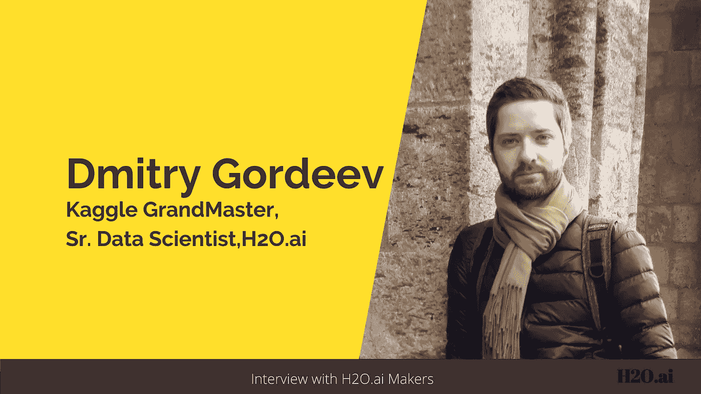
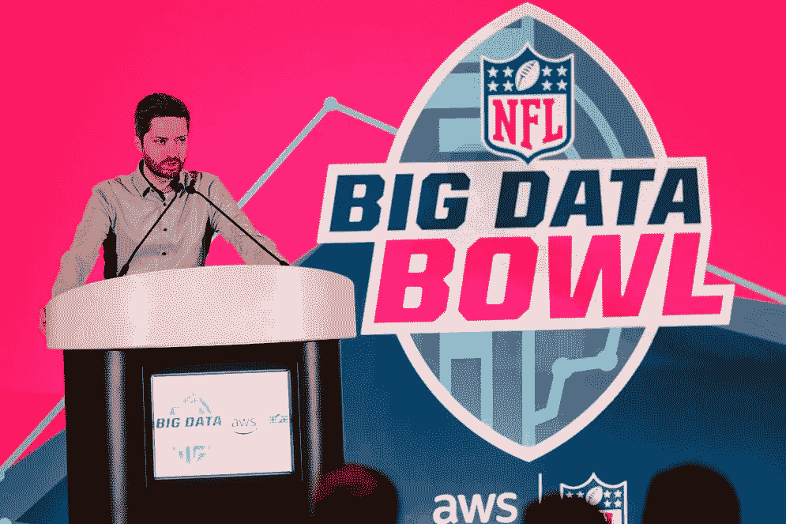
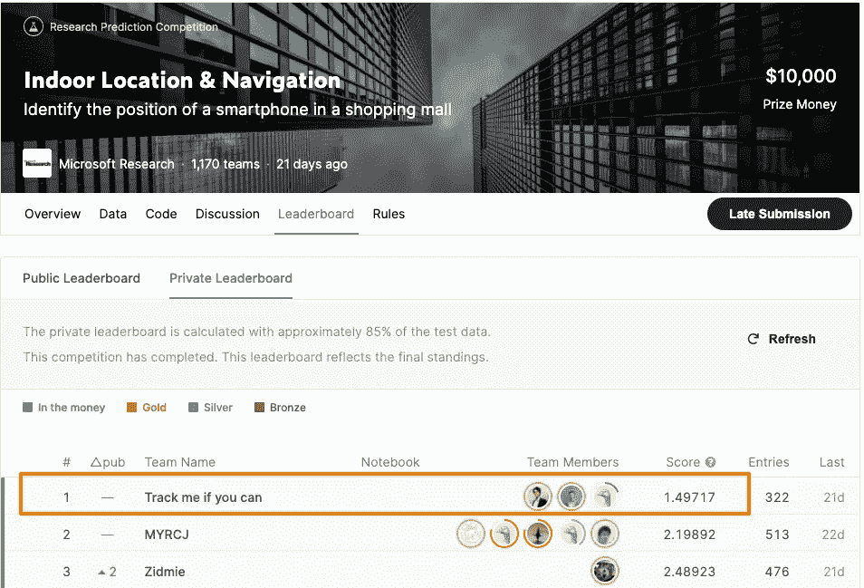
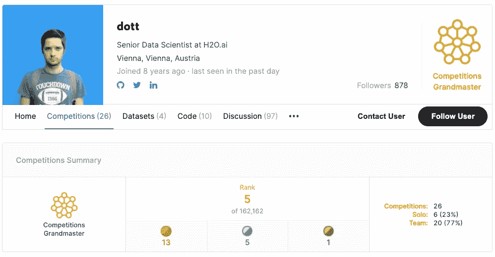
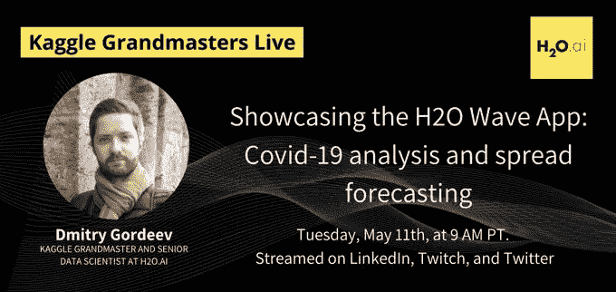
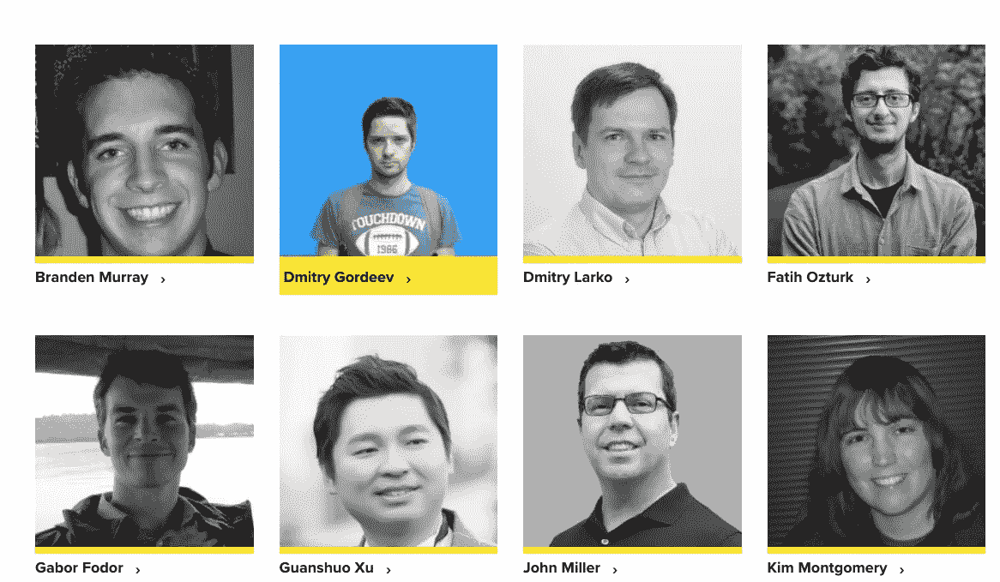

# 赢得卡格尔比赛需要什么？让我们听听获胜者本人的意见。

> 原文：<https://towardsdatascience.com/what-does-it-take-to-win-a-kaggle-competition-lets-hear-it-from-the-winner-himself-1d292a9f5b2d?source=collection_archive---------15----------------------->

## 与 Dmitry Gordeev 的对话:数据科学家和 Kaggle 竞赛大师

作者图片

> 在这一系列采访中，我在 [H2O.ai](https://www.h2o.ai/) 展示了一些知名数据科学家和 Kaggle 大师的故事，他们分享了自己的旅程、灵感和成就。这些采访旨在激励和鼓励那些想了解成为一名 Kaggle 特级大师的人。

在这次采访中，我将分享我与卡格尔世界**中 **Dmitry Gordeev、**又名**[**dott**](https://www.kaggle.com/dott1718)**的互动。**他是 **Kaggle 竞赛的特级大师**和**资深** **数据科学家**在 [**H2O.ai**](https://www.h2o.ai/) 。Dmitry 曾就读于莫斯科州立大学，毕业时是应用数学/数据挖掘专业的专家。在 H2O 之前，他在维也纳的 UNIQA 保险集团工作，主要从事信用风险管理。****

****Dmitry 和他的团队最近在 Kaggle 上赢得了 [**室内定位&导航比赛**](https://www.kaggle.com/c/indoor-location-navigation/leaderboard) ，与其他团队相比有相当大的优势。凭借这场胜利，Dmitry 现在在全球 Kaggle 比赛中排名第五。有趣的是，Dmitry 和 [Philipp Singer](/meet-the-data-scientist-who-just-cannot-stop-winning-on-kaggle-dfc0e6fe88f8) -目前 Kaggle 上的第一名(截至日期)和 H2O.ai 的数据科学家同事-在过去的许多 Kaggle 比赛中合作并赢得了金牌。这对搭档以团队代号 **The Zoo，**的身份参赛，这个代号成了获胜的代名词，并经常登顶 Kaggle 排行榜。“**动物园”**的标志性成就之一是赢得了 [NFL 第二届年度大数据碗](https://www.kaggle.com/c/nfl-big-data-bowl-2020/overview)。他们是 Kaggle 网站上 2038 份参赛作品中的获胜者，最高奖金为 5 万美元。****

********

****[2019–2020 年大数据杯冠军 Dmitry Gordeev 在印第安纳波利斯发表演讲](https://operations.nfl.com/gameday/analytics/big-data-bowl/past-big-data-bowl-recaps/) |图片提供:Dmitry Gordeev****

****NFL 数据分析总监迈克·洛佩兹(Mike Lopez)发现他们的方法非常周到，甚至评论说:“*拥有一种能够从历史数据中归纳出他们以前没有见过的比赛的算法是一件很难的事情。”*****

*****在这次采访中，我们将更多地了解 Dmitry 最近赢得的 Kaggle，他对 Kaggle 的热情，以及他作为数据科学家的工作。以下是我与菲利普对话的摘录:*****

******祝贺您在 Kaggle 上赢得了最近举行的“室内定位&导航”比赛。你能和我们分享一下你的方法和你从比赛中学到的东西吗？******

****Dmitry: 对我来说，这是一场相当激动人心的比赛，主要是因为它触及了一个新的主题和一种我以前从未处理过的新型数据。简而言之，该比赛致力于改善购物中心的手机导航。GPS 通常可以很好地解决这些任务，但只适用于户外，因为它需要户外曝光才能获得最佳精度。然而，在多层购物中心里，它不能充分地帮助你。在这场比赛中，微软研究院鼓励我们利用用户允许他们的手机收集的数据，来帮助识别一个人在哪里，以及一个人走了哪条路。这些数据包括 wifi 信号及其强度的记录，这有助于确定位置，以及传感器数据流，以重建一段时间内的运动轨迹。****

********

****[德米特里的团队高居排行榜榜首](https://www.kaggle.com/c/indoor-location-navigation/leaderboard)****

****我们设法以第一名的成绩结束了这场比赛，并以显著的优势击败了所有的竞争对手。我们的预测比第二名团队准确 30%以上。****

****首先，我需要提一下我那些不可思议的队友。比赛的成功完全是由于团队的杰出努力。比赛需要的工作量是一个人几乎不可能完成的。与典型的 Kaggle 竞赛相比，该解决方案非常复杂，因为它包含多个步骤，每个步骤都需要定制的数据科学方法。我在这里简单总结一下，但是我们也详细描述过，并且[在 GitHub 上开源了整个代码](https://github.com/ttvand/Indoor-Location-Navigation-Public)。****

****我们把问题分成多个块。其中最核心的包括:****

*   ****基于 wifi 信号记录预测位置(我们主要依靠 KNN 和 GBM 分类器)，****
*   ****基于传感器数据重建轨迹(使用一系列 CNN 和 RNN 模型)，以及****
*   ****结合两者结果的优化程序。****

****我们解决方案的关键特性是离散优化，它帮助我们获得了如此显著的精度提升。由于数据收集的特殊性，预测点形成了一个离散的网格，我们依赖于一个改进的波束搜索优化算法。我们的解决方案还依赖于一个高度复杂的例程，该例程注入额外的网格点来覆盖训练数据集中没有出现的购物中心的新区域。****

****你在高尔夫比赛中一直表现出色。你和 Kaggle 的幽会是如何开始的，是什么让你有动力一次又一次的比赛？****

*******德米特里:*** 大约在 7-8 年前，我发现 Kaggle 是一个竞争平台，但最重要的是，它可以学习更多关于机器学习的知识。我参加的第一次比赛给了我很棒的经历。这是我第一次在实际数据上拟合随机森林模型，也是我第一次发现适当交叉验证的重要性。这是一个陡峭的学习曲线，但我设法在前三场比赛中获得了铜牌、银牌，甚至金牌。然而，这非常耗时，需要长时间的工作。很明显，我不能以这样的节奏持续太久，所以我决定离开 Kaggle 一段时间。****

********

****[德米特里的 Kaggle 个人资料](https://www.kaggle.com/dott1718/competitions)****

****大约两年半前，我第二次在 Kaggle 上积极参赛，与我的同事 Philipp Singer 合作。****

> ****“拥有一个可靠而热情的队友是成功的关键。分享想法，让多人编码并尝试，分工的能力是绝对重要的。但是，最重要的是，在如此多的想法失败后，团队精神激励你一次又一次地尝试；这就是帮助我们一次又一次登顶的原因。”****

****你能告诉我们一些你的背景吗？你为什么选择数据科学作为职业？****

*******德米特里:*** 我有莫斯科国立大学的数据挖掘背景，对应的是硕士学位，但我的职业生涯相当一段时间专注于信用风险管理。然而，Kaggle 帮助我回到了通用数据科学领域。竞争和学习帮助我改变了职业道路，对此我非常高兴和感激。我花了很多年才做出这个改变，这些年包括了很多熬夜学习、阅读和编码。它们一点也不容易，但它们是值得的。****

******您还参加了每周一次的 COVID19 全球预测挑战赛，表现非常出色。你从中学到了什么？******

****

[Dmitry 在一次会议上展示新冠肺炎分析 wave 应用](https://www.pscp.tv/w/1BRJjBvYmgdJw) |提供:H2O.ai**** 

*******德米特里:*** [新冠肺炎全球预测挑战赛](https://www.kaggle.com/c/covid19-global-forecasting-week-1)是我和我的队友在疫情启动时将我们的技能和知识应用到一些有价值的事情上的一种方式。我们把所有的空闲时间都花在了寻找一种能够对疾病传播做出可靠预测的方法上。但是我们面临一个问题，根本没有可用的数据，这些数据可以可靠地转化为世界正在经历的事情。在这一系列比赛中，我们的模型在排行榜上取得了高分，但结果的准确性远远低于我的期望。****

******任何喜欢的 ML 资源(MOOCS、博客等..)您愿意与社区分享吗？******

*******Dmitry:*** 如今，跟上数据科学的发展很难，更不用说要关注的主题越来越多了。自然语言处理、计算机视觉、强化学习、可解释性等领域的进展。在过去的几年里，取得了显著的成绩。为了跟踪最新的发展，拥有关于研究论文、新的开源存储库、竞赛和解决方案的多种可靠信息源是很有帮助的。Kaggle 绝对是一个重要的工具，因为它是一个学习哪些方法对某些问题有效，哪些方法无效的好地方。在 Twitter 和其他社交媒体渠道上关注你最喜欢的人和公司，阅读 H2O.ai 博客和其他受欢迎的博客也是富有成效的。****

****我正努力跟上尽可能多的数据科学主题，因为它们经常以你可能意想不到的方式联系在一起。我最喜欢的例子是 NLP 方法，它在化学和体育分析任务中非常有效，尽管不涉及文本。****

******作为 H2O.ai 的数据科学家，你的角色是什么，你在哪些具体领域工作？******

*******Dmitry:*** 在我的日常工作中，我帮助我们的客户为他们的数据科学问题或尚未使用数据解决的问题找到最佳解决方案。这些客户来自不同的行业，如金融、医疗保健、零售、生产等。尽管用例初看起来似乎没有关联，但解决它们的最佳方法通常依赖于相同的数据科学方法。****

********

****[Dmitry 和其他围棋大师在 H2O.ai](https://www.h2o.ai/company/team/)****

****除此之外，我们还在不断寻找突破性的想法，并努力将它们变为现实。任何可以帮助我们向前迈进的东西，尤其是在社会和医疗保健领域，都是我致力于研究的课题。我们正与多个合作伙伴合作，引入数据科学模型和方法来帮助改善医疗保健。我们试图通过我们的新冠肺炎预报模型及其准确性评估做出一点贡献。不用说，这些活动不仅关注模型本身，还关注如何使它们可靠、健壮、可解释，从而在帮助做出关键决策时值得信赖。****

******你通过 Kaggle 学到的最好的东西有哪些是你在 H2O.ai 的专业工作中应用的？******

*******德米特里:*** 没有人知道一开始解决问题的最好方法是什么。一半都没有。这是一个反复测试、失败、从失败中学习和重复的过程。****

> ****“常见的方法和最先进的模型通常足以实现令人印象深刻的结果。但是如果你想做得更好，你必须跳出框框思考。这是一个充满无限创意机会的领域。”****

********

****一瞥德米特里的卡格尔之旅****

****我认为这个想法是我从 Kaggle 那里得到的，我将它应用到我的专业工作中。对于许多数据科学问题，已经有一个成熟的方法或已知的最先进的模型架构。我们需要准备现有的数据，根据需要调整模型，并对其进行调整。所有这些步骤几乎不需要任何思考过程，因此应该是自动化的。适合您的数据的最先进的模型应该成为一种商品。实际的工作应该从那里开始，集中于得到一个更好的解决方案，找到一个新的方法，以及一个如何解决问题的全新的想法。****

****可解释的人工智能正成为一种需要，而不是一种选择。你觉得会对现在的 AI 格局产生多大的影响？社区****

****人工智能的可解释性和可解释性一直是重要的话题，最近也越来越受到关注。我认为它们将永远与机器学习的所有未来发展齐头并进。人们试图解释甚至是最复杂的模型，以理解仅仅依赖模型的缺陷和风险。我认为这将仍然是可解释人工智能的一个关键目标——以透明的方式展示一个模型如何在给定的环境下得出预测。这有助于了解模型如何适用于感兴趣的案例。它还有助于将模型置于审查之下，以搜索当模型由于训练数据或模型架构和设计中的缺乏或偏差而表现出意外时的特定情况。如果可能的话，它将揭示可用于攻击模型的缺陷，或者如果环境发生变化(这是不可避免的),它将导致模型急剧恶化。这种对抗性测试将成为可解释的人工智能工具包的标准组成部分，在做出最终决定之前，它将始终应用于一个模型。****

******数据科学领域正在快速发展。你是如何设法跟上所有最新发展的？******

*******德米特里:*** 阅读过往 Kaggle 竞赛解答是必须的。每当我面临一个新问题时，我都会查看最近在相同或相似领域的竞赛，寻找最好的方法和行不通的想法。论坛、社交媒体、博客和群聊也是跟踪我可能错过的研究论文和公告的好方法。最后但同样重要的是，参加比赛。没有比亲自尝试更好的学习方法了。****

******给刚刚开始或希望开始数据科学之旅的数据科学和 Kaggle 有志人士一点建议？社区******

*******德米特里:*** 数据科学是一个广泛且不断发展的领域，所以很难感到无聊。我认为仍有大量的突破即将发生，所以它只会越来越好。最让我惊讶的是工作主题的多样性。今天可以看看 NFL 的统计数据，下周再分析 mRNA 分子的结构！****

> ****“对于那些开始他们的旅行的人来说。我羡慕你。不要误会我；我的道路包含了大量的汗水和泪水。老实说，这并不容易。但是我珍惜我过去成功的每一个瞬间，你也一样。好好照顾自己的心理健康。它的重要性怎么估计都不为过。有时候需要休息一下，去散散步。”****

# ****外卖食品****

****在这个非常有见地的采访中，德米特里谈到了他生活中的几个重要方面。他的故事充满了激情、努力和耐心。从处理机器学习问题到创建解决方案，Dmitry 强调了一致性和创新思维的必要性。他还讨论了人工智能需要更多的可解释性，以灌输对我们创建的模型的信任。他的旅程已经并将继续鼓舞人心，我们迫不及待地想看到他在未来的日子里还有什么里程碑。****

# ****阅读本系列的其他采访:****

*   ****[*Rohan Rao:数据科学家从数独到 Kaggle*](/a-data-scientists-journey-from-sudoku-to-kaggle-120876b7fa33) 的旅程****
*   ****[*希瓦姆·班萨尔:数据科学家，负责 Kaggle 上的“数据科学为善”竞赛。*](/the-data-scientist-who-rules-the-data-science-for-good-competitions-on-kaggle-ab436595a29f)****
*   ****[*认识 Yauhen:第一位也是唯一一位来自白俄罗斯的 Kaggle 特级大师。*](/meet-yauhen-the-first-and-the-only-kaggle-grandmaster-from-belarus-ee6ae3c86c65)****

*   ****[*加博·福多尔:卡格尔世界“白鲸”的励志之旅🐋*](/the-inspiring-journey-of-the-beluga-of-kaggle-world-5409e740a21b?sk=a500e2014feb175eae520931ff43b419)****
*   ****[*在 Kaggle*](/meet-the-data-scientist-who-just-cannot-stop-winning-on-kaggle-dfc0e6fe88f8?sk=bd58ca871ab26ab13917b338020c4a0c) 上遇见无法停止胜利的数据科学家****
*   ****[*向别人学习是成功的必要条件——论卡格尔所说的这位土耳其一代宗师*](/learning-from-others-is-imperative-to-success-on-kaggle-says-this-turkish-grandmaster-d8b5bf28ac87?sk=940c646515035c18aca050bab1469364)****
*   ****[*如何成为 Kaggle 上的世界第一*](/what-it-takes-to-become-a-world-no-1-on-kaggle-f149df44e98c?sk=63dd3a58d40dbe1df9fb7cd72ea4ede6)****